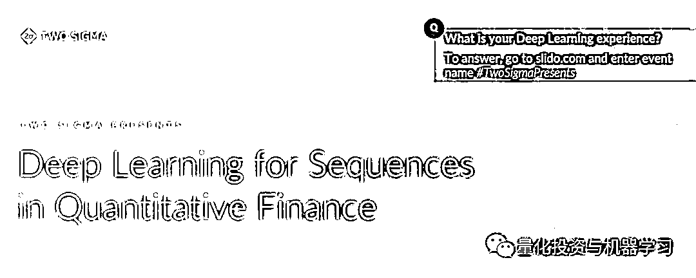
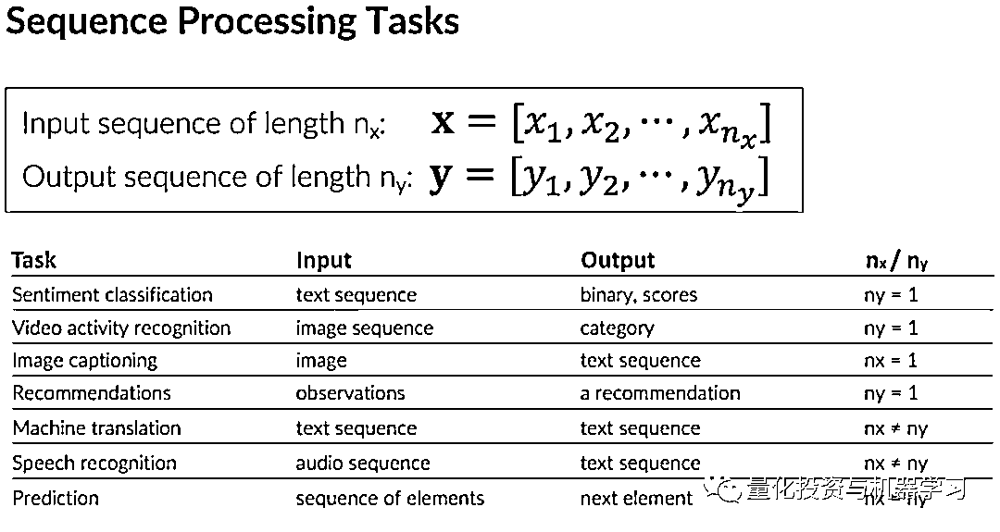
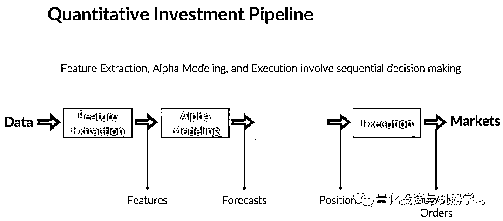
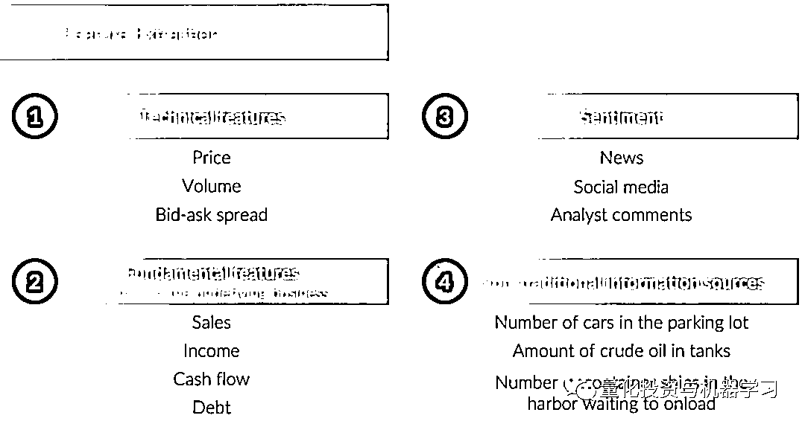
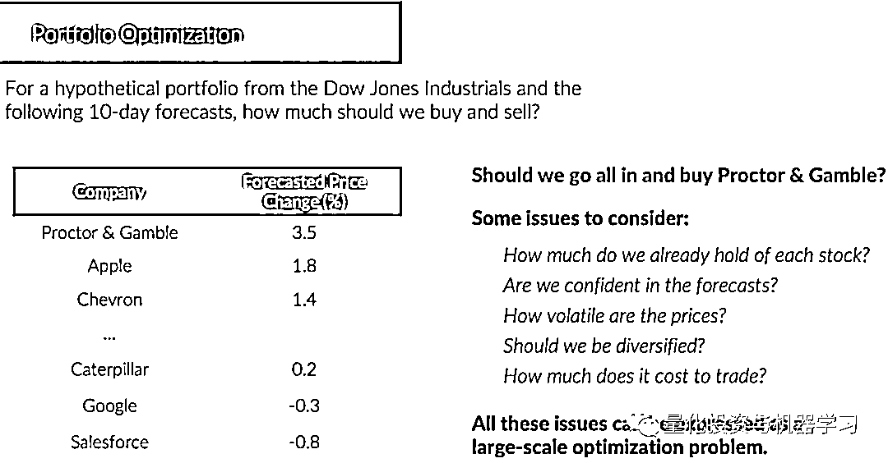
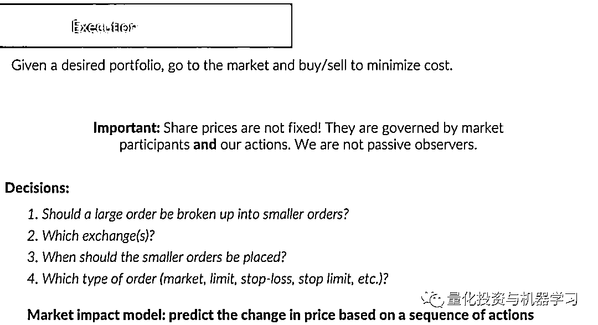
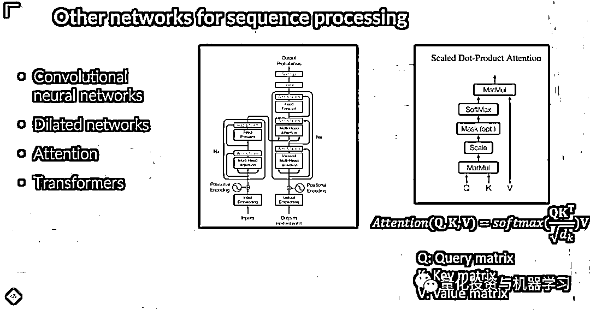
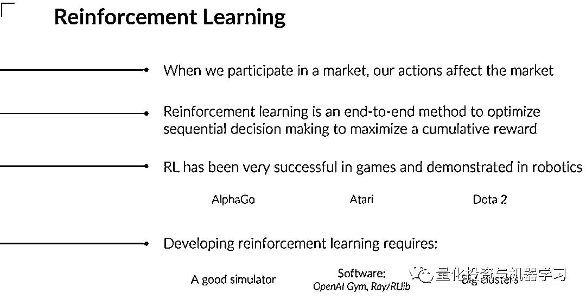

# Two Sigma：序列深度学习与量化投资

> 原文：[`mp.weixin.qq.com/s?__biz=MzAxNTc0Mjg0Mg==&mid=2653321737&idx=1&sn=5459c01f0305e574056fc8b38b56be45&chksm=802db81cb75a310ae83dfcf12a1fac38113c3c4381067c3e0802d3105e4ee008b3684af51f5d&scene=27#wechat_redirect`](http://mp.weixin.qq.com/s?__biz=MzAxNTc0Mjg0Mg==&mid=2653321737&idx=1&sn=5459c01f0305e574056fc8b38b56be45&chksm=802db81cb75a310ae83dfcf12a1fac38113c3c4381067c3e0802d3105e4ee008b3684af51f5d&scene=27#wechat_redirect)

# 

量化投资与机器学习微信公众号，是业内垂直于**量化投资、对冲基金、Fintech、人工智能、大数据**等领域的主流自媒体。公众号拥有来自**公募、私募、券商、期货、银行、保险、高校**等行业**20W+**关注者，连续 2 年被腾讯云+社区评选为“年度最佳作者”。

近日，来自 Two sigma AI Core 团队的 David Kriegman 教授进行了题为**《De****ep Learning for Sequences in Quantitative Finance》**在线分享。David Kriegman 是加州大学圣地亚哥分校的计算机科学与工程教授，也是计算机视觉的专家。他于今年 1 月份加入了 Two Sigma AI Core 团队。

量化投资对很多人来说似乎很神秘，以至于大家经常把投资过程本身称为一个“黑盒子”。此外，量化投资的复杂性不断增加，如今 Two Sigma 和其他公司经常在过程的各个部分使用强大的深度学习技术，根据大量数据做出决策。

即便如此，这个过程也不一定像人们有时想象的那样神秘。David kriegman 教授在本次网络研讨会，**阐明 Two Sigma 研究人员如何将序列深度学习应用于量化投资。**

正如 David Kriegman 解释的那样，量化投资过程地分为特征提取、预测单个资产的收益、投资组合配置和交易执行等步骤。这个过程中的许多步骤可以很容易地表示为机器学习问题，可以使用序列深度学习方法解决。

序列深度深度学习的输入是一个单维或多维的序列，如 RNN 就是典型的用于序列预测的深度学习模型。在很多领域都有序列预测的需求，比如情感分析、图像标注、翻译等等。

图片来自：Two Sigma

接下来的分享分为两大部分：**第一部分介绍了 Two Sigma 的量化投资的流程线，以及各流程中与深度学习结合的过程；第二部分介绍了常见的用于序列预测的深度学习模型。**

传统的因子体系的投资框架将策略构建的过程分为了特征提取、预测单个资产的收益、投资组合配置和交易执行等步骤。在这些步骤中，如特征提取、资产收益预测及交易执行中，都用到了序列预测。

> 可以看到，这还是一个传统的因子模型的构建流程，只不过在不同的流程中找到了深度学习的应用场景。所以整体还是基于传统投资框架，用深度学习进行局部优化与提升。在我们之前介绍的念空超级信号工厂（[念空的『超级信号工厂』](http://mp.weixin.qq.com/s?__biz=MzAxNTc0Mjg0Mg==&mid=2653321449&idx=1&sn=cd8e4beacd0b94e7d140be034c36b35f&chksm=802dbafcb75a33ea78914a98194157c1b66fb10d4e32d9bbe4a8e7360f608db82aea5b2d2e7f&scene=21#wechat_redirect)）也采取了一样的框架体系。

图片来自：Two Sigma

在**Feature Extraction 与 Alpha Modeling**的步骤中，原始输入的因子可以来自多个维度，包括**量价指标、基本面数据、情绪数据及非传统信息源**。通过大量的数据结合序列深度学习模型，对资产未来的收益进行预测。

图片来自：Two Sigma

有了对于单个资产的收益预测，接下来就是组合构建，需要确定每个资产在组合中的占比。**虽然这不是一个序列预测的问题。但组合优化本身也可以结合机器学习的算法，需要考虑非常多的限制条件，及选取合适的目标函数。这本身是一个大规模的优化问题。**

图片来自：Two Sigma

最后，在交易执行层面，为了尽可能的控制交易成本，**对于未来价格的预测也是一个序列预测的问题。与 Feature Extraction 与 Alpha Modeling 预测相对中长期的资产收益率不同的是，交易执行过程中预测的是跟高频的价格变动、成交量变动，以达到最优的执行成本。**这当中需要考虑多个因素：订单量大小的选择，交易所的选择及订单类型的选择等。

图片来自：Two Sigma

在第二部分序列预测深度学习模型的介绍中，David Kriegman 从基础的 RNN 介绍到了 LSTM。也提到了近年来序列预测模型的热点，**主要包括：Transformer 和 Attention**。当然 CNN 也更多的用在了序列预测的问题上。

> 对于新手，一个可行的序列预测的学习路径就是：RNN-LSTM-Attention-Transformers-各种新 Paper。

图片来自：Two Sigma

最后作者也分享了强化学习的相关应用，强化学习完全是一个端到端的应用。主要在游戏和机器人领域取得了很大的成功。强化学习本身需要强大的算力及模拟器。但在量化投资的应用并没有深度学习那么广泛。

图片来自：Two Sigma

**总结**

通过本次分享，可以看出深度学习在顶尖对冲基金的应用：

*   **深度学习有用，且已经成为主力**

*   **坚持传统投资框架，在不同的流程中找到深度学习的应用场景**

*   **基础设施、海量数据同等重要**