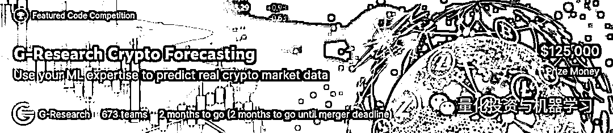
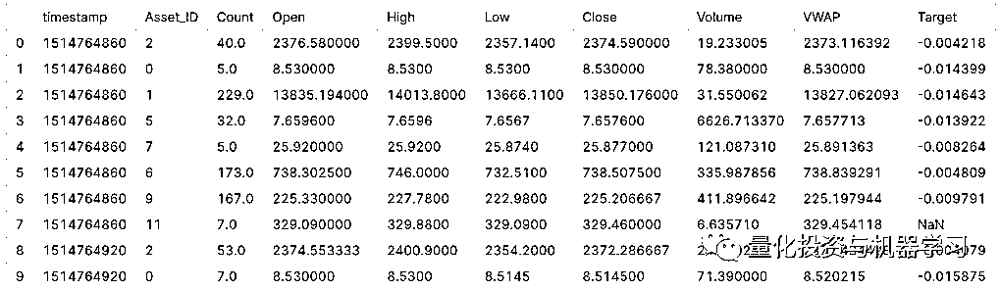
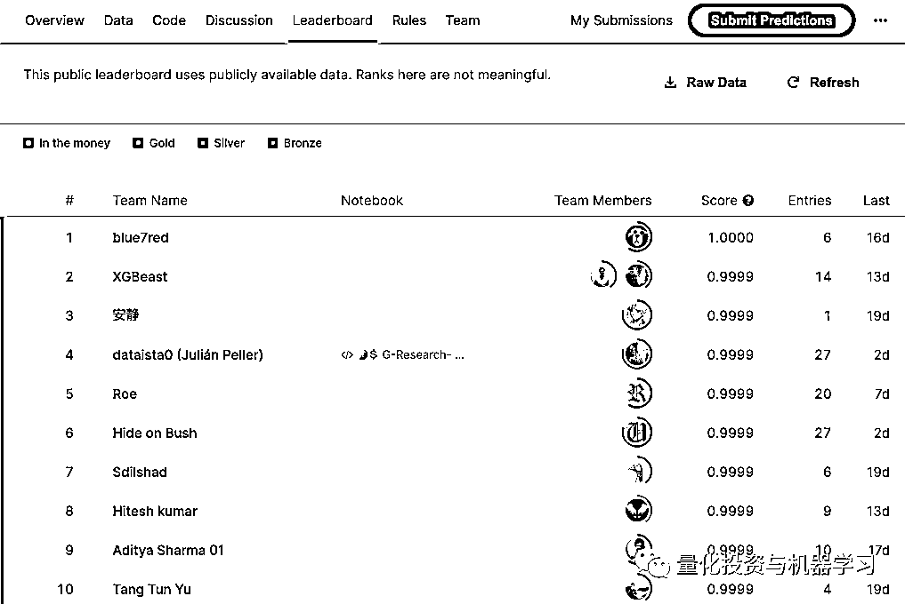
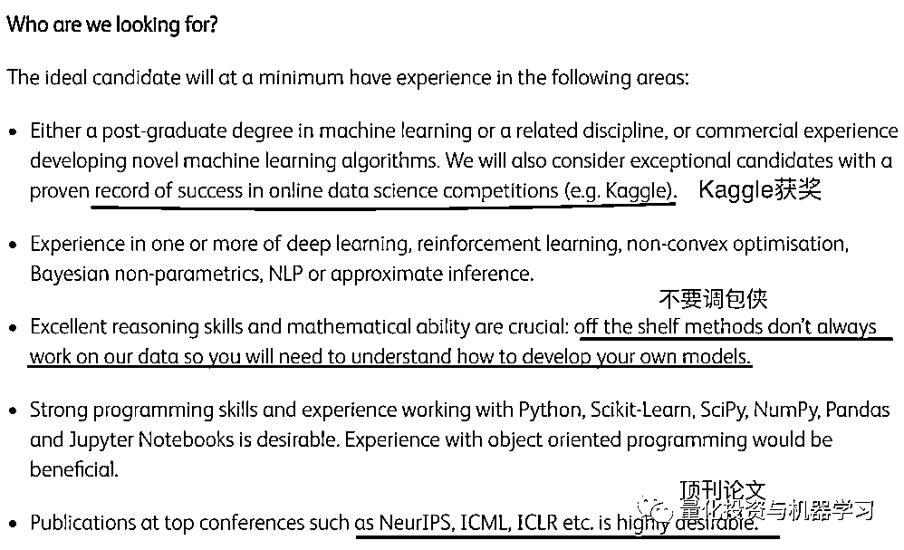

# Kaggle 大战再次打响！这次是 G-Research

> 原文：[`mp.weixin.qq.com/s?__biz=MzAxNTc0Mjg0Mg==&mid=2653321689&idx=1&sn=9cdfed0a3eaba980c4f45d068943340c&chksm=802dbbccb75a32daf7835e2d7b24db734ea42389b5e6b903b26ba898e2f03eb801ee424671f0&scene=27#wechat_redirect`](http://mp.weixin.qq.com/s?__biz=MzAxNTc0Mjg0Mg==&mid=2653321689&idx=1&sn=9cdfed0a3eaba980c4f45d068943340c&chksm=802dbbccb75a32daf7835e2d7b24db734ea42389b5e6b903b26ba898e2f03eb801ee424671f0&scene=27#wechat_redirect)

# 

量化投资与机器学习微信公众号，是业内垂直于**量化投资、对冲基金、Fintech、人工智能、大数据**等领域的主流自媒体。公众号拥有来自**公募、私募、券商、期货、银行、保险、高校**等行业**20W+**关注者，连续 2 年被腾讯云+社区评选为“年度最佳作者”。

近日，继 Jane Street、Two Sigma、Optiver 之后，又一家全球 TOP 的量化投资机构在 Kaggle 上举办了数据科学大赛。与以往针对股票预测的比赛不同的是，本次比赛是利用机器学习算法预测虚拟货币的未来收益率。

比赛地址：*https://www.kaggle.com/c/g-research-crypto-forecasting/*

本次比赛的总奖金高达 125000 美元，其中一等奖将获得 50000 美金的奖励，其他各名次的奖金情况如下：

*   First Prize：$50,000

*   Second Prize：$20,000

*   Third Prize：$15,000

*   Fourth Prize：$10,000

*   Fifth - Tenth Prize(s)：$5,000

自从 11 月 3 日比赛上线以来，已经有近 700 个参赛队伍报名参赛，可能是由于 G-Research 比较低调的缘故，报名热度并没有前面几家量化对冲基金来的火热。比赛的最后报名截止日为明年 1 月 25 日，最后提交截止日为明年 2 月 1 日。最终的比赛结果将于 2022 年 5 月 3 日公布。

**关于比赛**

本次比赛给出的历史数据是 14 个虚拟货币的历史分钟价格数据，包括高开低收、成交量、成交笔数及 VWAP 等，预测的目标是下个 15 分钟该虚拟货币的收益率*。

上面表格最后一列 Target 为预测的目标，是未来 15 分钟资产的残差收益率。具体计算公式如下：<embed style="vertical-align: -6.891ex;width: 33.774ex;height: auto;max-width: 300% !important;" src="https://mmbiz.qlogo.cn/mmbiz_svg/a18XcQ1EBBgzgouRoaMcibMOJGbiaHTeSLxQpIAicvG12oJrxjFqrGUd3OvXGJMxicPIK2EaMGLmiah6O95K50Iq5NcI1u7lYvReR/0?wx_fmt=svg" data-type="svg+xml">其中， 为资产 的权重（比赛数据中给定了每个资产的权重）， 为 14 个虚拟货币的加权收益率。然后通过对每个虚拟货币与 M 进行滚动回归（3750 分钟），计算出货币 a 的 。预测目标 Target 就是虚拟货币 a 减去 后的残差收益率。

比赛的评分标准是样本外每个货币的预测值与真实值的相关系数（Pearson），然后把所有 14 个虚拟货币的样本外相关系数通过给定的权重进行加权，计算出最终的加权相关系数，作为模型效果的评价标准。

关于比赛数据的 Tutorial，可参考：

*https://www.kaggle.com/cstein06/tutorial-to-the-g-research-crypto-competition#G-Research-Crypto-forecasting-competition*

从当前公榜的提交来看，大部分所有排名靠前的成绩都将近 1 的相关系数（看看就好，绝大多数出现了过拟合）：

**关于 G-Research**

G-Research 成立于 2012 年，由保守党议员安德里亚•利德索姆的丈夫本•利德索姆运营。利德索姆曾是巴克莱的银行家，但自 2009 年以来一直担任 Island Research 的董事（这家有限责任合伙企业是 G-Research 的组成部分）。

G-Research 一直非常低调。**随着 2018 年 Xu Ke 案件，G-Research 进入国人的视野。**当时彭博社商业周刊专门刊登了一篇文章“The Triple Jeopardy of a Chinese Math Prodigy”。这名前雇员每天都在 G-Research 的“安全区”写代码。据报道，安全区只能通过一个特殊的 pod 进入，该 pod 配有生物指纹扫描仪和重量传感器(用于检测未经授权的设备进入或离开该区域)。然而，Xu Ke 在 2014 年获得了 40 万英镑的奖金后突然离职，这引发了他窃取 G-Research 代码的怀疑。他随后被判五项指控中的两项罪名成立，并被判处四年半监禁。2019 年 1 月，他被驱逐回中国。

该公司人才招聘主管 Alex Whitlock 表示，该公司在伦敦拥有 800 名员工，目前正处于总体增长轨道上。惠特洛克告诉我们:“我们聘用的宽客都非常聪明，有很强的学术背景。”“我们一直在寻找新的团队成员，因此，如果你想处理大量数据集，在嘈杂的噪音中发现模式，并对量化金融感兴趣，我们可能会有一个机会，让你的名字出现在其中。”

**G-Research 对于人才的基础薪酬起薪将近 20W 美金（和 Jane Street 有的一拼）**，但想要通过 G-Research 的面试非常困难，据说 G-Research 清一色都是剑桥/普林斯顿级别的数学 Phd。如今，G-Research 的量化研究人员的面试流程分为量化能力测试，然后是 HackerRank 代码测试，然后是技术面试。Whitlock 说:“我们的面试是严格的，但不是为了抓住人们的把柄。”

G-Research 对于机器学习的人才也是求贤若渴，但对于人才的要求也非常苛刻。G-Research 有专门的 Machine Learning Researcher 岗位，从官网中看到该岗位对于候选人的要求如下：

G-Researcher 还专门成立了机器学习学院，为新加入的研究员或对机器学习有兴趣的员工进行培训。学院会邀请业界、学术界的机器学习专家为大家分享最前沿的机器学习理论与实践。 

通过 Kaggle 比赛挖掘量化人才已经成为趋势。我们期待，未来中国自己的量化机构也能在 Kaggle 上大放异彩，收获全球的目光。