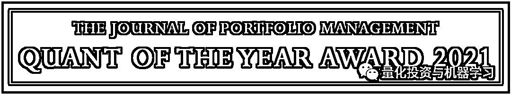
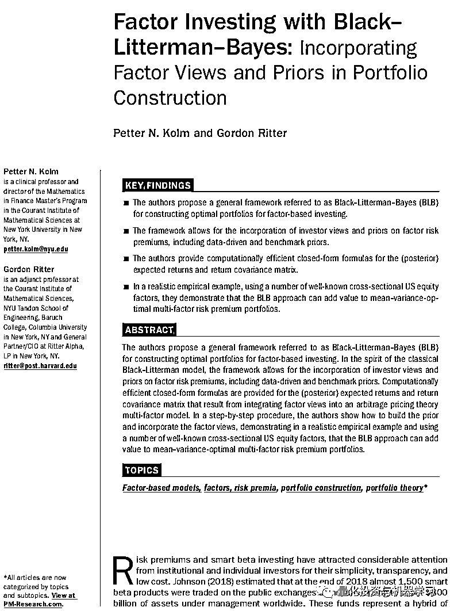
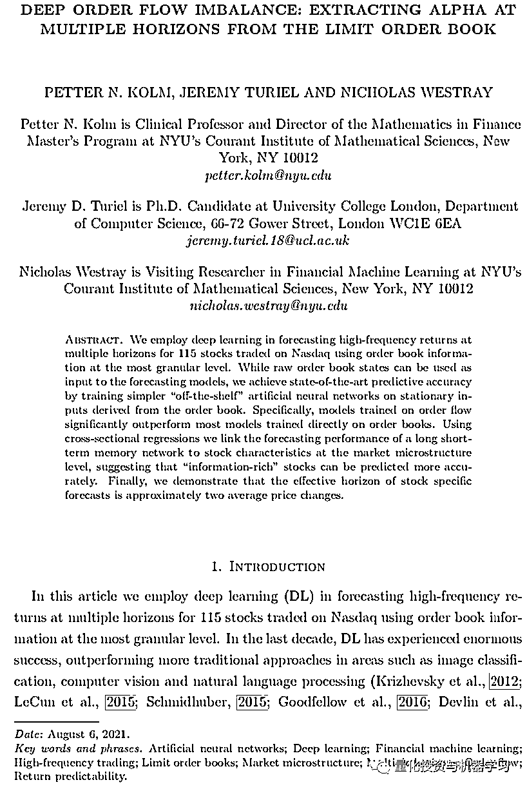

# JPM 2021 年度 Quant：Petter Kolm

> 原文：[`mp.weixin.qq.com/s?__biz=MzAxNTc0Mjg0Mg==&mid=2653321666&idx=1&sn=9c7cec70054ce7f63a02636c2fc702a1&chksm=802dbbd7b75a32c190548e0712c059eab46e1de4f2b0f36e90522e5756861daa66c89db94351&scene=27#wechat_redirect`](http://mp.weixin.qq.com/s?__biz=MzAxNTc0Mjg0Mg==&mid=2653321666&idx=1&sn=9c7cec70054ce7f63a02636c2fc702a1&chksm=802dbbd7b75a32c190548e0712c059eab46e1de4f2b0f36e90522e5756861daa66c89db94351&scene=27#wechat_redirect)

# 

量化投资与机器学习微信公众号，是业内垂直于**量化投资、对冲基金、Fintech、人工智能、大数据**等领域的主流自媒体。公众号拥有来自**公募、私募、券商、期货、银行、保险、高校**等行业**20W+**关注者，连续 2 年被腾讯云+社区评选为“年度最佳作者”。

The Journal of Portfolio Management （JPM）将 2021 年的“Quant of the year Award”授予了**Petter Kolm**。JPM 的“Quant of the year Award”表彰在量化投资组合理论领域做出杰出贡献的研究人员。

**Campbell Harvey 因其在研究方法和将运气与资产管理技能区分开方面的研究**而获得了去年的 Quant of the year Award，他在谈到 2021 年的奖项时说：“Petter Kolm 在多期贝叶斯投资组合优化、动态复制和对冲方面做出了关键贡献。他最近的重要工作展示了如何使用强化学习来解决具有挑战性的动态优化问题。”

JPM 的主编 Frank Fabozzi 指出，Petter Kolm 在学术界和实践者中享有杰出的声誉，有助于弥合学术界和实践者之间的鸿沟，这是 JPM 的一项重要使命。他指出了 Petter Kolm2017 年与 Gordon Ritter 的研究，揭示了 Black-Litterman 优化和贝叶斯回归之间的二重性。Fabozzi 还指出，由 Kolm 和 Ritter 在 2020 年进行的研究展示了如何通过使用强化学习技术来解决跨期选择问题是对学术界的另一个重要贡献。

在获得这个奖项时，Petter Kolm 说：“作为一名学者和实践者，我非常荣幸获得今年的 Quant of the year Award。我希望它能引起人们对投资组合和风险管理的关注，这些投资组合和风险管理利用了机器学习、贝叶斯统计以及动态优化等前沿技术。我要感谢我的合著者和学生，感谢他们不断挑战我，感谢他们的宝贵贡献。”

**关于 Petter Kolm**

Petter Kolm，2007 年起担任纽约大学 Courant 数学科学研究所金融数学项目的主任。他也是 CorePoint-Partners.com 的合伙人。此前，Petter 曾在高盛资产管理公司的量化策略组工作，开发股票、固定收益和大宗商品的自营投资策略、投资组合和风险分析。

Petter 是众多学术期刊文章和著名的金融书籍的合著者，包括 Financial Modeling of the Equity Market: From CAPM to Cointegration (Wiley, 2006)；Trends in Quantitative Finance (CFA Research Institute, 2006)；Robust Portfolio Management and Optimization (Wiley, 2007) and Quantitative Equity Investing: Techniques and Strategies (Wiley, 2010)。

Petter 经常在学术和行业会议和活动中发表演讲，担任小组成员和主持人。他是 International Journal of Portfolio Analysis and Management (IJPAM), Journal of Financial Data Science （JFDS），Journal of Investment Strategies （JoIS），和 Journal of Portfolio Management （JPM）的编委会成员。

Petter 还是是 lternative Data Group（ADG），AISignals and Operations in Trading（Aisot），Betterment（最大的机器人顾问之一）和纽约大学 Stern 学院波动与风险研究所的顾问委员会成员。他也是国际定量金融协会(IAQF)的董事会成员和人工智能金融研究所（AIFI）的科学咨询委员会成员。

作为顾问委员会成员、顾问和专家证人，Petter 提供的服务包括另类数据、数据科学、计量经济学、预测模型、高频交易、机器学习、带交易成本的投资组合优化、量化和系统交易、风险管理、机器人投顾、Smart Beta 策略等。

他拥有耶鲁大学数学博士学位，瑞典斯德哥尔摩皇家理工学院应用数学专业研究型硕士学位，并获得瑞士苏黎世联邦理工学院数学硕士学位。

**Petter Kolm 的研究**

Peter Kolm 最近的关于量化交易策略的研究应该就是 Deep Order Flow Imbalance：Extracting Alpha at Multiple Horizons from the Limit Order Book，我们之前也在公众号进行解读分享过，详情请看：

 

其他较多的研究是关于组合优化与 Black-litterman 的结合。比如这篇文章 Factor Investing with Black-Litterman-Bayes：Incorporating Factor Views and Priors in Portfolio Construction，作者基于 Black-Litterman-Bayes 的框架，在构建投资组合时，同时考虑考虑了投资者的观点及因子的风险溢价。

其他更多的研究可以参考作者 SSRN 主页：

*https://papers.ssrn.com/sol3/cf_dev/AbsByAuth.cfm?per_id=545299*

**如何下载论文？**

关于文章中提到的两篇论文，公众号也打包好供大家下载学习：

公众号后台回复：***JPM2021***