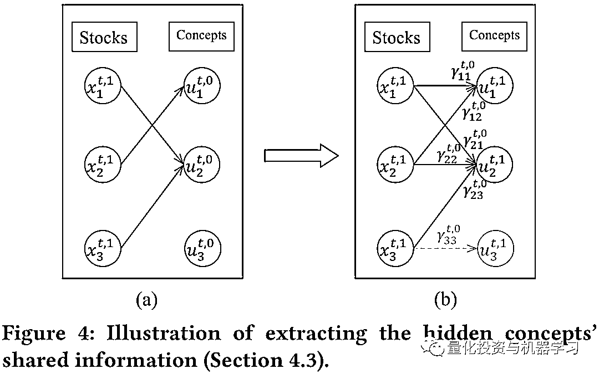

# 因子挖掘：基于图神经网络与公司主营（附代码）

> 原文：[`mp.weixin.qq.com/s?__biz=MzAxNTc0Mjg0Mg==&mid=2653321628&idx=1&sn=4c3ac7dac726fc52f62b275ee1c218d0&chksm=802dbb89b75a329f58e581a572e5f362bbe6dcf1a376c32edd43ccf27afeaec225cec5b93a7d&scene=27#wechat_redirect`](http://mp.weixin.qq.com/s?__biz=MzAxNTc0Mjg0Mg==&mid=2653321628&idx=1&sn=4c3ac7dac726fc52f62b275ee1c218d0&chksm=802dbb89b75a329f58e581a572e5f362bbe6dcf1a376c32edd43ccf27afeaec225cec5b93a7d&scene=27#wechat_redirect)

# 

量化投资与机器学习微信公众号，是业内垂直于**量化投资、对冲基金、Fintech、人工智能、大数据**等领域的主流自媒体。公众号拥有来自**公募、私募、券商、期货、银行、保险、高校**等行业**20W+**关注者，连续 2 年被腾讯云+社区评选为“年度最佳作者”。

# 

量化投资与机器学习公众号独家解读

量化投资与机器学公众号 *** ***QIML Insight——深度研读系列 ******是公众号今年全力打造的一档**深度、前沿、高水准**栏目。

公众号**遴选**了各大期刊前沿论文，按照理解和提炼的方式为读者呈现每篇论文最精华的部分。QIML 希望大家能够读到可以成长的量化文章，愿与你共同进步！

> **本期遴选论文** **标题：**HIST: A Graph-based Framework for Stock Trend Forecasting via Mining Concept-Oriented Shared Information
> **作者：**Wentao Xu, Weiqing Liu, Lewen Wang, Yingce Xia, Jiang Bian, Jian Yin, Tie-Yan Liu, Sun Yat-sen University, Microsoft Research

**股票特征的拆分**

股票市场的涨跌容易受到相关共同概念的影响，但在预定义的概念中，有时候并不能包含完全的信息，比如在某些概念数据中有些股票并不属于相关概念，但涨跌也受到了该概念的影响。有时候即使某只股票属于相关概念，但涨跌反而也没有受概念的影响。

同时预定义的概念并不能考虑到市场上所有存在的涨跌逻辑，可能市场中有一部分隐含概念也能影响股票收益。

作者提出了隐含概念的逻辑，并将股票的特征用以下三个部分来解释：

*   **市场存在的预定义概念包含的共有信息**

*   **隐含概念包含的共有信息**

*   **股票特质信**

通过图神经网络及全连接层的组合，作者构建了一个 HIST 模型，该模型可以将以息进行剥离，并最终放入一个全连接的线性层进行股票收益的预测。并在最终的测试中取得的满意的效果。

**HIST 模型结构**

**输入**

*   t 时间股票的特征

*   m 个预定义的概念 

**步骤**

**1、股票特征提取**

第一步使用 2 层的 GRU 对股票原始特征（Alpha360 因子）进行表征提取：

以上 为股票 i 的因子， 为提取后的表征。则矩阵 为所有股票的表征（第 i 行为股票 i 的表征）。

**2、股票特征分层处理**

本文假设每个股票表征所包含的信息有以下三层组成：

*   预定义概念相关的共有信息

*   隐含概念相关的共有信息

*   每只股票的特质信息

在本步骤中，主要是应用三个不同的模型对这三类信息进行分层提取，提取过程中主要采用了 Doubly Residual 的模型架构。

为了方便阐述，我们把以上三层不同的模型用模型 0、1、2 表示，每个股票 i 输入模型 j 的数据用 表示，经过模型 j 处理后，得到两个输出：

用于最后对于股票收益率的预测，其中最终用于预测的输入为: <embed style="vertical-align: -0.464ex;width: 22.14ex;height: auto;" src="https://mmbiz.qlogo.cn/mmbiz_svg/a18XcQ1EBBgzgouRoaMcibIMGdzNQIewGHhnUfftRAThALzqfC3fwOQFjVwkrHrZOLGdeddyHNrX8rLAyJ5ckfesmd6lC4AvA/0?wx_fmt=svg" data-type="svg+xml">；

用于从当前的 剥离掉的信息，并得到下一层模型的输入：

**Module 0：预定义概念处理模块（Predefined concept module）**

在这一步中，基于股票行业和概念属性构建了图神经网络模型。主要细分步骤如下：

*   **概念表征初始化**

如下图 3(a)表示，先把股票和对应概念（行业分类和主营业务）构建二分图（bipartite graph）。那么每个概念的表征的计算如等式(5)所示，其含义为：**概念 k 的表征为该概念内所有股票表征的市值加权**，以这个表征作为概念的初始化表征。

<embed style="vertical-align: -3.924ex;width: 19.945ex;height: auto;max-width: 300% !important;" src="https://mmbiz.qlogo.cn/mmbiz_svg/a18XcQ1EBBgzgouRoaMcibIMGdzNQIewGfQE0qYzsSkfqyjVMOLy4XuRpmSu2YjadAtA5Uh0rxaaQh5cU5cbiay6vZib4Whfok3/0?wx_fmt=svg" data-type="svg+xml">

*   **概念表征修正**

概念表征的修正主要为了解决以下两个问题：(1)预定义概念的信息缺失问题，有些股票跟概念的关联可能没呈现出来；(2)预定义概念的信息过剩问题，有些股票虽然跟概念有关联，但其实对股价影响不大。本文主要通过股票与概念的相似性解决这两个问题，如果一个股票与某个概念相似性很高，但在预定义概念中，这个股票与这个概念并没有相连，那就可以视为缺失的关联。反过来，如果股票与某个概念间相关度不高，但在预定义概念中两者相连，则这个关联是没有必要的。

其中，股票与表征的相关性计算采用 Cosine 相关性，并在后续步骤概念表征加总时，使用经 Softmax 归一化后的相关性作为权重，具体公式如下：

<embed style="vertical-align: -5.4ex;width: 35.02ex;height: auto;max-width: 300% !important;" src="https://mmbiz.qlogo.cn/mmbiz_svg/a18XcQ1EBBgzgouRoaMcibIMGdzNQIewGo7loVxK2SibNwGes4uWjVqPmiapRUlb3Sxl8GSnwgUrrotkcQQgoRFV8ufSJLtTicAB/0?wx_fmt=svg" data-type="svg+xml">

*   **概念表征加总**

最终在基于修正后的图结构计算每个概念的表征，并传入全连接层输出作为最终概念 k 的表征，其中选用了 LeakyReLU 作为激活函数：

<embed style="vertical-align: -3.094ex;width: 42.74ex;height: auto;max-width: 300% !important;" src="https://mmbiz.qlogo.cn/mmbiz_svg/a18XcQ1EBBgzgouRoaMcibIMGdzNQIewGb7Z4uj6xhSJZ4YoqoiaYQeibhXKIibvxGM43QfgXeQAUoeSy3fycEZc70uxGRSjrAFz/0?wx_fmt=svg" data-type="svg+xml">

*   **预定义概念相关共有信息的剥离**

在概念的表征修正后，重新计算股票与每个概念的相关性，并经 Softmax 归一化作为权重，其中 为股票 i 与概念 k 在 t 时间，归一化后的相关性：<embed style="vertical-align: -5.4ex;width: 35.02ex;height: auto;max-width: 300% !important;" src="https://mmbiz.qlogo.cn/mmbiz_svg/a18XcQ1EBBgzgouRoaMcibIMGdzNQIewGwLTntgtSh6MNiaFpPYHo0UbOrgcPMsX49VLm24lXo20JmQiafqARHPp5L7LWuEhBPB/0?wx_fmt=svg" data-type="svg+xml">

接着，把股票 i 与所有概念 k 的表征加权总和，传入全连接层，输出作为股票 i 所包含的预定义概念的相关共有信息。

<embed style="vertical-align: -3.219ex;width: 43.441ex;height: auto;max-width: 300% !important;" src="https://mmbiz.qlogo.cn/mmbiz_svg/a18XcQ1EBBgzgouRoaMcibIMGdzNQIewGrL2hCCvzGyUicjZJ2oib9ZkycxMNgf06ne430Fq3U5XkwdfB1JC8tqAicd5g9nYcuWG/0?wx_fmt=svg" data-type="svg+xml">

最后，再把 传入两个全连接层，分别输入 <svg xmlns="http://www.w3.org/2000/svg" role="img" focusable="false" viewBox="0 -963 4326.5 1263.3" aria-hidden="true" style="vertical-align: -0.679ex;width: 9.789ex;height: 2.858ex;"><g stroke="currentColor" fill="currentColor" stroke-width="0" transform="matrix(1 0 0 -1 0 0)"><g data-mml-node="math"><g data-mml-node="mo" transform="translate(1705.2, 0)"><text data-variant="normal" transform="matrix(1 0 0 -1 0 0)" font-size="932.9px" font-family="serif">，</text></g></g></g></svg>:

<embed style="vertical-align: -3.957ex;width: 31.996ex;height: auto;max-width: 300% !important;" src="https://mmbiz.qlogo.cn/mmbiz_svg/a18XcQ1EBBgzgouRoaMcibIMGdzNQIewGHNiaHyK5Tj6oicia3KPE72cbY9aqjdbXQ5YWLzuiahKRomBsh7oSgWSK03Qiauw78bby1/0?wx_fmt=svg" data-type="svg+xml">

其中 作为下一个模型的输入。

**Module 1：隐含概念处理模块（Hidden concept module）**

在上面的模型钟提取了预定义概念相关的共有信息，这里我们进行隐含概念共有信息的提取，主要经历以下步骤：

*   **隐含概念表征初始化**

假设隐含概念的数量与股票数量一致，都为 n。并假设概念 i 的表征 为对应股票 i 的表征 。  

*   **股票与隐含概念相似性计算**

采用 Cosine 计算股票 i 与概念 k，两两之间的相关性：

<embed style="vertical-align: -3.13ex;width: 40.157ex;height: auto;max-width: 300% !important;" src="https://mmbiz.qlogo.cn/mmbiz_svg/a18XcQ1EBBgzgouRoaMcibIMGdzNQIewGdl0IYL6aw1XThf9wpWzVDhkIgsBB9W52Pc9ps0vS2oCk1Yppht0LFWyMdSAl8GEj/0?wx_fmt=svg" data-type="svg+xml">

*   **股票与隐含概念关联**

将股票与相似度最高的概念进行连接（除了原先对应的概念，如股票 1 与概念 1），如图 4 所示，股票 1 与概念 2 进行了连续，而概念 3 没有股票与其连接，则把概念 3 删掉。然后再把每个股票原先对应的概念加回来，如图 4(b)所示。

*   **计算隐含概念的表征**

最后通过全连接层计算概念的表征：

<embed style="vertical-align: -3.477ex;width: 44.936ex;height: auto;max-width: 300% !important;" src="https://mmbiz.qlogo.cn/mmbiz_svg/a18XcQ1EBBgzgouRoaMcibIMGdzNQIewG4TKg6bleBibr7NuUjdD6k2u8TFV49DJpicrFmJzvO4Zib4C4nFCQiag4ceoC2JtzTWxx/0?wx_fmt=svg" data-type="svg+xml">

后续计算股票在隐含概念相关的共信息的步骤和以上 Module 0 的步骤一致。

**Module 2：股票特质信息处理（Individual information module）**

经过以上两个模型的信息剥离，每个股票都只包含里自身的特质信息，这些信息再经过一个全连接层输入为最后预测股票收益的信息：

<embed style="vertical-align: -1.469ex;width: 32.033ex;height: auto;max-width: 300% !important;" src="https://mmbiz.qlogo.cn/mmbiz_svg/a18XcQ1EBBgzgouRoaMcibIMGdzNQIewGQicvDbJLBtwoJeNIfibNMJiaXhEic3tJQdddYzZibH2yllc2xry4FKEaVPibooPTT51epF/0?wx_fmt=svg" data-type="svg+xml">

**3、全连接神经网络层**

以上三个 Moudle 的输出最终放到一个线性全连接层：

<embed style="vertical-align: -1.469ex;width: 42.887ex;height: auto;max-width: 300% !important;" src="https://mmbiz.qlogo.cn/mmbiz_svg/a18XcQ1EBBgzgouRoaMcibIMGdzNQIewGhQVFr2n6or8Lba4NPKf754t8qbSGpEUuv4fbXMD5wjCKoJmcNmdeDcn7ygclJLhS/0?wx_fmt=svg" data-type="svg+xml">

训练的目标函数为：

<embed style="vertical-align: -3.094ex;width: 40.617ex;height: auto;max-width: 300% !important;" src="https://mmbiz.qlogo.cn/mmbiz_svg/a18XcQ1EBBgzgouRoaMcibIMGdzNQIewGrklkmvWhJe65NASwU1eiaRUCExcxyO2ViaAR3Yv1YvjutL5kgGzohZHaGJsr2c1IaS/0?wx_fmt=svg" data-type="svg+xml"><embed style="vertical-align: -1.469ex;width: 42.887ex;height: auto;max-width: 300% !important;" src="https://mmbiz.qlogo.cn/mmbiz_svg/a18XcQ1EBBgzgouRoaMcibIMGdzNQIewGhQVFr2n6or8Lba4NPKf754t8qbSGpEUuv4fbXMD5wjCKoJmcNmdeDcn7ygclJLhS/0?wx_fmt=svg" data-type="svg+xml">

**实证效果**

**数据**

*   股票范围：中证 100 和沪深 300

*   股票特征（因子）：基于 Qlib 计算的 Alpha360 特征

*   时间跨度：2007-01-01 至 2020-12-31；其中 2007-01-01 至 2014-12-31 为训练集，2015-01-01 至 2016-12-31 为验证集，2017-01-01 至 2020-12-31 为测试集

*   预定义概念数据：使用公司的行业数据及主营业务作为预定义的概念数据

*   预测的目标：股票下一个交易日的收益率

**Baseline 模型**

Baseline 的模型细节参考原文

**结果**

在所有的模型钟，在两个股票池 CSI100 与 CSI300 钟，HIST 模型的 IC 和 RankIC 都是最高的。比如在 CSI300 的测试中，RankIC 达到了 12.6%。

**在考虑交易成本（买入万五，卖出万分之十五）的日度交易策略中，每日买入收益预测最高的前 30 只股票，**在 2017 年到 2020 年，模型的累计收益为 50%，是所有测试模型中收益最高的。

**代码**

作者开源了基于 Pytorch 的代码，非常简洁明了：

*https://github.com/Wentao-Xu/HIST*