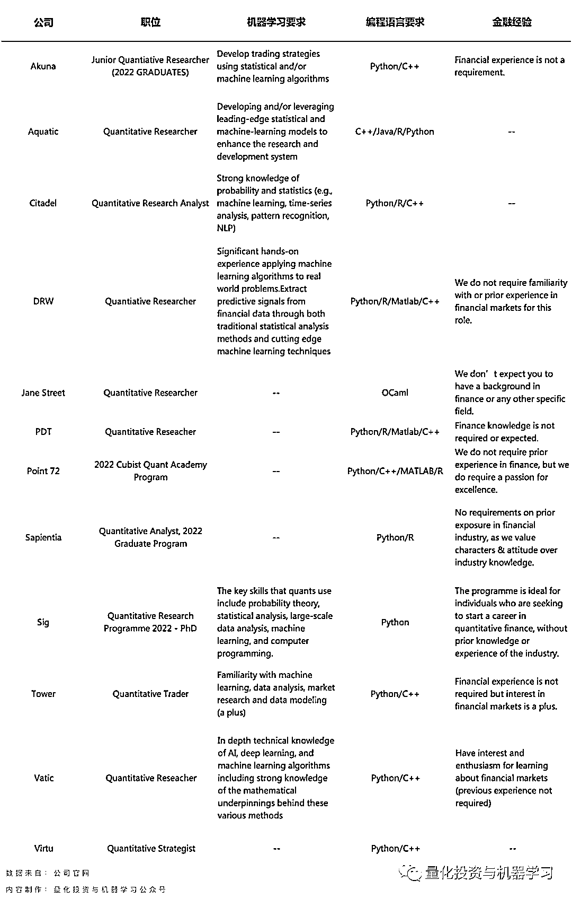

# 招聘 JD 有内涵：12 家顶尖量化对冲基金的抢人大战

> 原文：[`mp.weixin.qq.com/s?__biz=MzAxNTc0Mjg0Mg==&mid=2653321591&idx=1&sn=f0187bede0fc36c5f3f9df26a65fc39e&chksm=802dbb62b75a32740d1578b152823c94307d6b16249fd90c64ef29332b1d2a7419ca5275413c&scene=27#wechat_redirect`](http://mp.weixin.qq.com/s?__biz=MzAxNTc0Mjg0Mg==&mid=2653321591&idx=1&sn=f0187bede0fc36c5f3f9df26a65fc39e&chksm=802dbb62b75a32740d1578b152823c94307d6b16249fd90c64ef29332b1d2a7419ca5275413c&scene=27#wechat_redirect)

# 

量化投资与机器学习微信公众号，是业内垂直于**量化投资、对冲基金、Fintech、人工智能、大数据**等领域的主流自媒体。公众号拥有来自**公募、私募、券商、期货、银行、保险、高校**等行业**20W+**关注者，连续 2 年被腾讯云+社区评选为“年度最佳作者”。

2021 年即将接近尾声，全球各大 TOP 量化基金也开始了 2022 年的抢人大战（校招），公众号特意搜集了 12 家全球顶尖量化对冲基金的 2022 年量化研究员校招的 JD（如下表），包括：**Akuna、Aquatic、Citadel、DRW、Jane Street、PDT、Point 72（Cubist）、Sapientia、Sig、Tower、Vatic、Virtu**。

我们搜集的职位**仅包括量化研究员**（除了 Tower 以外），从这 12 家的招聘需求上，我们可以看出在 2022 年，顶尖量化基金对于量化研究岗位最基本的需求有什么共同点。

**关于机器学习**

**我们特意把各家招聘 JD 中对于机器学习的原句摘录了下来**，这所有 12 家公司中，其中 7 家在招聘需求中明**确要求应聘者掌握****『****机器学习****』****的相关知识**。

其中以 DRW 及 Vatic 对于机器学习的要求最为严格。比如：

DRW 要求：

> “Significant hands-on experience applying machine learning algorithms to real world problems.”

Vatic 要求：

> “In depth technical knowledge of AI, deep learning, and machine learning algorithms including strong knowledge of the mathematical underpinnings behind these various methods”，需要应聘者掌握机器学习方法背后的数学理论。

Tower 没有开放 Quant Research 的职位，但其也是罕见的对于 Quant Trader 有机器学习相关的要求。

除了对量化研究员有机器学习的相关要求外，现在**大部分公司有单独的机器学习研究员的岗位**。相对于量化研究员，**机器学习研究员更******『******专注于机器学习算法的设计与优化******』****。如 G-Research 还开设了专门的机器学习学院，帮助员工提高相关技能。

所以，按照目前的趋势，**机器学习相关知识已经逐渐成为量化研究员的标配**，而更专业的机器学习大牛可以应聘机器学习研究员。

**关于编程语言**

毫无疑问，对于量化研究员的岗位，Python 语言更适合快速进行策略逻辑的探索与实践，更专业的策略实现可以交给量化开发工程师。**在统计的 12 家机构中，其中 11 家公司有 Python 语言的要求。**只有非常极客的 Jane Street，希望员工入职后使用自家的 OCaml 语言。

相关阅读： 

 

除了 Python 之外，**如果能够掌握******『******C++******』******，也是大部分公司招聘的加分项。**当然 R 和 Matlab 也是可以接受的。而只有 Aquatic，在招聘需求中接受量化研究员使用 Java。

C++，大家接受指针的摧残吧

**关于金融专业/经验**

虽然公众号很清楚的知道，金融专业在量化求职中没有很大的优势。但还是让公众号惊讶的是，在 12 家 JD 中，**『****有 9 家公司明确表示，****不需要****大家有****金融行业****的知识和经验****』**，而更看重：

*   解决实际问题的能力
*   多任务的处理能力
*   对细节的强大注意力

**金融专业，或许，确实不是量化对冲基金的目标招聘专业。**

**所以，有时间考证，不如多刷几遍 tensorflow 源代码！**

祝大家求职顺利~