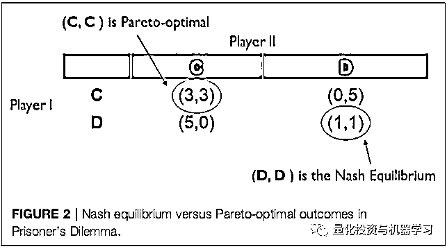
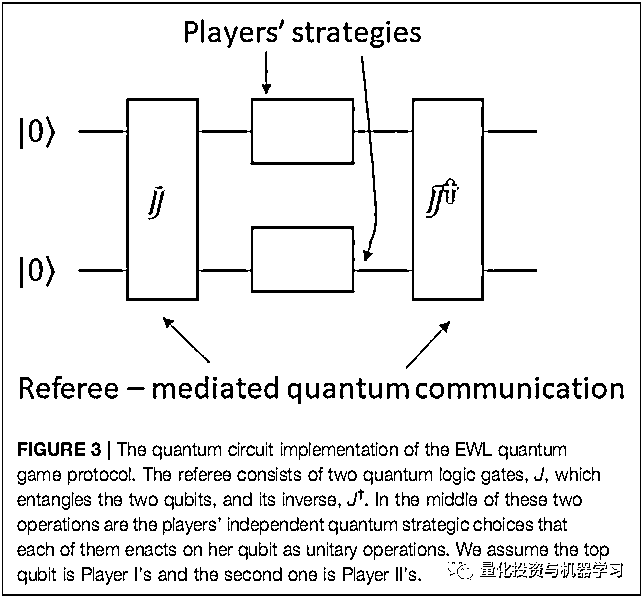
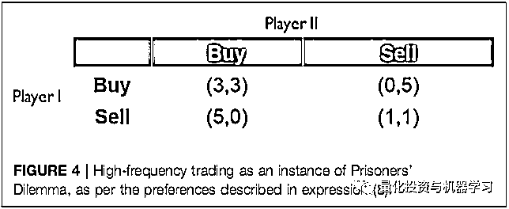

# 量子博弈与高频交易

> 原文：[`mp.weixin.qq.com/s?__biz=MzAxNTc0Mjg0Mg==&mid=2653321566&idx=1&sn=4d941a143760e8bf1a91c49c3fa7ed55&chksm=802dbb4bb75a325d223d67a8f14796f2d22c612029508947ba087792e84a276d593d59599893&scene=27#wechat_redirect`](http://mp.weixin.qq.com/s?__biz=MzAxNTc0Mjg0Mg==&mid=2653321566&idx=1&sn=4d941a143760e8bf1a91c49c3fa7ed55&chksm=802dbb4bb75a325d223d67a8f14796f2d22c612029508947ba087792e84a276d593d59599893&scene=27#wechat_redirect)

# 

量化投资与机器学习微信公众号，是业内垂直于**量化投资、对冲基金、Fintech、人工智能、大数据**等领域的主流自媒体。公众号拥有来自**公募、私募、券商、期货、银行、保险、高校**等行业**20W+**关注者，连续 2 年被腾讯云+社区评选为“年度最佳作者”。

高频交易（高频交易）为商业上可用的第一代准量子计算机提供了一个极好的用例和一个潜在的杀手级应用。为此，我们在这里提供了一个简单的高频交易的博弈论模型，即著名的两人博弈，囚徒困境。本文以准量子云上的囚徒困境为例，利用 Eisert，Wilkens 和 Lewenstein 量子中介通信协议，探讨了高频交易的实现方法。利用合作博弈论推理，我们还注意到，在不久的将来，当互联网适当量子化时，作为强化机器学习的一个实例，玩家将能够在高频交易中实现 Pareto 最优（Pareto-optimality）。

**引言**

非合作博弈论是具有不同偏好的个体之间为了共同利益而进行的战略互动的艺术。博弈论推理可以正式追溯到中国古代的孙子（大约公元前 500 年）和印度古代的部长 Chanakya（大约公元前 300 年）。

20 世纪非合作博弈论的数学形式化可以追溯到冯 · 诺依曼和纳什的工作。冯 · 诺依曼和摩根斯特恩的开创性著作《博弈论与经济行为》的出版使人们关注博弈论，将其作为分析经济行为和战略决策的正确数学语言。随着诺贝尔经济学奖授予博弈论推理的推进者，包括纳什（纳什，1950 年），哈萨尼（哈萨尼，1968 年），塞尔滕（塞尔滕，1994 年），奥曼（罗伯特，2005 年），和史密斯（梅纳德史密斯和普莱斯，1973 年），博弈论推理在经济学，政治电视，和进化生物学的应用也变得越来越重要。2019 冠状病毒疾病流行病的持续，博弈论推理也是用于制定最佳公共卫生政策的最佳实践（elgazar，2021）。

随着最近商业可行的量子计算和通信技术的出现，博弈论和量子信息处理的思想汇合已经引起了强烈的兴趣。这种兴趣产生了被称为量子博弈论的课题，这个课题主要研究量子信息技术对博弈论推理的影响。量子博弈论一个特别热门的应用领域是高频交易。在这里，许多参与者以非常高的速度参与买卖，利用市场在短时间的小幅波动持续获得收入。**由于交易的时机对于高频率公司的成功至关重要，因此，能够提高公司之间同步程度并能够提供可证明安全的通信的新工具引起了人们的极大兴趣。**

**囚徒困境**

首先我们用囚徒困境的例子解释下博弈论，在这个博弈中，两个共谋犯罪的人被关入监狱，不能互相沟通情况。如果两个人都不揭发对方（C，C），则由于证据不确定，每个人都减刑 3 年；若一人揭发（D），而另一人沉默（C），则揭发者因为立功而减刑 5 年，沉默者因不合作而入无法减刑；若互相揭发（D，D），则因证据确凿，二者减刑 1 年。由于囚徒无法信任对方，因此倾向于互相揭发（D，D），而不是同守沉默（C，C）。**最终导致纳什均衡仅落在非合作点上的博弈模型。而其实合作博弈模型的均衡点（C，C），称为 Pareto 最优**点。

**混合策略与中介交流**

当博弈中不存在纳什均衡时，或者它是次优的，博弈理论家建议玩家对结果采用随机化，作为引入或改进纳什均衡的机制。为此，玩家可以独立随机选择各自的策略，即所谓的混合策略，从而产生结果的概率分布。由此产生的混合博弈将至少有一个纳什均衡结果(约翰·纳什的诺贝尔奖获奖结果纳什，1950)。然而，这个混合策略的纳什均衡并不一定比原始博弈中的结果更好，也不一定是 Parteo 最优。事实上，囚徒困境也是如此。

如果以可忽略不计的代价将一名裁判员引入博弈，纳什均衡的进一步细化是可能的。这种博弈被称为带有中介交流的博弈。在这样的博弈中，裁判对博弈结果创建了一个概率分布，此时玩家不能使用混合策略。然后，裁判会私下告诉每个玩家应该采用哪种策略。每个玩家根据自己的喜好，考虑裁判建议的可行性。当双方球员都同意裁判的建议时，产生的纳什均衡被称为相关均衡（correlated equilibrium）。

只要将博弈的领域从欧几里得空间扩展到更奇异(和非平凡)的数学空间，如希尔伯特空间和巴拿赫空间，就可以进一步完善纳什均衡。接下来的挑战就变成了如何在物理现实中保持数学扩展的可行性。对于拓展到希尔伯特空间的博弈来说，其物理背景是量子力学。这种扩展的结果就是“量子博弈”理论。

**量子博弈**

Meyer 预见了量子技术的兴起，如量子计算机、量子通信设备和协议，提出了第一个量子算法的博弈论模型。在他关于这一主题的开创性作品(Meyer, 1999)中，他展示了在一个简单的掷硬币游戏中，使用量子物理操作(或“量子策略”)的玩家总是会赢得游戏。之后 Eisert 等人展示了如何适当地将博弈扩展到量子领域的量子媒介通信。这些作者提出了一个二量子位(两个玩家)量子电路，实现了囚徒困境的量子通信协议。该协议称为 EWL 协议，如图 3 所示。

> 关于量子博弈的机制，非物理学专业的小编解释起来有点难度，不过知乎有非常优秀的回答，参考量子博弈的机制是什么？- 刘锐的回答 - 知乎
> 
> https://www.zhihu.com/question/46313627/answer/101771784

**高频交易的困境**

高频交易者通常使用非常先进或领先的交易设施，大大加快接收市场数据、内部计算程序、订单提交和执行确的效率。其实通过云计算的量子计算可以把高频交易作为一个量子博弈的过程。因此，首先注意高频交易是囚徒困境的一个例子，其中参与人 1 和参与人 II 代表高频交易对手方。假设在市场中，参与者更倾向于按自己的条件进行卖出，而不是按对手方方的条件买入，所以这种偏好也可以简化成一个囚徒困境的例子,如下表所示。需要注意的是，高频交易 的两难之处在于，博弈将达到次优的纳什均衡点(Sell，Sell) = (1,1) ，这对市场来说是一个非常有害的结果。

**量子云上的高频交易**

今天，互联网是准量子的，这意味着用户可以通过云(量子云)访问第三方。更重要的是，准量子互联网在使用 EWL 协议处理囚徒困境时，可以在交易中提供更高的回报。

由于互联网的准量子特性，到目前为止，只有嘈杂的量子通信是可能的。因此，裁判可能只能在量子位元之间制造有限的纠缠。这意味着量子云上的高频交易将把参与者的数量提高到一个接近 Pareto 最均衡的水平，目前该均衡的上限相当于理论上(2.5,2.5)的收益。尽管如此，考虑到正在交易的大量资金，即使在回报上的这些小改进也是值得的。

在不久的将来，互联网将完全量子化，而量子信息传输保真度的提高将意味着玩家量子比特之间的量子纠缠将维持更长的时间。这将实现混合量子策略纳什均衡点的上限。

**量子云上高频交易的最优化与合作**

从非合作博弈论的角度来看，解决这一难题并产生 Pareto 最优均衡点(3,3)的纯量子策略根本实际上是不合理的。这是由于这样一个事实，即集合 6 中任何一个策略的最佳应对方式是来自集合 7。这样看来，在不久的将来量子互联网上实施高频交易以获得最佳效益的整个想法似乎就无效了。然而，在合作博弈论中，对于这个问题有一个合适的博弈论解决方案。正如奥曼(Aumann)在《罗伯特，2005》(Robert，2005)中所指出的:

> 我们用合作这个词来描述一个博弈的任何可能的结果，只要没有玩家能够保证自己得到一个更好的结果。必须强调的是，一般来说，合作的结果不是均衡的，而是协商的结果。例如，在众所周知的”囚徒困境”博弈中，两个囚徒都不承认的结果是合作的结果; 这不符合任何一方的最佳利益，尽管这对双方都好于唯一的均衡。

因此，解决办法在于协议契约的概念和执行它们的能力。为此，必须反复进行博弈，收集并利用参与者的行为历史来制定合同和执行方法(激励和抑制)。值得注意的是，像量子囚徒困境这样的量子博弈可以被认为是一个正在经历强化学习的代理人可用的政策空间。然而，众所周知，量子政策选择，例如量子囚徒困境，相对于经典政策选择是 Pareto 最优的。因此，如果在量子强化学习中进行的任务可以被认为具有囚徒困境的实例作为子任务，那么一个拥有量子策略的代理将严格优于只有经典政策选择的代理，正如 Meyer 在他的开创性工作中所观察到的那样。

**结论**

我们建立了一个对高频交易的博弈论解释，称之为囚徒困境博弈，并展示了如何利用云端的量子计算处理器将其实现为一个量子博弈。**我们认为，即使在今天，新生的量子技术基础设施允许大量改善这场博弈中玩家的回报，在不久的将来，完全量子互联网和性能更好的量子处理器将允许玩家通过加强学习合同的困境，正如合作博弈理论所预测的那样。**