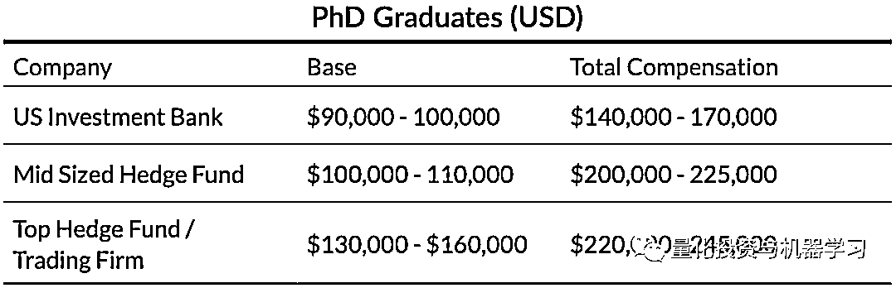
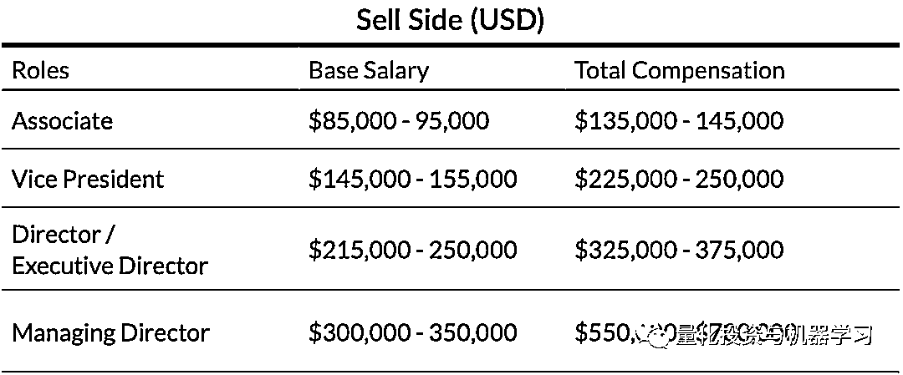
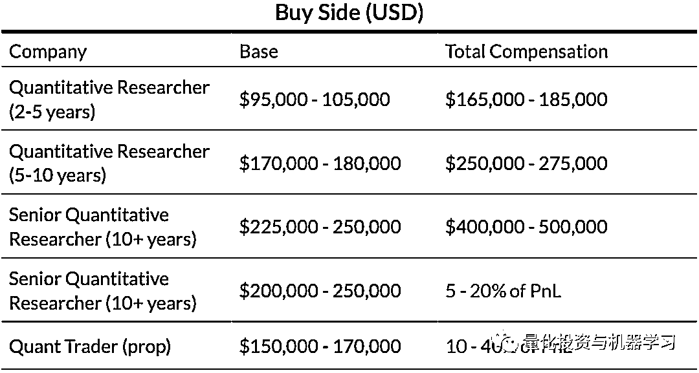

# 二千零二十一、全球 Quant 发展报告：高频交易、薪酬、激励

> 原文：[`mp.weixin.qq.com/s?__biz=MzAxNTc0Mjg0Mg==&mid=2653321543&idx=1&sn=888f1f5040a67cb163d118079c48e894&chksm=802dbb52b75a32446fa2ea7a67c4e770378d25b2e71c6950c5bf84e437833c051d16eec748ac&scene=27#wechat_redirect`](http://mp.weixin.qq.com/s?__biz=MzAxNTc0Mjg0Mg==&mid=2653321543&idx=1&sn=888f1f5040a67cb163d118079c48e894&chksm=802dbb52b75a32446fa2ea7a67c4e770378d25b2e71c6950c5bf84e437833c051d16eec748ac&scene=27#wechat_redirect)

量化投资与机器学习微信公众号，是业内垂直于**量化投资、对冲基金、Fintech、人工智能、大数据**等领域的主流自媒体。公众号拥有来自**公募、私募、券商、期货、银行、保险、高校**等行业**20W+**关注者，连续 2 年被腾讯云+社区评选为“年度最佳作者”。

全球著名猎头公司 Selby Jennings 在最近的一份 Quant 全球市场报告中，根据其服务的量化对冲基金及自营交易公司的招聘需求，阐述了 2021 年全球 Quant 相关的招聘趋势、激励机制及薪酬现状。我们节选部分跟大家分享。

**交易执行与高频交易的现状 **

对于很多头部的高频交易对冲基金来说，2020 年是非常不可思议的一年。由新冠疫情造成的市场波动及交易量，给这些基金带来了大量的收益，也由此增加了各家机构对于顶尖量化人才的需求。其中许多趋势在 2021 年仍在继续，但受到了有争议的“payment for order flow”做法带来的严格审查。

零售交易的增加，或许还有“傻钱”的增加，帮助 Citadel 和 Virtu 等公司从与 Robinhood 和 E-Trade 等零售经纪商的合作中获利。这种做法并不新鲜，但 2021 年初的“梗股（mem stock）”热潮将许多这种灰色地带关系和做法置于显微镜下，国会甚至介入，盘问 Ken Griffin 对零售投资的影响。

尽管存在负面新闻，但 Citadel、Virtu 和许多其他公司的利润都创下了纪录，并继续增长。从人才的角度来看，最近的出色表现似乎为高频交易行业带回了一些多年未见的光彩和兴奋。**现在，似乎许多顶尖的博士毕业生、顶尖的量化分析师和来自 FAANG 公司的候选人都在加入像 CitSec、Tower 和 HRT 这样的高频交易机构**，就像他们加入 D.E. Shaw、RenTech 和 Two Sigma 这样具有科学思维的著名对冲基金一样。

**我们还看到表现最好的高频交易员从大型机构转向更精简的高频交易公司，以获得更明确定义的 PnL 报酬。**由于这些交易员中的大多数都有创纪录的一年，并获得了与之相应的奖金，他们有了更多的财务稳定性，可以接受一个创业机会，从而获得更大的财务收益。也许“Flash Boys”的光辉岁月正在回归。最后，所有流动性提供、执行/TCA 和算法交易团队的招聘正持续的强劲增长。这是多年来买方的普遍趋势，因为公司希望降低交易成本以提升 PnL。交易量的增加和 COVID-19 后对持有短期头寸的整体关注，只会加强对这些招聘的趋势。**我们预计，在股票以外的品种（如期货、外汇和信贷产品）对于这些人才的需求会越来越大。**

**量化公司的激励机制**

在过去两年中，量化基金越来越多地关注独立管理账户和创造性的资本配置策略，以实现业务多元化。由于这一领域的合格人才短缺，多管理人基金和交易公司越来越多地提供灵活的资本配置，以吸引基金经理通过他们的平台来运行他们的策略。这些要约的范围可能从配置特定数额的资本和该策略的专有权，一直到 SMA（独立管理账户）结构。在 SMA 结构中，与基金运行相关的技术和运营成本是通过主基金收取。考虑到独立建立系统性交易业务的成本限制，以及 30% -50%的 PnL 奖金分红的吸引力，这些结构对投资经理有其独特的优势。

为了保持领先并继续吸引这些基金经理，许多基金和交易公司不得不重新设计他们的交易部门结构和薪酬方案。在过去的一年里，我们花了相当多的时间就一些常见的问题向客户提供建议，比如：

*   成本应该如何基于总 PnL 和净 PnL 进行计算?考虑到这对奖金的影响，哪一个更有吸引力?

*   初级交易员/助理 PM 应该如何支付?他们的奖金是来自 PnL，还是由首席交易员自行决定?

*   我们应该提供提成而不是底薪吗?这么做有什么好处和坏处?我们的 PM 和交易者应该把每天的风险方差/波动性作为目标吗?这将如何影响我们经理的潜在支出?

*   我们应该在奖金上签字吗?

*   我们应该保证他们第一年的奖金吗?

这些问题的答案因企业而异，但我们确实发现了一些最佳做法，而且这些最佳做法与吸引最优秀人才之间的相关性是显而易见的。

对于**量化对冲基金或自营交易公司/家族办公室**，资本的配置和 SMA 支付是不同的。当然，自营交易公司/家族办公室可以提供最高的 PnL 支付，因为它们的资金大部分（如果不是全部的话）是自由资金，所以有竞争性的 PnL 支付比例在 30%至 50%之间。而对于基金来说，PnL 支付比例的上限通常为 20%。

**他们两者（量化对冲基金，自营交易公司/家族办公室）对于量化基金经理的要求也有所不同：**

**亚太地区发展趋势和薪酬**

过去几个月，两家领先的国际做市商一直在亚洲市场拓展业务，并在新加坡设立了新的办事处。他们表示，这是因为新加坡有丰富的人才，他们可以从当地的一流大学招聘，以及该国金融服务业的发展。我们还看到大量新的参与者希望从新加坡推出他们的亚洲业务，包括一个著名的多策略、多经理投资平台和全球领先的量化交易公司，这两家公司都在 2021 年上半年在新加坡招聘。关于为什么新加坡要比香港吸引更多的机构，在媒体上引起了讨论，人们对其原因有不同的看法。一个关键原因是，香港的生活成本持续超过新加坡，因此，员工对新加坡有偏好。然而，在智库新金融（New Financial）最近的一份报告中，“到目前为止，香港仍是该地区最大的金融中心，也是全球增长最快的金融中心之一。”

**在整个亚洲范围，我们看到我们的许多对冲基金客户都在寻求为中国市场建立在岸和离岸交易部门。在我们的国际客户中，有很大一部分要么正在扩大在中国的办事处，要么正在寻求扩大在中国的业务。**由于该地区证券交易的细微差别和监管规定，对冲基金一直在把时间主要投入到股票和期货交易的能力上。我们发现，市场对亚洲中性股票策略的兴趣尤其浓厚，特别是中国 A 股。大多数量化基金都在寻找实力优秀的投资组合经理和交易员。大多数量化对冲基金和自营交易公司都希望快速招聘，并大量招聘，其中大多数都在寻找有中国市场交易经验的候选人。自中国在 2020 年放松对外国金融公司的限制以来，我们看到客户纷纷聘用人才，尤其是在上海。2021 年上半年，“高盛（Goldman Sachs）、贝莱德（BlackRock）和富达国际（Fidelity International）准备在中国增加数百名员工，因为他们希望利用中国 40 万亿美元金融业的开放”，这是一个共同的特点。

近期，在亚太地区，对于不同岗位的招聘薪酬范围如下：

