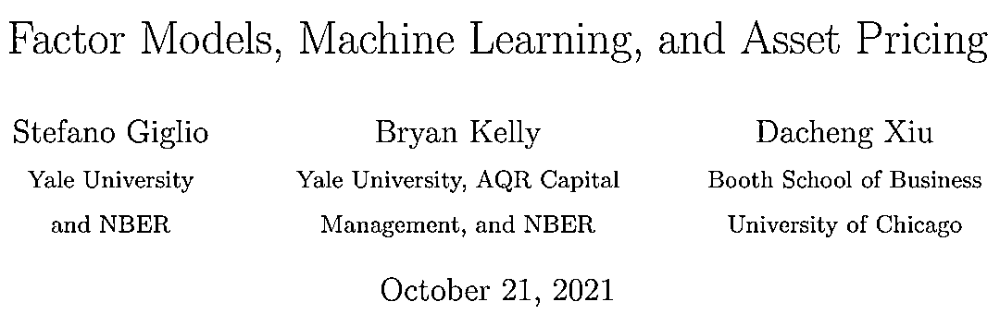

# 因子模型与机器学习：近期值得细读的论文

> 原文：[`mp.weixin.qq.com/s?__biz=MzAxNTc0Mjg0Mg==&mid=2653321496&idx=1&sn=b0f6e1a897a84e4aa6c455d00b00b37c&chksm=802dbb0db75a321b9cc33eb30a59f28cf8a43c7910c40d7ad82d1e924ff8ad20789453543b46&scene=27#wechat_redirect`](http://mp.weixin.qq.com/s?__biz=MzAxNTc0Mjg0Mg==&mid=2653321496&idx=1&sn=b0f6e1a897a84e4aa6c455d00b00b37c&chksm=802dbb0db75a321b9cc33eb30a59f28cf8a43c7910c40d7ad82d1e924ff8ad20789453543b46&scene=27#wechat_redirect)

量化投资与机器学习微信公众号，是业内垂直于**量化投资、对冲基金、Fintech、人工智能、大数据**等领域的主流自媒体。公众号拥有来自**公募、私募、券商、期货、银行、保险、高校**等行业**20W+**关注者，连续 2 年被腾讯云+社区评选为“年度最佳作者”。

**第一篇**

**简介**

本篇论文非常全面的从因子模型和机器学习的角度对最近实证资产定价的发展做了汇总 。非常清晰的将最近的发展从以下角度进行了归类： 

*   预期收益

*   因子暴露及因子收益

*   风险溢价

*   随机折现因子（SDF）

*   模型的测试与对比

具体看以下目录：

通过本文的学习，可以全面梳理近年资产定价与机器学习相结合的发展。

**第二篇**

简介

本文是对于 A 股市场，因子模型应用机器学习相关算法的很好的测试与总结。作者一共测试了 94 个因子，11 个机器学习的模型。主要得出了以下结论：

*   对于所有测试的机器学习模型，流动性因子都是很重要的因子；基本面因子中的估值因子也是非常重要的因子；对于深度学习模型，除了流动性因子，动量因子的重要性大于基本面因子。

*   模型对于国资控股的上市公司的预测效果要差于非国资控股的公司（以 R 方衡量）。

*   在 A 股虽然无法做空，但在考虑交易成本后，模型的多头收益也是非常显著的。

注意：在分享的文件中，该论文有两个文件，其中一个是附录

**第三篇**

本文尝试了用机器学习模型预测美股的 Beta。相对于现有的模型，树模型和神经网络模型的效果从统计和经济学的意义上，都表现的更加优秀。主要体现在以下几方面：

*   预测误差更小，其中随机森林模型的效果尤为突出；

*   更有利于建立真正的（事后）市场中性组合，而不是用传统的模型建立事前市场中性组合.

**如何下载论文**

后台回复：***QIMLFA***