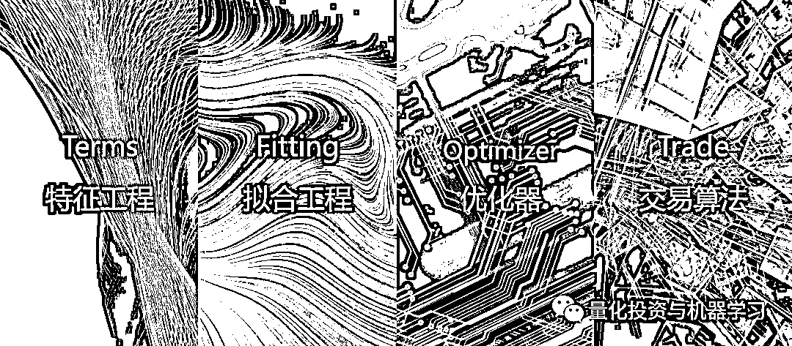

# 念空的『超级信号工厂』

> 原文：[`mp.weixin.qq.com/s?__biz=MzAxNTc0Mjg0Mg==&mid=2653321449&idx=1&sn=cd8e4beacd0b94e7d140be034c36b35f&chksm=802dbafcb75a33ea78914a98194157c1b66fb10d4e32d9bbe4a8e7360f608db82aea5b2d2e7f&scene=27#wechat_redirect`](http://mp.weixin.qq.com/s?__biz=MzAxNTc0Mjg0Mg==&mid=2653321449&idx=1&sn=cd8e4beacd0b94e7d140be034c36b35f&chksm=802dbafcb75a33ea78914a98194157c1b66fb10d4e32d9bbe4a8e7360f608db82aea5b2d2e7f&scene=27#wechat_redirect)

量化投资与机器学习微信公众号，是业内垂直于**量化投资、对冲基金、Fintech、人工智能、大数据**等领域的主流自媒体。公众号拥有来自**公募、私募、券商、期货、银行、保险、高校**等行业**20W+**关注者，连续 2 年被腾讯云+社区评选为“年度最佳作者”。

量化投资与机器学习公众号独家撰写

**前言**

近日，念空科技王啸接受了公众号近 2 个多小时面对面的采访。在本次访谈中，公众号会从一个研究者和开发者的角度，给大家呈现一个不一样的念空。

**本次访谈的很多内容也都是首次对外公布！**

**正念的力量**

想必很多人听到念空这个词会产生诸多联想，其实念空命名来自一个词：**正念**

百度词条给出的解释是：“正念就是有目的的、有意识的，关注、觉察当下的一切，而对当下的一切又都不作任何判断、任何分析、任何反应，只是单纯地觉察它、注意它。”

而王啸对于“正念”的理解是：“它让你的思维集中在一个点上，是让我们做出更好选择的价值观和方法论。”

希望这样的方法论能够一直伴随念空走的更远！

**超级信号工厂**

2017 年初，念空就意识到深度学习和机器学习一定会影响国内的量化市场，但在当时，他们并没有看到一个明确的方向。所以，念空先从数据集相对较小的股指期货入手，但因数据量太少，非常容易过拟合，这让念空在此期间摸了很多弯路。直到 2018 年，当听闻市场有人用 Tree-based 模型用于选股获得不错的效果时，念空便进行了一些尝试，发现效果喜人。

经过前期不断的测试与迭代，念空终于在 2019 年 3 月推出了第一个稳定版的机器学习策略模型，这个模型 60%的内容使用了深度学习模型，且综合了多种网络结构，这也为念空在今后的诸多策略研发中奠定了基础！

与此同时，念空也建立了一个对于他们具有跨时代意义的模型平台，从一个封装化的多因子挖掘平台转变到一个封装化的全流程策略平台——**超级信号工厂（TFOT）**。

念空的超级信号工厂，是一个一站式体系化的策略研发闭环。整个工厂由以下四个部分组成，包括**特征工程（Terms）、拟合工程（Fitting）、优化器（Optimization）及交易算法（Trade）**。策略在各个流程化标准化模块的配合下，并经过层层检验，被生产出来。

**▌特征工程（Terms）**

说到特征，不得不让我们想起另外一个词：因子。

何为因子？它其实就是一个个小小的模型，因为它能够单独预测市场。我们所知的 WorldQuant 就是这样一个体系。如果一个因子它在历史上能够较为稳定的形成一个预测能力，那可以说它的解释空间十分广阔。

好比一个乒乓球，它的解释空间很大，如果我们非要把它装到一个杯子中去，那这个杯子能装多少个球呢？可能装不了几个就满了。所以这样的因子体系边际效应递减会非常快，当你再想加入一个没别人没想过、相关性低的因子会非常困难。

那何为特征？特征就好比往这个杯子里面装沙子。相对于乒乓球来说，沙子这个“特征”每一颗解释力度都很低，比如，成交量有方向吗？它没有！有预测能力吗？它也没有！但当有人告诉你，成交量一定是影响价格变动的一个解释因素之一，你一定不会反对，所以这就是特征！**特征一定要有逻辑**，一些特征你看着会很普通，包括一些行业标签等等几乎都是静态的，但它们其实也是特征。

现在，我们已经有了十分成熟的非线性拟合工具，像沙子这样的“特征”就会有办法凝固在一起（形成有效的预测）。而且我们挖沙子的好处是：它的边际递减会比较慢，它会永远有缝隙让你钻进去！

**▌拟合工程（Fitting）**

拟合工程是海量特征到收益映射的过程，其实就是在校准特征到股票收益之间某个未知的函数。在这个过程中，我们会尝试多种线性或非线性的拟合工具，并对工具本身（包括机器学习或深度学习）做深度优化。

那么有人就会问：如果我们 input 的东西是有逻辑性的，但 output 的东西如何保证也是有逻辑性（有效性）的？因为在这中间其实有一个黑箱的存在。

其实，无论使用什么模型，过拟合都会存在。即使用的是一个非常简单的线性回归函数，完全可解释，但我们的 output 依然会过拟合。既然这样，其实我们会发现：**过不过拟合其实并不在于它是否可解释，而在于拟合程度是否可以被衡量，以及如何才能够让预测值的过拟合程度可控！**

在超级工厂的实践中，Fitting 组生产的因子会经过非常核心且严格的过拟合检验才能被用到下一步的组合优化的过程中。

通过念空的研究来看，在截面上的预测，过拟合相对较低；但在时序上的预测，由于单个股票序列的数据比较有限，过拟合风险相对较大。除了股票，在商品期货、股指期货也十分容易过拟合。

**▌优化器（Optimizer）**

优化器是预测信号到持仓权重之间重要的桥梁，在这个过程中需要收益预测、风险预测及交易成本共同作为优化器的数据，再根据产品的目标完成投资标的权重的优化求解。这其中有大量的细节需要注意，不同的优化器给出的结果会有很大的差异。与传统的主观设置不同风格暴露的限制，**念空把因子暴露的控制也进行参数化，使得不同风格之间的调整是联动和动态的。这种参数化的设置使得我们可以根据产品风险收益的特征要求进行自动的参数设置。**

**▌交易算法（Trade）**

交易算法模块解决的是在股票有订单执行的过程中，交易算法的执行，这是算法速度与硬件优势的集中体现。在这个过程中，对市场订单簿成交流的动态监控，使得念空在产品策略本身的收益基础上，通过对订单算法的不断优化，使得交易成本不断降低，为整个产品带来增量收益。

直到这里，一个策略终于完成了它在念空第一阶段的旅程，在后续的实盘过程中，还要时刻对策略绩效指标进行全方位的监控，并不断根据市场最新的情况进行优化。新的特征也不断的被加入到流水线中，等待着研究员们的悉心照料。

念空所有的策略，包括 CTA、指数增强和中性对冲等等，都由这个超级工厂生产出来。在这个框架下，我们可以看到，机器学习在量化上的应用并不是一个完全端到端的过程，**而是在****一定的传统的金融投资理论下，在不同的细节或模块加入了更复杂的算法，并把整个研究标准化的过程。**

**硬件上的算力并不是决定性的**

假设有这么一个问题：

> 如果你有 1 万个特征，频率是 5 分钟，即每个股票的每个特征每天有 48 个数值。如果要将过去 5 年全部 4000 只 A 股的这些特征值，即 24 万亿个数据点保存在一个文件里，需要拼多久？

1 个月？1 天？1 小时？1 分钟？

我们测试过，一个未经优化的算法给出的时间是 18 小时，念空对这套算法进行重构后，给出的答案是 1.5 小时，但并没有增加任何服务器。

也许这个时间并不是最快的，但是通过这个例子告诉我们，**优化的过程和硬件没有直接的关系，这在其中包含很多优化的算法是我们首要去解决的问题！**

**硬件的堆砌也不是策略收益提升的必要条件，更不是量化私募公司实力的决定因素。**

> 假设一家公司要建造一个价值 10 亿的机房，现在能买到最好的 GPU 服务器一台是 200 万左右，大概能买 500 台。

那么问题来了：你有没有足够多的机器学习工程师来使用这些算力呢？如果给每位工程师都配置这样一台 200 万的服务器，但他做出的结果和 20 万一台的服务器是一样的，他是不是也会有压力？

今年是念空策略迭代和提升最大的一年，当然也会面临算力紧张的问题，公司目前已经在建设独立专业机房，在目前算力基础上增加 50%，不断为研究员提供更强大的算力支撑。

**流水线模式会限制 Quant 的发展吗？**

当前对冲基金主要的管理模式分为投资经理模式和流水线模式。念空作为流水线模式的坚实拥护者，认为该模式在主要有以下优势：

*   研究团队协同合作，提升策略研发框架效率，策略迭代速度是每个量化团队的生命线；

*   实现策略从研究到实盘过程中的标准化控制，做到品质如一，不存在核心投研离职影响公司业绩的情况；

*   发挥量化研究员/工程师各自的优势，做精做细每一环，毕竟没有任何一个独立的自然人能够在 TFOT 四个环节都具备超强能力。

对于流水线模式，很多人认为一个显著问题是，该模式会让研究员变成螺丝钉，限制其职业的发展**。但在念空超级工厂的体系下，如果你做得越来越好，你会越往上走，会负责更多的内容，甚至到最后全链条参与到策略的每一个环节中去。**

当然这也是一个优胜劣汰的过程，如果你足够优秀，还有什么不可能呢？量化研究工作细节众多，环节众多，只有真正做到依靠团队智慧而非个人能力，才能尽可能地保持竞争力。

**更容易量化的绩效贡献**

念空给投研人员的激励机制在公众号看来很**“量化”**，在念空超级工厂生产的策略，最终不同模块对策略收益的贡献是非常容易量化的。

举个例子，我们把某个策略的收益按照超级信号工厂的逆流程（Trade>Optimizer>Fitting> Terms）来进行阐述：

*   如果今年念空超额 40 个点，首先你把一篮子标的交易出去，假设你拿到的就是 vwap 本身，那么算法不会提供收益，如果算法交易程序战胜 vwap 万一或者万二个点，也就是说你在算法层面贡献了 2.5%的收益，为了便于计算，我们取 3%，这 3%的贡献则来自于交易算法组。

*   那么现在剩下 37%，如果你没有专属优化器，而是使用一个普通的优化器，假设你的收益从 37%变到了 28%，那么，这 9%的贡献则来自优化组。

*   下面再到 Fitting 环节，如果用 XGBoost 跑一遍，发现最后剩下 20%超额收益，那么 8%的差异来自拟合工程的增益。

*   最后到特征工程，假设你的基础版本是基于 XGBoost，如果有 12 个人在做特征，现在把某个人的特征剔除掉，然后再 Fitting 一次，可能最后的总收益会减少或者增加，那么增加和减少的这些收益就是每个特征组的人的贡献。

更明晰的绩效归因，使得每个人的努力在念空显得更有价值也更有方向。

**给机器学习转量化投资的意见**

**多做一些工程性的尝试！**  

由于现在工业界的技术过于成熟，很多算法都被封装现成的工具，大多数人只有使用这些“工具/软件”的经验，而缺乏从 0 到 1 构建算法的经验。

很多高校学生也存在这样一个问题，只学会了一些皮毛。用一个 LSTM 模型，跑个几百兆的数据，然后就说自己熟悉了。这样的做法没有任何意义，机器学习最重要的是解决工程性问题！

**念空不断强调“工程”的重要性，机器学习不完全是一个理论学科，更是一个工程性的学科，需要大量实际模型构建及优化的经验，才能胜任量化研究对于海量数据建模的需求。**