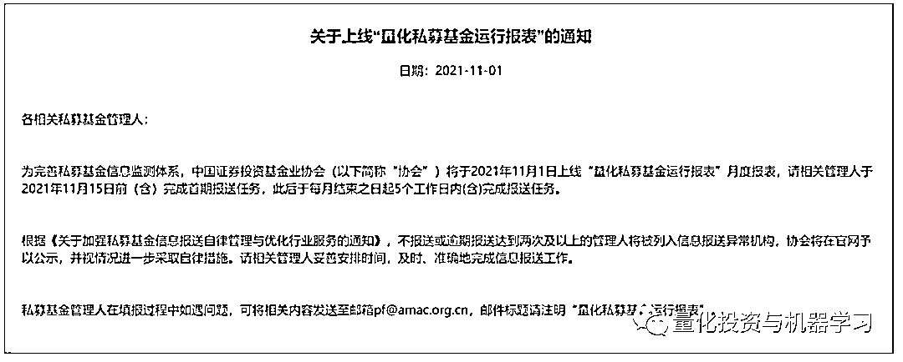
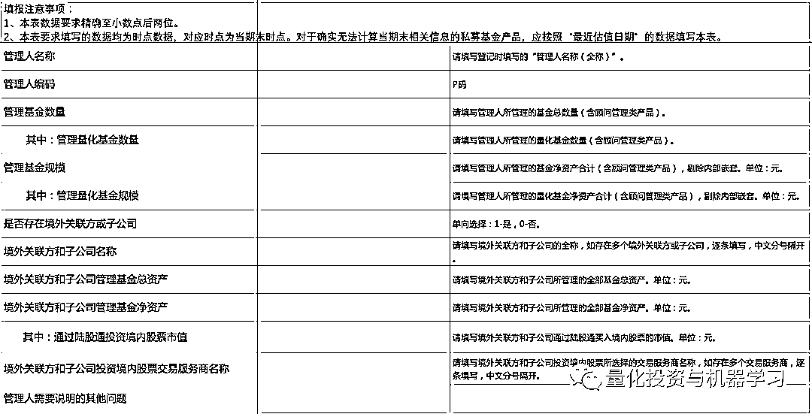
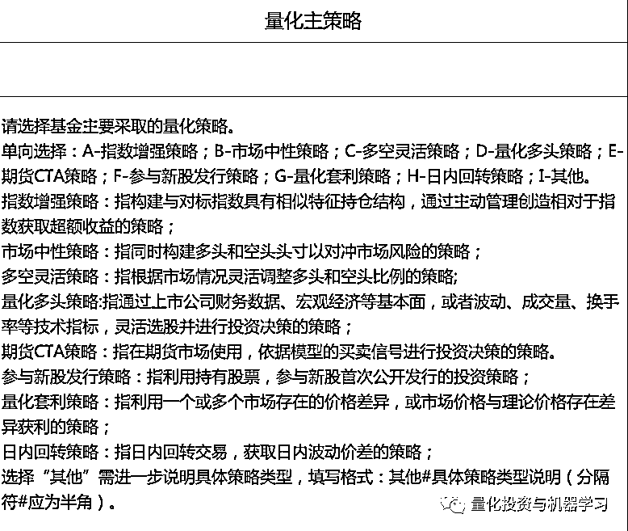
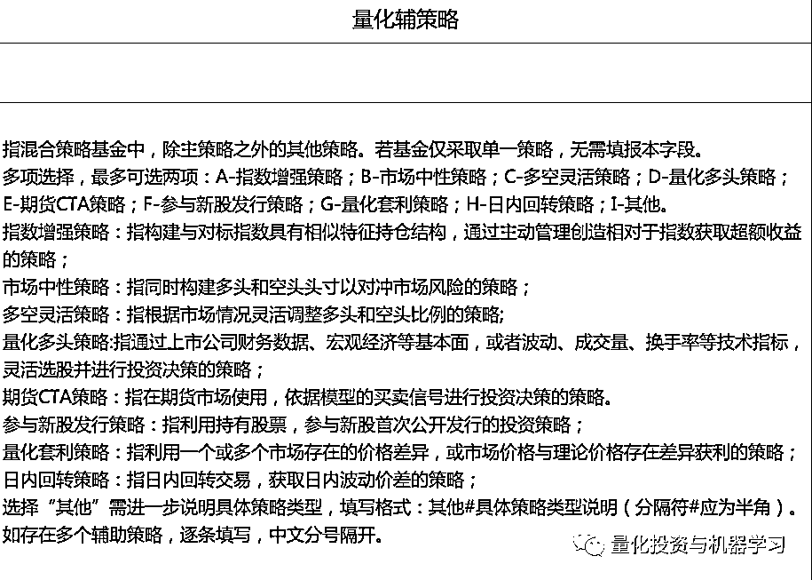

# 中基协定向发布『量化私募基金运行报表』，你收到了吗？

> 原文：[`mp.weixin.qq.com/s?__biz=MzAxNTc0Mjg0Mg==&mid=2653321437&idx=1&sn=892995cc4e312505d48a6dbaecc499ee&chksm=802dbac8b75a33de07fe5be8c647dbea0fcb76fb2382e3b59ff5108c5a5978454efb85b25f87&scene=27#wechat_redirect`](http://mp.weixin.qq.com/s?__biz=MzAxNTc0Mjg0Mg==&mid=2653321437&idx=1&sn=892995cc4e312505d48a6dbaecc499ee&chksm=802dbac8b75a33de07fe5be8c647dbea0fcb76fb2382e3b59ff5108c5a5978454efb85b25f87&scene=27#wechat_redirect)

量化投资与机器学习微信公众号，是业内垂直于**量化投资、对冲基金、Fintech、人工智能、大数据**等领域的主流自媒体。公众号拥有来自**公募、私募、券商、期货、银行、保险、高校**等行业**20W+**关注者，连续 2 年被腾讯云+社区评选为“年度最佳作者”。

内容来自：积募、中基协

**针对部分量化私募管理人，中基协 ****定向 ****发布了上线量化私募基金运行报表的通知，收到通知的管理人记得及时报送哦，否则将被公示！**

通过微信公众号后台回复**“量化报表”**，获取量化管理人监测报表。

昨日，中基协向部分私募基金管理人发布了《关于上线“量化私募基金运行报表”的通知》，积募相关要点如下：

1、协会将于 2021 年 11 月 1 日上线“量化私募基金运行报表”月度报表。

2、收到通知的相关私募基金管理人需要在 2021 年 11 月 15 日前（含）完成首期报送任务。

3、收到通知的相关私募基金管理人需要在此后每月结束之日起 5 个工作日内（含）完成报送任务。

4、不报送或者逾期报送达到 2 次及以上的管理人，将被列入信息报送异常机构，协会将在官网予以公示，并视情况进一步采取自律措施。

**收到该通知的有可能是量化基金管理规模较大的私募管理人，大部分管理人并未收到。**

量化管理人监测报表共分为 2 个：

**一是管理人基本信息表**，包括管理人名称、编码、管理基金数量及规模、管理量化基金数量及规模、境外关联方或子公司情况等。

**二是量化基金（含了问管理类产品）统计表**，包括基金名称、编码、中登公司一码通账户、期货保证金监控中心账户、量化主策略及辅策略、基金规模/总资产、净值、回撤、日均股票投资情况、期货及衍生品交易、融资融券、巨额赎回等。

表格也说明了对量化策略的界定：

通过微信公众号后台回复**“量化报表”**，获取量化管理人监测报表。