# Optiver 波动率预测大赛系列三：首次开源的金牌代码

> 原文：[`mp.weixin.qq.com/s?__biz=MzAxNTc0Mjg0Mg==&mid=2653321417&idx=1&sn=c0b85eefff2ec5a8f21deca90466306a&chksm=802dbadcb75a33ca5641213909a090bede71bfcd3364480c7608b1dfea3c7ff943a0cc28b839&scene=27#wechat_redirect`](http://mp.weixin.qq.com/s?__biz=MzAxNTc0Mjg0Mg==&mid=2653321417&idx=1&sn=c0b85eefff2ec5a8f21deca90466306a&chksm=802dbadcb75a33ca5641213909a090bede71bfcd3364480c7608b1dfea3c7ff943a0cc28b839&scene=27#wechat_redirect)

# 

量化投资与机器学习微信公众号，是业内垂直于**量化投资、对冲基金、Fintech、人工智能、大数据**等领域的主流自媒体。公众号拥有来自**公募、私募、券商、期货、银行、保险、高校**等行业**20W+**关注者，连续 2 年被腾讯云+社区评选为“年度最佳作者”。

**前言**

Optiver 波动率预测大赛于上个月 27 号截止提交，比赛终于告一段落，等待着明年 1 月份的最终比赛结果。Kaggle 上，由财大气粗的对冲基金大佬主办的金融交易类预测大赛，总能吸引大量的人气。在过去 3 个月的比赛中，也诞生了很多优秀的开源代码，各路神仙应用各种模型算法，在竞争激烈的榜单你追我赶。

关于这个比赛，网络上陆陆续续也有很多参赛经验的分享。但为了充分吸收大神们的精髓，公众号还是决定从 0 到 1 解读各种不同类型的开源比赛代码，方便小伙伴们学习归纳，并应用到实际研究中去。本系列大概安排内容如下：

*   [第一篇：相关概念及数据介绍，简单的 EDA 分析](http://mp.weixin.qq.com/s?__biz=MzAxNTc0Mjg0Mg==&mid=2653321155&idx=1&sn=6d85735080d3e7120a5b1c3922477571&chksm=802db5d6b75a3cc081d224bc303b8067fbe5f1acc7b5c7dbad9f961a596b96c6e5331123fb3e&scene=21#wechat_redirect)

*   [第二篇：初次尝试，LightGBM 模型及特征工程](http://mp.weixin.qq.com/s?__biz=MzAxNTc0Mjg0Mg==&mid=2653321226&idx=1&sn=6661e53b8bab4f5e491cf1c267dbebdc&chksm=802dba1fb75a3309166dd07dd66eec914fb0f5d3c0921987748f060a6b6893d957bfd1dd17f0&scene=21#wechat_redirect)

*   **第三篇：首次开源的金牌代码**

*   第四篇：独门绝技，TabNet

*   第五篇：登顶在即，图神经网络助力

Optiver 波动率预测大赛最近更新了公榜的排行，榜单的波动让大家再次感受到了金融市场的不确定性。作为波动率预测大赛，大赛排名的波动还是惊诧众人，**原本公榜第 1 名的方案跌落到第 2554 名，前 11 名的方案都跌到了近 2000 名之外。**

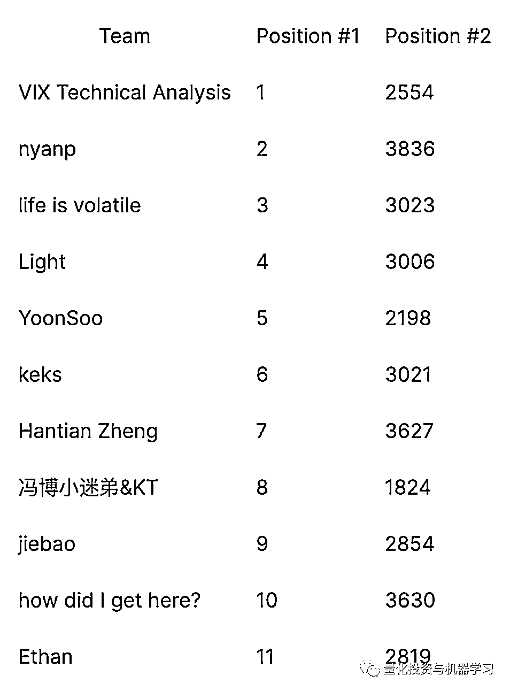

在比赛结果还没有最终确定前，一切都还是未知数。榜单的波动，不耽误我们学习优秀的模型方案。本次分享的方案，在当时开源时改变了整个公开榜单的动态。公众号在当时也进行了分享，具体请戳查看前言目录：[*Optiver 波动率预测，金牌大神开源代码！*](http://mp.weixin.qq.com/s?__biz=MzAxNTc0Mjg0Mg==&mid=2653318885&idx=1&sn=145fc153ccc8e9635ac121f68e988177&chksm=802dacf0b75a25e6093c221776b9a816c0ad85c89f5fc83c030d9457ae9e3fd81c825334cc8c&scene=21#wechat_redirect)

我们从模型及特征两个维度来解读本方案：

*   模型：

*   本方案采用了 LightGBM 及全联接神经网络模型的复合方案，最终的预测结果是两个模型的均值；

*   在神经网络模型中，采用 KNN++对训练数据进行分层，确保每个分层中不同波动水平的股票尽量均衡。

*   特征：本方案的特征也借鉴了其他方案，主要有以下特点：

*   在同一 time_id 的不同时间窗口进行特征计算；

*   将股票根据预测值进行聚类，计算每个聚类的特征；

*   计算每个 time_id 内的交易的平均时间间隔作为特征。

接下来我们逐一解读代码，由于 notebook 太长，具体代码大家可以参考：

***https://www.kaggle.com/alexioslyon/lgbm-baseline***

我们对其中关键的代码段进行解读。

**特征构建**

订单簿的特征主要在 book_preprocessor 中完成，

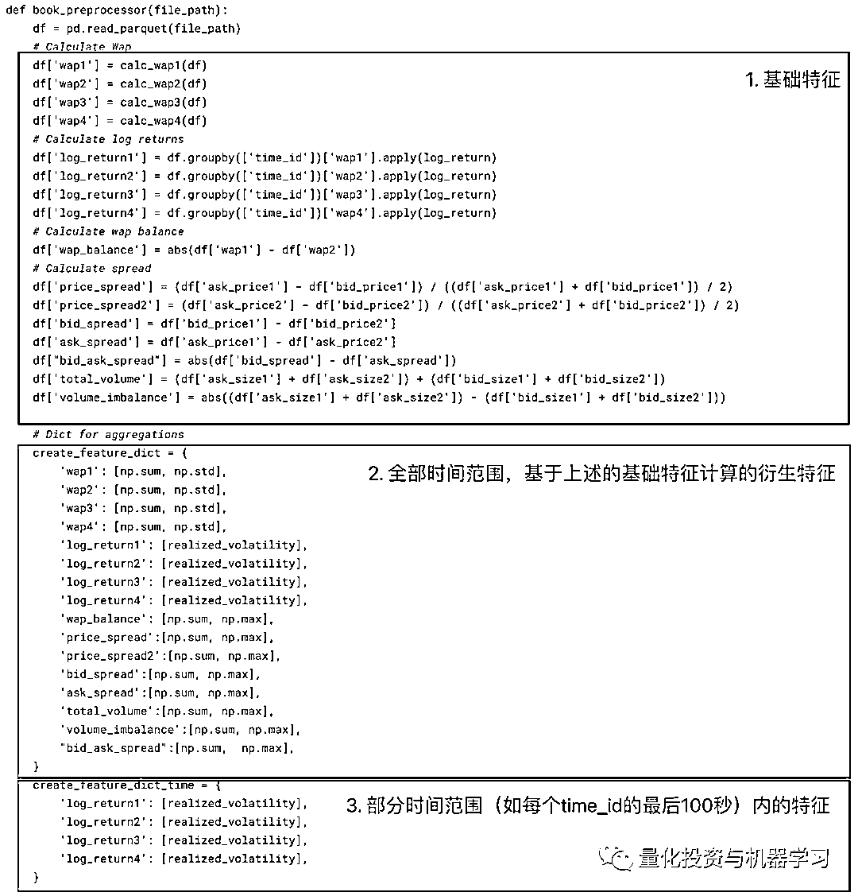

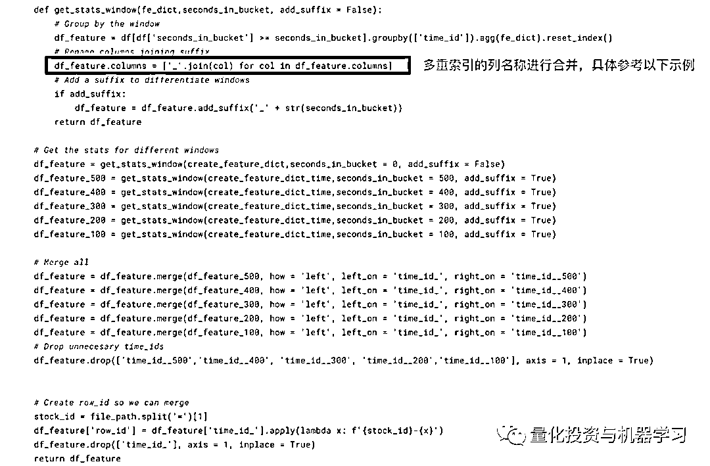

**多重索引列名合并示例**

这样的处理在本方案中出现多次，在 dataframe 进行分组计算（采用 agg 函数，多每列进行多种计算）后，返回一个列为多重索引的 dataframe，作者对列名称进行合并作为特征的名称，如以下简化的例子，可以看出 agg 后列名默认使用的是函数的名称，合并后原先的列名和函数名称合并在一起：

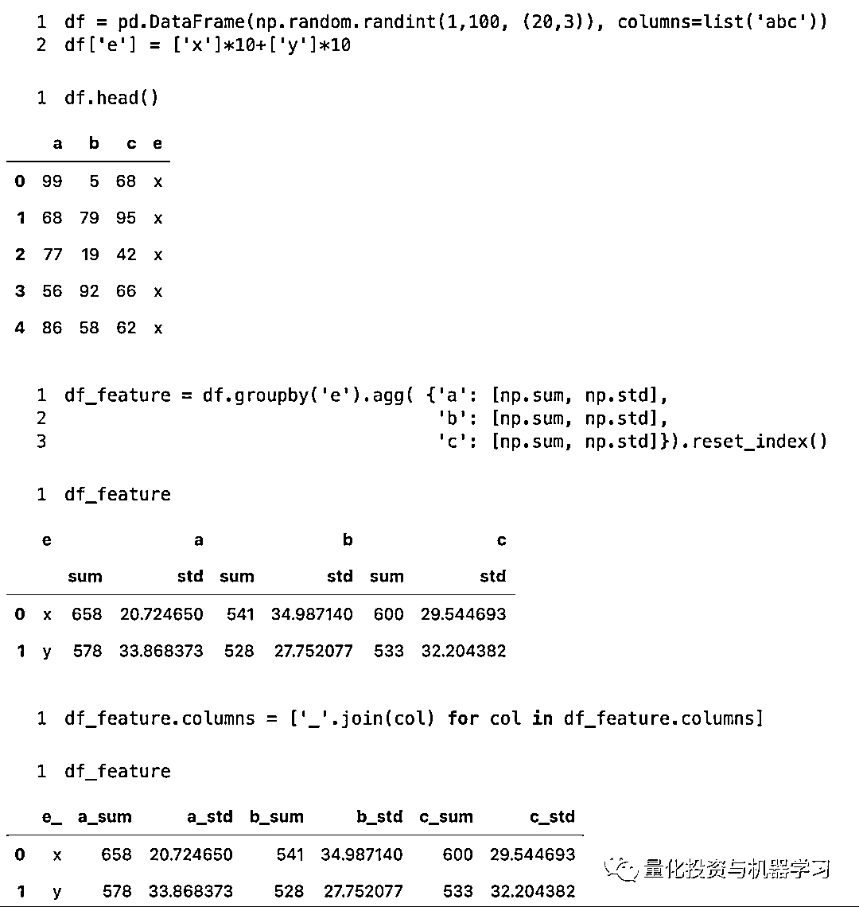

交易的特征在 trade_preprocessor 中完成，后 book 特征类似，前半部分也是计算全部时间范围和部分时间范围的特征，并进行合并。在交易特征中，作者还计算了基于成交价变动及成交量乘积的 tendency 特征。

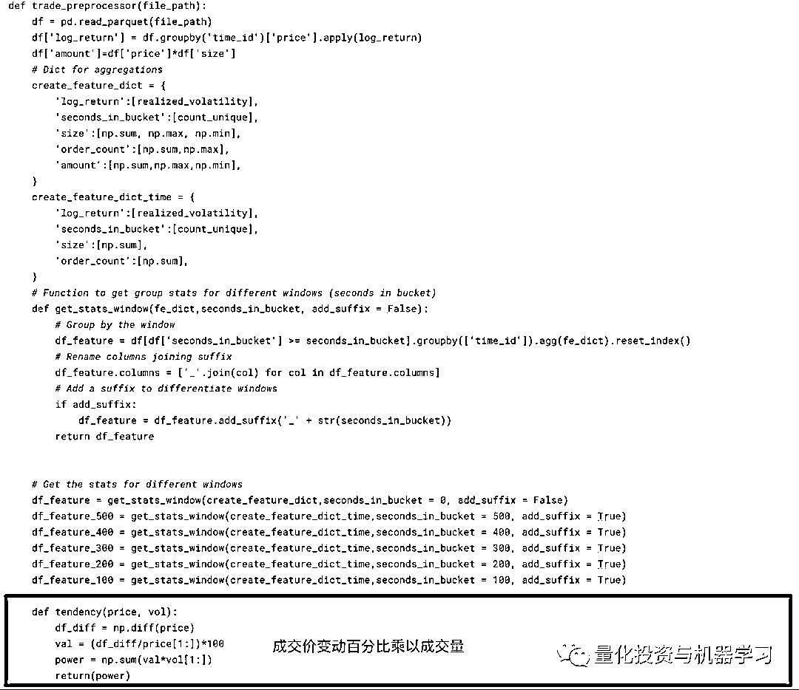

book_preprocessor 和 trade_preprocessor 计算的是每个 stock_id 在每个 time_id 内特征**，而以下函数 get_time_stock 则分别计算了在某个 time_id 内所有股票综合的特征（比如，某个时间所有股票波动的最大值等），及某个 stock_id 在所有时间内的综合特征（比如，某个股票在所有时间波动的最小值等）。**

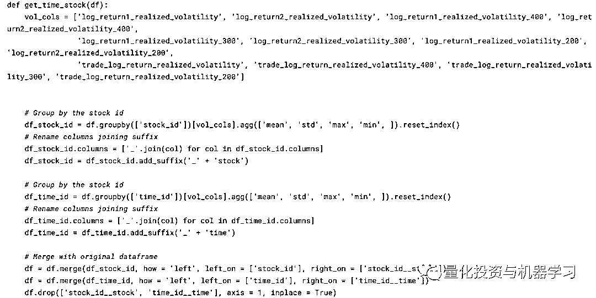

作者还计算了平均成交及订单的时间间隔：

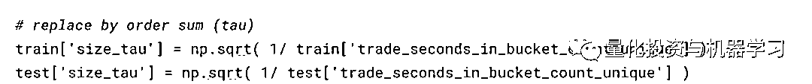

最后一类特征是对股票聚类后计算的特征，作者先使用 Kmeans，根据股票间波动率的相关系数，把股票分成了 7 类，然后之前的特征又根据聚类计算了每一类特征的均值作为新的特征。

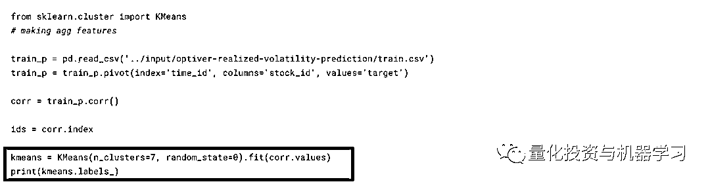

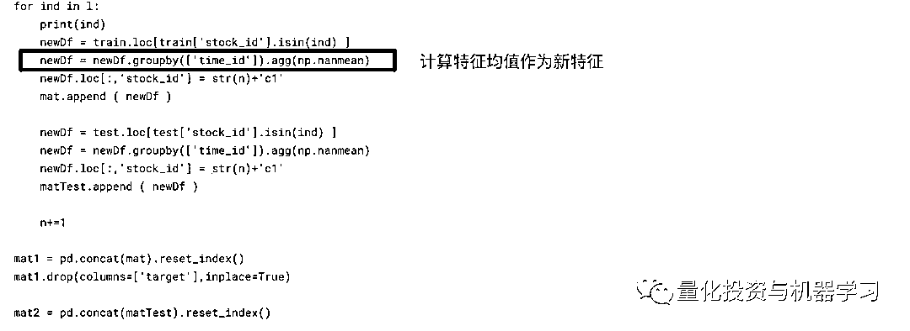

**模型**

模型层面就是常用的 lightgbm 和全连接神经网络，下图是 lgbt 给出的前 20 个特征的重要性。

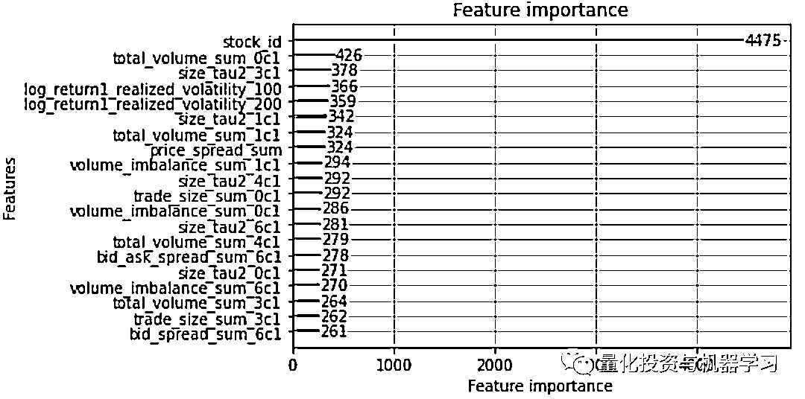

神经网络模型有三层全连接层，神经元的数量分别为（128，64，32）。在全连接层之前，首先加入了一个嵌入层对股票 id 转换为向量：

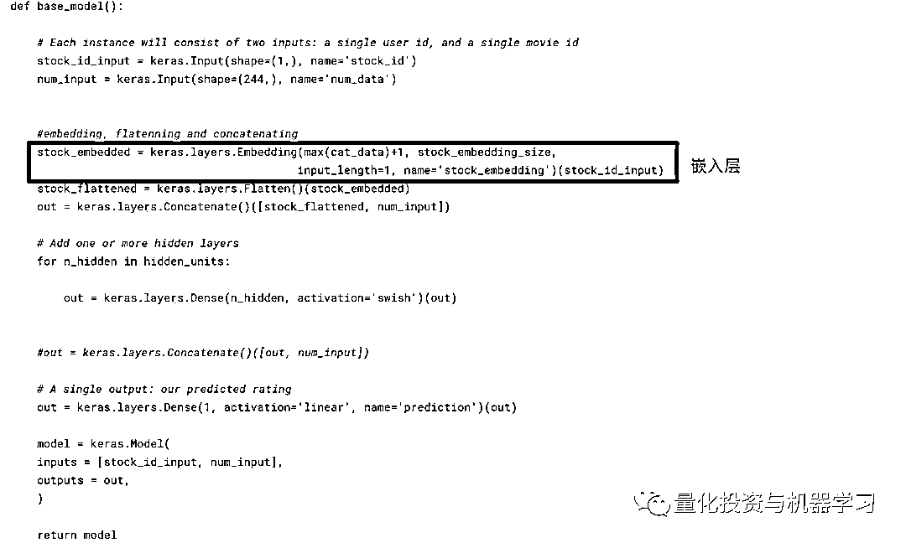

在交叉验证的训练数据分组中，作者代码中说使用了 KNN+算法，小编一开始也是一头雾水，直到看到以下讨论：

*https://www.kaggle.com/c/optiver-realized-volatility-prediction/discussion/268813*

**作者这番操作的意图是随机对训练数据分成五组，但又要使每组训练数据中预测值（波动率）的分布尽量保持一致。**

最终提交的结果为 lightgbm 与 neural network 模型预测结果的均值：

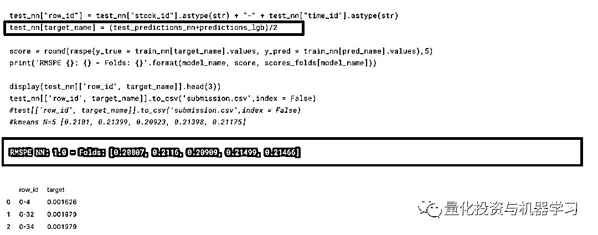

**总结**

以上是整个方案的主体框架及其中容易掉坑的部分，希望该方案能给大家带来启发。特别是特征构建的维度，毕竟特征是模型效果的天花板。本次榜单更新，又有一些新的方案开源，期待下一次榜单更新，给大家带来更多惊喜。