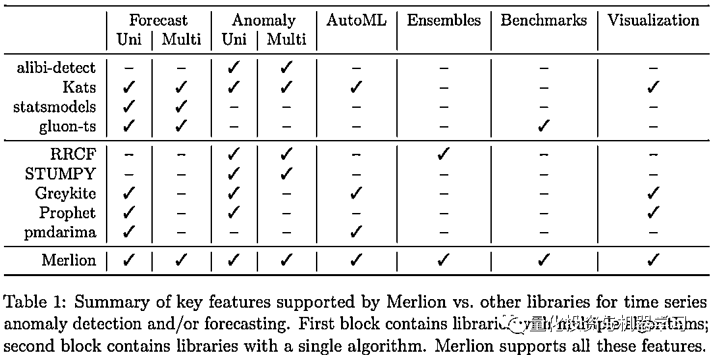
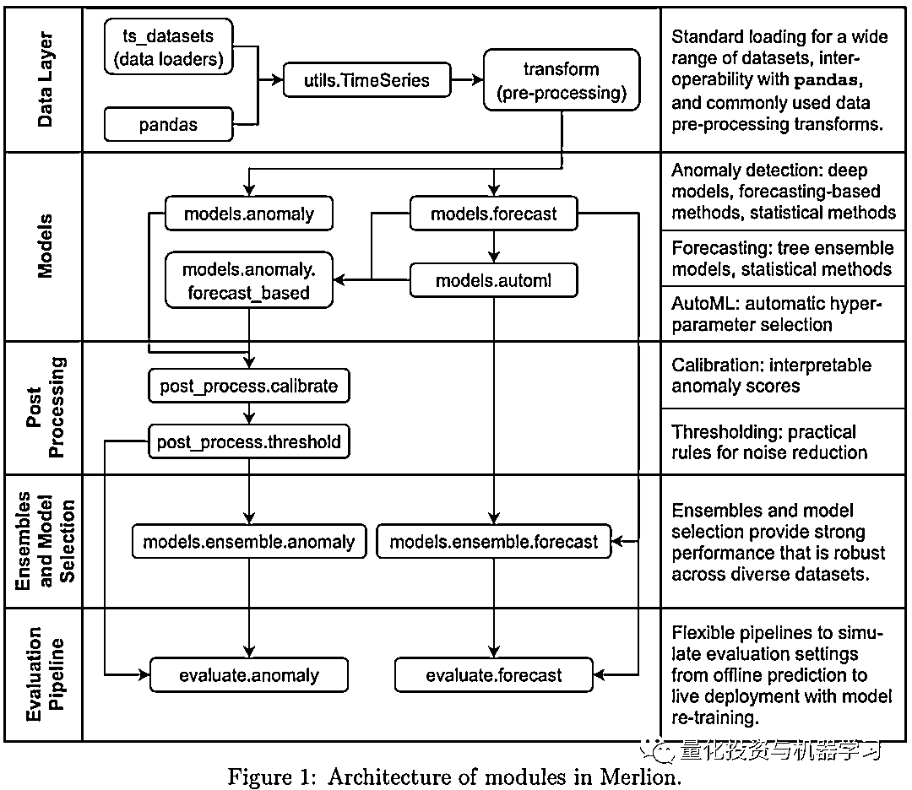
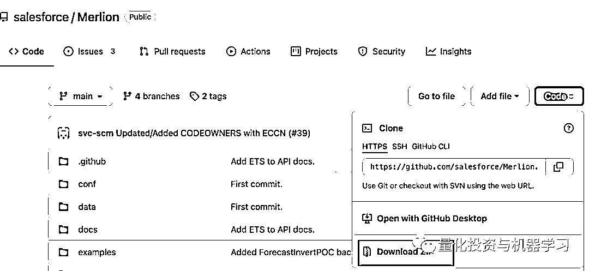

# Merlion：端到端的时间序列预测利器

> 原文：[`mp.weixin.qq.com/s?__biz=MzAxNTc0Mjg0Mg==&mid=2653321388&idx=1&sn=a47caeb0cfd3b069c580db3eb8b3901c&chksm=802dbab9b75a33af6dbcfe3bf18ac09253cf79a413ee2cc58b65d925cb30cd9791dc3ab5a99e&scene=27#wechat_redirect`](http://mp.weixin.qq.com/s?__biz=MzAxNTc0Mjg0Mg==&mid=2653321388&idx=1&sn=a47caeb0cfd3b069c580db3eb8b3901c&chksm=802dbab9b75a33af6dbcfe3bf18ac09253cf79a413ee2cc58b65d925cb30cd9791dc3ab5a99e&scene=27#wechat_redirect)

# 


量化投资与机器学习微信公众号，是业内垂直于**量化投资、对冲基金、Fintech、人工智能、大数据**等领域的主流自媒体。公众号拥有来自**公募、私募、券商、期货、银行、保险、高校**等行业**20W+**关注者，连续 2 年被腾讯云+社区评选为“年度最佳作者”。

时间序列的分析与预测一直是量化策略研究中非常核心的步骤。最近在 Github 上开源的 Merlion，作为端到端的时间序列预测工具，在短时间内获得的近 2K 的 star。


项目地址：*https://github.com/salesforce/Merlion*

只要有一定机器学习工具包使用经验的小伙伴，上手该项目应该是很快的。我们先简单介绍一下时间序列任务的类别，以及 Merlion 的功能与其他常用工具包的对比。

首先时间序列的任务主要包括**时间序列异常点检测及时间序列的预测**，其中时间序列的预测又包括单变量时间序列预测，和多变量时间序列预测。在时间序列预测的方法论上，主要又分为传统的计量方法，如 ARIMA 等；及最近兴起的机器学习的方法，如 LSTM、树模型（Random Forest，GBDT）及 Transformer 等。对于常用的时序研究工具包的功能对比如下：



通过上表对比发现，**Merlion 是所有工具中功能最完整的，支持时间序列预测及异常点检测，在模型优化层面还支持 AutoML 及模型的组合，还有方便的可视化工具。**看到这里很多小伙伴肯定跃跃欲试了。

不急，我们再从宏观层面了解下 Merlion 的整个架构，如下图所示，整个模块分为五个核心层：

1、Data Layer 数据层：在 Merlion 中，所有输入都需要转换为 Merlion 自有的数据格式 TimeSeries；最方便的是从 pandas 的 dataframe 格式直接转换为 TimeSeries 格式；

2、Models 模型层：模型层主要分为两大类，时序异常检测和时序预测。每个大类下又包含多个模型。在时许预测的模型中，还支持 AutoML 自动进行模型优化；

3、Post Processing 后处理模块：这个模块比较简单，主要是异常的校准及基于业务规则的噪音判断；

4、Ensembles and Model Selection：对于之前调优后的多个已训练模型，可以选择最优的模型，也可以对模型进行合并；

5、Evaluation Pipeline：最终对模型以模拟线上部署的方式进行最后的验证，**线上部署与历史训练最大的区别就是滚动式的模型再训练，类似量化策略的 Walk Forward 回测。**



对于 Merlion 有一个基本的了解后，怎么快速入门呢？推荐小伙伴们直接移步：

*https://opensource.salesforce.com/Merlion/v1.0.1/tutorials.html*

最后还是要对模块的安装分享一些心得，小编使用后发现通过 pip 安装有时会出现异常，而且无法安装支持 Plot 的版本，**最好的安装方式还是将模块代码下载到本地：**



下载下来解压后是一个 Merlion-main 的文件夹，文件夹重名为 Merlion，然后在 Merlion 的上层目录，通过命令行输入以下语句：

```py
pip install "Merlion/[plot]"
```

如果需要使用一些内置的数据集，最好安装 ts_datasets  

```py
pip install -e Merlion/ts_datasets/
```

最后，由于时序预测需要用到 lightgbm，没有安装的小伙伴也需要安装：

```py
conda install -c conda-forge lightgbm
```

安装中有具体问题可以参考官方文档，或回复本文。  

内置数据集中有 Kaggle M4 的数据集，小伙伴可以跑一下模型与 Kaggle 上的成绩比较一下。

祝大家万圣节🎃  快乐，Have fun！