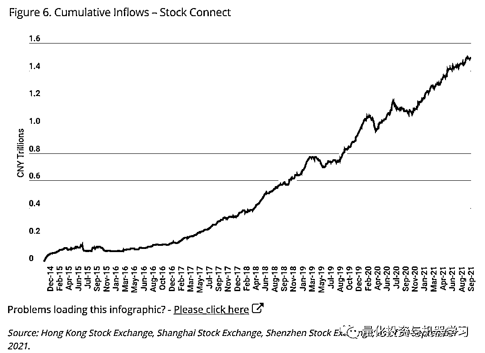

# Man Numeric：中国在岸市场与离岸市场对比

> 原文：[`mp.weixin.qq.com/s?__biz=MzAxNTc0Mjg0Mg==&mid=2653321357&idx=1&sn=eb86499c2a9f258cf04b1909fbd91c1c&chksm=802dba98b75a338e3b4d0b5c5972b0ae635b31d02c9c95946a7a19b24b325e121582536c7ca4&scene=27#wechat_redirect`](http://mp.weixin.qq.com/s?__biz=MzAxNTc0Mjg0Mg==&mid=2653321357&idx=1&sn=eb86499c2a9f258cf04b1909fbd91c1c&chksm=802dba98b75a338e3b4d0b5c5972b0ae635b31d02c9c95946a7a19b24b325e121582536c7ca4&scene=27#wechat_redirect)

# 

量化投资与机器学习微信公众号，是业内垂直于**量化投资、对冲基金、Fintech、人工智能、大数据**等领域的主流自媒体。公众号拥有来自**公募、私募、券商、期货、银行、保险、高校**等行业**20W+**关注者，连续 2 年被腾讯云+社区评选为“年度最佳作者”。

MAN Numeric 在最近的文章中，通过详细的数据对比了中国在岸市场与离岸市场，并对中国在岸市场持续健康稳定的发展表示出信心。文章的作者，Ziang Fang 是一位华人基金经理，文章以“There’s No Place Like Home”（没有一个地方像家一样），呼吁投资者更多的参与到 A 股市场。

# 

**正文**

中国股市平静的日子少之又少，过去的几个月也发生了很多大事。自蚂蚁集团(Ant Group)去年在最后一刻被暂停首次公开发行以来，中国政府出台了一系列反垄断、数据安全和特定行业的监管改革。

这些受到市场监管影响的大部分公司都在海外上市，相对于国内的投资者，中国离岸投资者不成比例地收到了此次市场震荡的影响。尽管我们认为中国市场的上市规模使其成为一个“没有如果，只有怎么做“的问题，但最近的变化还是引发了中国股市是否仍可投资的争论。我们之前已经从资产配置和阿尔法生成的角度讨论了投资中国 A 股的好处。

在本文中，我们将探讨在岸和离岸市场的历史表现、基本面、市场/监管风险，以及投资者在近期波动后的仓位。**结论是，尽管监管风险可能居高不下，但对投资者而言，中国在岸股票比离岸股票更具吸引力。**

# 

**历史表现对比**

过去 10 年，中国在岸和离岸上市公司都经历了飞速增长。现在的市场已经大到不可忽略的地步，两市合并后市值大约为 14 兆亿美元(图 2)。从历史上相对较小的规模到现在与在岸市场旗鼓相当，离岸市场发展很大程度归功于海外 IPO 的爆发，这本身是因为美国和香港市场更宽松的上市规则。

在很多投资者的印象中，把近十年称为中国 A 股市场失去的十年，事实上，与许多投资者的印象相反，中国 A 股市场相对于离岸上市获得了相似的回报，尽管没有那些曾经所向披靡的中国科技巨头在海外上市时的那种声势(图 2)。随着中美监管机构收紧对中国企业赴美上市的限制，以及中国内地持续进行的 IPO 改革(如创业板的改革)，我们预计，随着时间的推移，在美国以及更广泛的海外上市的吸引力将逐渐减弱。我们认为，特别是那些更有可能享受政策支持(从而监管风险更小)的公司，将选择在岸交易所作为 IPO 的主要地点。

# 

**基本面对比**

中国企业在海外上市的一个吸引力在于，它们往往能让投资者接触到中国经济中最具创新性的行业——那些从新兴中产阶级中受益最大的行业。如果我们将消费品、非必需消费品、医疗保健、技术和通信行业定义为“新中国”，其余行业定义为“旧中国”，那么离岸上市主要包括“新中国”行业。在 2021 年的高峰时期，“新中国”板块占海外上市总量的近 80%(图 3)。然而，近年来在岸上市也发生了变化。这个市场不再像大约 10 年前那样由金融、能源和工业板块主导，“新中国”板块如今占在岸市场总市值的一半。

在地缘政治紧张、Covid-19 大流行和监管审查加剧的不确定性下，我们认为，投资在岸市场有助于投资者保持更平衡的行业敞口，同时仍受益于中国经济最具活力的领域。由于大多数监管措施都影响到“新中国”行业的公司，海外上市公司的预期收益增长已明显放缓。**然而，受全球经济复苏推动的强劲周期性反弹的支持，在岸市场正拥有过去十年最强劲的盈利势头(图 4)。**

# 

**风险对比**

除了更多元化的行业敞口，从监管角度看，中国在岸股票的风险更低。中国的海外上市主要依靠可变利益实体(VIE)结构来规避中国的某些外资限制，因此面临着中国和美国监管机构越来越严格的审查。在美中地缘政治紧张局势挥之不去的背景下，中国企业(尤其是在美国上市的企业)在海外上市的命运仍悬而未决。

另一方面，在中国境内上市在 IPO 过程中必须经过广泛的监管审查。这是因为监管机构寻求保护散户投资者，他们历来是中国股市的主要参与者。以深圳证券交易所为例，任何公司想在主板上市，必须满足一系列高标准的要求(比如，公司成立超过三年，且 IPO 前三年净利润超过 3000 万元) ，这是一个漫长而复杂的过程，包括承销人对董事会的尽职调查，直到获得中国证监会的批准。

上市过程的差异在最近的市场事件中得到了突显。蚂蚁集团在上海和香港两地上市的是在最后一刻停止，针对在滴滴的调查也紧随其在美国上市后开始。同样，2020 年 11 月恒大无法安全的在岸通过股权融资，这最终导致了流动性危机，这波冲击影响了全球金融体系。

从市场风险的角度来看，大幅波动是中国 a 股市场的一个特点，2015 年的盛衰周期仍清晰地留在投资者的记忆中。

然而，近年来，在沪港通的引入和国内机构日益增多的推动下，中国已逐步实现了制度化。这导致中国 a 股市场的波动性降至与境外上市企业相当的水平(图 5)，更容易受到外国投资者情绪频繁变化的影响。

最后，即将在香港交易所推出的 MSCI 中国 A50 指数期货(MSCI China A 50 Connect Index Futures)是中国 A 股市场发展的又一里程碑，为全球投资者提供了一种期待已久的金融工具，有效管理贝塔风险。

# 

**投资者的头寸对比**

随着监管改革对市场的影响，国际和国内投资者对在岸上市仍充满信心，同时对离岸上市持谨慎态度。

国际投资者由于受到离岸市场的影响，对在岸市场保持着持续净流入(图 6)。2021 年三季度末，通过港股通流入的金额达到了 1.4 万亿元，达到了历史最高，且相比年初高出 3000 亿元。与之前导致外资外流的宏观事件相比，比如 2019 年中美贸易紧张局势、Covid-19 疫情爆发和随后的 2020 年 3 月全球市场崩溃，监管收紧并没有让在岸市场的外国投资者感到那么担心。同样，用于为在岸投资者的多头头寸融资的未偿保证金贷款总额(历史上是在岸市场情绪的良好指标)继续上升(图 7)。

在离岸市场，通过沪港通进入香港上市的国内资本流动——在 2020 年和 2021 年初呈垂直上升趋势——在离岸市场崩盘后现在趋于平稳(图 8)。

外国投资者对境外上市也变得更加谨慎，过去几个月中国境外上市的价格图表显示，他们在一定程度上降低了风险。虽然我们还没有看到开始做空的一致行动，但这可能也是一个信号，表明离岸市场的不确定性加剧，导致卖空者的参与减少(图 9-10)。

# 

**总结**

作为全球第二大股市，中国上市公司规模之大，令全球投资者无法忽视。随着监管风险的增加，投资者需要对中国在其投资组合中的风险敞口采取更深思熟虑的方式。

我们认为，就更广泛的中国股市而言，在岸市场的相对重要性可能会继续上升。鉴于中国近期的监管行动以及未来可能崎岖不平的道路，与海外上市相比，在岸上市提供了类似的历史表现、更均衡的行业格局、更光明的盈利前景，以及可能更少的监管阻力。因此，我们认为，对于投资者而言，中国在岸股市是一个更好的投资组合。