# 组合优化哪家强，HRP 当自强！

> 原文：[`mp.weixin.qq.com/s?__biz=MzAxNTc0Mjg0Mg==&mid=2653321337&idx=1&sn=2bd441ef5167f7893e51c8816d7b323c&chksm=802dba6cb75a337afa30c6b0314bf73e280b04df995683fcd908a3293e79e3524ab2fcefaa38&scene=27#wechat_redirect`](http://mp.weixin.qq.com/s?__biz=MzAxNTc0Mjg0Mg==&mid=2653321337&idx=1&sn=2bd441ef5167f7893e51c8816d7b323c&chksm=802dba6cb75a337afa30c6b0314bf73e280b04df995683fcd908a3293e79e3524ab2fcefaa38&scene=27#wechat_redirect)

# 

量化投资与机器学习微信公众号，是业内垂直于**量化投资、对冲基金、Fintech、人工智能、大数据**等领域的主流自媒体。公众号拥有来自**公募、私募、券商、期货、银行、保险、高校**等行业**20W+**关注者，连续 2 年被腾讯云+社区评选为“年度最佳作者”。

# 

量化投资与机器学习公众号独家解读

量化投资与机器学公众号 *** ***QIML Insight——深度研读系列 ******是公众号今年全力打造的一档**深度、前沿、高水准**栏目。

公众号**遴选**了各大期刊前沿论文，按照理解和提炼的方式为读者呈现每篇论文最精华的部分。QIML 希望大家能够读到可以成长的量化文章，愿与你共同进步！

> **本期遴选论文** **来源：**The Journal of Financial Data Science Fall 2021
> **标题：**Adaptive Seriational Risk Parity and Other Extensions for Heuristic Portfolio Construction Using Machine Learning and Graph Theory
> **作者：**Peter Schwendner、Jochen Papenbrock、Markus Jaeger、Stephan Krügel

**前言**

针对马科维茨提出的传统组合优化方法存在的缺陷，Marcos 提出了基于图模型的层次风险平价方法（Hierarchical Risk Parity / HRP），其在统计性能上优于传统的资产组合优化方法。HRP 方法的实现主要分为三个步骤：

*   层次化树聚类（资产聚类）

*   准对角化处理（相关性矩阵调整）

*   递归式二分类处理（计算资产权重）

**标准的 HRP 组合优化方法**

**Step1：层次化树聚类（Hierarchical Tree Clustering）**

1、假设有 N 个证券过去 T 个时间的收益率数据构成 TxN 的矩阵，基于此收益率数据计算资产间的相关系数，构成 NxN 的相关系数矩阵；

2、根据相关系数矩阵，使用下列公式转换为距离矩阵 D；3、根据上述矩阵 D，使用下列公式计算距离矩阵 ，该矩阵的每个元素是矩阵 D 任意两列的欧式距离。从逻辑上理解，用股票与所有其他股票的距离作为该股票的向量表征，通过计算两两向量之间的欧式距离作为股票之间的相似性。<embed style="vertical-align: -2.864ex;width: 33.813ex;height: auto;max-width: 300% !important;" data-fileid="505837658" src="https://mmbiz.qlogo.cn/mmbiz_svg/a18XcQ1EBBgzgouRoaMcibFRBibFCNcS1AzYvKZMicNnQSKXibWu3mgTianJPOUuNNSXUxSwukfSrThvpK9XbzXZf6IibMnqGerjqx/0?wx_fmt=svg" data-type="svg+xml">4、通过递归的方式对 N 个资产进行聚类，具体做法如下：  

a. 找到矩阵 中最小值对应的股票对，比如下图中，a、b 股票的值最小，那么第一个聚类就是 

<embed style="vertical-align: -0.946ex;width: 23.805ex;height: auto;max-width: 300% !important;" data-fileid="505837659" src="https://mmbiz.qlogo.cn/mmbiz_svg/a18XcQ1EBBgzgouRoaMcibFRBibFCNcS1AZQBcDku43gF2ExmqtV2mOos4SsU4SlC3G8R6DWPh1bLWqJJjcNIk247IKxSCuticE/0?wx_fmt=svg" data-type="svg+xml">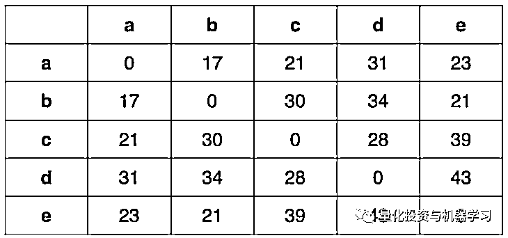

b. 将上述的 a、b 列用 替换，重新计算 c、d、e 到 的距离，得到以下矩阵 ，结果如下：

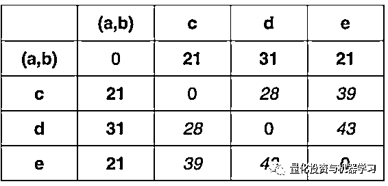

其中 c、d、e 到 U[1] = (a,b)的距离计算方式如下，其他位置元素保持不变：

<embed style="vertical-align: -4.205ex;width: 52.654ex;height: auto;" data-fileid="505837662" src="https://mmbiz.qlogo.cn/mmbiz_svg/a18XcQ1EBBgzgouRoaMcibFRBibFCNcS1AAkdmmX80Dfz7ThgzqqNiaoz8trRcicEUnXneLFem4ckyGj2DwlL1OOyxgjlxHuS4ml/0?wx_fmt=svg" data-type="svg+xml">我们再找到上述矩阵的最小值对应的股票或聚类是 ，并按同样的方法更新距离矩阵 :

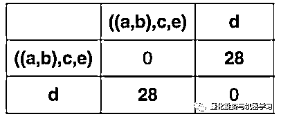

5、不断反复的更新距离矩阵，最终得到资产的聚类结果，如下图（称为 dendrogram，系统树图）：

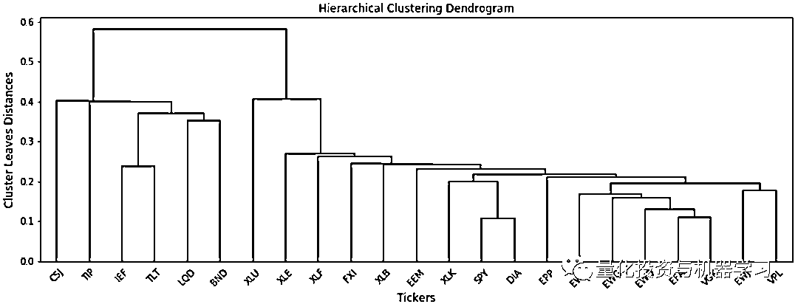

**Step2：准对角化处理（Quasi-diagonalization）**

在这个步骤中，主要是重新组织协方差矩阵的行列，使得最大的值尽量的沿着对角线排列（看下图左右两图对比）。协方差矩阵的准对角化带来的结果是：类似的资产被组织在一起，而不太类似的资产被隔离的远远的。

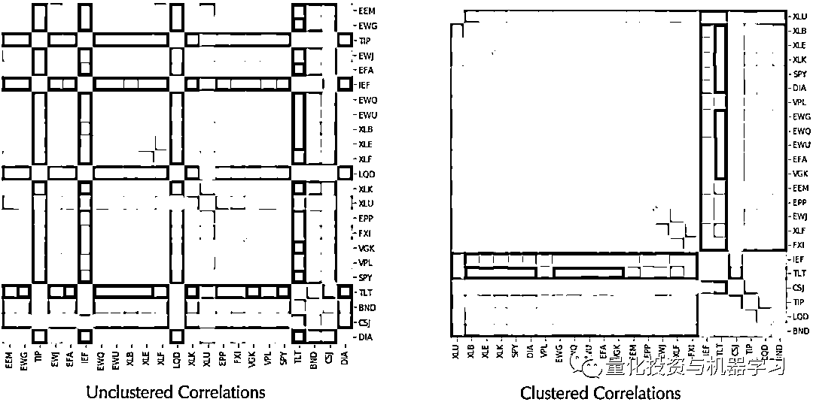

**Step3：递归式二分类处理（Recursive bisection）**

这一步骤主要是基于以上的结果计算各资产的权重：

1、初始化所有资产权重：

2、基于 Step1 得到的聚类，从树形图的顶部到最底部依次将树分为左右两部分（分别用 V1，V2 标志），如下图所示：

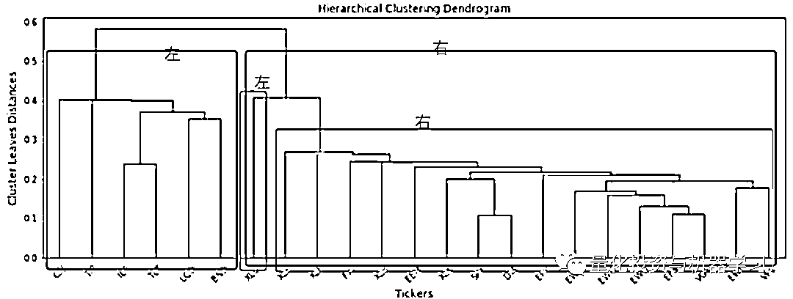

3、从树的根部开始，根据以下公式及 Step2 的协方差矩阵计算考虑权重后的 V1，V2：

其中：

<embed style="vertical-align: -2.622ex;width: 23.048ex;height: auto;max-width: 300% !important;" data-fileid="505837667" src="https://mmbiz.qlogo.cn/mmbiz_svg/a18XcQ1EBBgzgouRoaMcibFRBibFCNcS1AuYn3WvgOTVhUb2atQnGB6C5T949bW2G7YW7ib7qOwBREfjNJWX7icQGsKt7WefuBcu/0?wx_fmt=svg" data-type="svg+xml">

4、基于以上更新后的 V1，V2，按以下公式调整左右两个分支的资产权重：

<embed style="vertical-align: -4.163ex;width: 27.35ex;height: auto;max-width: 300% !important;" data-fileid="505837668" src="https://mmbiz.qlogo.cn/mmbiz_svg/a18XcQ1EBBgzgouRoaMcibFRBibFCNcS1AjvU4U1au714oatB6dibsFPsLSnaBhfqdLDyQibFUTG6fVHhK8slHvAhDVia0Uz4icxzp/0?wx_fmt=svg" data-type="svg+xml">5、重复上述步骤，直到计算至最底部的节点。

标准的 HRP 有现在的 Python 实现，具体参考：

*https://github.com/robertmartin8/PyPortfolioOpt/blob/master/cookbook/5-Hierarchical-Risk-Parity.ipynb*

**HRP 存在哪些改进的空间？**

在本篇文章中，作者参考标准的 HRP 步骤，主要从聚类的方法上提出了改进，首先把聚类分成了两大类：序列聚类 Seriation-based 和树聚类 Tree-based，树聚类又考虑了固定聚类法和自适应聚类法。

首先是不同的序列聚类 Seriation-based 方法，如下表所示，以下方法主要参考自 Hahsler, Hornik,  Buchta (2008)，并在 R 语言中有现成的实现方式。

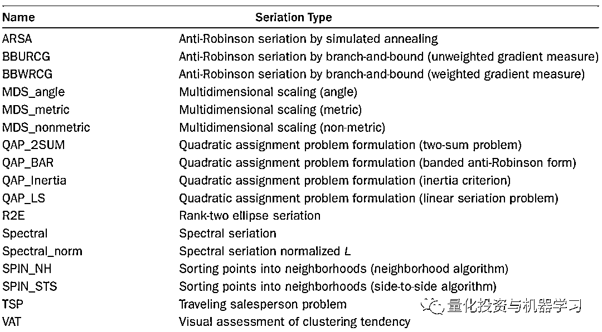

然后是不同的树聚类方法，作者主要测试了 Agglomerative（从下至上）、Divisive（从上至下）、Hierarchical graph community（基于图论）的聚类方法，下表给出了具体方法大部分在 scikit-learn 有 python 的实现，大家可以搜索 Name 查找具体说明。

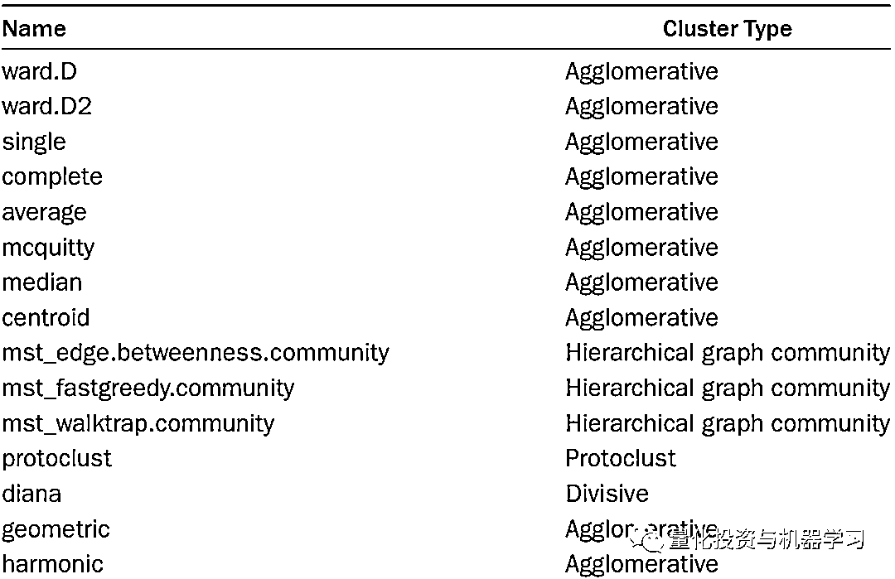

关于以上聚类方法的选用，作者采用了两种方式，一种是固定，一种是根据某个指标的结果动态的自适应的选用最优的聚类方法，所以关于选取的标准又有不同的指标，具体如下：

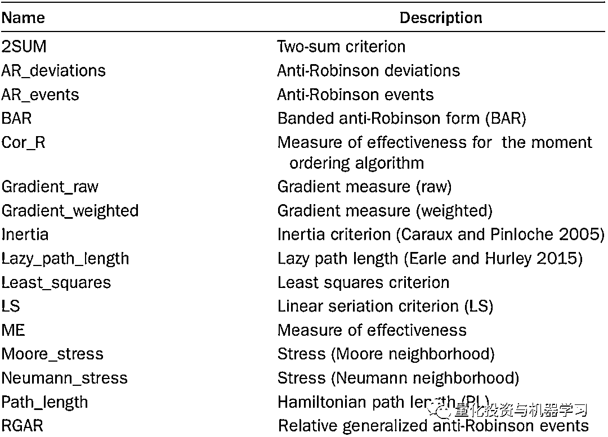

在采用自适应树聚类时，还考虑了不同距离的计算方式，如下表所示。

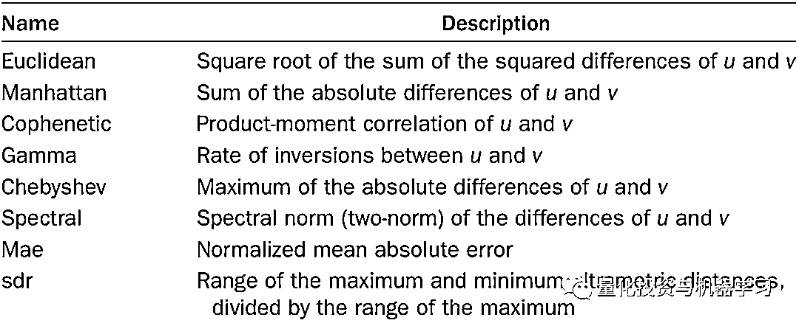

综合以上所有的可变选项，作者基于以下资产，测试了近 60 种组合优化的方法，并给出了改进后方法相对于标准方法夏普比率的变动（改进方法减去标准方法），如下表：

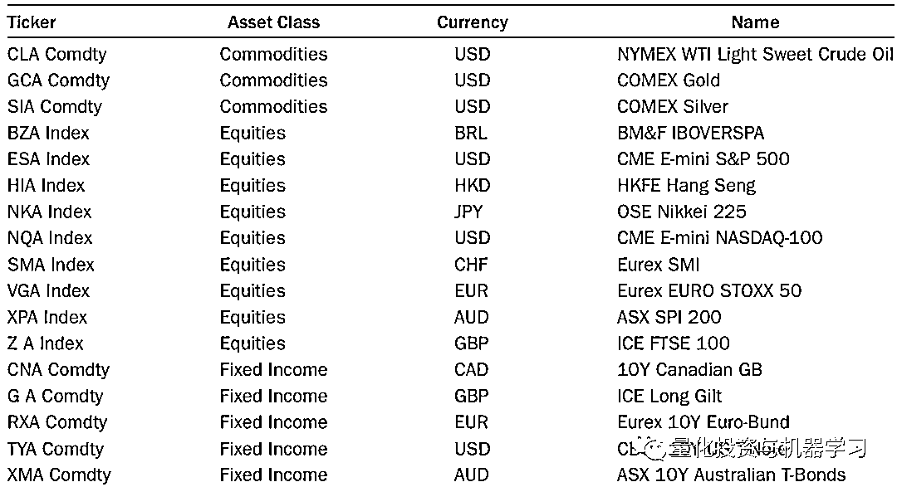

所有待测试的方法，如下：

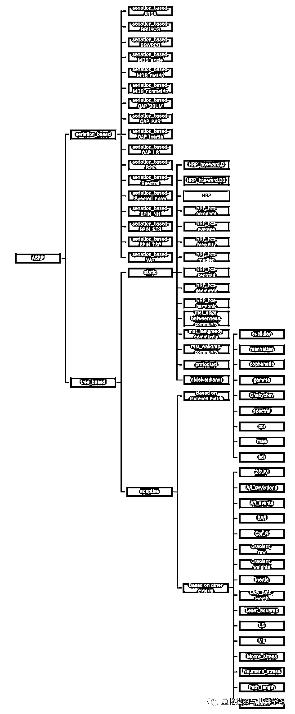

最终测试结果如下，可以发现大部分的方法相对于标准方法并，效果没有提升。但是大部分的 Tree-based 的固定聚类方法的结果表现比标准方法优秀，**如 HRP_hcs_average。其中效果最好的是 HRP_hcs-geometric，即固定采用 geometric 层次聚类，且距离计算方式与标准方法一致的组合优化方法。**

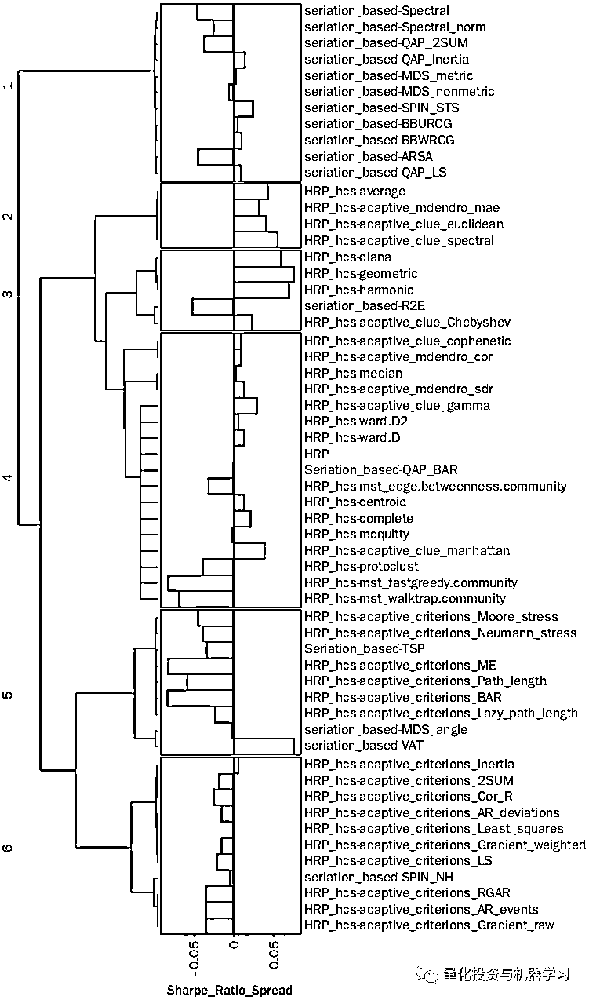

**参考文献**

1、The hierarchical risk parity algorithm: An introduction. Hudson & Thames. (2021, January 11). Retrieved October 25, 2021, from https://hudsonthames.org/an-introduction-to-the-hierarchical-risk-parity-algorithm/. 

2、Hahsler, M., K. Hornik, and C. Buchta. 2008\. “Getting Things in Order: An Introduction to the r Package Seriation.” Journal of Statistical Software 25 (3): 1–34.