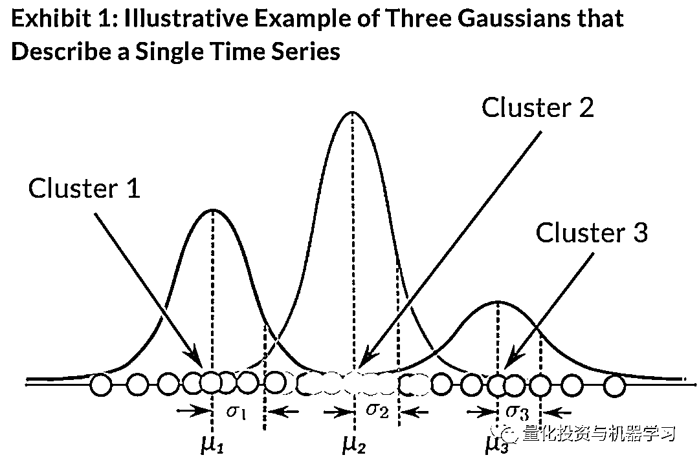
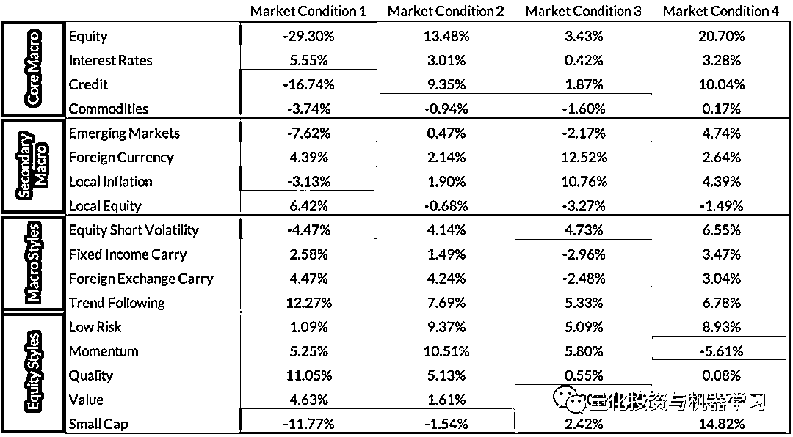
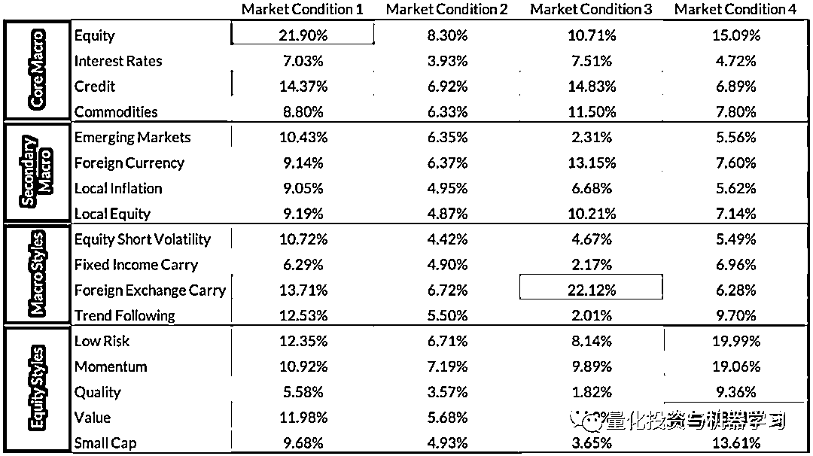
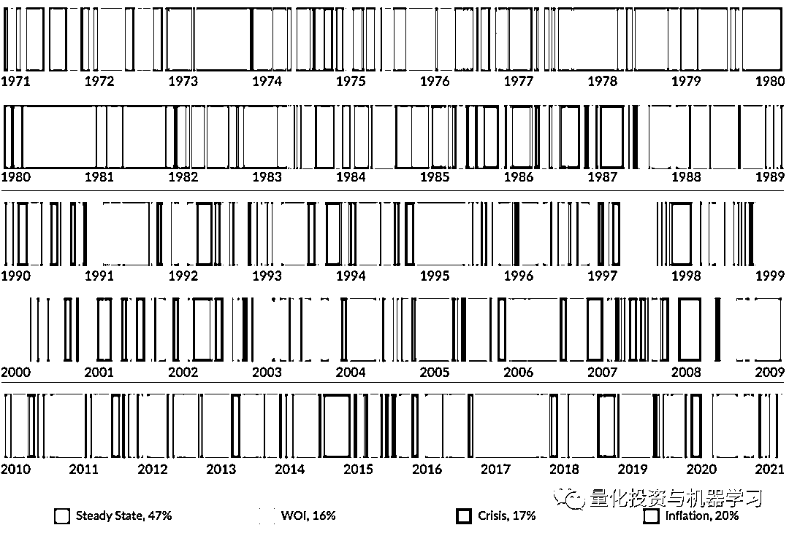
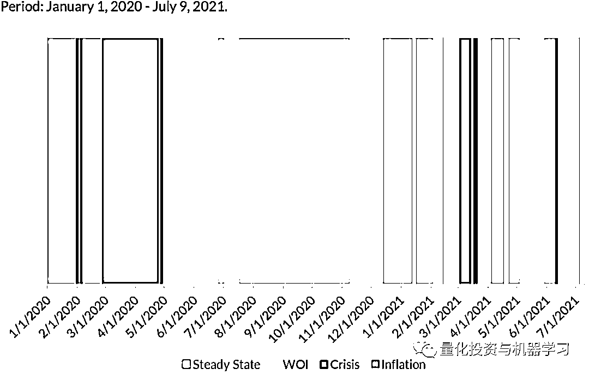
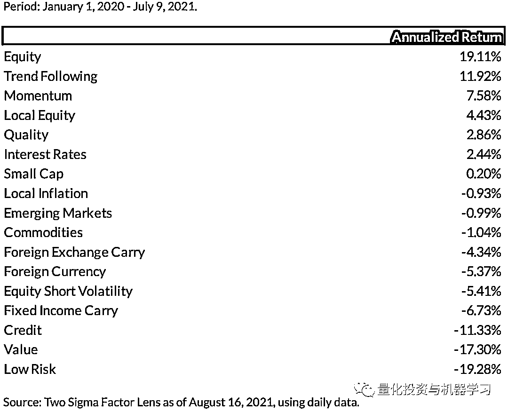

# Two Sigma：通过机器学习识别市场状态

> 原文：[`mp.weixin.qq.com/s?__biz=MzAxNTc0Mjg0Mg==&mid=2653321305&idx=1&sn=bbb165ebed0219f0b8c639c640127e67&chksm=802dba4cb75a335add302a89b3b7b7da8bba5b8e9a279806bcdd28cdc21767082173fdc825e6&scene=27#wechat_redirect`](http://mp.weixin.qq.com/s?__biz=MzAxNTc0Mjg0Mg==&mid=2653321305&idx=1&sn=bbb165ebed0219f0b8c639c640127e67&chksm=802dba4cb75a335add302a89b3b7b7da8bba5b8e9a279806bcdd28cdc21767082173fdc825e6&scene=27#wechat_redirect)

# 

量化投资与机器学习微信公众号，是业内垂直于**量化投资、对冲基金、Fintech、人工智能、大数据**等领域的主流自媒体。公众号拥有来自**公募、私募、券商、期货、银行、保险、高校**等行业**20W+**关注者，连续 2 年被腾讯云+社区评选为“年度最佳作者”。

金融市场的状态（Regime）通常会不定期的切换并保持一段时间，市场状态的切换会直接影响到金融资产的表现及投资组合的配置。如果能有效对市场状态进行建模，预测市场状态的变换，将非常有利于投资管理决策制定及尾部风险管理。

在本篇分享中，Two Sigma 提出了一个基于机器学习算法对市场状态进行建模的方案，并在历史数据测试中显示该模型能够有效的预测市场状态的变换。

**怎样划分市场状态**

在了解市场状态如何影响投资组合构建，首先需要弄清楚市场有多少种状态。对于市场状态的定义有不同的方法，比如根据经验定义为“繁荣”或“萧条”，“高波动”或“低波动”，也可以根据市场情绪分为“低风险”或“高风险”，还有根据货币政策区分市场状态。

除了根据经验定义市场状态，近些年很多研究根据数据驱动的模型对市场状态进行划分，常用的模型有 Gaussian Mixture Model (GMM)，这是一种无监督学习。**GMM 应用不同的高斯分布拟合不同时期的历史数据。如下图 1 所示，对于某单一资产的历史收益率，不同的历史区间对应了一个不同的高斯分布。**

我们应用 GMM 对更多的资产收益进行建模，用来对整个市场的状态进行研究。实际上，具体的做法是，**我们建模的对象不是所有资产的收益，而是美国市场从 1970 年开始 17 个因子的收益。我们应用 GMM 模型，通过对因子收益的建模，来判断市场状态的变化。**

**四种市场状态**

我们利用 GMM 算法对因子历史收益进行聚类，最终通过交叉校验选择了聚类个数 4 作为最优参数，也就是说市场存在 4 个状态。下表 2 和表 3 展示了 4 个不同市场状态下，17 个因子收益的均值和波动。由于 4 个状态存粹是基于模型对数据建模的结果，很难完成弄清楚不同状态对应的逻辑。所以我们尝试从因子的表现对四个状态进行分析。

**市场状态 1：危机（Crisis）**

*   大部分核心的宏观因子表现非常糟糕。这是唯一个市场状态中， global Equity 和 Credit factors 的平均收益为负的。 

*   Emerging Markets factor 的收益也是负的，这说明在这个市场状态中，发展中国家市场表现比发达国家更糟糕。

*   **Interest Rate factor 收益为正，说明在这个市场状态下，投资者更倾向低风险的证券。**

*   Local Inflation factor 反映的是通胀对冲后的收益，该因子收益为负说明市场处于危机状态时，权益收益并不能对冲通胀。

*   宏观趋势跟踪的因子收益为正，说明方向明确的市场状态对于趋势跟踪是有利的。

*   风格因子层面，只有小市值因子收益为负，说明市场危机相对于大市值股票，对于小市值股票影响更大。

*   **对比四种市场状态，危机状态下，各因子收益间的相关性是最大的。**

**市场状态 2：稳定（Steady State）**

该状态覆盖了大部分最稳定或健康的时期，在这个状态下任何一个因子都没有发生较大的回撤。权益信用类因子的表现都比较平均。Local Equity 和 Emerging Market 的因子收益接近于 0，说明发达国家与发展中国家的权益收益无明显差异。

**市场状态 3：通胀（Inflation）**

这个状态下 Local Inflation 因子的收益为四个状态下最高，达到了 10.76%。在这个市场状态下，全球权益类和利率类的因子表现几乎在四个状态中垫底。同时，汇率类因子的表现也说明美元跑输了 G10 货币，这也可能是因为通胀带来的货币贬值。

**市场状态 4：脆弱（Walking on Ice）**

在这个状态下，市场的表现是比较敏感的，貌似在危机及稳定中摇摆，全球股票市场表现比较好，但波动比其他三个状态都高。股票风格因子的表现也波动也比其他状态下更高。说明在这个状态下，各因子收益都比较均衡，但波动比较高，随时可能发生风险。

**四种市场状态的历史分析**

GMM 模型会给出每个时间段属于不同市场状态的概率，我们取概率最高的状态作为当时的市场状态，下图 4 给出了 1971 年以来每个时间点的市场状态。市场 47%的时间处于稳定状态，17%的时间处于危机状态，20%的时间处于通胀状态，还有最后 16%的时间处于脆弱状态。

*   1970-1980 年代，大部分时间处于通胀期，当时历史的实际情况也是这样的，而在近 10 年几乎没有再没出现过通胀状态。

*   脆弱状态主要集中在 90 年代到 21 世纪初，那时候正好了科技股泡沫破裂的时期，市场非常脆弱，脆弱状态下市场会出现较大回撤，且有很大的波动。

*   1987、2008 及 2020 年初的新冠影响，都将市场带入了危机状态，模型也成功识别出来。

*   市场大部分处于稳定状态，而且在过去 10 年，市场基本都处于稳定状态。

**当前的市场状态**

从 2020 年新冠开始，市场由稳定状态转为危机状态，随着各国政府对新冠疫情应对，市场不断的在脆弱与稳定中切换，直到 2021 年出市场有短暂的进入了危机状态。表 7 给出了 2020 年初至今各因子的表现。

**总结**

GMM 模型可以比较准确的区分当前市场的状态，且历史数据测试的结果说明与历史真实状态比较一致。但 GMM 本身不是一个预测模型，我们只能识别当前状态，并不能预测未来状态。当准确识别当前市场状态，也能为投资组合的风险管理提供有利的数据决策。