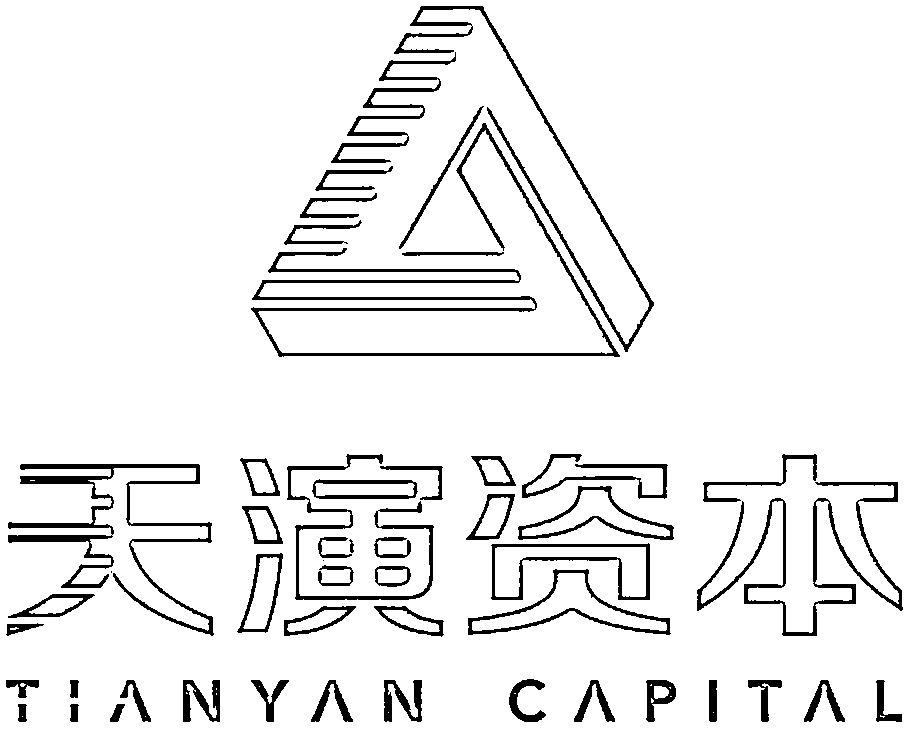

# 百亿私募，天演资本 | 量化研究员招聘

> 原文：[`mp.weixin.qq.com/s?__biz=MzAxNTc0Mjg0Mg==&mid=2653321271&idx=1&sn=f467e7364f111d17fc3beb316781a049&chksm=802dba22b75a3334c1a065811512d8d8d30ee22604806e4dc3bb16f0c2eb212bc1e8607ca2ad&scene=27#wechat_redirect`](http://mp.weixin.qq.com/s?__biz=MzAxNTc0Mjg0Mg==&mid=2653321271&idx=1&sn=f467e7364f111d17fc3beb316781a049&chksm=802dba22b75a3334c1a065811512d8d8d30ee22604806e4dc3bb16f0c2eb212bc1e8607ca2ad&scene=27#wechat_redirect)

量化投资与机器学习微信公众号，是业内垂直于**量化投资、对冲基金、****Fintech、人工智能、大数据**等领域的主流自媒体。公众号拥有来自**公募、私募、券商、期货、银行、保险、高校**等行业 20W+**关注者，****我们为所有量化金融机构提供岗位招聘与推广服务。**

****

****公司介绍****

**天演资本成立于 2014 年，专注于量化投资领域的研究，是一家创设于中国本土的量化私募基金管理人，现资产管理规模逾 300 亿元。**

**公司致力成为一家以高水准的数理研究和高效率的技术解决方案为核心竞争力的投资机构。核心团队成员由各类背景的资深科学家与技术专家组成，他们毕业于剑桥、清华、北大、麻省理工等一流学府，投研团队一半以上拥有理工科博士学位。**

**天演资本追求“高幸福感、高自由度”的工作环境，实行扁平化管理，工作方式轻松高效，并提供行业顶级薪酬。公司珍视好奇心，鼓励成员积极求知、乐于探索，追本溯源；欢迎大胆创新，鼓励成员用技术创新解决问题；鼓励独立思考，培养成员出色的问题分析和解决能力。**

****工作地点****

**上海市浦东新区：上海中心大厦**

****量化研究员（初级/资深）****

****工作职责****

**1、对数据进行科学统计与分析，发掘金融市场运行的客观规律，形成投资策略并验证交易策略，具体涉及交易想法的策略化、数据处理、策略历史回测、策略报告撰写等；**

**2、对量化投资策略的表现进行跟踪、分析、评估和改进，为公司投资优化提供合理化建议；**

**3、参与公司的专项研究课题，完成公司布置的各项工作。**

****任职要求****

**1、精通 python/C#/Matlab 中至少一门工作语言，有机器学习方面技术经验者优先；**

**2、国内外顶级大学硕士以上学历，数学/计算机等相关学科功底扎实，专业成绩优异，博士或有相关专业各级比赛金牌者优先；**

**3、善于解决开放式问题，有系统的定量研究经验（不限定金融行业，科研及非金融行业内的定量研究经验均可）；**

**4、具备良好的逻辑思维、严谨的研究习惯、沟通和团队合作能力及和敬业精神；**

**5、资深研究员应在以下某一个领域有 2-5 年系统的研究经验：**

*   **深度学习**

*   **金融场景下的 NLP 研究和应用**

*   **港股或美股多因子选股**

*   **交易执行算法**

*   **高频交易**

*   **波动率预测**

****具体投递方式****

**投递邮箱**

*****hr_quant@tianyancapital.com*****

****简历命名****

****岗位+初级/资深+姓名+QIML 公众号****

****企业如有招聘需求**** 

****请发邮件至：*****lhtzjqxx@163.com*****

*******或添加微信：********l******htz******jqxx*****

****部分合作机构****

****