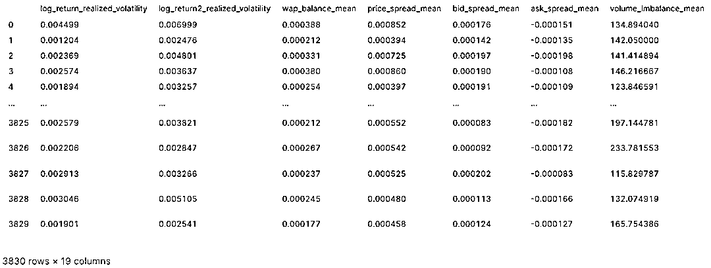
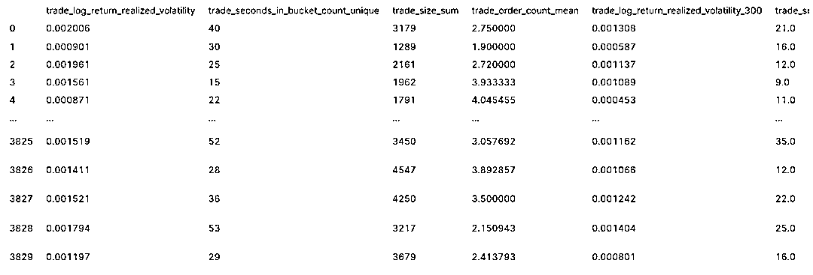

# Optiver 波动率预测大赛系列解读二：LightGBM 模型及特征工程

> 原文：[`mp.weixin.qq.com/s?__biz=MzAxNTc0Mjg0Mg==&mid=2653321226&idx=1&sn=6661e53b8bab4f5e491cf1c267dbebdc&chksm=802dba1fb75a3309166dd07dd66eec914fb0f5d3c0921987748f060a6b6893d957bfd1dd17f0&scene=27#wechat_redirect`](http://mp.weixin.qq.com/s?__biz=MzAxNTc0Mjg0Mg==&mid=2653321226&idx=1&sn=6661e53b8bab4f5e491cf1c267dbebdc&chksm=802dba1fb75a3309166dd07dd66eec914fb0f5d3c0921987748f060a6b6893d957bfd1dd17f0&scene=27#wechat_redirect)

# 


量化投资与机器学习微信公众号，是业内垂直于**量化投资、对冲基金、Fintech、人工智能、大数据**等领域的主流自媒体。公众号拥有来自**公募、私募、券商、期货、银行、保险、高校**等行业**20W+**关注者，连续 2 年被腾讯云+社区评选为“年度最佳作者”。

**前言**

Optiver 波动率预测大赛于上个月 27 号截止提交，比赛终于告一段落，等待着明年 1 月份的最终比赛结果。Kaggle 上，由财大气粗的对冲基金大佬主办的金融交易类预测大赛，总能吸引大量的人气。在过去 3 个月的比赛中，也诞生了很多优秀的开源代码，各路神仙应用各种模型算法，在竞争激烈的榜单你追我赶。

关于这个比赛，网络上陆陆续续也有很多参赛经验的分享。但为了充分吸收大神们的精髓，公众号还是决定从 0 到 1 解读各种不同类型的开源比赛代码，方便小伙伴们学习归纳，并应用到实际研究中去。本系列大概安排内容如下：

*   [第一篇：相关概念及数据介绍，简单的 EDA 分析](http://mp.weixin.qq.com/s?__biz=MzAxNTc0Mjg0Mg==&mid=2653321155&idx=1&sn=6d85735080d3e7120a5b1c3922477571&chksm=802db5d6b75a3cc081d224bc303b8067fbe5f1acc7b5c7dbad9f961a596b96c6e5331123fb3e&scene=21#wechat_redirect)

*   **第二篇：初次尝试，LightGBM 模型及特征工程**

*   第三篇：首次开源的金牌代码

*   第四篇：独门绝技，TabNet

*   第五篇：登顶在即，图神经网络助力

在 [上一篇文章](http://mp.weixin.qq.com/s?__biz=MzAxNTc0Mjg0Mg==&mid=2653321155&idx=1&sn=6d85735080d3e7120a5b1c3922477571&chksm=802db5d6b75a3cc081d224bc303b8067fbe5f1acc7b5c7dbad9f961a596b96c6e5331123fb3e&scene=21#wechat_redirect) 中，我们对本次比赛要解决的问题有了一个初步的认识，简单来说就是：**应用前 10 分钟的 Book 和 Trade 数据预测下个 10 分钟的已实现波动率。**

**特征构建**

基于对金融市场的理解，对于 Book 数据构建以下几类特征：

*   **价差（price_spread）:** 买卖的价差（bid-ask spread）。价差越大，意味着流动性越低，也就意味着潜在的高波动。

*   **订单量（volume）:** 买量卖量之和。订单量越低，意味着流动性越低，也就意味着潜在的高波动。

*   **订单倾向（volume_imbalance）:** 买量卖量之差。差值越大，说明买卖力量越失衡，也就意味着潜在的高波动。

具体的特征计算逻辑参见下文代码

**模型相关**

在模型层面，对股票的 id 编码（用 target 均值作为编码），也作为特征之一。这样构建了一个适用于所有股票的模型，而不是单个股票对应一个模型。

目标函数 RMSPE：

<embed style="vertical-align: -2.819ex;width: 22.037ex;height: auto;max-width: 300% !important;" data-fileid="505837562" src="https://mmbiz.qlogo.cn/mmbiz_svg/a18XcQ1EBBgzgouRoaMcibOAic0rOjFlicxe568j0IUpftfEASblxey3FTbPVib89rhYAgavx1C46EBrNHVbvAZDRBPt6SByR6cu/0?wx_fmt=svg" data-type="svg+xml">

**代码解读**

```py
# 导入相关工具包
import numpy as np
import pandas as pd
import matplotlib.pyplot as plt
import os
import glob

# 设置数据所在文件夹路径
data_dir = '../input/optiver-realized-volatility-prediction/'
```

**预处理函数**

由于波动率是基于 wap 的 log return 计算得出，所以首先要计算 wap 价格，然后根据 wap 价格计算对数收益率及已实现波动率。

```py
# 计算 wap 价格
def calc_wap(df):
    wap = (df['bid_price1'] * df['ask_size1'] + df['ask_price1'] * df['bid_size1'])/(df['bid_size1'] + df['ask_size1'])
    return wap
def calc_wap2(df):
    wap = (df['bid_price2'] * df['ask_size2'] + df['ask_price2'] * df['bid_size2'])/(df['bid_size2'] + df['ask_size2'])
    return wap

# 计算对数收益率
def log_return(list_stock_prices):
    return np.log(list_stock_prices).diff() 

# 计算已实现波动率
def realized_volatility(series):
    return np.sqrt(np.sum(series**2))

# 其他函数
def count_unique(series):
    return len(np.unique(series))
```

**订单簿数据（Book）特征计算函数**

Book 样例数据如下：


以下是特征处理计算的代码，关于以下代码，有几点需要注意：

*   "log_return"/"log_return2"：计算的是每个 time_id 内相邻两个快照的收益率，没两个快照之间的时间间隔可能不一致，如示例数据中的秒数间隔数为 1、4、1、1。 

*   "wap_balance"/"price_spread"/"volume_imbalance"等等（代码 21-27 行所示）：计算的是这个 time_id 内这个特征在这个时间段内的平均值。如果自己尝试时，也可以增加其他统计维度的值，如最大最小，标准差等。

*   除了每个 time_id 整个 10min 时间窗口构建的特征，原作者还构建了每个 time_id 后 300s 的特征，见以下代码 37-45 行。

```py
def preprocessor_book(file_path):
    df = pd.read_parquet(file_path)
    #calculate return etc
    df['wap'] = calc_wap(df)
    df['log_return'] = df.groupby('time_id')['wap'].apply(log_return)

    df['wap2'] = calc_wap2(df)
    df['log_return2'] = df.groupby('time_id')['wap2'].apply(log_return)

    df['wap_balance'] = abs(df['wap'] - df['wap2'])

    df['price_spread'] = (df['ask_price1'] - df['bid_price1']) / ((df['ask_price1'] + df['bid_price1'])/2)
    df['bid_spread'] = df['bid_price1'] - df['bid_price2']
    df['ask_spread'] = df['ask_price1'] - df['ask_price2']
    df['total_volume'] = (df['ask_size1'] + df['ask_size2']) + (df['bid_size1'] + df['bid_size2'])
    df['volume_imbalance'] = abs((df['ask_size1'] + df['ask_size2']) - (df['bid_size1'] + df['bid_size2']))
    #dict for aggregate
    create_feature_dict = {
        'log_return':[realized_volatility],
        'log_return2':[realized_volatility],
        'wap_balance':[np.mean],
        'price_spread':[np.mean],
        'bid_spread':[np.mean],
        'ask_spread':[np.mean],
        'volume_imbalance':[np.mean],
        'total_volume':[np.mean],
        'wap':[np.mean],
            }
    #####groupby / all seconds
    df_feature = pd.DataFrame(df.groupby(['time_id']).agg(create_feature_dict)).reset_index()

    df_feature.columns = ['_'.join(col) for col in df_feature.columns] #time_id is changed to time_id_

    ######groupby / last XX seconds
    last_seconds = [300]

    for second in last_seconds:
        second = 600 - second 

        df_feature_sec = pd.DataFrame(df.query(f'seconds_in_bucket >= {second}').groupby(['time_id']).agg(create_feature_dict)).reset_index()
        df_feature_sec.columns = ['_'.join(col) for col in df_feature_sec.columns] #time_id is changed to time_id_

        df_feature_sec = df_feature_sec.add_suffix('_' + str(second))
        df_feature = pd.merge(df_feature,df_feature_sec,how='left',left_on='time_id_',right_on=f'time_id__{second}')
        df_feature = df_feature.drop([f'time_id__{second}'],axis=1)

    #create row_id
    stock_id = file_path.split('=')[1]
    df_feature['row_id'] = df_feature['time_id_'].apply(lambda x:f'{stock_id}-{x}')
    df_feature = df_feature.drop(['time_id_'],axis=1)

    return df_feature
```

以股票 0 计算相关特征作为示例，一个有 18 个特征：

```py
%%time
file_path = data_dir + "book_train.parquet/stock_id=0"
preprocessor_book(file_path)
```

、

**成交数据（Trade）特征计算函数**

Trade 样例数据如下：


Trade 数据字段比较少，特征也比较少，作者主要构建了以下特征（见代码 7-10 行）：

*   某个 time_id 内的总成交量

*   某个 time_id 内的成交笔数

*   某个 time_id 内平均订单量

*   计算成交价计算的已实现波动率

*   同样也计算了每个 time_id 后 300 秒的以上 4 个特征

```py
def preprocessor_trade(file_path):
    df = pd.read_parquet(file_path)
    df['log_return'] = df.groupby('time_id')['price'].apply(log_return)

    aggregate_dictionary = {
        'log_return':[realized_volatility],
        'seconds_in_bucket':[count_unique],
        'size':[np.sum],
        'order_count':[np.mean],
    }

    df_feature = df.groupby('time_id').agg(aggregate_dictionary)

    df_feature = df_feature.reset_index()
    df_feature.columns = ['_'.join(col) for col in df_feature.columns]

    ######groupby / last XX seconds
    last_seconds = [300]

    for second in last_seconds:
        second = 600 - second

        df_feature_sec = df.query(f'seconds_in_bucket >= {second}').groupby('time_id').agg(aggregate_dictionary)
        df_feature_sec = df_feature_sec.reset_index()

        df_feature_sec.columns = ['_'.join(col) for col in df_feature_sec.columns]
        df_feature_sec = df_feature_sec.add_suffix('_' + str(second))

        df_feature = pd.merge(df_feature,df_feature_sec,how='left',left_on='time_id_',right_on=f'time_id__{second}')
        df_feature = df_feature.drop([f'time_id__{second}'],axis=1)

    df_feature = df_feature.add_prefix('trade_')
    stock_id = file_path.split('=')[1]
    df_feature['row_id'] = df_feature['trade_time_id_'].apply(lambda x:f'{stock_id}-{x}')
    df_feature = df_feature.drop(['trade_time_id_'],axis=1)

    return df_feature
```

以股票 0 计算相关特征作为示例，算上股票代码本身，一个有 8 个特征：

```py
file_path = data_dir + "trade_train.parquet/stock_id=0"
preprocessor_trade(file_path)
```



**计算所有股票的特征**

作者使用并行计算，并且把 book 和 trade 的特征合并在一个 dataframe，函数的输入是 stock_id 的列表，代码运行时会根据 stock_id 去文件里读取相关股票的数据。

```py
def preprocessor(list_stock_ids, is_train = True):
    from joblib import Parallel, delayed # parallel computing to save time
    df = pd.DataFrame()

    def for_joblib(stock_id):
        if is_train:
            file_path_book = data_dir + "book_train.parquet/stock_id=" + str(stock_id)
            file_path_trade = data_dir + "trade_train.parquet/stock_id=" + str(stock_id)
        else:
            file_path_book = data_dir + "book_test.parquet/stock_id=" + str(stock_id)
            file_path_trade = data_dir + "trade_test.parquet/stock_id=" + str(stock_id)

        df_tmp = pd.merge(preprocessor_book(file_path_book),preprocessor_trade(file_path_trade),on='row_id',how='left')

        return pd.concat([df,df_tmp])

    df = Parallel(n_jobs=-1, verbose=1)(
        delayed(for_joblib)(stock_id) for stock_id in list_stock_ids
        )
    df = pd.concat(df,ignore_index = True)
    return df
```

**构建训练/测试数据集**

首先，根据 train.csv 内的 stock_id 计算特征，得到 df_train，再通过 row_id 合并 df_train 与 train，把对应的训练数据过滤出来。同样的操作也应该在测试集上。


```py
# 训练集
train = pd.read_csv(data_dir + 'train.csv')
train_ids = train.stock_id.unique()
df_train = preprocessor(list_stock_ids= train_ids, is_train = True)
train['row_id'] = train['stock_id'].astype(str) + '-' + train['time_id'].astype(str)
train = train[['row_id','target']]
df_train = train.merge(df_train, on = ['row_id'], how = 'left')

# 测试集
test = pd.read_csv(data_dir + 'test.csv')
test_ids = test.stock_id.unique()
df_test = preprocessor(list_stock_ids= test_ids, is_train = False)
df_test = test.merge(df_test, on = ['row_id'], how = 'left')
```

**上文说过，本文构建了一个适用于所有股票的模型，而不是单个股票对应一个模型。对于股票编码的方法，并不是传统的 one-hot，作者用股票在训练集内 target 的均值作为编码（见代码第 5 行）：**

```py
from sklearn.model_selection import KFold
#stock_id target encoding
df_train['stock_id'] = df_train['row_id'].apply(lambda x:x.split('-')[0])
df_test['stock_id'] = df_test['row_id'].apply(lambda x:x.split('-')[0])
stock_id_target_mean = df_train.groupby('stock_id')['target'].mean() 
df_test['stock_id_target_enc'] = df_test['stock_id'].map(stock_id_target_mean) # test_set
#training
tmp = np.repeat(np.nan, df_train.shape[0])
kf = KFold(n_splits = 10, shuffle=True,random_state = 19911109)
for idx_1, idx_2 in kf.split(df_train):
    target_mean = df_train.iloc[idx_1].groupby('stock_id')['target'].mean()
    tmp[idx_2] = df_train['stock_id'].iloc[idx_2].map(target_mean)
df_train['stock_id_target_enc'] = tmp
```

**LightGBM**

LightGBM 模型本身是为了解决 XGBoost 在训练时间空间上的缺陷提出来的高效的 GBDT 模型，关于 LightGBM 模型的介绍可以参考网上丰富的资料。在这里，我们不花篇幅讲解 LightGBM 的原理，做一回调包侠，直接引入 lightgbm 模块：

```py
import lightgbm as lgbm
# 数据最后准备
df_train['stock_id'] = df_train['stock_id'].astype(int)
df_test['stock_id'] = df_test['stock_id'].astype(int)
X = df_train.drop(['row_id','target'],axis=1)
y = df_train['target']

# 定义目标函数
def rmspe(y_true, y_pred):
    return  (np.sqrt(np.mean(np.square((y_true - y_pred) / y_true))))

def feval_RMSPE(preds, lgbm_train):
    labels = lgbm_train.get_label()
    return 'RMSPE', round(rmspe(y_true = labels, y_pred = preds),5), False

# 参数设置
params = {
      "objective": "rmse", 
      "metric": "rmse", 
      "boosting_type": "gbdt",
      'early_stopping_rounds': 30,
      'learning_rate': 0.01,
      'lambda_l1': 1,
      'lambda_l2': 1,
      'feature_fraction': 0.8,
      'bagging_fraction': 0.8,
  }

# 训练验证集划分
kf = KFold(n_splits=5, random_state=19901028, shuffle=True)
oof = pd.DataFrame() # out-of-fold result
models = [] # models
scores = 0.0                         # validation score
gain_importance_list = []
split_importance_list = []
```

在上面的代码中，把数据集分成了 5 个 fold，每个 fold 训练的模型都保留下来（代码第 31 行），最终的 scores 是 5 个模型的平均值。

```py
# 模型训练
for fold, (trn_idx, val_idx) in enumerate(kf.split(X, y)):
    print("Fold :", fold+1)

    # create dataset
    X_train, y_train = X.loc[trn_idx], y[trn_idx]
    X_valid, y_valid = X.loc[val_idx], y[val_idx]

    #RMSPE weight
    weights = 1/np.square(y_train)
    lgbm_train = lgbm.Dataset(X_train,y_train,weight = weights)
    weights = 1/np.square(y_valid)
    lgbm_valid = lgbm.Dataset(X_valid,y_valid,reference = lgbm_train,weight = weights)

    # model 
    model = lgbm.train(params=params,
                      train_set=lgbm_train,
                      valid_sets=[lgbm_train, lgbm_valid],
                      num_boost_round=5000, 
                      feval=feval_RMSPE,
                      verbose_eval=100,
                      categorical_feature = ['stock_id'] 
                     )

    # validation 
    y_pred = model.predict(X_valid, num_iteration=model.best_iteration)
    RMSPE = round(rmspe(y_true = y_valid, y_pred = y_pred),3)
    print(f'Performance of the　prediction: , RMSPE: {RMSPE}')
    #keep scores and models
    scores += RMSPE / 5
    models.append(model)
    print("*" * 100)

# 最终的训练集的 scores 为 0.2344
```

**在测试集上预测，并进行提交**

```py
y_pred = df_test[['row_id']]
X_test = df_test.drop(['time_id', 'row_id'], axis = 1)

target = np.zeros(len(X_test))
#light gbm models
for model in models:
    pred = model.predict(X_test[X_valid.columns], num_iteration=model.best_iteration)
    target += pred / len(models)
y_pred = y_pred.assign(target = target)
y_pred.to_csv('submission.csv',index = False)
```

**总结**

这个方案给我们带来的启示由以下几点：

*   使用训练集 target 均值对测试集股票 id 进行编码；

*   kfold 中每个 fold 训练一个模型，最终测试集是多个模型综合的结果（LightGBM 本身就是一种集成学习）；

*   在构建特征时，分时间段构建，比如作者构建了全部 600 秒及后 300 秒的特征；

*   后续改进方向上，可以构建更多不同时间跨度的特征，计算这些特征不同的统计值。

下一篇，在本方案的基础上又有了质的提升。