# 因子是否应该行业中性化？

> 原文：[`mp.weixin.qq.com/s?__biz=MzAxNTc0Mjg0Mg==&mid=2653321207&idx=1&sn=691eea3c8fa408e87c62e0b85a5c4721&chksm=802db5e2b75a3cf47bc0170f933e60e8eb4f29d9a574d45d5f2c665436e1954a8116a41975bc&scene=27#wechat_redirect`](http://mp.weixin.qq.com/s?__biz=MzAxNTc0Mjg0Mg==&mid=2653321207&idx=1&sn=691eea3c8fa408e87c62e0b85a5c4721&chksm=802db5e2b75a3cf47bc0170f933e60e8eb4f29d9a574d45d5f2c665436e1954a8116a41975bc&scene=27#wechat_redirect)

# 

量化投资与机器学习微信公众号，是业内垂直于**量化投资、对冲基金、Fintech、人工智能、大数据**等领域的主流自媒体。公众号拥有来自**公募、私募、券商、期货、银行、保险、高校**等行业**20W+**关注者，连续 2 年被腾讯云+社区评选为“年度最佳作者”。

# 

量化投资与机器学习公众号独家解读

量化投资与机器学公众号 *** ***QIML Insight——深度研读系列 ******是公众号今年全力打造的一档**深度、前沿、高水准**栏目。

公众号**遴选**了各大期刊前沿论文，按照理解和提炼的方式为读者呈现每篇论文最精华的部分。QIML 希望大家能够读到可以成长的量化文章，愿与你共同进步！

> **本期遴选论文** **来源：**The Journal of Portfolio Management November 2021
> **标题：**Should Equity Factors Be Betting on Industries?
> **作者：**Krishna Vyas、Mihael、Baren

**核心观点**

*   大部分大类因子都有行业暴露的倾向，行业暴露对有些因子有利，对有些因子会增加风险；

*   即使是同一类大类因子，不同定义下，因子的表现也不一致；

*   因子模型中，对于行业暴露的控制可以精细化到不同的因子中，而不要一刀切的对所有因子进行行业中性化。

在做因子测试时，大家都会进行行业中性化处理，但完全的中性掉因子的行业暴露实际上是不可取的，因为有些因子具有行业选择的预测能力，因子收益的大部分是源自于正确的行业暴露。如何定量的研究因子与行业暴露之间的关系，行业暴露有利于什么样的因子？作者在这篇文章中给出了一定的答案。

作者定义了以下 21 个常用的风格因子，并通过控制变量与权重调整的方法测试了不同因子与行业暴露之间的关系。

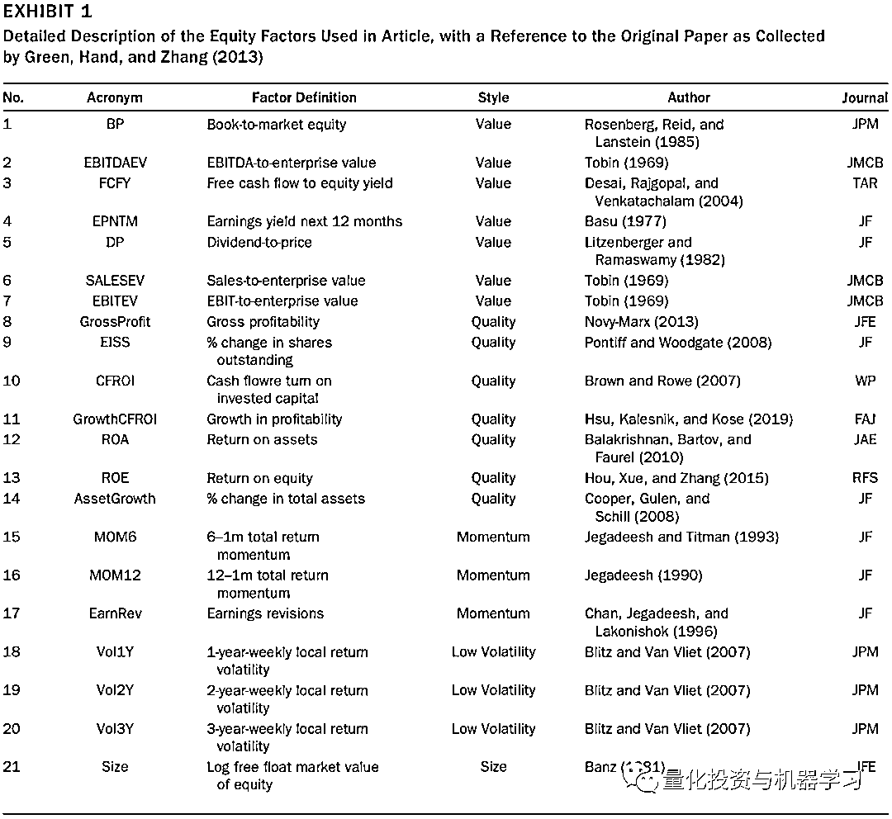

# 

**实证**

## 

**数据**

**作者选取了 FTSE 发达国家指数的成分股作为股票池，选取这个股票 1994 年 7 月至 2018 年 2 月，每月末的数据（包含以上 21 个因子）**，这个股票池包含大约 2000 个中大盘的股票。

## 

**验证方法**

采用以下公式（等式 1）对因子进行**行业内标准化**，对每个月末某行业 i 内的所有股票，标准化后的因子为因子原始值减去原始值中位数，再除以 k 倍的行业内因子的 MAD，其中 k 为 1.4826（参考 Rousseeuw and Croux 1993）。<embed style="vertical-align: -2.418ex;width: 37.639ex;height: auto;max-width: 300% !important;" src="https://mmbiz.qlogo.cn/mmbiz_svg/a18XcQ1EBBgzgouRoaMcibF6ribPzeE0IRiakMtt5xgkTwUibB4NicSyCEmTAEt9HbXwvaAcsWuaZVnEtd4yXB6c2BbxTrmdib42Oo/0?wx_fmt=svg" data-type="svg+xml">

作者也尝试了其他标准化的方法，不同方法的结果没有很大的区别，但等式(1)的方法对于异常值更稳健。在后文中，该方法计算出来的因子称为**行业内因子**（within-industry factor)。这样经过标准化处理后的因子就可以跨行业比较的。为了研究行业本身的影响，作者又定义了**跨行业因子**（across-industry factor），这个因子的作用是包含行业暴露的信息，该因子定义如等式(2)：

<embed style="vertical-align: -0.869ex;width: 31.252ex;height: auto;max-width: 300% !important;" src="https://mmbiz.qlogo.cn/mmbiz_svg/a18XcQ1EBBgzgouRoaMcibF6ribPzeE0IRkibjPmGdZ6Iic5gFnpk5IvEqDo50j8ibPWE3N9khPyVtwSzINPzDg3icvnOichEmIibg7s/0?wx_fmt=svg" data-type="svg+xml">

为了研究行业暴露对不同因子的影响，作者定义了以下符合因子，该因子为等式(1)和(2)两者的线性加权，其中 w 的取值范围为 0 到 1，通过 w 的变化我们可以定量的研究不同因子与行业暴露的关系（如图 3 示例）。**w 越大，行业内因子比重越大，行业暴露的影响占因子的比重越小；w 越小，跨行业因子比重越大，行业暴露的影响占因子的比重越大。**

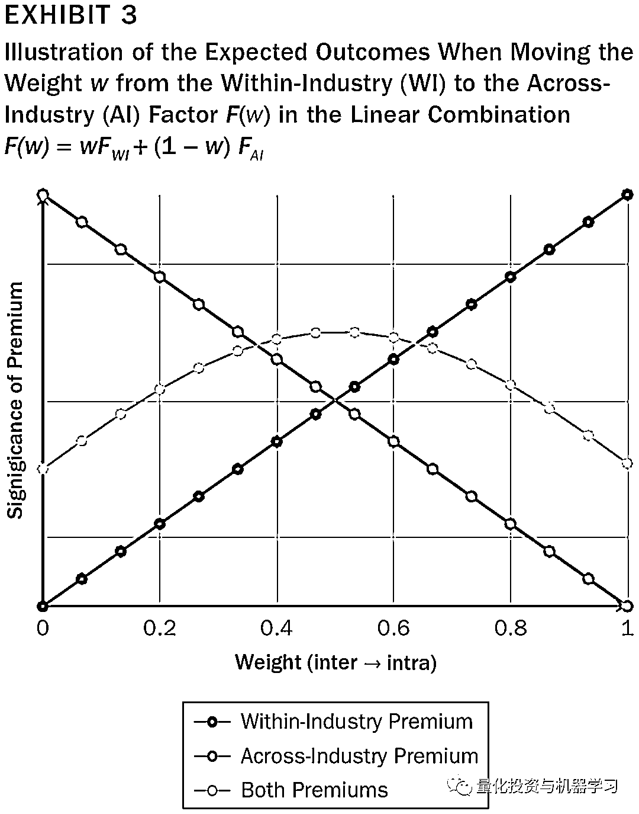在具体研究每个因子与行业暴露的关系时，采用了如等式(4)的截面回归的方法 (Fama and MacBeth 1973) ：<embed style="vertical-align: -0.566ex;width: 43.704ex;height: auto;max-width: 300% !important;" src="https://mmbiz.qlogo.cn/mmbiz_svg/a18XcQ1EBBgzgouRoaMcibF6ribPzeE0IRkdJLK35IQFW3djml0Zju8YMoZFxj3YgCcuOm807jGCWEslJ7avC4TQgicGrVHsKcia/0?wx_fmt=svg" data-type="svg+xml"><embed style="vertical-align: -0.583ex;width: 35.274ex;height: auto;max-width: 300% !important;" src="https://mmbiz.qlogo.cn/mmbiz_svg/a18XcQ1EBBgzgouRoaMcibF6ribPzeE0IROkNqX1qYiaL5YWQOr0O3jYdjTsIckUUH0cibSnlWVIXQgmuUUf4cFfoXeIb1BLhicI6/0?wx_fmt=svg" data-type="svg+xml">

其中 controls 为控制变量，作者选取了五类风格因子作为控制变量，包括 value, quality, momentum, low-volatility, 和 size。**如 momentum 的控制变量计算方式如下，将 momentum 类里的三个因子计算排序后取平均值，再计算排序**，这样做的一个目的是减少变量的数量，控制多重共线性。如果所分析的因子属于五类风格因子，则在控制变量中去除这一类风格因子。

<embed style="vertical-align: -0.816ex;width: 71.658ex;height: auto;" src="https://mmbiz.qlogo.cn/mmbiz_svg/a18XcQ1EBBgzgouRoaMcibF6ribPzeE0IR5shXJ7Bv0tNGODPtXseCk1c1RxcwHpL13uvB4Ffu31DB832w540a55EYVZCtCjLB/0?wx_fmt=svg" data-type="svg+xml">最终，把测试期间每个因子的回归系数的 t 统计量的平均值作为测试结果，关于这个 t 统计量的解释如下，参考图 3：

1、如果靠近 w=0 端（最左端），t 统计均值大于 2，说明因子显著性与行业暴露关系不大,因子收益不受行业暴露影响。

2、如果靠近 w=1 端（最右端），t 统计均值大于 2，说明因子显著性与行业暴露关系非常明显，因子收益主要受行业暴露影响。

3、如果两端的 t 统计均值都大于 2，说明因子显著性与行业暴露及因子值本身的关系都比较明显。

**结果分析**

**Value 因子**

作者一共测试了以下 7 个 Value 因子，结果如图 5 所示，其中蓝色横线为通过原始因子值回归计算的 t 统计量。

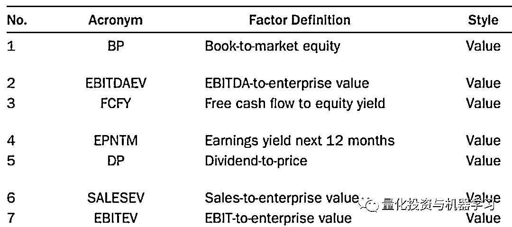

可以发现：

*   随着 w 的增加，t 统计量整体呈上升趋势，说明当因子进行行业中性化之后，因子的显著性增加。也就是说，利用 Value 因子，并没有选行业带来的 Premium，大部分是选股票带来的 Premium。（Value 因子没有选取行业的能力）

*   不同的 Value 因子，表现比较一致。

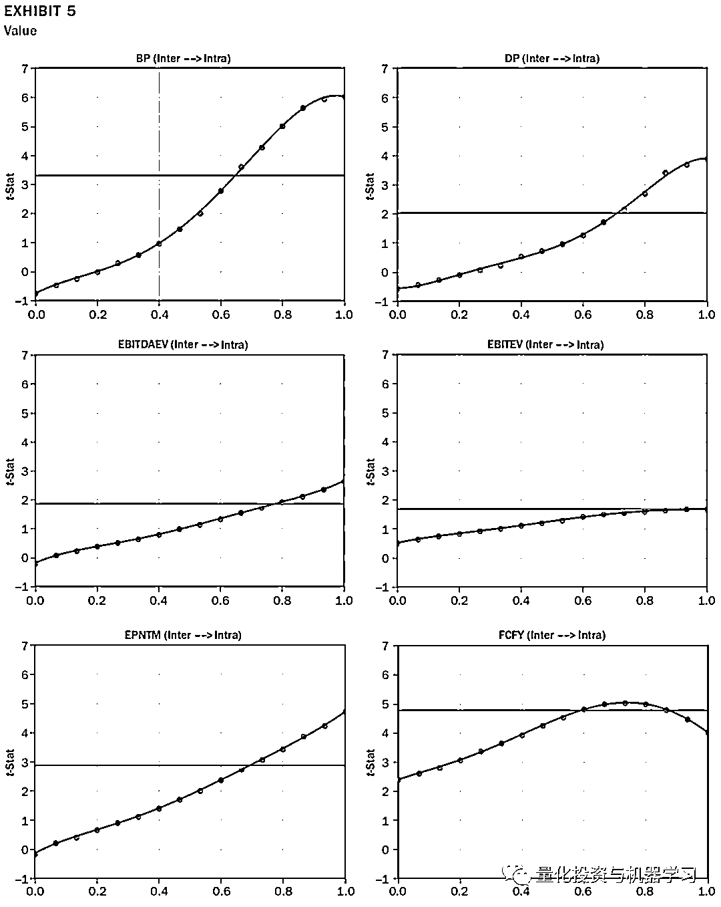

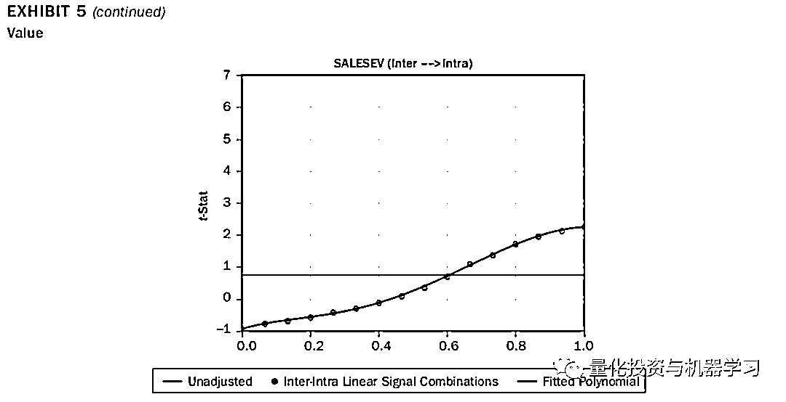

**Quality 因子**

不同 Quality 因子的结果之间有很大的差别，不如 Value 因子的表现那么一直：

*   ROA、ROE、negEISS 随着 w 的增加，t 统计量单调的降低，说明当因子进行行业中性化之后，因子的显著性降低。也就是说，利用 Quality 因子，可以获得选**行业带来的 Premium，行业暴露有利于因子表现**。但对于 ROE，随着 w 的增加，t 统计量并没有显著的降低，说明因子显著性与行业暴露及因子值本身的关系都比较明显。

*   不同定义的 Quality 因子的表现也比较分化，这很可能是因子关于 Quality 的定义有不同的分类，比如有的从利润的角度，有的从成长的角度。

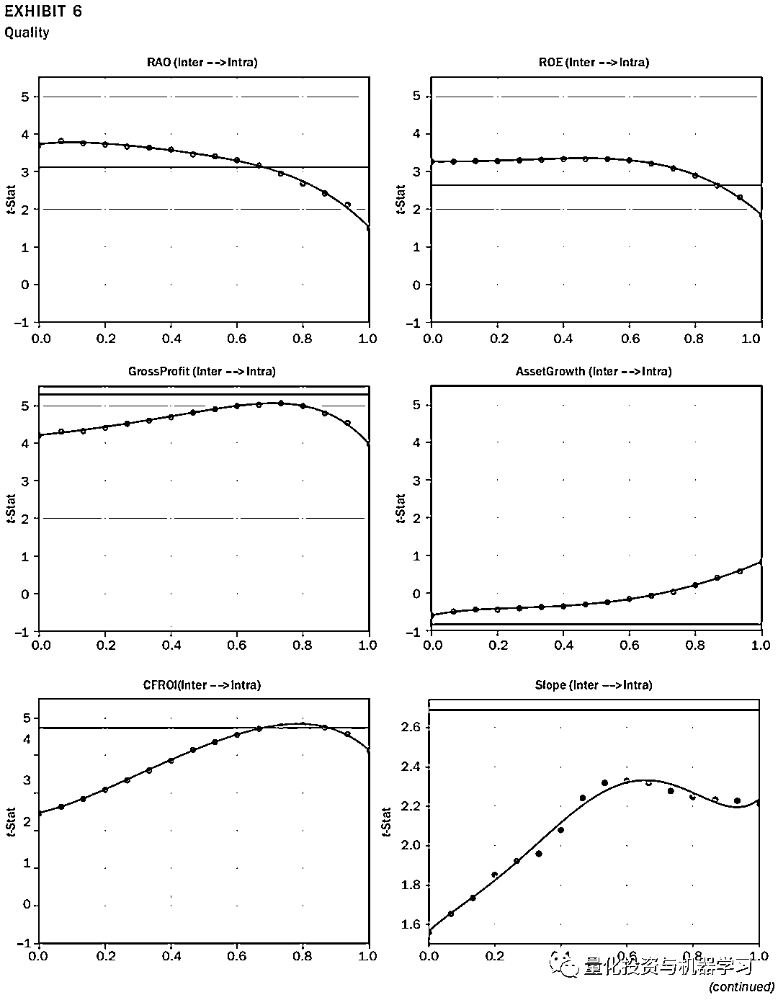

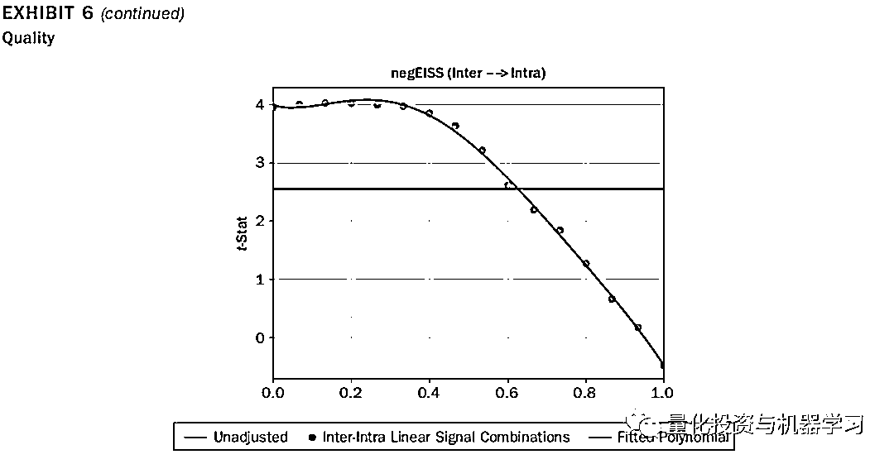

**Momentum 因子**

Momentum 因子的表现也有很大差别：

*   短期动量因子主要靠行业暴露，如 MOM6 因子；

*   长期动量因子的收益来自行业暴露和因子本身，如 MOM12 因子；

*   而分析师关于盈利的调整则与行业暴露无关。

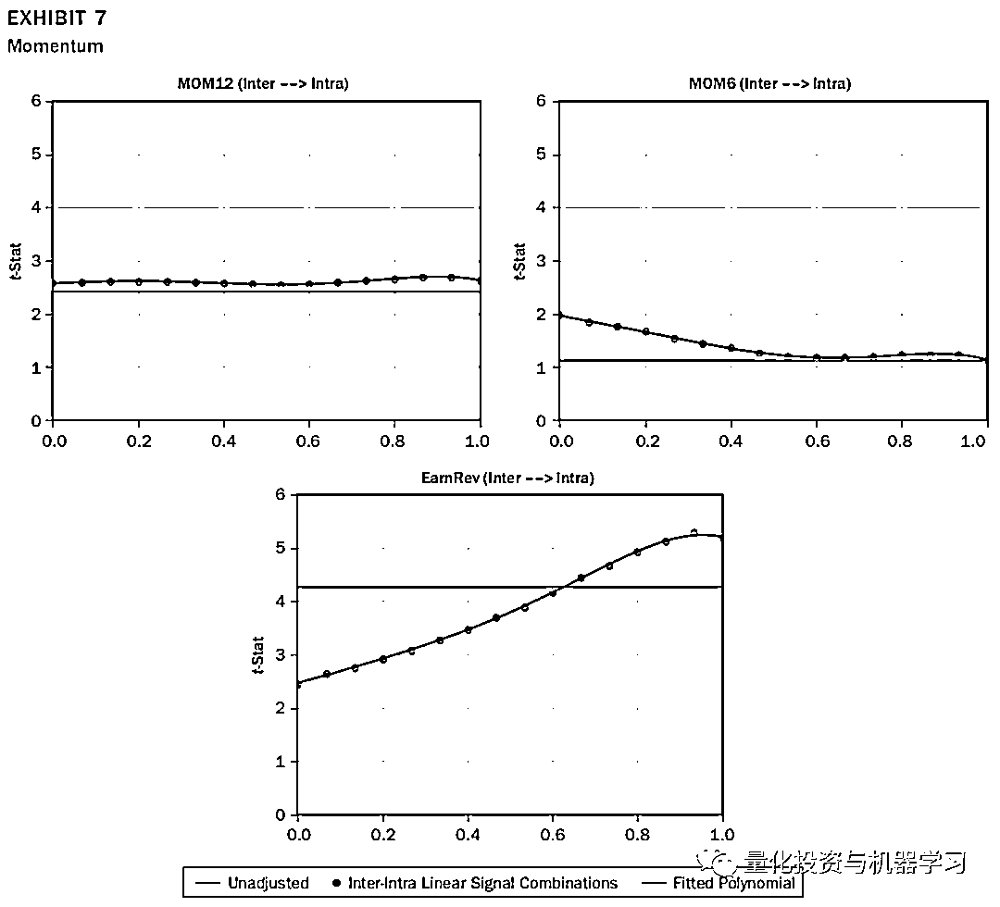

**Low Volatility 因子**

低波动因子的定义主要是时间长度的区别，作者分别计算了过去 1 年、2 年及 3 年的波动因子。可以发现，低波动因子的表现比较一致。**随着 w 增加，t 统计量单调上升，也就是说对于低波动因子，行业暴露对于因子收益显著性的影响比较大。**

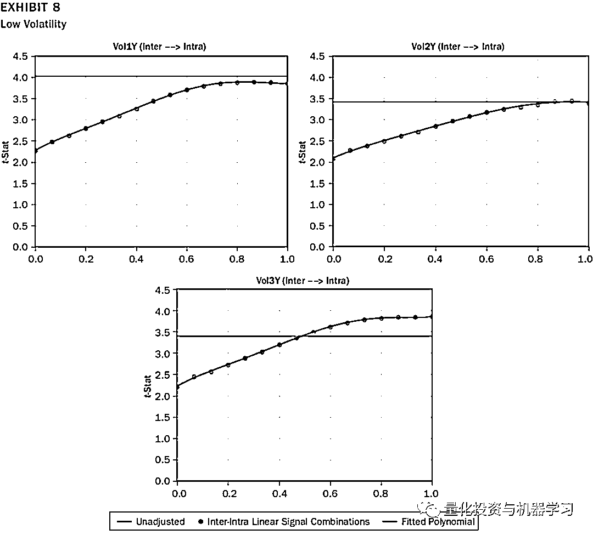

**Size 因子**

规模因子就只有一个定义，就是市值的对数，可以发现，规模因子，**随着 w 增加，t 统计量单调上升，也就是说对于低波动因子，行业暴露对于因子收益显著性的影响比较大。**

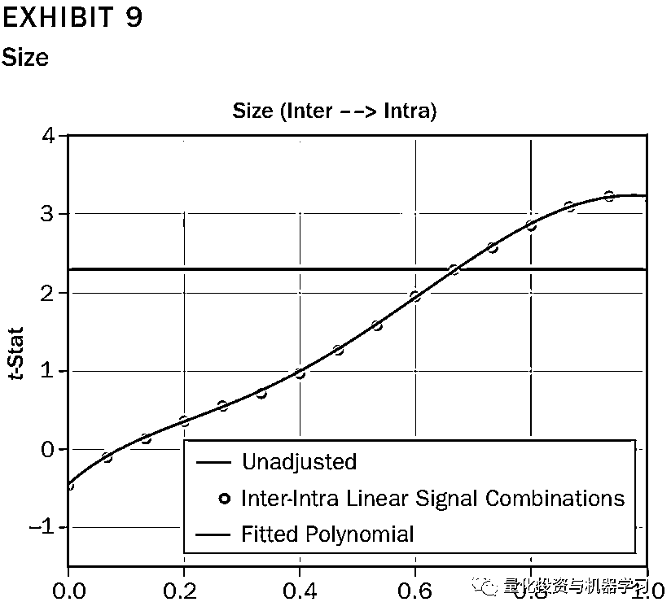

**总结**

下表 4 及图 10 给出了分组测试的结果，及所有 21 个因子 t 统计的汇总，通过以上研究，得出以下结论：

*   大部分大类因子都有行业暴露的倾向，行业暴露对有些因子有利，对有些因子会增加风险；

*   即使是同一类大类因子，不同定义下，因子的表现也不一致；

*   因子模型中，对于行业暴露的控制可以精细化到不同的因子中，而不要一刀切的对所有因子进行行业中性化。

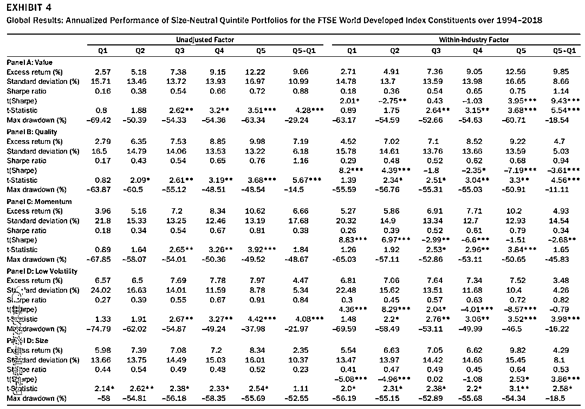

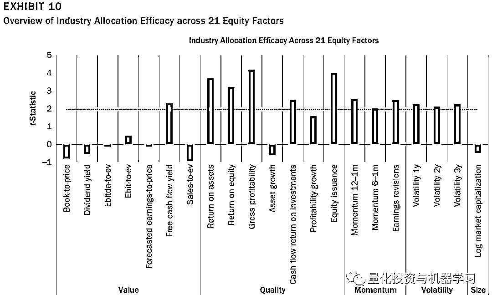