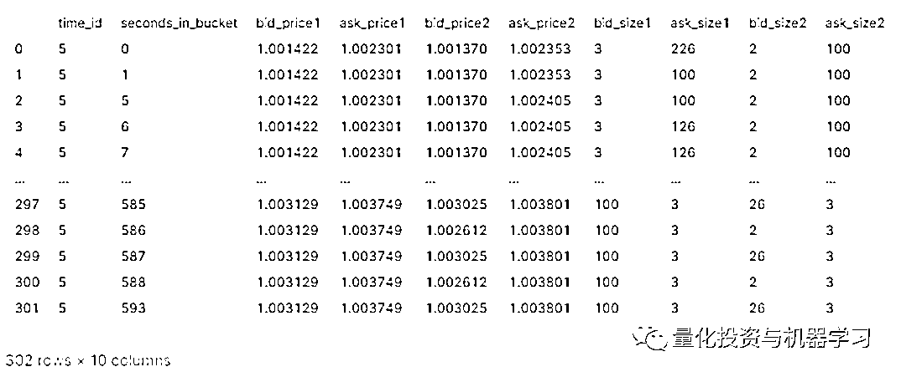
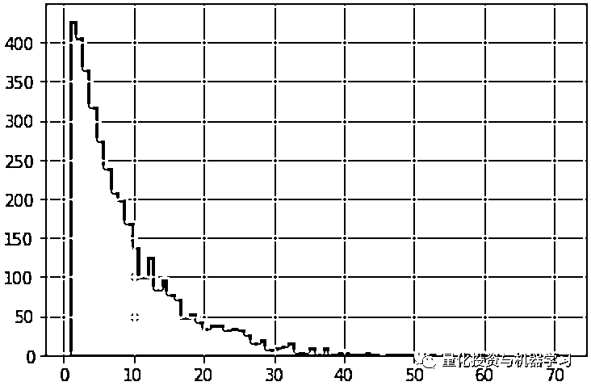

# Optiver 波动率预测大赛系列解读一：相关概念及数据介绍

> 原文：[`mp.weixin.qq.com/s?__biz=MzAxNTc0Mjg0Mg==&mid=2653321155&idx=1&sn=6d85735080d3e7120a5b1c3922477571&chksm=802db5d6b75a3cc081d224bc303b8067fbe5f1acc7b5c7dbad9f961a596b96c6e5331123fb3e&scene=27#wechat_redirect`](http://mp.weixin.qq.com/s?__biz=MzAxNTc0Mjg0Mg==&mid=2653321155&idx=1&sn=6d85735080d3e7120a5b1c3922477571&chksm=802db5d6b75a3cc081d224bc303b8067fbe5f1acc7b5c7dbad9f961a596b96c6e5331123fb3e&scene=27#wechat_redirect)

# 


量化投资与机器学习微信公众号，是业内垂直于**量化投资、对冲基金、Fintech、人工智能、大数据**等领域的主流自媒体。公众号拥有来自**公募、私募、券商、期货、银行、保险、高校**等行业**20W+**关注者，连续 2 年被腾讯云+社区评选为“年度最佳作者”。

Optiver 波动率预测大赛于上个月 27 号截止提交，比赛终于告一段落，等待着明年 1 月份的最终比赛结果。Kaggle 上，由财大气粗的对冲基金大佬主办的金融交易类预测大赛，总能吸引大量的人气。在过去 3 个月的比赛中，也诞生了很多优秀的开源代码，各路神仙应用各种模型算法，在竞争激烈的榜单你追我赶。

关于这个比赛，网络上陆陆续续也有很多参赛经验的分享。但为了充分吸收大神们的精髓，公众号还是决定从 0 到 1 解读各种不同类型的开源比赛代码，方便小伙伴们学习归纳，并应用到实际研究中去。本系列大概安排内容如下：

*   **第一篇：相关概念及数据介绍，简单的 EDA 分析**

*   第二篇：初次尝试，LightGBM 模型及特征工程

*   第三篇：首次开源的金牌代码

*   第四篇：独门绝技，TabNet

*   第五篇：登顶在即，图神经网络助力

Optiver 官方提供了一个关于本次比赛相关金融概念及数据得介绍文档，作为本系列的第一篇文章，我们以这个文档为参考，对这次得波动率预测比赛做一个介绍。

**相关概念**

**订单簿（Order Book）**

订单簿是指股票（或其他资产）交易时按照价格优先的顺序将买卖订单进行排序的订单序列，每个价格水平都有对应的买卖订单的数量（如下图所示），其中 bid 为买量，ask 为卖量。


**成交（Trade）**

订单簿只是一种成交的倾向或意图，当买卖双方的限价单的价格一致时，该笔订单就可以成交。例如，你想要买 20 股，当前最低卖价为 148，卖量为 221。如果你的买单价格也是 148，那你这笔订单就可以成交。成交后，订单簿就更新到如下图所示，148 价位的卖量还剩 201（221-20）。


由此产生了如下成交记录：**20 股股票 A 以 148 价格成交**

订单簿与成交数据都是策略研究中非常重要的原始数据，策略研究员可以利用这些数据构建大量的因子或特征，来预测未来股票的价格或波动率。

**做市商与市场有效性**

假设有一天，股票 A 的订单簿变成如下图所示，可以发现，当前该股票时缺少流动性的。这时如果你想以 148 的价格买 20 股是没法成交的，因为没有对手方。而做市商的主要职责就是为市场提供流动性，他们通常会双边报价（同时报买价及卖价），所以有了做市商的参与，市场会变得更有流动性。


**订单簿相关的特征**

根据订单簿及成交记录等原始数据，可以构建大量的特征，这些特征对于高频价格的预测非常有帮助，我们列举了一些常用的特征：

### **bid/ask spread**<embed style="vertical-align: -0.566ex;width: 39.611ex;height: auto;max-width: 300% !important;" src="https://mmbiz.qlogo.cn/mmbiz_svg/a18XcQ1EBBgzgouRoaMcibHeIuaH7UcickR9xsiczg1bSjMLibaicRGPpyGSicMGXJK7NdEf5OuljxNI10Dft25FXnt0hNeZsmuuZF/0?wx_fmt=svg" data-type="svg+xml">最优卖价与最优买价之间的差除以最优买价。

**Weighted averaged price**

基于 Order Size 的加权平均价（WAP），在本次比赛中也是基于 WAP 计算已实现波动率（Realized Volatility）作为预测目标。<embed style="vertical-align: -1.891ex;width: 55.453ex;height: auto;max-width: 300% !important;" src="https://mmbiz.qlogo.cn/mmbiz_svg/a18XcQ1EBBgzgouRoaMcibHeIuaH7UcickoCeicLnSjq9BCSkzDtTOvOqnK47nicSiatcPByQeuIktcxcaGaclOUYNrJgkrzlyOFV/0?wx_fmt=svg" data-type="svg+xml">注意：这里给到的公式用的是 BidPrice 乘以 AskSize，**第一次看到这个公式，大部分人会以为写错了，直觉上应该是 bidprice*bidsize**。作者再原始 Notebook 的评论区给了个例子：如果买单远大于卖单（bid_size>>ask_size)。那么正常的逻辑是股价应该上涨，WAP 价格应该更靠近卖价。具体看以下例子：

假设当前最优买卖价格及订单量如下：

> BidPrice1 = 90，BidSize1 = 90，AskPrice1 = 100，AskSize1 = 10
> 
> 按照以上公式计算 WAP =(90*10+100*90)/(90+10) = 99；
> 
> 如果按照 bidprice*bidsize 计算 WAP = (90*90+100*10)/(90+10) = 91；
> 
> 逻辑认为 99 更能反应当前市场状态，因为买单远大于卖单，价格很可能会快速上涨。

当然，也有文献中使用 bidprice*bidsize，但作者认为这个定义更合适。

**已实现波动率（Realized Volatility）**

Optiver 是著名的期权做市商，而波动率作为期权定价的重要因素，有效的预测波动率成了本次比赛最首要的目标。本次比赛中，需要参赛者基于每 10 分钟的历史订单簿及成交数据，预测下一个 10 分钟的已实现波动率。已实现波动率的定义如下：其中 r 是基于前文 WAP 价格计算的对数收益率。

**比赛数据**

本次比赛一共提供了以下数据文件：

*   book_train/test：训练/测试的订单簿数据

*   trade_train/test：训练测试的成交数据

*   test.csv：测试集

*   train.csv：训练数据集对应的预测目标

*   sample_submission：规定了提交的格式

**订单簿数据(book_train/test)**

订单簿数据有每只股票每个时间的前**两档买卖价及对应的量，及该时间点在当前的 bucket 对应的秒数（seconds_in_bucket)，相关字段说明如下：**

*   stock_id - 股票 ID

*   time_id -  时间 Bucket 的 ID

*   seconds_in_bucket - 当前 Bucket 的秒数，从 0 开始

*   bid_price[1/2] - 第一档买价（标准化后）

*   ask_price[1/2] - 第一档卖价（标准化后）

*   bid_size[1/2] - 第一档买量

*   ask_size[1/2] - 第一档卖量


**成交数据(trade_train/test）**

相关字段说明如下：

*   stock_id - 同上

*   time_id - 同上

*   seconds_in_bucket - 同上

*   price - 平均成交价

*   size - 成交量

*   order_count - 成交的订单量


**Target 数据（train.csv）**

train.csv 文件里包含了每个股票每个 time_id 需要预测的下个时间窗口（下一个 10mins）的已实现波动率（下表 target 字段所示）。


*   stock_id - 同上

*   time_id - 同上

*   target - 对应的下个 10mins 数据计算的已实现波动率 

**Target 数据（test.csv）**

test.csv 是测试数据集，包含了 stock_id，time_id 及 row_id，其中 row_id 是 stock_id 和 time_id 的组合，如 stock_id 为 0、time_id 为 4 时，row_id 为 0-4。row_id 是为了与最终需要提交的文件进对应，也就是说在最终需要提高的文件中需要给出每个 row_id 对应的 target，也就是已实现波动率。


**最终需要提交的数据格式**


**EDA：数据初探**

**读取样例数据**

订单簿和成交数据都是 parquet 格式，可以直接用 pandas 读取，下面读取 train.csv，及 stock_id 为 0 的订单簿和成交样例数据。

```py
train = pd.read_csv("../input/optiver-realized-volatility-prediction/train.csv")
book_example = pd.read_parquet('../input/optiver-realized-volatility-prediction/book_train.parquet/stock_id=0')
trade_example = pd.read_parquet("../input/optiver-realized-volatility-prediction/trade_train.parquet/stock_id=0"
```

统计一共有 112 个股票：

```py
print("stock_id:",len(train["stock_id "].unique()))
stock_id : 112
```

**买卖价可视化**

选取 book_example 中 time_id=5 的数据（每个 time_id 对应 1 个 10min 的时间区间）：

```py
book_test = book_example[book_example["time_id"]==5
```



可以发现，基本每秒都有记录，对其中 bid_price1\bid_price2\ask_price1\ask_price2 分别作图，可以发现在这个 10 分钟内，四个价格整体趋势一致，局部区间会出现不同的价格走势。

```py
samples = ["bid_price1","bid_price2","ask_price1","ask_price2"]
plt.figure(figsize=(20,5))
for num,a in enumerate(samples):
   plt.plot(book_test["seconds_in_bucket"],book_test[a],label=a)
plt.legend(fontsize=12)
```


同样，选取 trade_example 中 time_id=5 的数据（每个 time_id 对应 1 个 10min 的时间区间），相比 book 数据，trade 数据就显得稀疏的多，并不是每秒都有成交：

```py
trade_test = trade_example[trade_example["time_id"]==5]
trade_test.head(5)
```


把成交价加入到上图中，下图紫色的粗线是当时真实的成交价格：

```py
plt.figure(figsize=(20,5))
for num,a in enumerate(samples):
    plt.plot(book_test["seconds_in_bucket"],book_test[a],label=a)
plt.plot(trade_test["seconds_in_bucket"],trade_test["price"],label="trade_parquet",lw=10)
plt.legend(fontsize=12)
```


由以下代码可知：

*   训练数据中每个股票的 time_id 都是一样的

*   每个股票有 3830 个 time_id，其中 time_id 最大值 32767，**也就是说每只股票大概涉及了 3 年的历史数据**

*   time_id 之间的间隔分布如直方图所示

```py
df_sample0 = train.query("stock_id==0")
df_sample10 = train.query("stock_id==10")
id_is_same = (df_sample10['time_id'] - df_sample0['time_id']).abs().sum()

print("id_is_same : {}".format(id_is_same))
print("max_time_id: {}".format(df_sample0['time_id'].max()))
print("count_time_id: {}".format(df_sample0['time_id'].nunique()))

# 输出
id_is_same : 0.0
max_time_id: 32767
count_time_id: 3830

# time_id 之间间隔直方图
df_sample0['time_id'].diff().hist(bins=70)
```



**总结**

通过以上分析，我们对比赛有了大概的了解：

1、训练数据给出了 112 只股票过去 32767 个 10 分钟片段抽样出来的 3830 个 10 分钟片段的数据；

2、每个 10 分钟片段对应一个 time_id，数据有这 10 分钟内的订单簿数据（前两档的买卖价和量），及这 10 分钟内的成交数据；

3、同样给出了每个 time_id 对应下个 10 分钟的 target（已实现波动率）；

4、需要基于这些数据构建一个预测模型，用于预测某个股票未来 10 分钟的已实现波动率。

看到这里，不知道各位小伙伴对于模型有没有任何的思考？这其中实际上存在了许多需要解决的问题：

1、每只股票的训练数据是不连续的，至少直觉上，无法采用滚动时间窗口方法进行预测；

2、每个 time_id 内的 book 和 trade 也不是每秒都有数据，而且两者的稀疏程度也不一样。

下一篇，我们将通过一个简单的 LightGBM 去探索这个问题最直观的解决思路。

*参考：*

*https://www.kaggle.com/jiashenliu/introduction-to-financial-concepts-and-data*

*https://www.kaggle.com/chumajin/optiver-realized-eda-for-starter-english-version*