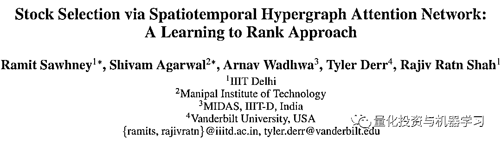

# AAAI 2021：仅有的 8 篇量化投资论文（论文+代码）

> 原文：[`mp.weixin.qq.com/s?__biz=MzAxNTc0Mjg0Mg==&mid=2653321120&idx=1&sn=7c814886c2f0e179ebbc36417097749a&chksm=802db5b5b75a3ca3d13a8a8faab4b9910a1ce9532b2a28ad044c131066974633c972ea57f102&scene=27#wechat_redirect`](http://mp.weixin.qq.com/s?__biz=MzAxNTc0Mjg0Mg==&mid=2653321120&idx=1&sn=7c814886c2f0e179ebbc36417097749a&chksm=802db5b5b75a3ca3d13a8a8faab4b9910a1ce9532b2a28ad044c131066974633c972ea57f102&scene=27#wechat_redirect)

# 

量化投资与机器学习微信公众号，是业内垂直于**量化投资、对冲基金、Fintech、人工智能、大数据**等领域的主流自媒体。公众号拥有来自**公募、私募、券商、期货、银行、保险、高校**等行业**20W+**关注者，连续 2 年被腾讯云+社区评选为“年度最佳作者”。

**前言**

AAAI 的英文全称是 Association for the Advance of Artificial Intelligence，美国人工智能协会。该协会是人工智能领域的主要学术组织之一，其主办的年会也是人工智能领域的国际顶级会议。在中国计算机学会的国际学术会议排名以及清华大学新发布的计算机科学推荐学术会议和期刊列表中，AAAI 均被列为人工智能领域的 A 类顶级会议。

作为全球人工智能顶会之一，虽然受到疫情影响，但 AAAI 2021 的热度仍然不减。**本届会议一共收到了** **9034** **篇的提交论文。其中，来自中国的** **3319** **篇论文数量几乎是美国（1822 篇）的两倍。在最终** **7911** **篇经过评审的论文中，共有** **1692** **篇被接收。**

在这 1692 篇被接收的论文中，**有 8 篇与量化投资相关**，公众号注意到其中大部分论文的作者来自国内高校：**有西南财经大学、上海交通大学及中国科学技术大学**。

下面我们对每篇文章做一个简要的介绍，**并在文末把 8 篇论文打包好，供各位小伙伴在国庆期间好好学习，天天向上。**

**第一篇**

在金融领域，上市公司的动量溢出效应得到了广泛的认同。但只有很少的研究预测了一个企业与其相关企业在动量溢出上的传导效应。通常的做法是用一些**事先定义的公司间的关系**，构建一个图卷机网络模型（GCNs）来预测公司间的动量溢出。然而，动量溢出会通过企业间多种不同的关系进行传播，其不同关系的重要性也会随时间而变化。限制在几个预先定义的关系不可避免地会产生噪音，从而误导股票预测。

此外，传统 GCNs 对于邻节点公司的消息进行传递与聚合时，不会考虑关联公司的状态 。这个问题使得传统的 GCNs 不适合处理上市公司的属性敏感的动量溢出问题（注：动量溢出收到公司其他特征的影响）。在本研究中，我们提出一个属性驱动的图形注意网络(AD-GAT)来解决动量溢出模型中的这两个问题。这是一种**通过对关联企业的属性与来源企业的属性进行相乘以后进行非线性变换的方法**，以考虑其属性敏感的动量溢出，并应用无掩饰注意力机制，通过一种新型的基于张量的特征提取器，从观察到的市场信号中推断企业间的动态关系。对 S&P 500 指数三年期数据的实验表明，该框架优于最先进的算法，包括 GCN、 eLSTM 和 TGC。

**什么是动量溢出效应？**

海外研究发现，基本面相似或关联的公司间存在动量溢出效应（momentum spillovers）：投资者在处理信息时的注意力有限，当一家公司股价受到外在冲击后，信息并不会迅速传递至相似或关联公司。在信息的传递过程中，相关公司的股价间会形成领先-滞后效应（lead-lag effects）。这种领先-滞后关系，往往以动量的形式存在，即动量溢出效应。

#### 

**相关代码**

*https://github.com/RuichengFIC/ADGAT*

**第二篇**

作为算法交易中的一个基本问题，指令执行的目的是完成一个特定的交易指令。为了实现有效的执行策略，近年来，由于交易执行优化本身是一个序列决策最优化的问题，研究的重点从基于模型的市场假设的分析视角向无模型视角的转变，即强化学习。然而，由于市场信息的嘈杂且不完善使得建立有效的强化学习以实现有效的订单执行策略变得相当具有挑战性。在本文中，我们提出了一个新的通用交易决策优化框架，以弥补噪声但不完善的市场状态和最优订单执行序列之间的差距。**特别是，这个框架利用了一种策略蒸馏的方法，这种方法能够使用具有市场完整信息的老师策略来指导一个 Student 策略学习，从而实现最优执行。**实验表明，该方法的表现优于各种强大的 Baseline 模型。

#### 

**相关代码**

*https://seqml.github.io/opd*

**第三篇**

深度学习技术的最新发展促进了机器学习辅助股票交易策略的深入研究。然而，由于金融市场具有高度非平稳性质，阻碍了典型数据匮乏的机器学习方法的应用，利用金融归纳偏差对于确保更好的样本效率和鲁棒性非常重要。在本研究中，我们提出了一种基于预测残差因子的分布来构建投资组合的新方法，该方法对于对冲常见市场因子的风险敞口通常是有用的。该方法的关键技术构成有两部分：**首先，作者介绍了一种高效率计算与提取残差信息的方法，该方法易于与各种预测算法相结合。**其次，我们提出了一种新的神经网络结构，使我们能够融合广泛认可的金融归纳偏差，如振幅不变性和时标不变性。我们用美国和日本的股票市场数据证明了我们方法的有效性。通过消融实验，我们也验证了每一种技术都有助于提高交易策略的性能。我们预计我们的技术将在各种金融问题上有广泛的应用。

**第四篇**

量化交易和投资决策是复杂的金融任务，依赖于准确的股票选择。尽管深度学习在复杂和高度随机的股票预测问题上取得了显著进展，但依然面临两个显著的局限性。他们没有直接从收益角度优化投资目标，而是把每只股票视为相互独立的，忽略了相关股票价格动态之间的丰富信号。基于这些局限性，我们将股票预测重新定义为一个学习排序问题，并提出 STHAN-SR 模型，**一种用于股票选择的神经超图结构。我们工作的关键是通过超图与 Hawkes 注意力机制构建了一种新的时空注意超图网络结构，这种结构能够考虑到股票间的复杂关系。**利用这个模型，我们可以在对股票排序进行预测的同时考虑到股票间的关系及股价的动态变化。通过对三个市场超过 6 年的数据进行的实验，表明 STHAN-SR 显著优于最先进的神经股票预测方法。我们通过对 STHAN-SR 的空间和时间成分的探索性分析来验证我们的设计选择，并证明了其实际适用性。

#### 

**相关代码**

*https://github.com/midas-research/sthan-sr-aaai*

**第五篇**

在订单驱动的金融市场中，金融资产的价格是通过订单(以特定价格买进或卖出的请求)的交互作用发现的，这些订单被发布到公开的限价订单簿(LOB)上。因此，LOB 数据对于建模市场动态非常有价值。然而，LOB 数据并不是可以自由访问的，这对希望利用这一信息的市场参与者和研究人员提出了挑战。幸运的是，交易和报价(TAQ)数据，以及在市场中执行的交易——更容易获得。在本文中，我们提出了 LOB 重现模型，这是第一次仅使用 TAQ 数据从深度学习的角度来重现股票 LOB 的前 5 个价格水平。该模型由以下部分组成：

**1、历史编译****器，它使用一个 gate recurunit (GRU)模块选择性地编译预测相关的报价历史；**

**2、市场事件模拟器，利用常微分方程递归神经网络(ODE-RNN)模拟净订单量的累积；**

**3、一个加权方案，自适应地结合(1)和(2)产生的预测。**

通过迁移学习的范式，在一只股票上训练的源模型可以被微调，使其能够应用到对额外数据需求更低的其他同类金融资产。在两个真实世界的日内 LOB 数据集上进行的综合实验表明，该模型仅以 TAQ 数据为输入，就能高效、高精度地重建 LOB。

**第六篇**

强化学习的投资组合管理是金融科技研究的前沿，它探索了如何通过试验和错误在长期内优化地将基金重新配置到不同的金融资产。现有的方法是不切实际的，因为它们通常假设每次重新分配都可以立即完成，从而忽略了作为交易成本一部分的价格下滑。为了解决这些问题，我们提出了一个分级强化的投资组合管理股票交易系统(HRPM)。具体来说，我们将交易过程分解为交易执行的投资组合管理层次，并训练相应的策略。高级策略以较低的频率给予投资组合权重以最大化长期利润，并调用低级策略以较高的频率在短时间窗口内出售或购买相应的股票，以最小化交易成本。我们通过数据效率的前训练方案和迭代训练方案对两个层次的策略进行训练。在美国市场和中国市场的广泛实验结果表明，HRPM 比许多最先进的方法取得了显著的改进。

**第七篇**

现有的基于强化学习(RL)的投资组合管理模型大多没有考虑市场状态，这限制了它们在风险收益平衡方面的表现。在本文中，我们提出基于深度强化学习方法的 DeepTrader 来优化投资策略。特别地，为了解决风险收益平衡问题，我们的模型嵌入了宏观市场条件作为指标，动态调整多空基金的比例，以负的最大回撤作为回报函数，以降低市场波动的风险。此外，该模型还引入了一个评估单个资产的模块，该以价格上升率作为回报函数，从历史数据中学习动态模式。资产之间的时间和空间依赖关系都是由特定类型的图结构分层捕获的。特别是，我们发现，与行业分类和相关性相比，估计的因果结构更好地捕捉了资产之间的相互关系。这两个模块是互补和整合的，可以产生一个适合市场趋势的投资组合，有效地在回报和风险之间取得平衡。对三个知名股票指数的实验证明了 DeepTrader 在风险收益标准方面的优势。

**第八篇**

在对股票走势预测进行深入研究的同时，由于数据和建模的不确定性，现有工作的泛化程度较低。一方面，以端到端方式对随机股票数据训练股票表示可能导致过度建模，涉及模型的不确定性；另一方面，股票数据与其相关因素的相关性分析涉及到数据的不确定性。为了同时从数据和建模的角度解决这些不确定性，一个基本但具有挑战性的任务是通过考虑从宏观层面到行业和微观层面的层次耦合，以更少的不确定性学习更好的股票表征。为此，我们提出了一种基于 Copula 的对比预测编码(Co-CPC)方法。Co-CPC 首先建立了特定股票部门和相关宏观经济变量之间的依赖关系模型，这些变量是顺序的和异质性的，例如，宏观变量与不同的时间间隔、规模和分布有关。然后，通过引进宏观状态信息，以自我监督的方式学习股票表征，可以进一步用于下游任务，如股票移动预测。在两个典型的股票数据集上的大量实验验证了 Co-CPC 方法的有效性。

#### 

**相关代码**

*https://github.com/goiter/CoCPC*

*https://github.com/yumoxu/stocknet-dataset*

**论文下载**

后台回复：**AAAI-2021**