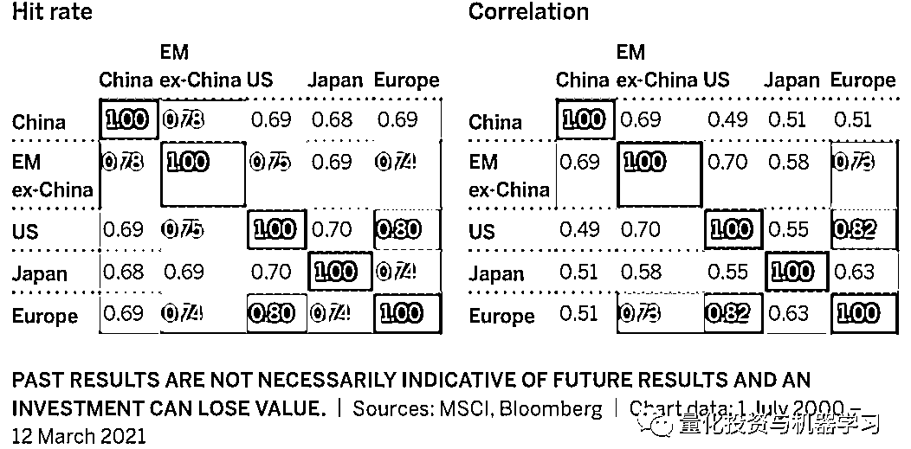
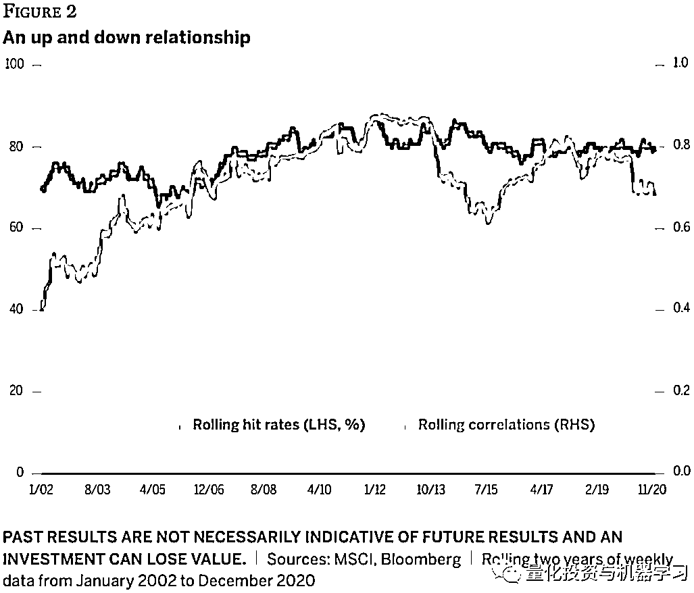
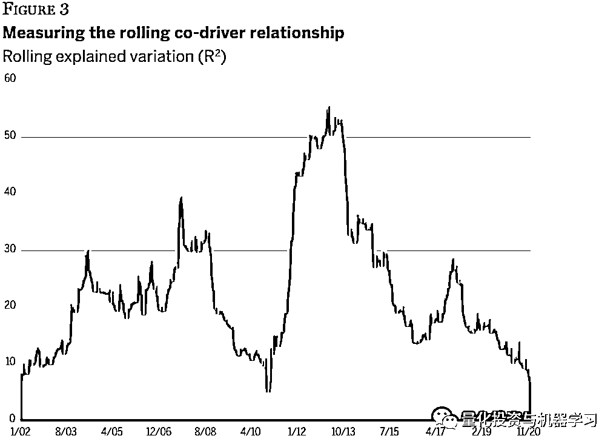
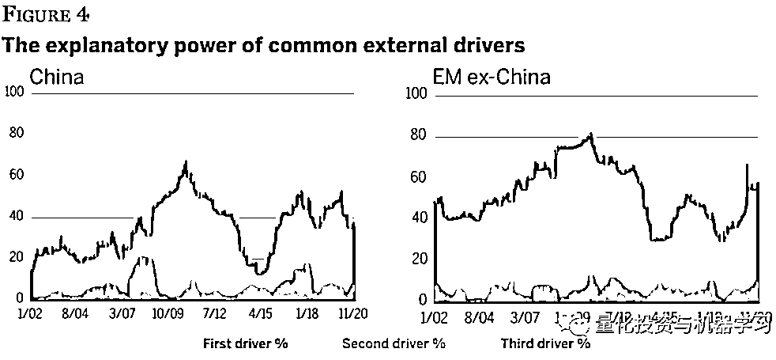
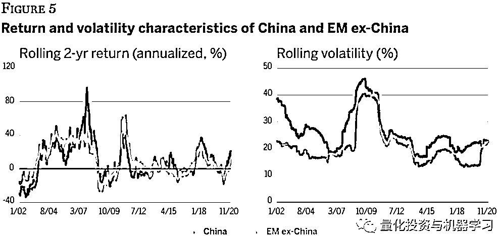
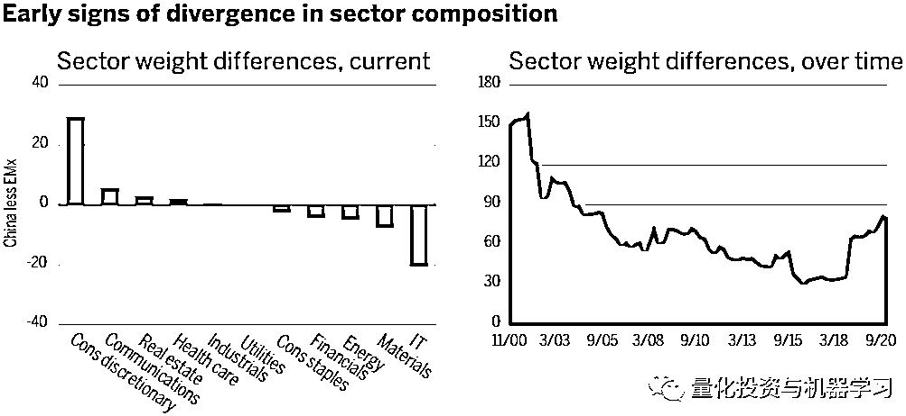
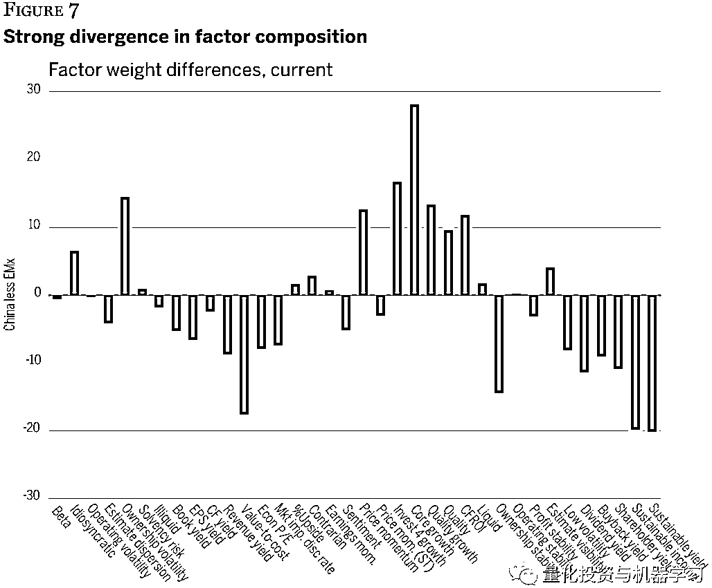
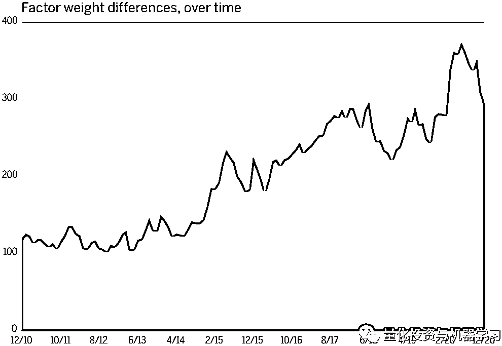
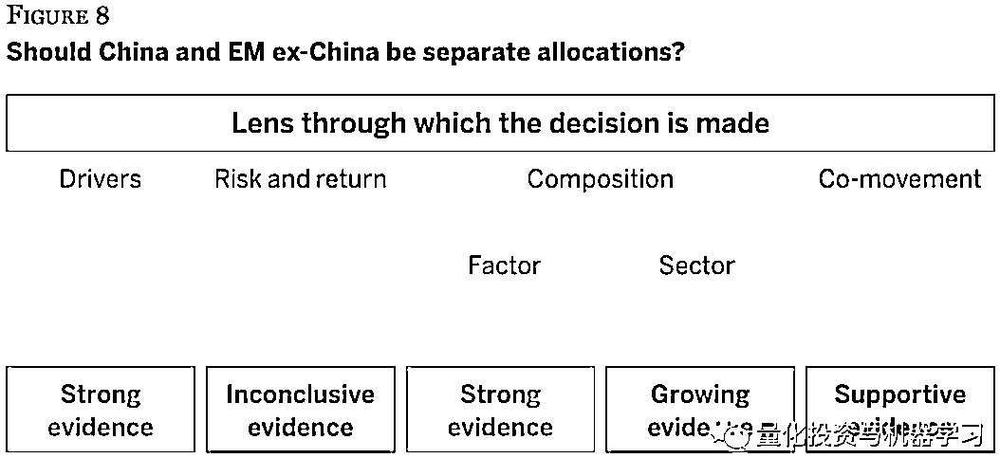

# 定量研究：中国与其他新兴市场的相关性分析

> 原文：[`mp.weixin.qq.com/s?__biz=MzAxNTc0Mjg0Mg==&mid=2653321094&idx=1&sn=a548c34ae45945a3d512d56e2fc74781&chksm=802db593b75a3c85750a5534c85d50811f20381f4b665de7e1d5079cc545eb7a92dd4a7d3f5e&scene=27#wechat_redirect`](http://mp.weixin.qq.com/s?__biz=MzAxNTc0Mjg0Mg==&mid=2653321094&idx=1&sn=a548c34ae45945a3d512d56e2fc74781&chksm=802db593b75a3c85750a5534c85d50811f20381f4b665de7e1d5079cc545eb7a92dd4a7d3f5e&scene=27#wechat_redirect)

# 

量化投资与机器学习微信公众号，是业内垂直于**量化投资、对冲基金、Fintech、人工智能、大数据**等领域的主流自媒体。公众号拥有来自**公募、私募、券商、期货、银行、保险、高校**等行业**20W+**关注者，连续 2 年被腾讯云+社区评选为“年度最佳作者”。

# 

量化投资与机器学习公众号独家解读

**公众号预祝大家国庆快乐****祝愿我们的祖国更加繁荣昌盛** 

量化投资与机器学公众号 *** ***QIML Insight——深度研读系列 ******是公众号今年全力打造的一档**深度、前沿、高水准**栏目。

公众号**遴选**了各大期刊前沿论文，按照理解和提炼的方式为读者呈现每篇论文最精华的部分。QIML 希望大家能够读到可以成长的量化文章，愿与你共同进步。

> **本期遴选论文** **来源：**Wellington Management JULY 2021
> **标题：**Split decision: Should investors separate China from EM equities?
> **作者：**Nick Samouilhan、Cara Lafond、Adam Berger

**前言**

**许多国际投资者在做新兴市场资产配置的时候，正在考虑是否要将中国与其它新兴市场国家分开配置。**分开的理由是基于中国在新兴市场基准指数中的权重日益上升。不过，我们认为，关键的决定点不在于中国在新兴市场指数中的主导地位，而在于中国市场与其他新兴市场(不包括中国)的股票的相似性。如果它们实际上是“相同的东西”，那么仅仅是规模上的差别并不会带来实际的影响。

我们以 MSCI 中国指数和 MSCI 中国以外新兴市场指数为代表，评估了两种配置的相似性。当然，没有两个国家/地区会完全一样，所以我们的重点是相似程度，以及它是否随着时间而变化。我们使用了多种度量指标来衡量相似度，因为我们认识到投资者会根据自己的资产配置方法，选择不同的方式度量其相关性。

总而言之，对与是否要把中国和中国以外的新兴市场分开考虑，不同的度量方式给出了不同的答案：

*   从因子的角度，**强烈支持**分开考虑
*   从板块构成的角度，那么这个决定也是**有利**的
*   如果是基于一些共振性的度量指标，这个决定也是**比较支持**的
*   如果是基于风险收益的相关指标，是**不支持**这个决定的

# 

**共振性**

通过相关系数及“hit rate”等指标（如下图），我们发现中国和其他新兴市场间存在明显的共振性。然而，我们发现在别的市场间，如美国和欧洲市场，也存在明显的共振，但在投资美国和欧洲时，投资者一般倾向分开配置。

我们也发现在中国与其他新兴市场的市场波动并不是一直保持一致：

# 

**收益驱动因素的相似性**

**首先从相互驱动的角度来看**，我们发现两个市场的相互驱动程度在不断在下降。如图 3 所示，对两个市场指数的收益率进行滚动回归，可以发现除了 2010 年至 2014 年 R 平方显著上升之外，特别在最近几年 R 平方在不断的下降。

**然后，再从外部驱动因素的角度来比较。**具体做法如下，首先非新兴市场指数（如日本、欧洲及美国等）进行 PCA 分解，选取前 3 个 PCA 因子；然后用这三个 PCA 因子，分别对中国市场及其他新兴市场指数的收益率进行回归分析。**如图 4 所示，可以发现非新兴市场指数对其他新兴市场的解释度更大。**

# 

**风险收益的相似性**

两个市场各自的风险收益特征在过去变化的比较剧烈，但两者变化的趋势非常类似。图 5 展示了各自两年的滚动收益及滚动波动率，可以看出两者重叠度非常高。**波动率方面，两个市场的整体波动在近些年都在下降，收益率在一个比较窄的区间震荡。**

# 

**行业及因子收益的相似性**

在板块权重方面，如下图所示，左边显示了最近两个市场在不同板块的权重差异（中国减去中国外新兴市场），右边显示了过去 20 年权重的总差异。**可以看出主要差异集中在非必需消费品与 IT 板块，近年的总体差异在下降。**

从因子的角度看，两个市场在因子权重上的差异还是非常明显的，差距最小的因子来自 Beta 及波动等。在过去 10 多年，因子权重的总体差异也在不断的上升。所以如果从因子配置的角度来说，两个市场应该分开配置。

# 

**总结**

通过不同角度的相似性度量，对于是否应该分开配置中国市场及中国外新兴市场这个问题，给出了不同的答案：

*   从因子的角度，**强烈支持**分开考虑

*   从板块构成的角度，那么这个决定也是**有利**的

*   如果是基于一些共振性的度量指标，这个决定也是**比较支持**的

*   如果是基于风险收益的相关指标，是**不支持**这个决定的

