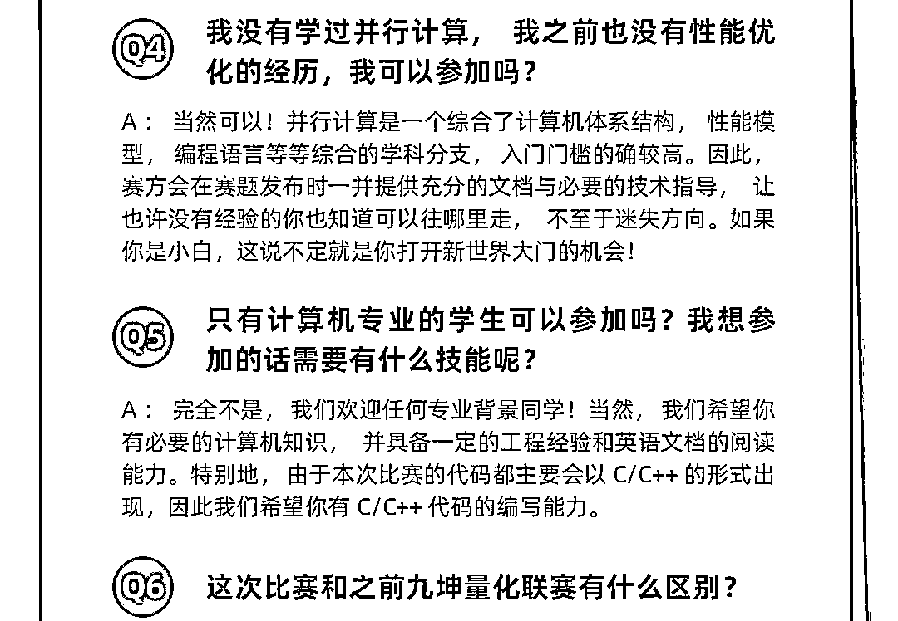

# 第一名 10 万奖金！九坤投资量化新星挑战赛报名倒计时

> 原文：[`mp.weixin.qq.com/s?__biz=MzAxNTc0Mjg0Mg==&mid=2653321035&idx=1&sn=5ca1533d7a9ee0109a5a35d13d70fbee&chksm=802db55eb75a3c48d284071ab3f4c253fdfb57871901faf0aeae53ffb8a6b8827e4090b5c99d&scene=27#wechat_redirect`](http://mp.weixin.qq.com/s?__biz=MzAxNTc0Mjg0Mg==&mid=2653321035&idx=1&sn=5ca1533d7a9ee0109a5a35d13d70fbee&chksm=802db55eb75a3c48d284071ab3f4c253fdfb57871901faf0aeae53ffb8a6b8827e4090b5c99d&scene=27#wechat_redirect)

量化投资与机器学习微信公众号，是业内垂直于**量化投资、对冲基金、Fintech、人工智能、大数据**等领域的主流自媒体。公众号拥有来自**公募、私募、券商、期货、银行、保险、高校**等行业**20W+**关注者，连续 2 年被腾讯云+社区评选为“年度最佳作者”。内容来自**九坤投资招聘**公众号

******点击阅读原文，也可以报名哒！**