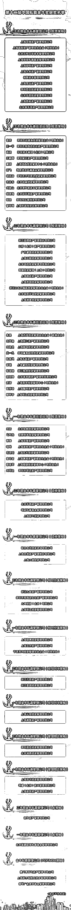

# 重磅！基金界『奥斯卡』名单今日揭晓，私募金牛奖花落谁家？

> 原文：[`mp.weixin.qq.com/s?__biz=MzAxNTc0Mjg0Mg==&mid=2653321005&idx=1&sn=b26ab977d29191f12aaadfcbee53ee65&chksm=802db538b75a3c2e2e5553093b8e63efe91ac6578fbd16ebb6cb7cfc570fab22e75c9bf7651f&scene=27#wechat_redirect`](http://mp.weixin.qq.com/s?__biz=MzAxNTc0Mjg0Mg==&mid=2653321005&idx=1&sn=b26ab977d29191f12aaadfcbee53ee65&chksm=802db538b75a3c2e2e5553093b8e63efe91ac6578fbd16ebb6cb7cfc570fab22e75c9bf7651f&scene=27#wechat_redirect)

# 

量化投资与机器学习微信公众号，是业内垂直于**量化投资、对冲基金、Fintech、人工智能、大数据**等领域的主流自媒体。公众号拥有来自**公募、私募、券商、期货、银行、保险、高校**等行业**20W+**关注者，连续 2 年被腾讯云+社区评选为“年度最佳作者”。

今日（9 月 28 日），有基金界“奥斯卡”之称的第十二届中国私募金牛奖正式放榜！

恭喜以下上榜的部分量化私募管理公司：

**灵均、九坤、明汯、****黑翼******洛书**、**艾方**、涵德、量道******幻方、稳博、****进化论****

****···****

**以下是此次金牛奖获奖名单**

****

**免责声明：以上观点、言论及其他信息仅作参考和资讯传播之目的，不代表公众号赞同其观点或证实其描述。**