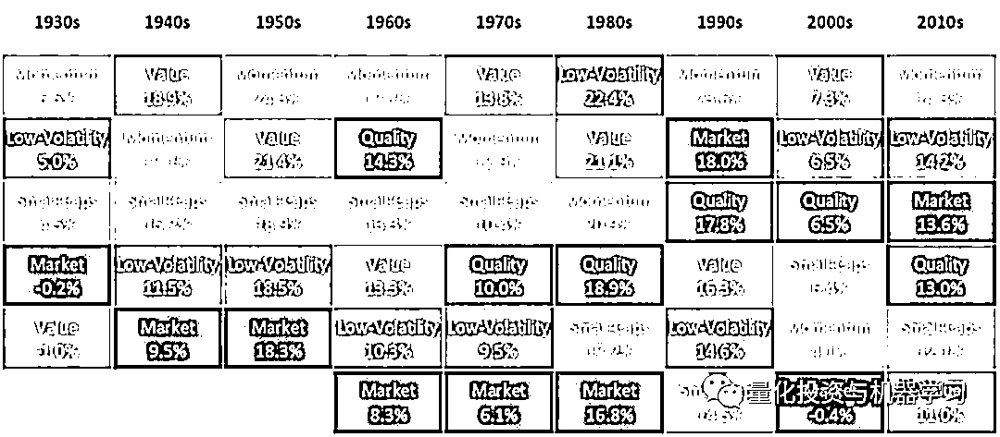

# 动量因子：行为金融角度新解

> 原文：[`mp.weixin.qq.com/s?__biz=MzAxNTc0Mjg0Mg==&mid=2653320997&idx=1&sn=71479e20ecd1010749743445a123c46d&chksm=802db530b75a3c264a5ee8a7a9e07a8d241bf4bf45fb2494787567dad51c77da069ba6c10eda&scene=27#wechat_redirect`](http://mp.weixin.qq.com/s?__biz=MzAxNTc0Mjg0Mg==&mid=2653320997&idx=1&sn=71479e20ecd1010749743445a123c46d&chksm=802db530b75a3c264a5ee8a7a9e07a8d241bf4bf45fb2494787567dad51c77da069ba6c10eda&scene=27#wechat_redirect)

量化投资与机器学习微信公众号，是业内垂直于**量化投资、对冲基金、Fintech、人工智能、大数据**等领域的主流自媒体。公众号拥有来自**公募、私募、券商、期货、银行、保险、高校**等行业**20W+**关注者，连续 2 年被腾讯云+社区评选为“年度最佳作者”。

**核心观点**

Robeco 最近有一篇不错的文章，公众号进行脱水整理，分享给大家：

*   长期来看，动量因子带来了强劲的收益

*   动量溢价是由行为而不是风险来解释的

*   人类犯错的倾向是决定因子持久性的基础

动量投资的概念很简单：买入（增持）近期表现更优的资产，卖出（减持）表现不佳的资产。尽管这种投资方法相对简单，但这一因子能够在股票市场产生强劲的长期表现。

下图显示了自 1930 年以来各因子的 10 年收益率。可以看到，动量因子在过去 90 年中，有 5 个 10 年来获得最高总收益率，并且在所有 9 个 10 年收益率都超过了市场。此外，最近的证据表明，它仍然是最强有力的因子之一，而且它没有消失的迹象。

为了理解为什么动量因子表现如此出色，而没有被套利交易消灭掉，我们首先需要理解为什么这种现象会存在。

**以风险为基础的理论在解释上不够完善**

新古典主义学派认为，动量溢价是承担一定系统性风险的补偿。实际上，动量是一个快速变化的因子，它青睐的股票可能在下一个月发生重大变化。因此，从基于风险的角度来看，溢价可能来自金融市场不断变化的风险，也可能来自投资者愿意承担的风险程度的变化。然而，真实的证据表明，这些组成因子实际上变化非常缓慢（并不足以解释动量因子带来的溢价）。

另一个基于风险的解释是，动量溢价可能来自投资者期望得到潜在崩盘风险的补偿。事实上，众所周知，动量策略可能会遭遇突然的、毁灭性的崩溃，比如 2009 年发生的那次。然而，研究表明，一些具有风险管理的动量策略，并没有出现崩溃，也给投资者带来高收益，显然与这一理论相矛盾。

由于缺乏足够的基于风险的解释，即使是有效市场假说之父尤金 · 法玛也认为动量是对他的理论的最大挑战。

**行为偏差导致动量溢价**

相对于新古典主义理论的解释，行为金融学更成功地解释了动量因子的存在。与主流的新古典主义金融学不同，新古典主义金融学认为投资者是理性的代理人，理解金融市场的风险和机会，行为金融学建立在假设投资者不是完全理性的，他们基于启发式的决策，这可能导致错误，因此产生了“异象”。

投资者对自己分析证券的能力过于自信，倾向于把成功归因于技巧，把失败归因于运气不好，这有助于解释动量的存在。例如，如果正面新闻出现，肯定了个人投资者的观点，他们将倾向于推动相关公司的股价超过其基本价值，即过度推断。但投资者对这些消息产生了过度反应导致股价长期回调时，这种情况最终会得到纠正。

**反应不足**也会导致动量溢价。这是一种保守偏差，这意味着对于他们认为正确的信念，通常会选择不变或者缓慢地改变。但是这种反应不足会使的价格缓慢地向正确的(基本面)价值变动时，这也会带来动量溢价，因为好消息会慢慢的反应在价格中。

在 1999 年的一篇学术论文中，过度反应和反应不足被定义了一个统一地概念。研究者定义了这样一个模型，在这个模型中有两类投资者，一类是基于消息面给股票定价的投资者，称为**新闻交易者**；一类是基于过去历史价格的模式给股票定价的投资者，称为**动量交易者**。如果有关公司基本价值的正面消息流传播开来，**新闻交易者**会首先利用这一点进行交易。他们发现，这将导致其股票价格上涨不足，因为消息会在市场上缓慢传播，即反应不足。动量交易者只有在观察到价格最初的上涨之后，才会推断出这种趋势，从而导致过度反应。正如其他反应过度的情况一样，随后将出现长期调整。

**为什么动量没有被套利交易消除？**

如果与动量相关的异象能够从人类的错误中得到到稳健的收益率，那么自然而然的问题是，为什么它们没有被套利行为消除。

首先，动量因子在真实交易中，实施起来并不容易。例如，价值因子可能每年只有 10%至 20%换手率实现，而传统的动量因子通常每年好几百的换手率。显然，为了有效地驾驭这一因子，需要付出更多的交易成本，更需要一个非常有效的交易策略。

其次，虽然动量溢价与行为偏差而非风险有关，但如何更好的利用动量因子却并没有那么容易。动量策略已经被证明易于发生罕见但严重的崩盘。因此，动量投资者还需要能够在较长时期内投入资本，并做好面对挑战的准备。

第三，定义动量没有一个唯一正确的方法。即使是简单的价格动量，也经常使用不同的回溯窗口来定义，从 3 个月到 12 个月不等。此外，投资者也可以选择仅使用一种动量因子，也可以选择结合多种动量因子，如剩余动量或结合相关的分析师动量。

最后，我们不应该低估人类心理和我们犯认知错误的倾向。**许多金融领域的研究表明，人类总是会犯错误，即使他们事先知道这些错误。**人们不需要深入挖掘就能找到过度推测市场的例子，这种市场是由人类的热情推动的。一次又一次，这些模式出现，并导致可预测的模式，只有系统和有耐心的投资者才可能利用并获利。