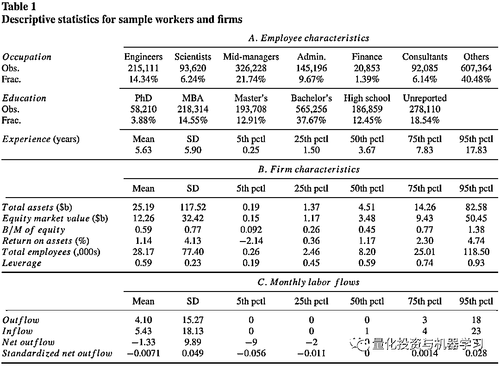
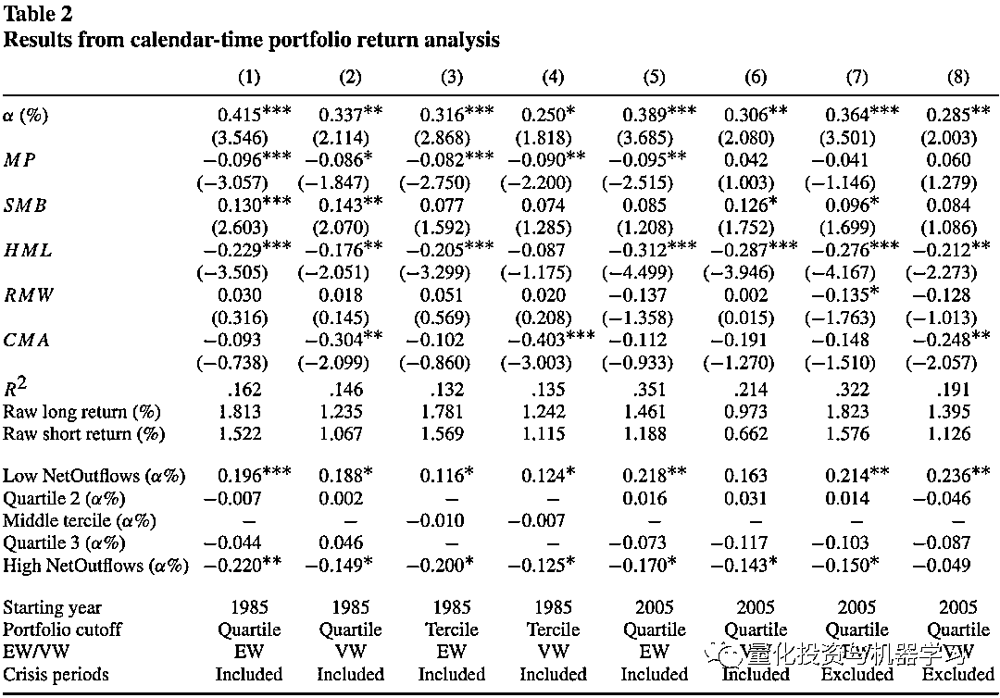
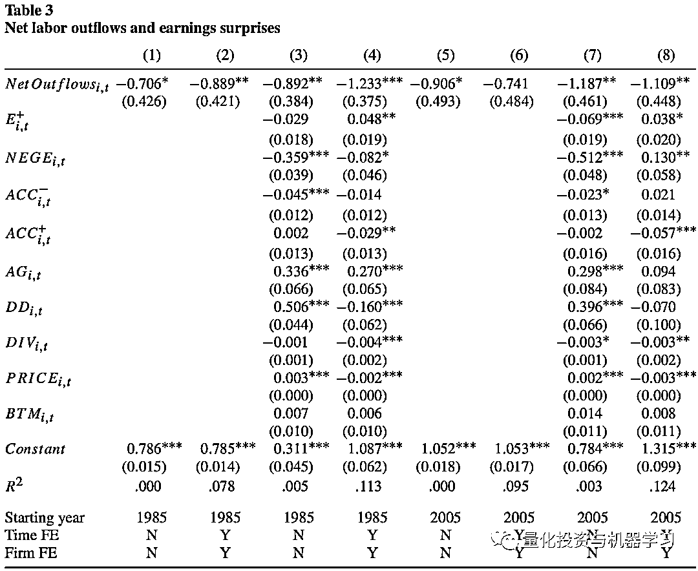
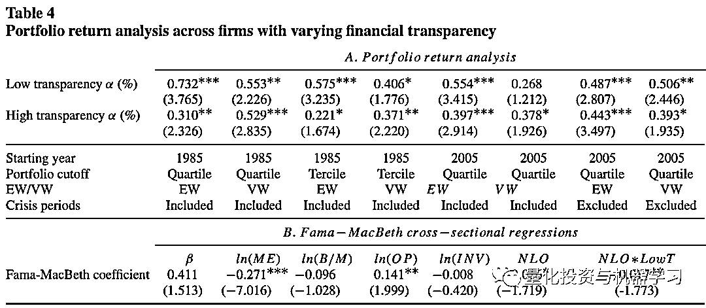
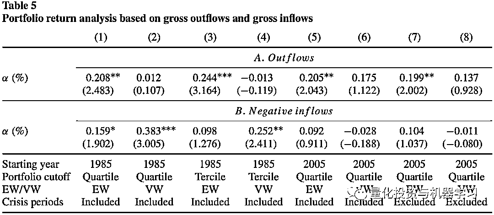

# LinkedIn 简历数据 Alpha 挖掘：员工流转因子

> 原文：[`mp.weixin.qq.com/s?__biz=MzAxNTc0Mjg0Mg==&mid=2653319885&idx=1&sn=7875917d9f59319b19c1bd700d3832f5&chksm=802db0d8b75a39ce380abee36aa83ea0634cd60fd3b4c45d84b3e9642e6c44103d955a68c634&scene=27#wechat_redirect`](http://mp.weixin.qq.com/s?__biz=MzAxNTc0Mjg0Mg==&mid=2653319885&idx=1&sn=7875917d9f59319b19c1bd700d3832f5&chksm=802db0d8b75a39ce380abee36aa83ea0634cd60fd3b4c45d84b3e9642e6c44103d955a68c634&scene=27#wechat_redirect)

# 

量化投资与机器学习微信公众号，是业内垂直于**量化投资、对冲基金、Fintech、人工智能、大数据**等领域的主流自媒体。公众号拥有来自**公募、私募、券商、期货、银行、保险、高校**等行业**20W+**关注者，连续 2 年被腾讯云+社区评选为“年度最佳作者”。

# 

量化投资与机器学习公众号独家解读

量化投资与机器学公众号 *** ***QIML Insight——深度研读系列 ******是公众号今年全力打造的一档**深度、前沿、高水准**栏目。

公众号**遴选**了各大期刊前沿论文，按照理解和提炼的方式为读者呈现每篇论文最精华的部分。QIML 希望大家能够读到可以成长的量化文章，愿与你共同进步！

> **本期遴选论文** **来源：**The Review of Financial Studies, Volume 34, Issue 10, October 2021
> **标题：**Information Dispersion across Employees and Stock Returns
> **作者：**Ashwini Agrawal, Isaac Hacamo, Zhongchen Hu

在最新一期的 The Review of Financial Studies 中，唯一一篇与量化投资相关的论文谈到了公司员工流入流出数据作为因子的表现，作者使用了 Linkedin 中上市公司员工的简历数据，构建了每个公司月度员工流转的数据，并进行了相关测试，主要结论如下：

*   劳动力流转（labor flows）能够预测股票未来的超额收益（abnormal return）。作者定义了员工净流出因子（net labor outflow），计算方法为每月末员工总流出减去员工总流入数除以月初的总员工数。每月做多员工净流出最少的公司，做空员工净流出最多的公司。该策略每月有 0.42%的超额收益，即使在考虑了其他常见的因子，该超额收益也是显著的。

*   作者发现股票分析师在对公司做盈利预测时，并没有考虑劳动力流转的因素。股票分析师通常高估（低估）员工净流出因子高（低）的公司的盈利。这种员工净流出与分析师对于盈利预期之间的负相关性，即使在控制很多常见的变量之后，也表现得非常显著。

*   **以上关于员工净流出因子的发现，在财务更不透明的公司上表现得更加明显。**通过加入一些公司透明度的代理变量，我们发现员工净流出因子与股票收益之间的关系，在一些不透明的公司上更为明显。

*   员工总流出与股票收益之间的关系比员工总流入与股票收益之间的关系更为显著。

**假设**

我们假设公司员工的流转信息对于股票的定价包含了其他常用因素中没有考虑到的信息。潜在的员工在加入公司前，一般会从多个渠道了解公司的信息并以此更新薪酬的期望。在职的员工，也会根据公司的经营状况选择是继续或离开当前所在的公司。所以员工净流出的因子能够从一定程度上反映公司的经营状况。

**验证**

为了验证以上假设，作者使用了 LinkedIn 上个人的简历数据，个人简历数据一般包括个人教育经历及工作经历。通过工作经历的变动，可以汇总出一段时间内某家公司员工流转的数据。**作者从 Linkedln 中抽样了 100 万个具有上市公司工作经历的员工，具体公司范围为 Russell 1000 指数成分股。并通过这 100 万个员工的工作经历，构建出这些公司每月的员工流入及员工流出数据。**

作者一个搜集了 1028356 个员工总计 1500457 段工作经历，详细的统计数据如下，其中 37.7%的员工最高学历为本科，平均的工作年限为 5.63 年。

**员工净流出因子与股票收益**

每月末计算每家公司员工净流出（等于流出减流入除以每月出员工总人数），按照因子大小分为 4 组，作者对于多空收益与 Fama 五因子模型进行回归测试。其中 1-4 列开始时间为 1985 年，5-8 列开始时间为 2005 年，这里考虑到 2005 年 LinkedIn 才上市。从第 1 列，可以看出每月的超额收益 0.415%，且显著。所以，劳动力流转（labor flows）能够预测股票未来的超额收益（abnormal return）。

**员工流转与分析师盈利预期**

既然员工净流出能够预测股票未来超额收益，说明投资者在公司盈利预测时并没有考虑到公司员工流转的影响。那么，员工流转的数据，与公司盈利预测之间的偏差肯定也有相关性。为了验证这之间的关系，作者使用了分析师的预期数据与公司真实盈利数据计算盈利预测偏差，对于每家公司，在每个月计算分析师盈利预期均值与标准差，并用以下公式计算标准化后超预期盈利数据 SUE：

<embed style="vertical-align: -2.202ex;width: 30.102ex;height: auto;max-width: 300% !important;" src="https://mmbiz.qlogo.cn/mmbiz_svg/a18XcQ1EBBggIibBXCZoqdqkHrp8cz0R9aDzurxns8O0eNocQAl20MXQkMoarK0wTDdLLFfpicbNwPVPpAOFQvXFkeaTnm26lG/0?wx_fmt=svg" data-type="svg+xml">

其中 u 为盈利预期均值，sigma 为盈利预期标准差，actual 为真实的盈利数据。

对于每个公司每月的 SUE 与员工净流出数据进行面板回归，得到以下结果，其中需要关注的就是 NetOutflows 的回归系数。**可以发现，盈利预期与真实盈利之间的差额，与员工净流出之间呈现负相关性。员工净流出越大，分析师的盈利预测就越差。**

**员工流转与公司财务透明度**

作者使用以下变量作为公司透明度的代理变量，根据 Leuz, Nanda, and Wysocki (2003), 可以通过公司对于盈利的管理来度量财务透明度，具体以企业应计利润的绝对值除以经营活动产生的现金流量的绝对值来衡量。作者把公司分为高透明与低透明两组，并分别进行投资组合收益的回归测试（如员工净流出因子与股票收益部分）。**结果如下表所示，可以在不同的测试场景下，低透明的超额收益要明显高于高透明组的超额收益。**

**员工总流出与员工总流入**

以上测试都基于员工净流出（流出与流入的差值），那员工流入与流出之间在对股票超额收益的解释上会不会有差别？作者分别对流出因子与流入因子结合 Fama 因子模型进行了回归测试，从下表可以看出，整体上流出因子比流入因子更有效，更能解释其他因子未能解释的超额收益的部分。

