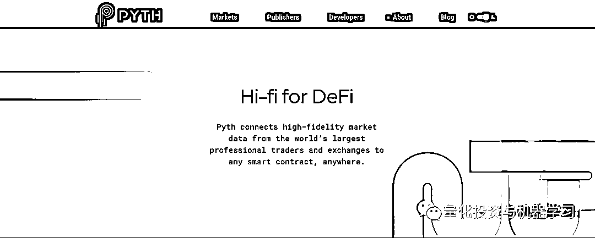

# Jump Trading、Point72 等对冲基金扎堆加密货币交易！

> 原文：[`mp.weixin.qq.com/s?__biz=MzAxNTc0Mjg0Mg==&mid=2653319820&idx=1&sn=25fe099efb299f29bd8b181615a5dbf6&chksm=802db099b75a398f030ad0115c8a90c4112b805cc6312715b22c51d69161316f3b15dc1fd53a&scene=27#wechat_redirect`](http://mp.weixin.qq.com/s?__biz=MzAxNTc0Mjg0Mg==&mid=2653319820&idx=1&sn=25fe099efb299f29bd8b181615a5dbf6&chksm=802db099b75a398f030ad0115c8a90c4112b805cc6312715b22c51d69161316f3b15dc1fd53a&scene=27#wechat_redirect)

# 

量化投资与机器学习微信公众号，是业内垂直于**量化投资、对冲基金、Fintech、人工智能、大数据**等领域的主流自媒体。公众号拥有来自**公募、私募、券商、期货、银行、保险、高校**等行业**20W+**关注者，连续 2 年被腾讯云+社区评选为“年度最佳作者”。

**前言**

8 月份，加密货币对冲基金上涨了近 24% ，原因是数字资产价格的大幅波动。根据 Eurekahedge 的数据显示，这种强劲的增长速度意味着，专注于比特币和其它数字资产的基金今年的回报率为 145% 。

在对冲基金行业，加密基金仍是一个相对较小的市场，多数基金仍将重点放在债券、大宗商品和其它更为成熟的资产类别上。但是，数字资产的高收益率吸引了很多机构的目光。近期，全球的对冲基金仿佛都像商量好的一样，全部爆发式的扎堆投入到加密货币的队伍中。

**Jump Trading**

根据最新消息，Jump Trading 目前正式成立了一个新的部门：**Jump Crypto**，负责加密货币和区块链等领域的相关业务。Jump Trading 表示，该部门将继续专注于构建区块链生态系统软件基础设施和工具，并寻求通过交易和做市等手段提高全球加密货币市场的效率。

Jump 也为 Wormhole 做出了很多贡献，将高性能的 Solana 区块链连接到更广泛的以太坊区块链等。上个月，Jump Trading 收购了一家做 DeFi（去中心化金融）基础设施的公司 Certus One，该公司专注于在分布式账本技术（Distributed ledger Technology，DLT）的业务，收购后，帮助 Jump 开发 Wormhole。

Solana 每秒可处理约 5 万笔交易，类似于现代证券交易所。但智能合约的早期工作大多集中在以太坊上，因此将两者连接起来可以极大地扩大 DeFi 的应用范围。

Jump Crypto 的负责人 Kanav Kariya 表示：“DeFi 生态系统还很年轻，有很多棘手的工程问题。我们在 Jump 所做的很多工作使我们能够成为这些开源项目中非常有意义的贡献者。”

要知道，Jump Trading 一直是 DeFi 的早期支持者，帮助开发区块链项目，包括 Solana、Terra 和 Pyth Network。

在过去的几个月里，包括 Jane Street，GTS，LMAX，Virtu Financial，Genesis Global Trading，IEX Cloud，CMS，CoinShares，Cumberland DRW，XR Trading and Hudson River Trading 都加入了一 Pyth Network。

Jump 的目标是，确保在其认定的加密货币领域内成为真正的 Big Player，可谓野心满满！

**Point72**

Point72 创始人、纽约大都会棒球队老板 Cohen，目前在原则上同意为新成立的数字资产投资和自营交易公司 Radkl 提供资金支持。Radkl 最初将专注于数字资产的量化交易，并计划在未来扩展到 DeFi 领域。

电影 Billions 的原型就是 Cohen： 

 

Cohen 在纽约参加了一场名为《Generating Alpha in Markets and Baseball》的讨论会上表示：“一旦我确定这是个机会，我认为这可能是一个像互联网一样的空间，它可能是难以置信的变革，我绝对不会错过它！”

根据声明，虽然 Point72 会为 Radkl 提供资金支持，但不会参与公司的日常运营。公司的新团队已经就位，预计将在第四季度开始进行交易。

在这之前，Cohen 就开始探索加密货币。在今年 7 月，根据加密货币网站 The Block 发布了一份报告称：Point72 正“大举”进入加密市场。

在此之后，彭博也报道了此事称，Point72 正着眼于加密货币相关的投资布局。因为在 Point72 一封致投资者的信中表示：“我们正在探索区块链技术，**如果我们忽视目前规模 2 万亿美元的加密货币市场，那将是我们的失职。”**

在投资加密货币方面，通过其 Point72 Ventures 进行投资，同时也在对冲基金方面部署多/空策略。

随着比特币的崛起以及对区块链技术的乐观情绪，基金经理们对该行业的兴趣日益浓厚，Point72 的竞争对手 Millennium 一直在积极参与加密货币相关的期货和 ETF，包括 Grayscale Bitcoin Trust，并计划继续在这一领域开展业务。全球最大的宏观对冲基金之一 Brevan Howard 表示，将建立一项数字业务，以探索加密货币领域的机会。

但在加密货币市场赚钱变得越来越困难，许多数字资产基金不再依赖比特币价格上涨，转而采用套利和市场中性策略，以获得丰厚的利润。