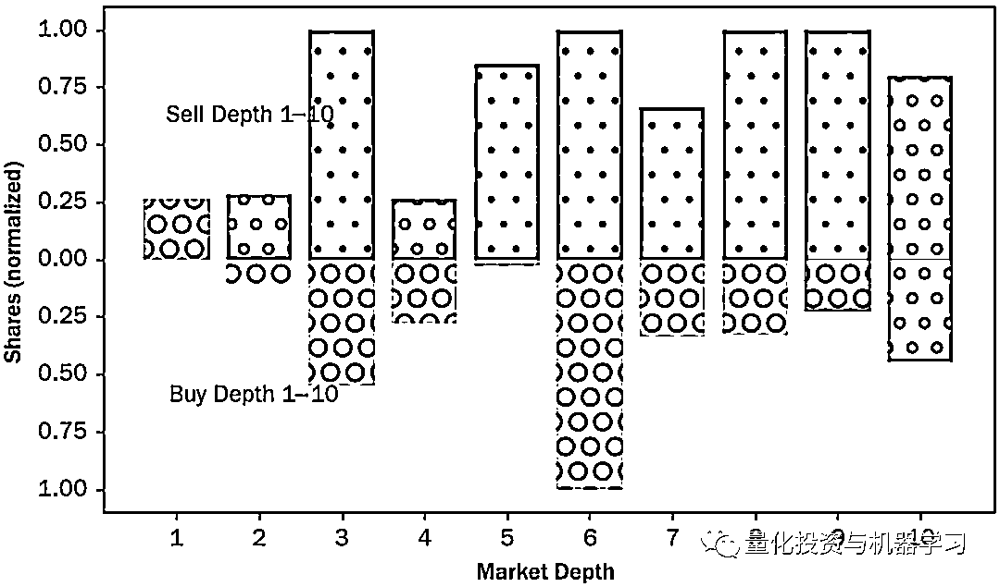
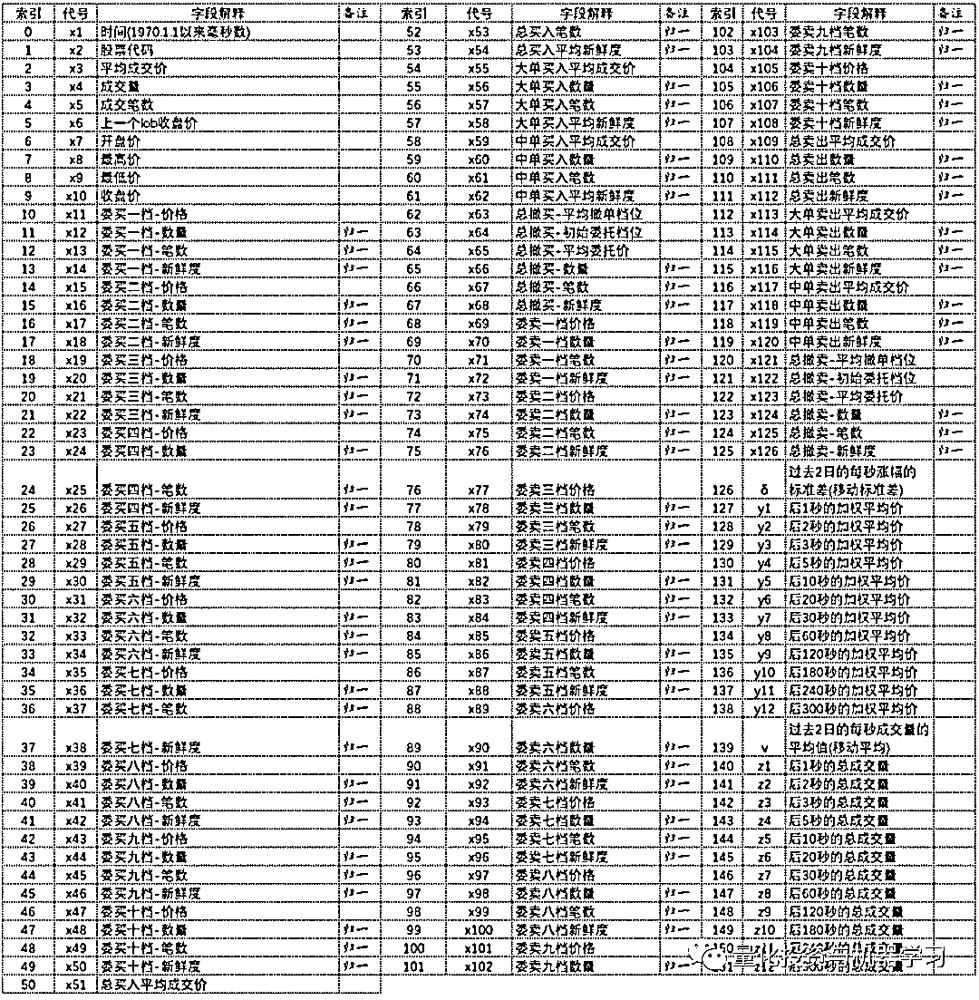
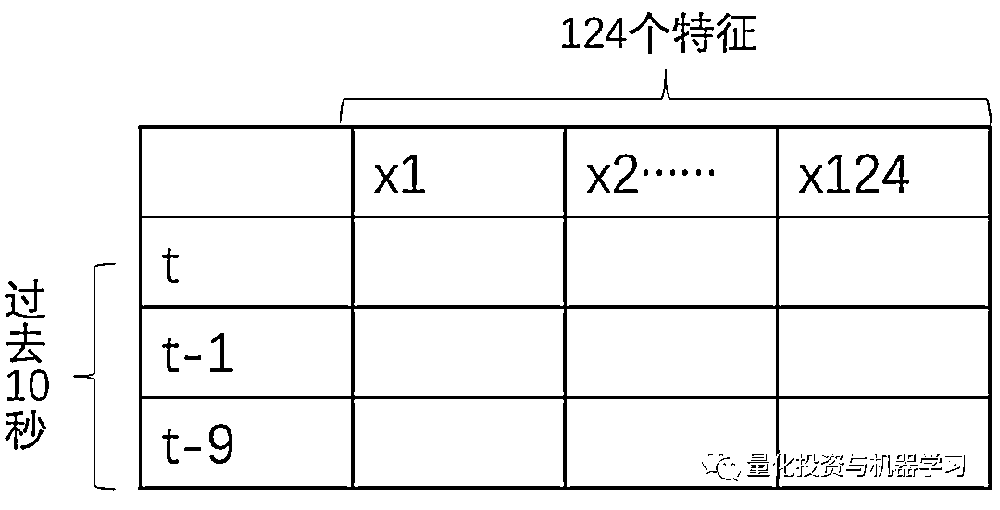
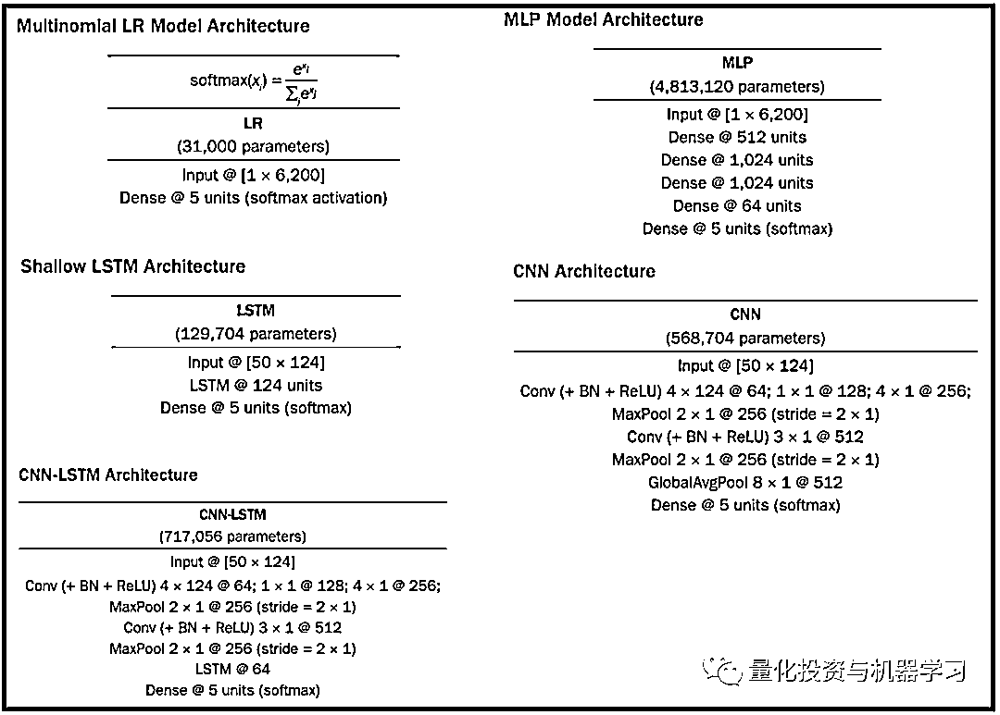
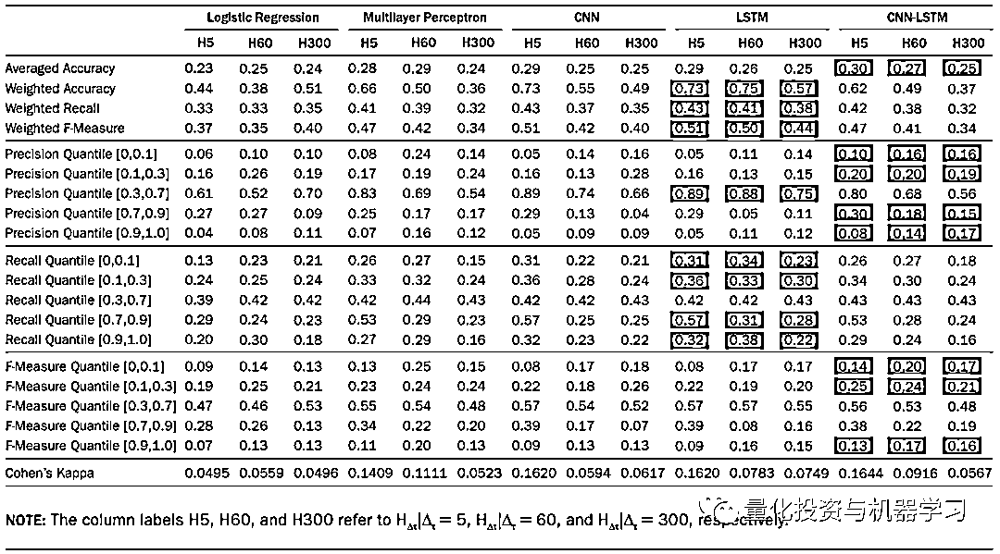

# 重构订单簿！基于深度学习的 A 股 Tick 级价格变动预测

> 原文：[`mp.weixin.qq.com/s?__biz=MzAxNTc0Mjg0Mg==&mid=2653319500&idx=1&sn=93b861233755c4cf991aec9a95cabf05&chksm=802db359b75a3a4ffab8cbb28be86c1d71faf222f928a1c38b391d14f67e1658b4f6ef1302f9&scene=27#wechat_redirect`](http://mp.weixin.qq.com/s?__biz=MzAxNTc0Mjg0Mg==&mid=2653319500&idx=1&sn=93b861233755c4cf991aec9a95cabf05&chksm=802db359b75a3a4ffab8cbb28be86c1d71faf222f928a1c38b391d14f67e1658b4f6ef1302f9&scene=27#wechat_redirect)

# 

量化投资与机器学习微信公众号，是业内垂直于**量化投资、对冲基金、Fintech、人工智能、大数据**等领域的主流自媒体。公众号拥有来自**公募、私募、券商、期货、银行、保险、高校**等行业**20W+**关注者，连续 2 年被腾讯云+社区评选为“年度最佳作者”。

# 

量化投资与机器学习公众号独家解读

量化投资与机器学公众号 *** ***QIML Insight——深度研读系列 ******是公众号今年全力打造的一档**深度、前沿、高水准**栏目。

公众号**遴选**了各大期刊前沿论文，按照理解和提炼的方式为读者呈现每篇论文最精华的部分。QIML 希望大家能够读到可以成长的量化文章，愿与你共同进步！

> **本期遴选论文** **来源：**The Journal of Financial Data Science Fall 2021
> **标题：**Benchmark Dataset for Short- Term Market Prediction of Limit Order Book in China Markets
> **作者：**Charles Huang, Weifeng Ge, Hongsong Chou, Xin Du

**重构订单簿**

深交所的 Level2 数据包含逐笔委托和成交数据。准确的模拟撮合方法就是回放交易所的逐笔委托和成交数据，根据交易所撮合机制、市场流动性来模拟撮合订单，从而得出策略的成交概率。高频策略研究中，可以通过这两个数据重构订单簿，并生成任意时间间隔的快照数据。

作者基于深交所的 Level2 数据重构了订单簿，生成了 1 秒间隔的快照数据及每一秒间隔内发生的交易统计数据，分别称为 Snapshot component 和 Periodical component，下图就展示了平安银行某个时间点的快照：

> 关于重构订单簿，作者指出学术界常用 LOBSTER 软件，公众号查了下一年的费用需要近 5000 欧元😭。他们自己用 C++实现了重构逻辑，但没给出具体逻辑和代码。

基于以上 1 秒间隔的 Snapshot 及 Periodical 数据，作者尝试构建预测模型对未来一段时间的价格及成交量进行预测。

**深度学习模型预测 Tick 级价格变动**

**特征**

作者一共构建了 124 个特征, 分成两大类：

*   **第一类是过去一段时间的交易数据**，一共有 8 个特征，包含：VWAP、成交量、订单量及高开低收成交量；

*   **第二类是买卖双方的力量对比，**一共有 116 个特征，买卖双方分别有 58 个，包含：

*   10 档快照数据（价格、规模、订单数量、订单平均的新鲜度*），这里一个有 40 个特征；

*   已成交订单的数据，分为三个类别，总成交/大单/中单，每个类别包括价格、成交量、订单量及被动端的平均新鲜度，这里一共 3*4=12 个特征；

*   取消订单的数据，订单发出时及订单取消时的市场平均深度、平均价、成交量及取消订单的数量，一共 2*3=6 个特征。

作者对以上特征数据做了以下处理：

*   **价格数据**保持不变，当没有成交量时，对价格数据进行前向填充；
*   **交易量数据**除以所有交易量数据的 10%分位数进行标准化；
*   **订单量数据除**以所有订单量数据的 10%分位数进行标准化；
*   **新鲜度分为三类**: 0 (过去 5 秒以内), 1 (过去 5-30 秒), 2 (过去超过 30 秒)。

**标签**

预测未来 1, 2, 3, 5, 10, 20, 30, 60, 120, 180, 240, 及 300 秒的价格及成交量：

*   对于价格，预测的是未来时间点加权平均价的分位数，分位数划分如下，10%、20%、40%、20%及 10%，分别对应标签-2、-1、0、1 及 2；

*   对于成交量，也是预测成交量大小的分位数：20%、40%及 20%，分别对应标签 0、1 及 2。

详细的特征及标签的说明如下（除去股票代码和时间）：

**模型**

训练数据：2020 年 6 月 3 日至 2020 年 8 月 31 日，9:30-11:30 及 13:00-14:57 的快照数据；

测试数据：2020 年 9 月 1 日至 2020 年 9 月 30 日的快照数据；

每个输入到模型的数据结构如下：

**针对每个预测标签都构建一个模型，所以任何一类模型都会有 24 个子模型，如 12 个预测价格的模型及 12 个预测成交量的模型。（1, 2, 3, 5, 10, 20, 30, 60, 120, 180, 240, 及 300 秒的价格及成交量）。**

总共测试了 5 个模型，模型的架构如下图展示：

**测试结果 **

由于计算资源的限制，作者在最后的实证中对 20 个交易最活跃的股票进行了建模分析，预测的标签是未来 5，6 及 300 秒的价格。使用的是 Pytorch 和 RTX 2080 显卡，结果如下：

可以看出，LSTM 和 CNN-LSTM 要优于 MLP 和 CNN。且所有四个非线性的模型的表现都优于线性模型。但是同样也可以看到，每个模型预测准确率最高的分位数是区间是 0.3-0.7，也就是说模型对于极端价格的变动没有很好的预测能力。**作者表示，未来应该使用更多的数据，更长的历史 Lookback 长度及更复杂或合适的网络结构构建深度学习模型。**

**开源代码**

所有的模型代码及数据均已在 Github 开源，大家可以访问如下网址获取：

> ***https://github.com/hkgsas/LOB***