# 基于 TRA 和最优运输学习的多股票交易模式

> 原文：[`mp.weixin.qq.com/s?__biz=MzAxNTc0Mjg0Mg==&mid=2653319425&idx=1&sn=d64b5f73d352b8b9a3acaef9bc995dd6&chksm=802db314b75a3a0207615691c420213ca00f9baf6cbfcc7c33b93a47e1663e3efaa4414a15c7&scene=27#wechat_redirect`](http://mp.weixin.qq.com/s?__biz=MzAxNTc0Mjg0Mg==&mid=2653319425&idx=1&sn=d64b5f73d352b8b9a3acaef9bc995dd6&chksm=802db314b75a3a0207615691c420213ca00f9baf6cbfcc7c33b93a47e1663e3efaa4414a15c7&scene=27#wechat_redirect)

# 

量化投资与机器学习微信公众号，是业内垂直于**量化投资、对冲基金、Fintech、人工智能、大数据**等领域的主流自媒体。公众号拥有来自**公募、私募、券商、期货、银行、保险、高校**等行业**20W+**关注者，连续 2 年被腾讯云+社区评选为“年度最佳作者”。

# 

量化投资与机器学习公众号独家解读

量化投资与机器学公众号 *** ***QIML Insight——深度研读系列 ******是公众号今年全力打造的一档**深度、前沿、高水准**栏目。

公众号**遴选**了各大期刊前沿论文，按照理解和提炼的方式为读者呈现每篇论文最精华的部分。QIML 希望大家能够读到可以成长的量化文章，愿与你共同进步！

> **本期遴选论文** **来源：**KDD 2021
> **标题：**Learning Multiple Stock Trading Patterns with Temporal Routing Adaptor and Optimal Transport
> **作者：**Hengxu Lin、Weiqing Liu、Jiang Bian、Dong Zhou

**KDD2021**

第 27 届国际数据挖掘与知识发现大会 KDD 2021 于 8 月 14 日-18 日在线上正式开幕。本次大会共收到 1541 篇投稿，其中 238 篇论文被接收，接收率为 15.44%。**其中跟唯一一篇文章跟量化投资投资相关的论文是出自微软研究院的《Learning Multiple Stock Trading Patterns with Temporal Routing Adaptor and Optimal Transport》。**

**TRA****量化模型**

首先，整体来介绍一下模型的框架结构：

*   股票市场同时存在多种状态，每个时刻都有不同的状态占主导，所以需要根据不同的状态单独构建 Predictor。每只股票，在不同的时刻适合用不同的 Predictor 进行预测，才能达到更优的预测效果。

*   所以，可以对市场状态的数量进行假设，比如有 5 个状态，那就可以构建 5 个 Predictor，**但是问题就来了，是对于不同的股票，在每个时刻该选择哪个 Predictor？**

*   **作者提出了路由的概念，根据每个 Predictor 历史上预测的表现及股票的特征，匹配出当前时间点最佳的 Predictor，这就是 TRA 核心的思想。**

*   但是问题又来了，如果对于路由不加限制，就会一直选择一个历史上表现最优的 Predictor，而违背了最初的设计，所以作者又引入了最优运输的机制，控制 Router 对 Predictor 的分配。

**市场同时存在多种状态**

股票预测是量化投资中最为关键的任务。近年来，深度神经网络因其强大的表征学习能力和非线性建模能力，逐渐成为股票预测的主流方法。现有的预测方法均假设股票数据符合独立同分布（IID）且采用单一模型有监督地对股票数据建模。但实际上，股票数据通常会包含多种不同甚至对立的分布（Non-IID），比如动量（历史收益率高的股票未来收益率会高）和反转（历史收益率低的股票未来收益率会高）这两种分布形式同时存在于股票数据中，但是已有的模型并不具备同时学习股票数据中多种分布的能力。

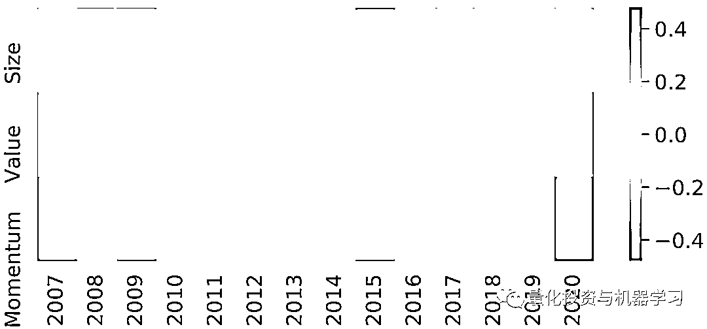

Momentum、Value、Size 因子 Top 组在 2007 年到 2020 年间，每年的超额收益

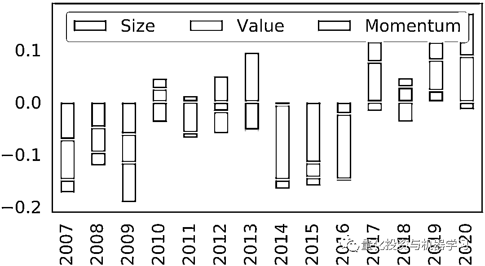

Momentum、Value、Size 三个因子截面回归的系数

**TRA 是什么？**

因此，微软亚洲研究院的研究员们提出了 Temporal Routing Adaptor (TRA)，来赋予已有模型学习多种分布的能力。**具体而言，TRA 在给定骨干模型的基础上，引入了一组 Predictors 来建模不同分布，和一个 Router 来根据样本的规律 p(y_t│X_t) 将其分配到所属的 Predictor 上进行训练和推理。**为了保证 Router 能够预测出样本的规律，研究员们设计并利用了两种与 p(y_t│X_t) 关联的信息作为其输入：1) 利用骨干模型的隐层来表征 p(y ̂_t |X_t)，2) 利用 Predictor 的历史预测偏差来表征 p(y_(< t)│X_(< t))。实验表明，这两种信息对 Router 有能力预测出样本规律起到了重要作用。TRA 的两个主要模块和基于骨干模型的具体实现可以参下图：

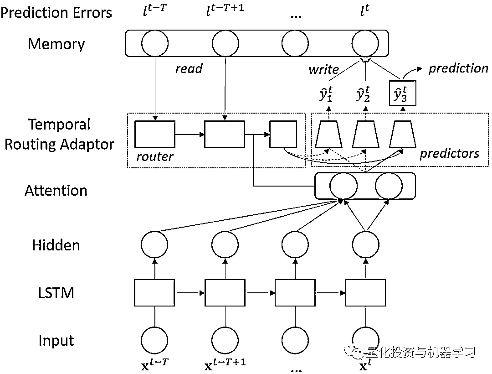

针对当前的 Sample，根据 Attention LSTM 的输出及记忆中的 temporal prediction errors 共同确定最合适的 Predictor

**什么是最优运输？**

为了有效地训练 TRA 模型，另一个需要解决的问题是，如何保证分配到不同 Predictor 的样本是属于不同规律的。因此，研究员们基于最优运输 (Optimal Transport) 设计了一个迭代优化的算法。最优运输被用来求解在分配的样本满足特定比例约束下，如何分配样本能够最小化整体预测偏差。求解得到的分配方案会用来更新对应的 Predictor，并继续下一轮迭代，直至收敛。

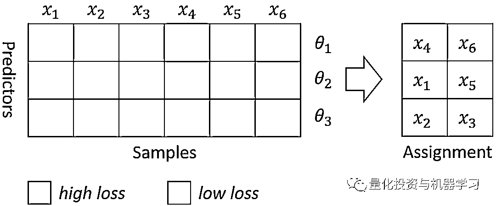

实验表明，TRA 可以稳定提升之前在股票预测中表现最强的基准模型如 Attention LSTM 和 Transformer 的预测性能，并取得更高的投资收益，结果见下表。

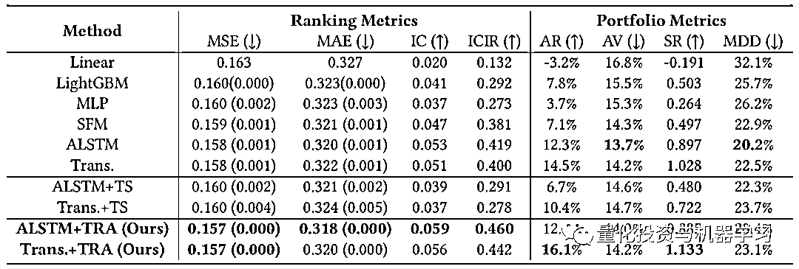

RA 模型相比于其他基准模型在股票排序预测任务下的性能

**实证设计的细节**

**X：16 个特征**

作者选取了中证 800 股票，以下 16 个特征 market capitalization, price-to-EPS, price-to-book value, price-to-sales, price-to-net cash flow, asset turnover ratio, net profit margin,receivables turnover ratio, EPS growth, asset growth, equity growth,12 month momentum, 1 month reversal, close to 12 month highest,close to 12 month lowest,  maximum return in last month. **每个月末的数据。**

**Y：预测目标变量**

**未来一个月每个股票月度收益率的截面排序分位数（标准化之后）。**

所以每次前向传播的 Sample data 的数据结构如下，过去 60 个月，16 个因子：

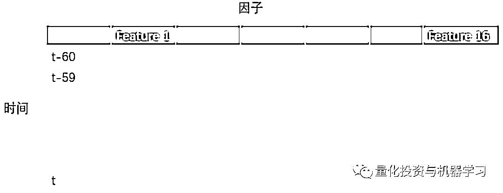

**基准模型：**

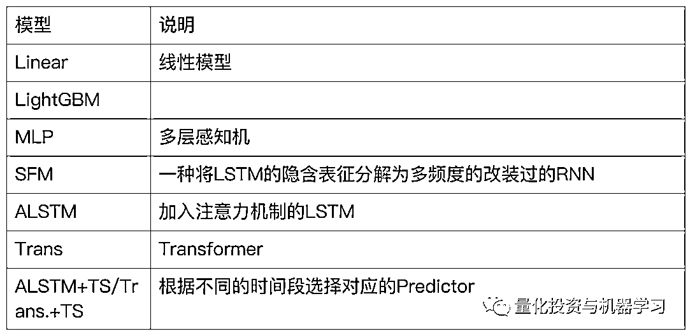

**核心问题解答**

**问题 1，TRA 能否正确的学到市场存在的多个状态并选择正确的那个用于预测?**

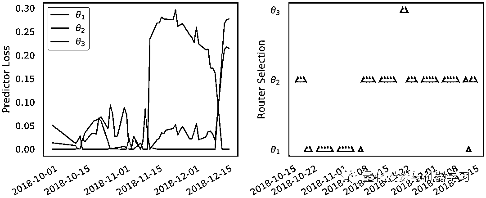

在实验中，我们假设市场存在三种状态（对应的有三个 Predictor），并随机的选取股票进行预测，图 6 左侧是不同 Predictor 的 Loss，右侧是对应的那个时间点 TRA 选择的 Predictor，可以看出大部分时间 TRA 选择的是 2 号预测器，也就是 Loss 最小的那个。在 2018 年下半年，基本上选择的是 1 号，整体很少会选择 3 号，因为三号大部分时间 Loss 都很大。说明 TRA 能够选择 Loss 最小的 Predictor。

**问题 2，LSTM 输出的隐含表征（hidden state）和 Predictor 的预测误差对于 Router 是否都有利用价值?**

对于 Router 的输入，作者做了以下控制：

*   Random，随机生成的白噪声作为 Router 的输入
*   LR：只把 ALSTM 输出的隐含表征（hidden state）作为 Router 的输入
*   TPE：只把 Predictor 的历史预测误差作为 Router 的输入
*   LR+TPE：LR 和 TPE 都作为 Router 的输入

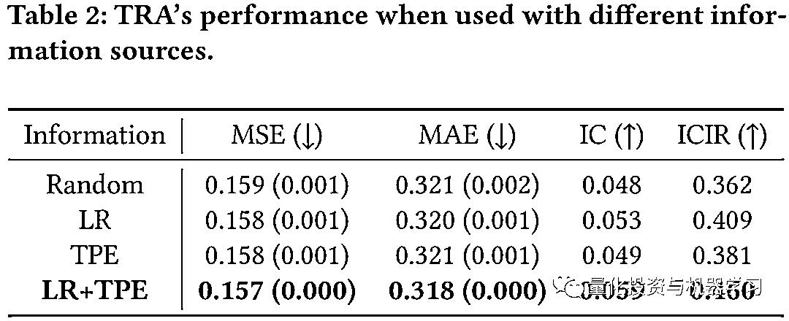

如上表 2 可以发现，相对单独输入 LR 或 TPE，LR+TPE 的各项指标都得到领先。

**问题 3，最优运输规则（Optimal Transport, OT）到底对于 TRA 有没有帮助?**

如图 7，作者对比了 OT 对于模型的影响，在没有 OT 的时候大部分时间选择的都是 Loss 相对最少的 2 号 Predictor，而加入 OT 之后，各个 Predictor 被选择的比率就比较均匀了。

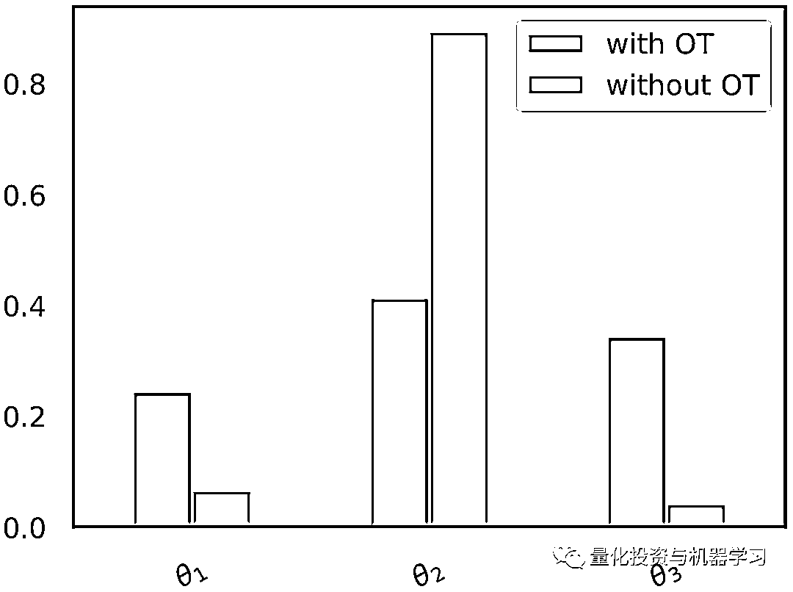

**问题 4，TRA 模型对于 Predictor 的数量（也就是假设的市场状态的数量）是否敏感？**

从图 8 可以看出，当 K 大于 5 之后，模型的表现趋于稳定，IC 维持在 0.06 左右， MSE 也不再降低，说明当 Predictor 的数量达到一定量，模型对于 K 就不敏感了。

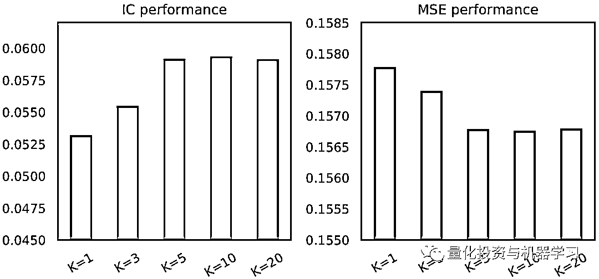

**QLib 代码实现**

模型实现的代码已经封装在 QLib 里，关于 QLib 的介绍可以参考公众号之前的文章：

 

如果想要动手复现文中的结果，需要以下几个步骤：

1、Clone QLib 到本地，并进行安装；

2、下载特征及标签数据，地址：https://drive.google.com/drive/folders/1fMqZYSeLyrHiWmVzygeI4sw3vp5Gt8cY?usp=sharing

3、将数据放入以下文件夹：/qlib/examples/benchmarks/TRA/data

4、修改/qlib/examples/benchmarks/TRA/example.py 内的代码，图中红圈部分改为 config_alstm_tra_init，然后运行文件。

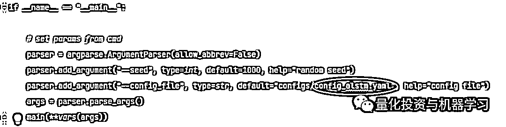

关于模型的细节，可以参考/qlib/examples/benchmarks/TRA/src/model.py