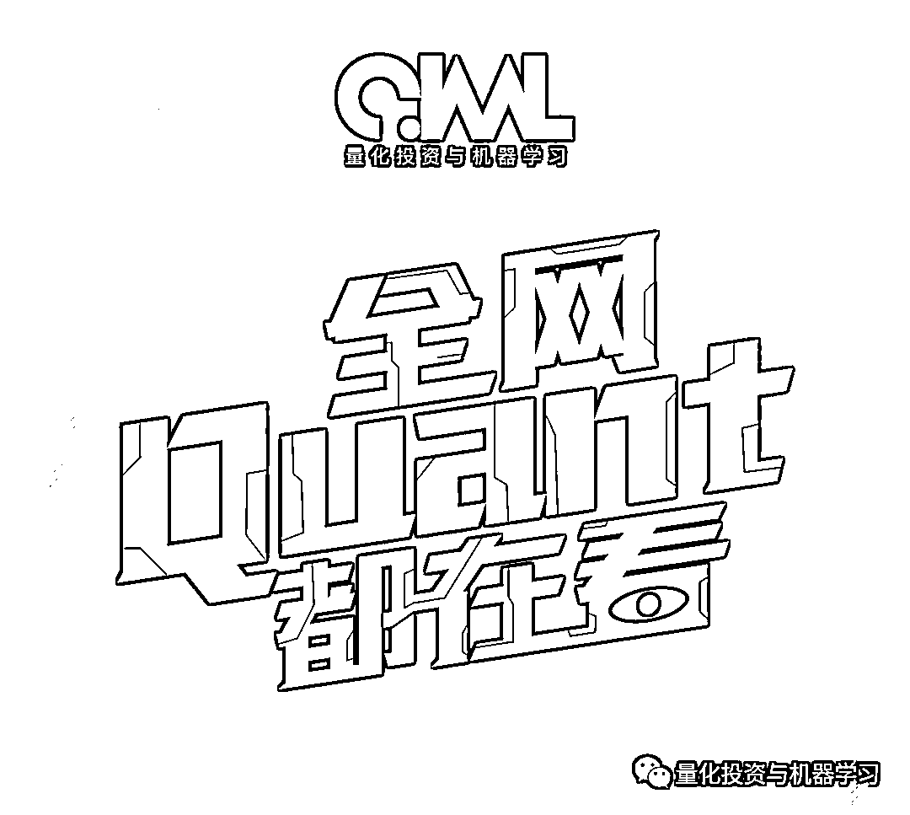

# 科研型 Quant：流水线模式的量化研究

> 原文：[`mp.weixin.qq.com/s?__biz=MzAxNTc0Mjg0Mg==&mid=2653319220&idx=1&sn=a9c2509d989f5627fc20908dbcd296c1&chksm=802db221b75a3b37cf6c0dd757311be20254ff248d067f9cadf82100dc2165c1b39ec354cfb2&scene=27#wechat_redirect`](http://mp.weixin.qq.com/s?__biz=MzAxNTc0Mjg0Mg==&mid=2653319220&idx=1&sn=a9c2509d989f5627fc20908dbcd296c1&chksm=802db221b75a3b37cf6c0dd757311be20254ff248d067f9cadf82100dc2165c1b39ec354cfb2&scene=27#wechat_redirect)

# 

量化投资与机器学习微信公众号，是业内垂直于**量化投资、对冲基金、Fintech、人工智能、大数据**等领域的主流自媒体。公众号拥有来自**公募、私募、券商、期货、银行、保险、高校**等行业**20W+**关注者，连续 2 年被腾讯云+社区评选为“年度最佳作者”。

Advances in Financial Machine Learning 的作者，著名的量化大佬，Marcos Lopez de Prado 昨天在 AI&Data Science in Trading 的线上论坛，分享了其对于量化职业发展的主题演讲《Escaping The Sisyphean Trap: How Quants Can Achieve Their Full Potential》。

从初入量化行业所可能遇到的问题和挑战，谈到了当前量化机构的两种模式，**投资经理模式和流水线模****式。**

**作者认为，在机器学习时代，流水线模式的量化研究更适合 Quant 的职业发展。像科研一样做量化策略的研究，才是最符合这个时代量化投资机构的发展路径。**

**金融行业技术及人才需求的变革**

Marcos 首先回顾了过去 100 多年，投资行业所使用的技术和所需技能的演进。

20 世纪初，投资交易主要是由投机占主导，没有系统的金融理论，更没有计算机，数据也非常有限。即使涉及到数学，所使用也都是非常简单的数学模型，更多的是采用技术分析。这个时期，投资管理的从业人员基本没有接受专业的训练，投资决策主要依靠故事或主题。

20 世纪 50 年代开始，经济学家开始关注怎么对经济和金融系统进行建模。系统性的金融理论开始得到发展，比如现代组合管理理论，资产定价理论等。专业的金融分析师开始在投资决策中占主导，他们利用基本面分析及计量经济学的方法进行投资决策。在这个阶段 CFA 成为金融认证的黄金标准。

2000 年开始，随着技术的发展，包括算力、数据存储及互联网的发展，还有数学建模的发展，市场微观结构也在这时候成为很多高频交易的理论工具。这时候开始，很多投资管理的公司开始倾向雇用 STEM 专业的毕业生进行研究及技术开发。但这时候，大部分的 Quant 还是 Q side。

2015 年以来，随着机器学习的发展及另类数据的爆发，Quant 的研究也从定价转向了预测，机构对于机器学习、数据科学家及自动化专家的需求达到了新高度。

是什么推进了这个变革，Marcos 总结了三个方面：**数据、算法和算力**。数据正以指数级的速度增加，根据 IDC 的估算，过去两年产生的数据总量，已经占到了历史所有数据总量的 90%以上。这当中有 80%的数据是非结构化数据，在处理非结构化数据又需要强大的机器学习算法和算力。这三个方面共同的作用，是对科学背景的人才的高需求。金融投资行业的数据处理，对数据科学家提出了很高的挑战。

**金融研究的五大困境**

与传统的科学研究相比，金融研究存在了哪些困难与挑战？Marcos 阐述了金融研究相比科学研究最显著的五个困境：

**实验的障碍：**相对于传统科研，量化策略的研究并没有那么明显的因果推断关系，很难使用传统的控制变量法。

**非平稳的数据：**金融系统是一个动态的系统，金融市场的数据大多是非平稳，这种非平稳性往往是市场结构的变化所导致的，比如监管的变化、投资者结构的变化等。非平稳性带来很多问题，会导致预测的不可靠及多发的黑天鹅事件等等。如下图所示，在数据存在结构性突变的情况下，依据历史数据预测未来的可行性就大大降低。

**严苛的竞争：**不同为科学研究上创新性的竞争，能够提高生产力。策略的研究，本质上是一个零和的游戏，是一种内卷，这种竞争降低了金融市场的信噪比。比如一样策略研究的发表会使其在将来失去有效性，增加了有效策略挖掘的难度，加快了 alpha 的衰减。

**系统的复杂性：**金融系统是一个复杂的系统，传统的统计学假设我们知道每一个变量的分布，及变量之间的相关性。但这些假设都是不现实的，特别是第二个假设。我们知道金融市场的数据存在层级性、高纬度等未知的特性，某一个相关性的错误假设都会导致模型的失败，得出错误的结论。

**少量的样本：**虽然说金融市场有大量数据，但相对系统的复杂性，数据还是不够，更何况这些数据还存在序列自相关，及多个序列之间的相互依赖。这就造成了大量假阴性研究结果的出现。

**如何克服困境：像科研人员一样工作**

面对以上困境，什么样的研究体系能够有助 Quant 直面这些挑战呢？Marcos 首先明确表示传统的投资经理主导的模式（称为 Silos 模式）阻碍的 Quant 的发展，及投资者利益的最大化。什么是 Silos 模式呢？传统的机构会雇用独立的投资团队，这个团队通常由一个投资经理及几个研究员组成，不同的投资团队之间相互独立（确切说是相互竞争）。**团队共用公司的研究平台及技术设施（如数据 API、风控系统及回测交易设施），独立研发策略，对策略研发的整个生命周期负责，并根据策略的表现获得相应报酬。**在这种模式下，团队之间没有任何激励去进行合作，而是存粹的竞争关系。采用这个模式的公司希望通过竞争达到团队的分散化，但这种模式存在如下明显的缺点：

*   有限的研究深度，造成很多 Alpha 都是肉眼可见且衰退极快；

*   有限的策略覆盖范围，每个团队只能开发有限的策略，且重复性很高；

*   策略 IP 无法归属公司，没有知识留存及迭代的机制；

*   缺少团队合作的科研氛围。

所以，Solios 模式的公司很难适合想做科研一样做量化研究的 Quant。Solios 公司需要的是通才而不是专才。在某方面突出的 Quant，进入这类公司会有专才变成通才，每天花费很多时间在重复性的工作上，比如回测、数据整理，而在策略创新方面失去动力。Marcos 把这种情况比作了 Quant 的西西弗斯困境。

与 Silos 模式对立的是另一种模式，Marcos 称之为 Big Science 模式或 Assembly Line 模式，**把策略的研究作为一个系统化的科学研究工作**，在这样一个框架下精细化分工，每个来自不同专业背景的角色承担整个系统的某一个细分部分的工作。美国著名物理学家 Ernest Lawrence 在 1931 年创立了伯克利实验室，就通过跨专业团队的合作解决了很多在大学里很难解决的问题。

以实验室的形式，通过不同分工进行量化研究，是 Marcos 所推崇的模式，他认为这种模式相对 Solios 模式有很大的优点：

Assembly Line 模式把整个量化研究分成了多个部分，具体可以参考 Marcos 的书《Advances in Financial Machine Learning》。以下为部分截图，整个生产线主要包括：研究、策略及生产三个大部分。每个部分有分为多个角色，比如研究中有特征分析的角色主要从海量数据中挖掘因子。生产中，有负责部署的角色，也有负责订单执行的角色。

**在这种模式下，量化研究更像是一个科研人员，为了解决整个系统中某一个部分的优化而不断努力研究，最终掌握的是一种技能，而不是一个策略。团队成员间的合作，更利于解决更困难的问题，挖掘更优质的 Alpha。独立的策略测试团队，更能保证策略的有效性，避免了策略的过拟合。在没有组合经理这个角色的情况下，团队更扁平，更具自我纠错的能力。**

Marcos 认为，在这样一个 Quant 研究朝向团队合作发展的情景下，2-3 人的量化团队将更难生存，因为随着技术及算法的发展，很难有人能够独自掌控整个量化策略研究到生产的全过程，即使有这样的人，在面对大型团队的时候，也几乎没有竞争优势，这样的团队在未来将很难生存。

**回到国内量化机构**

关于国内量化机构采用的管理模式，之前公众号在知乎上也看到广泛的讨论，有些大的机构从发展初期就确定了流水线模式。有些机构则依赖几个核心的投资经理，不断扩大规模。

关于**投资经理模式（Silos）/ 流水线模式（Assembly Line）**在国内的情况，欢迎大家在评论区讨论。