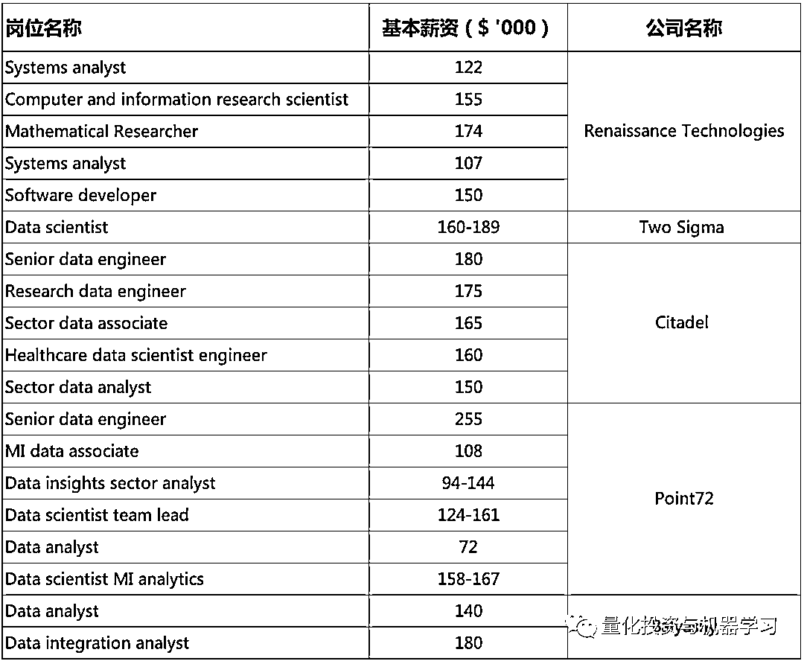

# 量化人，量化魂！Billions 第五季回归（附下载）

> 原文：[`mp.weixin.qq.com/s?__biz=MzAxNTc0Mjg0Mg==&mid=2653319192&idx=1&sn=f624a5be812d6380fe82ffe447303314&chksm=802db20db75a3b1bcbce3f03f93f5e5df60bc3aa1a1bff43cbde3445e9c72744237e6afa6154&scene=27#wechat_redirect`](http://mp.weixin.qq.com/s?__biz=MzAxNTc0Mjg0Mg==&mid=2653319192&idx=1&sn=f624a5be812d6380fe82ffe447303314&chksm=802db20db75a3b1bcbce3f03f93f5e5df60bc3aa1a1bff43cbde3445e9c72744237e6afa6154&scene=27#wechat_redirect)

# 

量化投资与机器学习微信公众号，是业内垂直于**量化投资、对冲基金、Fintech、人工智能、大数据**等领域的主流自媒体。公众号拥有来自**公募、私募、券商、期货、银行、保险、高校**等行业**20W+**关注者，连续 2 年被腾讯云+社区评选为“年度最佳作者”。

**Billions 第五季正式回归！！！**

首先，要说一个激动人心的好消息，Billions 第五季下半部分终于在正式回归啦！

公众号在前面的文章里为大家剧透了部分内容，通过最新第八集的内容，基本都对了：

 

公众号第一时间为大家为大家**提供最新（第八集）观看资源。**

同时，也为忘记前面部分的小伙伴提供了**1-7 集观看资源**。

**获取视频资源，请在文末获取！**

第八集 Taylor 说的一段话代表了作为 Quant 的一种境界：

Quant 这个职业就是这样，寂寞里带着高冷与不俗！

同时，在 Taylor 与一位员工的交流中，谈到此员工的薪资：

根据我们**最新**获取到顶级对冲基金 H1B 数据，来看看作为一名普通的量化研究员或者数据分析师的薪资在现实中是否和影视剧里面的说的类似（**基本薪资，不包含 bonuses**）： 

**获取 Billions 第五季：1-7 级 + 最新第 8 集**

后台回复：**BS05**