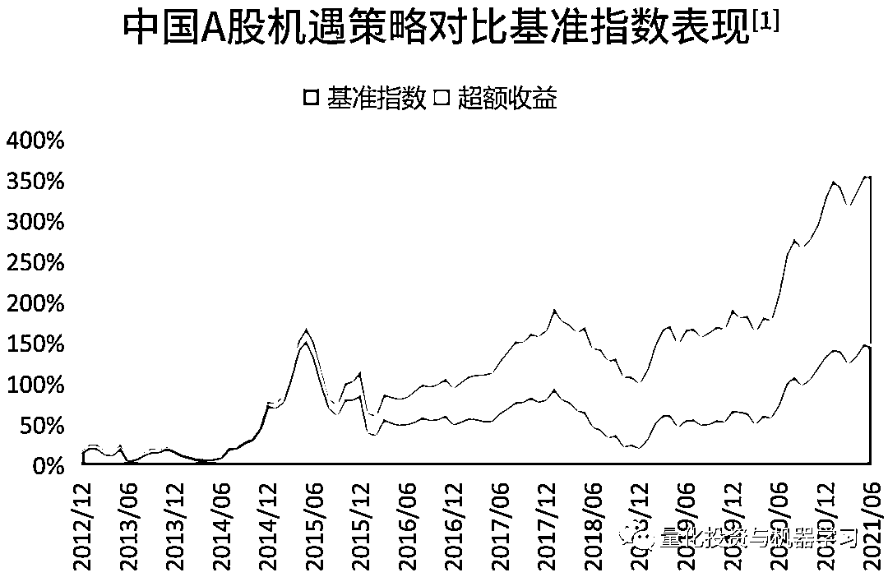
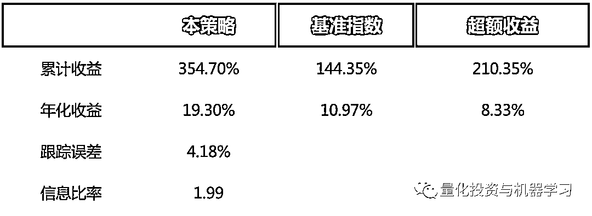
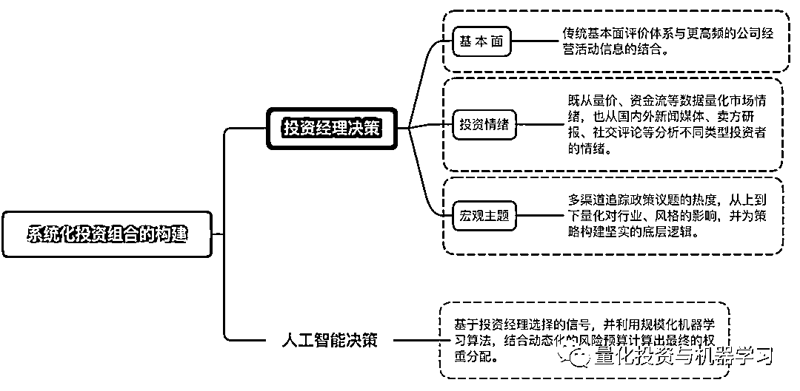
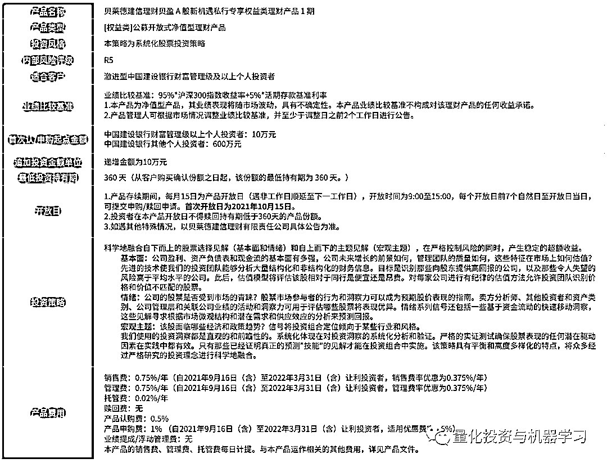

# 贝莱德建信理财：A 股系统化主动投资策略

> 原文：[`mp.weixin.qq.com/s?__biz=MzAxNTc0Mjg0Mg==&mid=2653319153&idx=1&sn=53580ba349b634dd152a857a8231a40f&chksm=802dade4b75a24f2965f5627505bf5fe94d7e326a4ca4ea76b056393eb36c7e0785ff8f8b38a&scene=27#wechat_redirect`](http://mp.weixin.qq.com/s?__biz=MzAxNTc0Mjg0Mg==&mid=2653319153&idx=1&sn=53580ba349b634dd152a857a8231a40f&chksm=802dade4b75a24f2965f5627505bf5fe94d7e326a4ca4ea76b056393eb36c7e0785ff8f8b38a&scene=27#wechat_redirect)

# 

量化投资与机器学习微信公众号，是业内垂直于**量化投资、对冲基金、Fintech、人工智能、大数据**等领域的主流自媒体。公众号拥有来自**公募、私募、券商、期货、银行、保险、高校**等行业**20W+**关注者，连续 2 年被腾讯云+社区评选为“年度最佳作者”。

**前言**

贝莱德（BlackRock），全球资产管理行业的巨头。在短短 30 多年的时间，依靠着对**风险管理、持续创新以及客户至上**等三大信条的坚持，飞速成长为全球管理规模最大的资产管理公司之一。这一切离不开其出众的资产管理能力，及其业界领先的风险管理能力，而这得益于贝莱德对于科技的执着与投入。

在科技方面的持续投入，提高了信息整合及分析的准确性和时效性，为投资决策提供强有力的依据，结合金融市场瞬息万变的真实情况，模拟各类资产可能出现的各种风险情景，贝莱德这种注重风控的理念，能够覆盖到投资的全生命周期管理。也正是由于持续的科技赋能，**贝莱德能够很早就通过科技手段构建出独有的投资信号库，针对不同市场遴选出有效信号进行主动量化投资。**

**贝莱德与中国**

作为最早一批投资于中国的外资机构投资者，贝莱德早在 2004 年就通过持股中银基金进入国内市场，并一直积极通过 QFII、RQFII、沪深港通等参与 A 股市场投资。

**今年 5 月，由贝莱德、建设银行以及新加坡主权基金淡马锡合资组建的贝莱德建信理财正式获批成****立。今年 6 月，贝莱德基金在上海正式开展公募基金业务。**6 月 10 日，贝莱德中国区负责人汤晓东（Tony Tang）接受了第一财经等记者的采访时表示，公募基金和合资理财公司将发挥各自专长，定位不同风险偏好的目标群体。目前，合资理财公司首只产品已经开始在建行发行，策略为系统化主动股票投资，**贝莱德将充分利用在全球主动量化投资策略（贝莱德称之为“系统化主动股票投资策略”）上的优势****和建行的渠道优势。**

公众号在与贝莱德建信理财的投资团队交流中得知，早在 2012 年，贝莱德就已经开始对中国股票进行量化投资，借鉴全球主动量化投资策略在 A 股的应用，通过 QFII 帮助海外客户投资中国市场，9 年来创造了年化近 19.3%的收益*。早在 2018 年 6 月 7 日，贝莱德当时在华设立的独资私募基金登记备案的第一只境内私募基金（中国 A 股机遇私募基金 1 期）也采取了类似的策略，利用贝莱德在科技及数据分析方面的专业优势以获取投资回报。不过当时的目标群体为机构与高净值个人。谈到这个策略时，贝莱德建信理财的投资团队给我们分享了这其中的故事：

*“我举一个具体的例子，2012 年，一个机构客户开始投资中国 A 股，主动来找到贝莱德，希望我们研究一个策略。这位客户以前是贝莱德全球股票的一个策略投资人，后来他们想要投资中国 A 股，就在投资管理人里选择了贝莱德。我们这一策略已经在全球运作了很多年，对中国研究之后发现，中国市场超额收益比海外更丰厚。**我们就向客户表明，如果超额收益是你想要追求的，那么相比海外市场，中国市场无疑是一个更理想的选择，但是中国市场本身的波动也要比海外市场更大一些。投资人说没关系，长期对中国有信心，长期回报加上策略恒定的超额收益，累积起来时间拉长，投资回报应该会相对可观。投资人投资了这个策略很长时间，对策略很了解，他们所需要的正是我们所能提供的，从 2012 年开始投资到现在他们也比较满意。*

*如果单年度来看这个产品，和同类基金相比，可能称不上很出类拔萃，但是从 9 年的长期维度来看，我们的产品创造优秀业绩的能力就凸显出来了。我们从来不以单纯追求排名为目标。一般来说，我们把市场同类的基金分为四等分，如果每一年我们都稳定在第二象限里面，也就是 50%-75%，那么 5 年以上我们肯定就在第一象限。这是在任何市场都成立的一个规律。”*

当前，贝莱德全球系统化主动股票投资的总规模超过 1500 亿美元，其中 A 股策略的规模约为 83.5 亿美元。是什么样的策略体系带来了其稳健的回报？

数据来源：贝莱德，Wind；截至 2021 年 6 月 30 日[1]：为同一策略的美元海外基金的费前收益，基准指数为 MSCI ChinaA Onshore Net Total Return(USD)。过往业绩仅供参考，不代表未来表现，不等于实际收益，海外团队管理的策略业绩不构成贝莱德建信理财业绩的保证。理财非存款，产品有风险，投资须谨慎。

**贝莱德 A 股系统化投资策略**

贝莱德的量化投资核心是基于价值投资，通过从基本面、宏观、投资者情绪等不同角度，挖掘有用的投资信号，寻找优质标的。这是一种 Top-down 与 Bottom-up 结合的投资策略，基于合理的投资逻辑，通过对多维度海量数据的研究分析，系统化构建投资组合、挖掘投资机会的量化投资体系。贝莱德 A 股系统化主动投资策略，沿用全球系统化主动投资策略的整体框架，针对 A 股市场的数据维度及特征，通过追踪全市场的数据信息，力求全面捕捉投资信号，帮助投资者充分参与中国经济增长下的资本市场发展。

**系统化投资组合的构建**

贝莱德系统化主动投资策略是投资经理决策与人工智能决策相结合的过程。**通过将股票未来回报的预期驱动因素**系统化地融入到投资组合的构建过程中，再结合风险模型及交易成本的预测，生成股票持仓的权重。

**股票未来收益的驱动因素**

贝莱德系统化主动投资策略将股票未来收益的驱动因素分为三大类：**基本面、宏观主题、投资情绪**。每个大类又有很多细化的影响因素，称之为信号。每个信号，都遵循一个投资逻辑。信号的挖掘也正是从很合理的经济学或者心理学逻辑开始，通过分析数据来验证或证伪这个罗辑。这个是一个非常严谨、漫长的过程，最关键的是每个信号都必须满足以下几点：**第一，逻辑合理；第二，信号要有超前性，能先于其他市场参与者预测股价的波动；第三，信号规律要有普适性，不能只适用于小盘股或某个行业、某个市场；第四，与已有的信号的相关性要低。**只有满足以上条件，一个信号才有机会被放到库里面，然后被选中到投资组合中。

信号构建是投资经理决策重要的组成部分，通过各维度全方位捕捉中国 A 股市场投资信息，将满足条件的优质股票纳入投资组合。首先，这是一个自上而下分析行业与主题与自下而上选股相结合的过程，投资决策的过程主要覆盖以下三个方面：

*   通过系统性分析与跟踪国内外宏观的经济与政策的变化，并量化其对公司基本面的影响，筛选**有宏观主题或政策利好的股票；**

*   通过公司营收、利现金流及估值的多个维度，**筛选有基本面表现优异的股票。**

*   通过分析市场参与者对市场的看法、机构投资者的仓位信息及股票量价数据反应的交易行为等，筛选**有积极投资者情绪的股票。**

在以上三个维度，除了使用传统的量化投资信号，贝莱德建信理财和全球投研团队也结合 A 股市场的信息特征进行创新，通过对更多元的另类数据的分析研发具有独特价值的投资信号，并结合交易成本的考量和严谨的风险预算和管理，从多个细节提升了策略信号的捕捉空间和整个策略运行的长期稳定性。

**全方位的捕捉宏观政策变化信息**

中国政府通过官方媒体（如人民日报）来“释放”政策信号，政策会影响到基本面及投资情绪，从而影响到股票收益。除了对传统的宏观经济指标的监测，贝莱德系统化投资策略持续创新，也会**通过更多维度，全方位系统化地捕捉政策变化信息。**

突如其来的新冠疫情以及随之而来的全球经济贸易脱钩，引起了全国范围内围绕“立足国内大循环，促进内外双循环”主题的关注和讨论，从中央政治局会议到企业家座谈会，中国提出的这种新发展格局引发了媒体及金融机构的广泛关注。诸如此类的讨论及关注势必会对股票市场的各行业板块产生不同的影响。如何通过系统化的方式捕捉这些关注的强弱，是贝莱德建信理财 A 股系统化投资策略首先要解决的问题。通过 NLP 文本分析的技术手段，对多个新闻媒体及大量的券商研报进行分析，可以系统化跟踪与各主题相关的公司及热度。比如通过对人民日报及券商研报关于“发展国内龙头”等相关议题的讨论次数，可以统计出在过去 5 年中，该政策议题的热度呈现了明显的上升趋势。**随着 2020 年后半段中美贸易局势再次紧张化，该信号在行业/板块配置方面显示出了十分良好的效果。**

**多维度检测公司基本面**

基本面研究是评估公司质量的主要方法，财务报告及公告又是了解公司经营信息与经营状况的主要来源，**得益于中国企业许多特殊的信息披露要求**，这些信息已经被广泛地应用到传统的量化投资策略中。

除了这些维度的信息，贝莱德 A 股系统化投资策略从多维度更深入地评价公司基本面的情况。比如，优质的公司一般会得到市场上优秀投资者的关注，投资者会通过实地调研等方式了解相关公司的经营情况。通过跟踪公司的机构关注度（如机构拜访的数量统计）发现其与公司股价表现存在明显相关性，那么机构关注度就有可能作为信号加入到信号库。

**公司招聘信息**中也隐含了公司的经营状况及未来发展计划，招聘人数的增长预示着公司的经营状况良好，有继续扩张的意愿。可以从以下两个维度分析公司的招聘信息。首先，在同一个行业，不同公司的招聘需求存在技能及资质要求上的差异，通过分析不同公司招聘岗位的技术集中度，**其中更加注重技术职位招聘的公司，说明更注重技术能力的建设，在未来发展中将占据更加有利的位置。**其次，通过分析不同行业招聘趋势的变化，也可以掌握公司所处行业的人才需求状况。

**借助 NLP 模型更好地洞察投资者情绪**

随着近年来 NLP 模型与网络爬取技术的发展，我们可以从海量文本中提取关注信息并量化投资者情绪。不同类型的投资者对于市场有不同的情绪，卖方分析师、海内外机构投资者及个人投资者都会在不同的地方发表对市场的看法。系统化地捕捉全市场的情绪需要**覆盖更多更全的信息**，从不同的投资者群里获取对于市场的见解，例如**社交媒体、卖方研究报告和国内外中英文媒体等**。不同投资者表达情绪的方式也不一样，需要针对不同的文本数据训练更具有针对性的 NLP 模型，提取更丰富的隐含信息。例如，对于个人投资者，其中**社交媒体**是 A 股市场主要超额收益的来源，通过 NLP 模型对每日数十万个帖子进行分析，可以捕捉个人投资者对市场情绪的变化。

**人工智能决策：规模化机器学习算法处理数据**

基于投资经理选择的信号，并利用规模化机器学习算法，结合动态化的风险预算计算出最终的权重分配。首先，规模化的机器学习技术能够显著提高策略对于分析数据容量的上限。其次，基于符合经济学逻辑的信号库，结合先进的机器学习模型，能够更大限度地捕捉信号间的非线性关系。在这样一种从上至下的逻辑体系下，虽然已经过去 9 年时间，但策略的整个框架没有改变，选择信号的时候依然是三类：宏观、基本面及投资情绪。但是到每一类中选择的具体信号会改变。比如 2012 年的信号和现在的信号已经非常不一样了，甚至同类别的信号的比例也有很多调整。因为不同的时代，有不同的方法去构建信号，在 2012 年很难想象有这么先进的 NLP 对文本进行情绪分析，但现在我们做到了。未来可能会有更先进的技术，更多维度的数据信息，但整体的逻辑框架还是不会改变，这是策略一致性的体现，也是策略能够经过市场多年检验获取稳定收益的原因。

**“贝盈 A 股新机遇”建设银行私行专享权益类理财产品**

就在本月初，贝莱德建信理财开始发行**“贝盈 A 股新机遇”私行专享权益类理财产品 1 期。这款产品将采用前文所介绍的贝莱德 A 股系统化投资策略**，将表现稳健的贝莱德 A 股旗舰投资策略带给中国投资者。公众号也在第一时间拿到了产品要素表：

公众号在与贝莱德建信理财投资团队交流的过程中，团队一直在强调全球架构、本土团队的理念，本土团队有一个很重要的任务是如何最大程度地运用全球资源，根据当地市场的需要进行全球资源的本土化，让这些资源能被运用到实际投资之中。公众号相信借助贝莱德全球领先的资源及对中国市场的认识，加上本土团队对本土市场有着更深度以及更多元角度的理解，**“贝盈 A 股新机遇”**应该能够成为中国本土投资者资产配置中的理想选择。

*文中提到的业绩数据为截至 2021 年 6 月 30 日的数据。过往业绩仅供参考，不代表未来表现，不等于实际收益，海外团队管理的策略业绩不构成贝莱德建信理财业绩的保证。理财非存款，产品有风险，投资须谨慎。

关于该产品更详细的介绍，请点击**“阅读原文”**