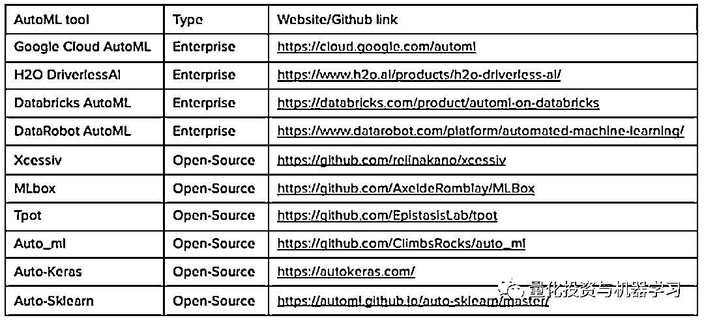

# Quant 值得拥有的 AutoML 框架

> 原文：[`mp.weixin.qq.com/s?__biz=MzAxNTc0Mjg0Mg==&mid=2653319132&idx=1&sn=8d78f10e13b1e5bce42ac3bd944a13fb&chksm=802dadc9b75a24dfedad18a95b896f78c80313cb0e326d827ffd3939697c1c393c5bbc84574d&scene=27#wechat_redirect`](http://mp.weixin.qq.com/s?__biz=MzAxNTc0Mjg0Mg==&mid=2653319132&idx=1&sn=8d78f10e13b1e5bce42ac3bd944a13fb&chksm=802dadc9b75a24dfedad18a95b896f78c80313cb0e326d827ffd3939697c1c393c5bbc84574d&scene=27#wechat_redirect)

# 

量化投资与机器学习微信公众号，是业内垂直于**量化投资、对冲基金、Fintech、人工智能、大数据**等领域的主流自媒体。公众号拥有来自**公募、私募、券商、期货、银行、保险、高校**等行业**20W+**关注者，连续 2 年被腾讯云+社区评选为“年度最佳作者”。

自动机器学习，也称为 AutoML，是将机器学习应用于实际问题的端到端过程自动化的过程。典型的机器学习过程包括几个步骤，包括数据的摄取和预处理、特征工程、模型训练和部署。在传统的机器学习中，Pipeline 中的每一步都是由人来监控和执行的。自动机器学习工具（automatic machine learning）旨在自动化这些机器学习的一个或多个阶段，使非专家更容易建立机器学习模型，同时消除重复性任务，使经验丰富的机器学习工程师能够更快地建立更好的模型。

TPOT 框架：AutoML 自动化流水线示意图 

AutoML 解决方案已经出现很长时间了。像 AutoWeka 这样的早期 AutoML 解决方案起源于 2013 年的学术界，紧随其后的是 Auto-sklearn 和 TPOT。这引发了机器学习的新浪潮，在接下来的几年里，许多其他的 AutoML 解决方案，包括 Auto-ml 和 Auto-Keras 进入了市场。与此同时，像 H2O.ai 和 DataRobot 这样的初创公司也推出了自动化解决方案。最近，像亚马逊、谷歌和微软这样的公司也加入了这股潮流。

一些解决方案，如 AutoWeka，Auto-Sklearn，TPOT，H2OAutoML 是完全开源的，而 DataRobot，Amazon Sagemaker，Google 的 AutoML 和 DriverlessAI 则是面向企业的应用。

**AutoML 的使用情况**

以下是根据 Kaggle’s State of Data Science and Machine Learning 2020 调查结果得出的最著名和最常用的 AutoML 工具:

AutoML 工具的使用情况：

与 Kaggle’s State of Data Science and Machine Learning 2019 的调查相比如下：

可以看出：

*   与 2019 年相比，2020 年的 AutoML 工具得到了更好的应用；

*   开源 AutoML 工具的采用率高于企业 AutoML 工具。AutoSklearn 显示了最大的用户增长。在企业领域，Google Cloud 获得了 11% 的用户增长，而 H2O 无人驾驶 AI 获得了 4% 的用户增长。

**社交媒体分析: Twitter 和 Google Trends**

此外，我们还分析了 Twitter 和 Google 的趋势，以便更清楚地了解大家对 AutoML 的普遍看法。

**AutoML 市场规模**

AutoML 在 2019 年产生了 2.7 亿美元的收入，预计到 2030 年将达到 145.12 亿美元，在预测期间(2020-2030 年)的复合年增长率为 43.7% 。考虑到这一点，我们相信 AutoML 还没有达到顶峰，对 AutoML 的兴趣将继续增长。

**AutoML 给我们带来了什么？**

AutoML 解决方案可以针对机器学习过程的不同阶段。并不是所有的方法都适用于同一范围。以下是可以自动化的步骤:

*   数据准备 
*   数据列的类型识别，例如，布尔，离散数字，连续数字，或文本
*   任务检测; 例如二元分类, 回归, 或聚类
*   特性化处理
*   特性工程、特征提取、特征选择
*   元学习 、迁移学习
*   有偏数据处理、缺失值的检测和处理；不平衡数据的处理
*   模型选择、超参数优化
*   时间、内存和复杂性约束下的处理流程（Pipeline）的选择
*   评价指标和验证流程的选择
*   数据泄漏检测、错误配置检测
*   可解释性、对所得结果的分析
*   部署

**AutoML 解决方案的比较**

**开源 vs 企业**

AutoML 的开源和企业解决方案非常不同: 大部分开源解决方案只能自动化算法选择和超参数调整，而企业解决方案可以做得更多(参见“我们能从 AutoML 工具中期待什么”一节)。

**H2O Driverless AI**

*   它可以从任何数据源中摄取数据，包括 Hadoop，Snowflake，S3 object storage，Google BigQuery 等。
*   自动可视化绘图、图形和图表，以帮助理解数据形状、异常值、缺失值等。数据科学家能够快速发现数据中的偏差之类的东西的地方。在某种程度上，自动可视化有助于启动 EDA 过程。
*   机器学习的可解释性使我们了解什么样的模型被生成，以及哪些特征被用来建立模型。Driverless AI 的模型的每一个预测都可以向企业用户解释，因此该系统甚至对于受监管的行业也是可行的。
*   可以为表格数据、文本、图像、视频和时间序列数据创建世界级的模型。
*   自动化文档为整个特性工程过程提供了深入的解释。
*   整个过程是通过一个图形用户界面数据库来完成的，这使得即使是一个数据科学家新手也很容易立即就能有所作为。
*   高度可定制: 可以上传自己的模型，Transformers 和 Scorers。
*   能够在不丧失影响优化的能力的情况下充分利用自动化的好处。

**Google Cloud AutoML**

*   Google AutoML 由几个产品组成: AutoML Natural Language, AutoML Tables, AutoML Video Intelligence, and AutoML Vision。最近，谷歌发布了 Vertex AI 它将所有的 AutoML 产品和 Google 的其他 AI 产品统一在一个统一的 API、客户端库和用户界面中。

*   可配置性不如 H2O Driverless AI

*   模型可视化的缺失导致很难进行模型的迭代

**H2O-3**

*   **开源版本的 H2O。**

*   内存中，分布式，快速，可扩展的机器学习和预测分析平台，允许您在企业环境中建立基于大数据的机器学习模型并快速生产化。

*   它使开发变得更容易和更快，即使对于新手也是如此。

*   支持最广泛使用的统计和机器学习算法，包括梯度增强机器，广义线性模型，深度学习等。

*   行业领先的 AutoML 功能，可以自动运行所有的算法和它们的超参数，生成最佳模型的排行榜。与其他开源 AutoML 解决方案相比，它具有高度的可配置性。

*   包含模型可解释性接口，使用一个函数就可以生成了多个可解释性的方法并进行可视化。

*   H2O Flow 是 H2O-3 中的一个附加用户界面，您可以随意使用。它是一个基于 web 的交互式环境，允许您将代码执行、文本、数学、图表和富媒体组合到一个文档中，类似于 iPython Notebooks。这个直观的界面允许你建立你的机器学习模型，而不需要一行代码。这消除了熟悉 H2O SDK 的需求，并允许任何人构建机器学习模型。

**H2O-3 是目前使机器学习 AutoML 最好的开源平台。**其完整的范围和基于 H2O 流的网络界面使其成为开源解决方案的首选。我们能够在没有一行代码的情况下从头到尾构建一个机器学习项目。

长期来看，AutoML 并不能取代数据科学家，但 AutoML 的出现在很多时候可以极大的提高模型生产的效率，尤其在初期探索的阶段。