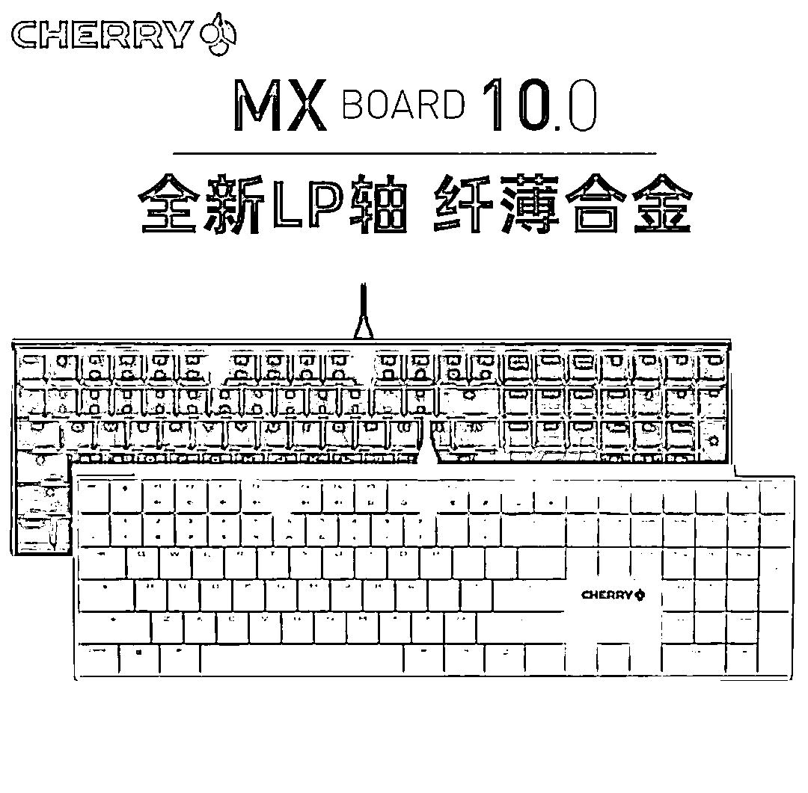

# 大厂公司名新解：量化私募版

> 原文：[`mp.weixin.qq.com/s?__biz=MzAxNTc0Mjg0Mg==&mid=2653319107&idx=1&sn=4446a5953e125689a6f50b3bb1d01eb9&chksm=802dadd6b75a24c023773463a096c83b228256faf2179c0ffe11861180bb61c469467e96f3f8&scene=27#wechat_redirect`](http://mp.weixin.qq.com/s?__biz=MzAxNTc0Mjg0Mg==&mid=2653319107&idx=1&sn=4446a5953e125689a6f50b3bb1d01eb9&chksm=802dadd6b75a24c023773463a096c83b228256faf2179c0ffe11861180bb61c469467e96f3f8&scene=27#wechat_redirect)

# 

量化投资与机器学习微信公众号，是业内垂直于**量化投资、对冲基金、Fintech、人工智能、大数据**等领域的主流自媒体。公众号拥有来自**公募、私募、券商、期货、银行、保险、高校**等行业**20W+**关注者，连续 2 年被腾讯云+社区评选为“年度最佳作者”。

昨天一夜之间，互联网巨头们仿佛都在自己公司的名字里找灵感。这场始于美团的“造句活动“。比如：

> 携程：共同携手漫步人生旅程
> 
> 京东：京城东边的新型实体 
> 
> 拼多多：让爱打拼的人，多一点财富，多一点幸福
> 
> ···

这让其他公司跃跃欲试，开始了“企业级的理解”。营造出一种奇妙的喜剧效果，让广大网友纷纷效仿，加入了狂欢之中。

量化圈怎么可以闲着，来吧！！！

**免责声明：**以下观点、言论及其他信息仅作参考和资讯传播之目的，不代表公众号赞同其观点或证实其描述。

一切皆可解读。如果你有更好的 idea，欢迎各位管理人和量化爱好者踊跃留言！

**留言区点赞第一名**的读者****

将获得公众号送出的价值近**1800****元**的**幸运大奖：**

**颜色自己选**********

**截止日：**2021 年 9 月 3 日  13:00****