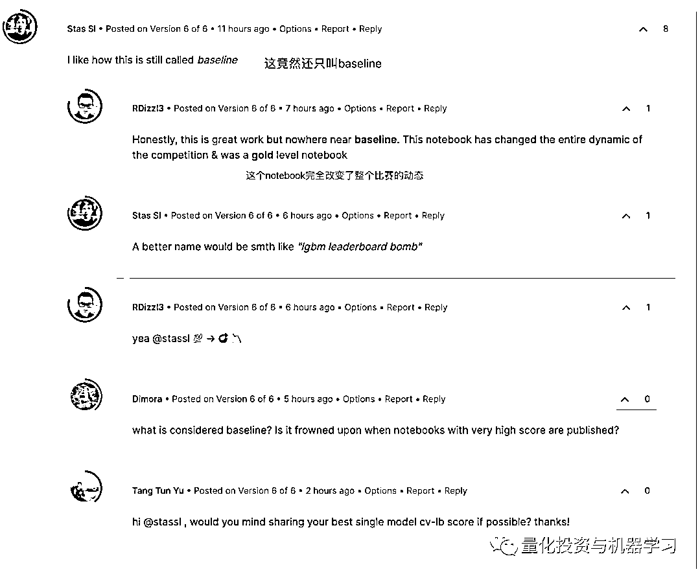

# Optiver 波动率预测，金牌大神开源代码！

> 原文：[`mp.weixin.qq.com/s?__biz=MzAxNTc0Mjg0Mg==&mid=2653318885&idx=1&sn=145fc153ccc8e9635ac121f68e988177&chksm=802dacf0b75a25e6093c221776b9a816c0ad85c89f5fc83c030d9457ae9e3fd81c825334cc8c&scene=27#wechat_redirect`](http://mp.weixin.qq.com/s?__biz=MzAxNTc0Mjg0Mg==&mid=2653318885&idx=1&sn=145fc153ccc8e9635ac121f68e988177&chksm=802dacf0b75a25e6093c221776b9a816c0ad85c89f5fc83c030d9457ae9e3fd81c825334cc8c&scene=27#wechat_redirect)

# 

量化投资与机器学习微信公众号，是业内垂直于**量化投资、对冲基金、Fintech、人工智能、大数据**等领域的主流自媒体。公众号拥有来自**公募、私募、券商、期货、银行、保险、高校**等行业**20W+**关注者，连续 2 年被腾讯云+社区评选为“年度最佳作者”。

**大奖在即！**

今年 6 月份，全球顶尖的电子交易做市商 Optiver 在 Kaggle 上发布了一个关于股票波动率预测的比赛，这是目前 Kaggle 上最火热的比赛，犹如当年 Two Sigma 的新闻数据预测股价的比赛。该比赛的截止时间是 2021 年 9 月 27 日，**总奖金为 10 万美金**，最终排名前 10 的团队将分得这部分奖金。截止今天，参赛队伍已经达到了 2719 支，当前比赛排行的前十支队伍如下：

就在一天前，整个排名还不是这个迹象，因为这么重要激烈的比赛，尽然有金牌区的大神 AlexiosLyon 公开了源码，公开代码的时候排名大概在 14 名左右，现在很多参赛队伍融合大神的代码之后，排名都上去了，AlexiosLyon 当前排名在 38 名，这也是目前比赛前 50 名唯一公开源码的 Submission。

我们来到了 AlexiosLyon 的 Kaggle 主页，他应该刚注册 Kaggle 不到一个月，两个公开的 Notebook 都是 Optiver 波动率预测比赛的，可以看出明显是为了这个比赛来的，而且一鸣惊人。

公开的 notebook “lgbm baseline”下面的留言也尽是各路网友的惊讶，而且又是 LGBM，看来数据比赛中 LGBM、XGboost 等真的是万金油。

每次 Kaggle 上有关金融领域的比赛，都能得到广泛的关注，前有 Two Sigma、Jane Street，今有 Optiver。在这些比赛中获得优异的成绩，也是自身能力强有力的证明。从另一个角度也看出，机器学习、数据科学在量化投资领域中越来越有用武之地。

**源码下载**

**后台回复**

***ORVP***

同时，Optiver 上海也正在招聘优秀的人才，欢迎投递哦!

**↓↓↓**

[Optiver | Quant Engineer 招聘（全职）](http://mp.weixin.qq.com/s?__biz=MzAxNTc0Mjg0Mg==&mid=2653317670&idx=2&sn=ed2bc98a5ecdbf0a9c1fa7184b1a4154&chksm=802da833b75a2125494198aab75a3c9786e231d75f0ae9edc50c1186817d2729ce78373c4045&scene=21#wechat_redirect)

