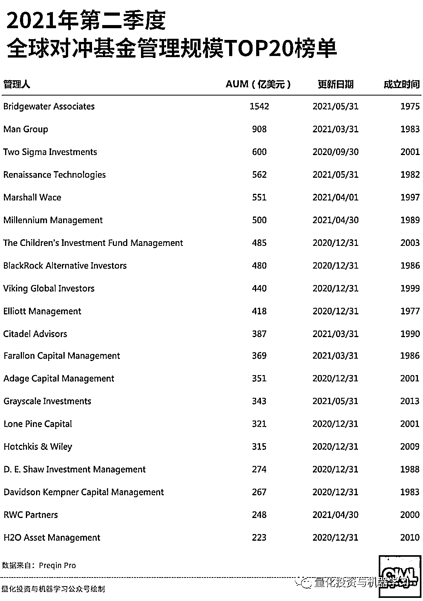
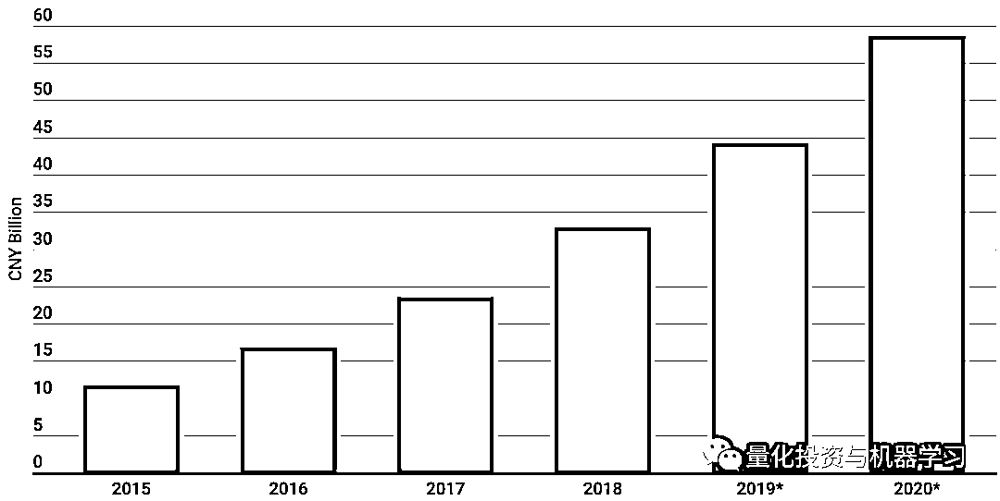
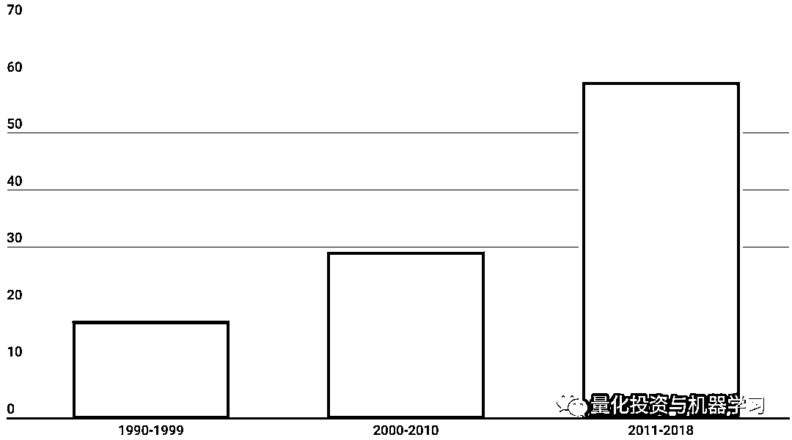
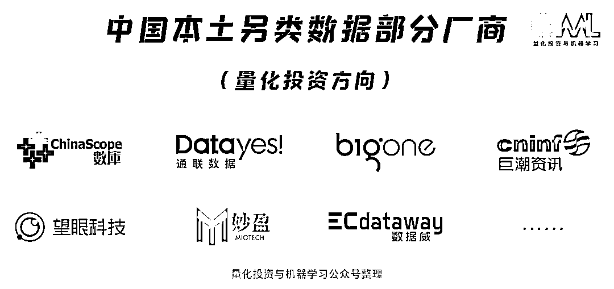
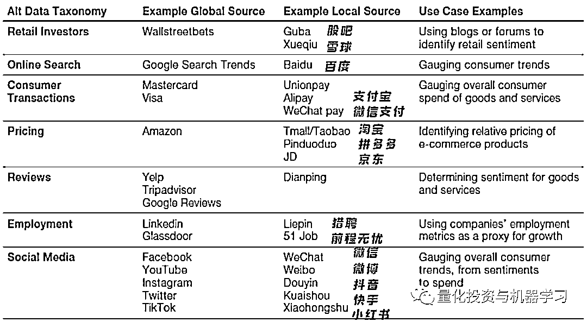
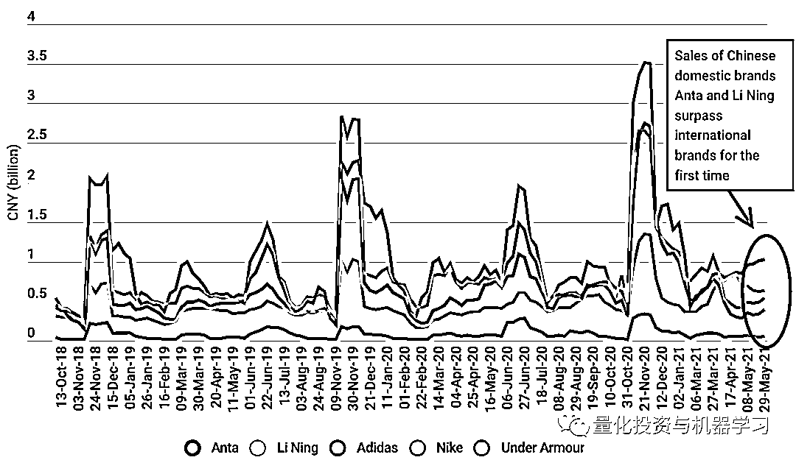
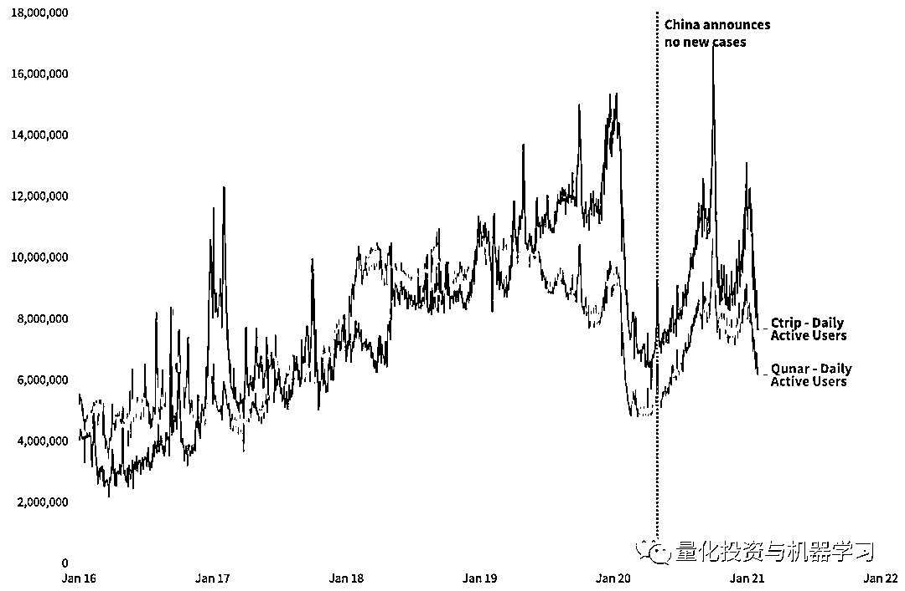
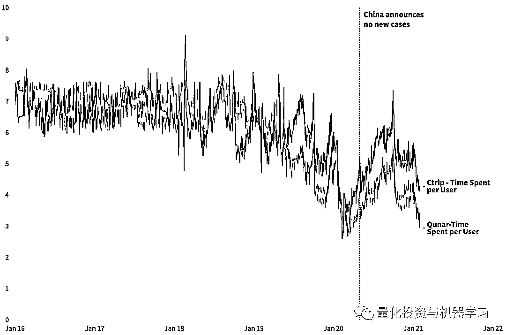
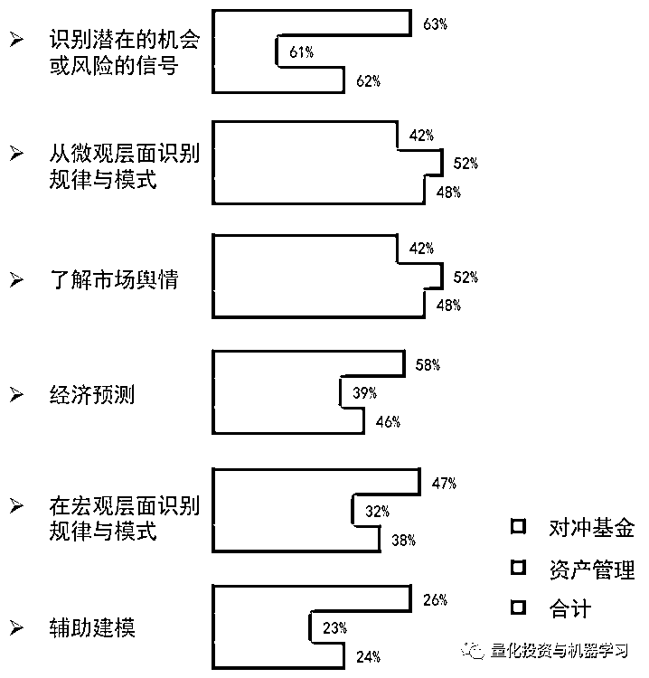

# Man Group：另类数据在中国！

> 原文：[`mp.weixin.qq.com/s?__biz=MzAxNTc0Mjg0Mg==&mid=2653318855&idx=1&sn=2143c8fea98b5e347f46ae411f20eb6f&chksm=802dacd2b75a25c4574b5092d62cfe4f3907bf5f52290a89df19dc8127a54275797528cc9d54&scene=27#wechat_redirect`](http://mp.weixin.qq.com/s?__biz=MzAxNTc0Mjg0Mg==&mid=2653318855&idx=1&sn=2143c8fea98b5e347f46ae411f20eb6f&chksm=802dacd2b75a25c4574b5092d62cfe4f3907bf5f52290a89df19dc8127a54275797528cc9d54&scene=27#wechat_redirect)

# 

量化投资与机器学习微信公众号，是业内垂直于**量化投资、对冲基金、Fintech、人工智能、大数据**等领域的主流自媒体。公众号拥有来自**公募、私募、券商、期货、银行、保险、高校**等行业**20W+**关注者，连续 2 年被腾讯云+社区评选为“年度最佳作者”。

作为一家全球顶级的对冲基金，Man Group 在人才、算力、数据等方面投入极多，这也为期优异的业绩与持续增长的规模添砖加瓦。

我们看到截止目前，Man Group 在全球对冲基金 AUM 排名中暂列第二，马上突破 1000 亿美元！ 

图片来自：公众号独家制作

**另类数据就是未来！**

**Citadel 前量化分析师 Jeffrey Ryan 在媒体上所说：“**在量化基金在分析来自社交媒体的实时数据时，处理庞大的非结构化数据集变得越来越重要！”****

**另类数据更多的应用于偏股票型的量化对冲基金。近于实时的另类数据流有助资产管理公司提前获得大量股票买入或卖出的信号。除此之外，传统资产管理公司也已经开始使用另类数据来帮助提升人工制定长期投资决策的质量。例如，英国资产管理公司 Schroders 在 2014 年推出了一个“数据洞察部门”（Data Insights Unit，以下简称“DIU”）。DIU 拥有 30 名数据科学家，他们分析各种另类数据，帮助投资组合管理团队制定中长期投资决策。**

****欧美市场也正在形成包括使用另类数据的资产管理经理、数据所有者和供应商的另类数据生态系统**。例如，Orbital Insights 和 Prattle 两家另类数据供应商，前者利用卫星图像估计原油库存，后者根据文本数据定量分析主要国家货币政策情绪。**

****从数据积累方面看****

**根据 IDC 的一份报告，2018 年全球有 33ZB 的数据，而这个数量预计在 2025 年会增长到 175ZB，这依赖于计算机算力的提升和存储设备技术的提高。**

****从另类数据公司数量上看****

**另类数据公司主要分为三类。一是原始数据提供者，这类供应商只收集最原始的另类数据，对于数据的处理程度最小；二是轻处理数据提供者，提供与金融资产相关的可视化数据；三是信号提供者，一般关注于某个特定行业，向资产管理公司提供打包好的量化投资信号。**

**今天，Man Group 对其在中国另类数据的使用上谈了几点自己的心得，事实表明：**中国的另类数据具有独特的优势，是海外数据不可替代与比拟的。如何发挥效益，如何保证数据安全，这是我们每个人需要思考的！****

****中国市场**** 

**Man Group 在对中国另类数据市场的规模评价为三个字：**Big！Big！Bigger！****

**自 2015 年以来，中国大数据市场的规模增长了近 600%（下图所示）。**

****

**图片来自：Man Group**

**同时，与中国相关的另类数据厂商的数量在过去几年也在快速增长（下图所示）。**

****

**图片来自：Man Group**

**以下是公众号整理的部分在量化投资领域有应用场景的另类数据厂商：**

****

**根据 IDC 的一份报告显示，2018 年全球有 33ZB 的数据，而这个数量预计在 2025 年会增长到 175ZB。AlternativeData 的数据也印证了这一点，2018 年全球另类数据公司已增长到近 400 家，国内另类数据厂商大约占 100 家。目前中国已经超过了 200 家。**

**从市场空间上看，AlternativeData 统计表明，截至 2017 年全球已有约 800 支基金利用另类数据做投资决策，2017 年投资机构对另类数据的投入规模约为 4 亿美金，行业正处于快速发展期。预计从 2021 年开始到未来的 10 年期间，国内每年新成立另类数据厂商可达几十家乃至 100 家，每年吸引投资达数十亿人民币。**

### ****数据也要入乡随俗****

**同时，投资者需要理解哪些数据具有预测能力。13 亿中国消费者不像西方消费者那样通过谷歌、Twitter 或 Wallstreetbets 来产生数据。相反，他们在很多社交软件、流媒体等平台产生大量的数据：**

****

**图片来自：Man Group**

**比如：天猫数据显示了中国消费者如何从耐克、阿迪达斯等国际品牌，转向安踏、李宁等国内品牌。这种现象是无法通过全球消费者相关数据获得的。**

****

**图片来自：Man Group**

**同样，通过使用中国本土的另类数据，可以有效地监测整个行业的趋势。例如：我们使用来自携程和去哪儿的日活跃用户数量、用户在 APP 上的总时间以及每个用户所花的时间。正如我们所预料的，随着新冠疫情的出现，其 APP 使用量急剧下降。透过此类数据，投资者能够观察到中国消费者对旅游的兴趣保持到何种程度，来配合相应的对策。**

****

**图片来自：Man Group**

****

**图片来自：Man Group**

****目前国内使用另类数据的多为对冲基金、二级市场基金及部分一级市场基金**。**

**买方对另类数据的使用方式：** 

****

**图片来自：中信证券**

**另类数据可以**给基金经理带来五点优势：****

*   ****更大体量的数据和信息****

*   ****新的洞察力****

*   ****竞争优势****

*   ****可靠性****

*   ****效率****

**虽然基金经理使用另类数据寻找到新的阿尔法只是时间问题，**但并不是所有另类数据都有潜力可以帮助基金公司获取市场阿尔法**，因此另类数据公司在收集、清洗数据的同时，需要基金经理来评判数据是否有价值，同时高效的处理和应用将是降低成本和提升效率的关键，因此**另类数据公司应当具备机器学习等技术开发能力和高效的产品策略**。**

**同时，Man Group 对有效处理数据，对相关人士/机构提出了四个考虑因素：**本土文化、语言技能、当地供应商、地方监管。****

**Man Group 也教育相关投资者：**

**为了更好地使用和挖掘中国本土的这些另类数据，投资者应该设法调整他们研究框架与流程。同时，最好与当地另类数据商合作，并关注那些不熟悉但很受欢迎的网站，而不是那些在全球常见的网站。最后，要确保技术团队和研究人员能够处理这些新数据的细微差别。**

**总结一句话：**数据也要入乡随俗，用起来才能得心应手！****

****最后****

**另类数据让我们感到充满了希望和创造力，但许多人拿”淘金热“作比喻——销售工具可能比寻找黄金本身更有利可图。**

**在许多对冲基金中，数据来源/采购是一项新的工作职能，它帮助数据供应商了解量化需求，并为大规模的量化研究细化数据。**

**很多量化机构在招聘岗位市，也都在寻找类似的人才：** 

****

****

****数据的内涵与外延在不断变化，分析人员的思维不能停留在传统数据的舒适圈中，必须与时俱进，保持开放。而目前，我们的时代也许正处于这一轮变革浪潮的高潮。****

**最后：**

***“Most problems don’t require more data. They require more insight, more innovation and better eyes. Information is what we call it when a human being takes data and turns it into a useful truth.”***

***- Seth Godin***

***”大多数问题无需大量的数据。它们需要更多的洞察力，更多的创新性和一双慧眼。当人类获取数据并将其转化为有用的真理时，我们称之为信息。“***