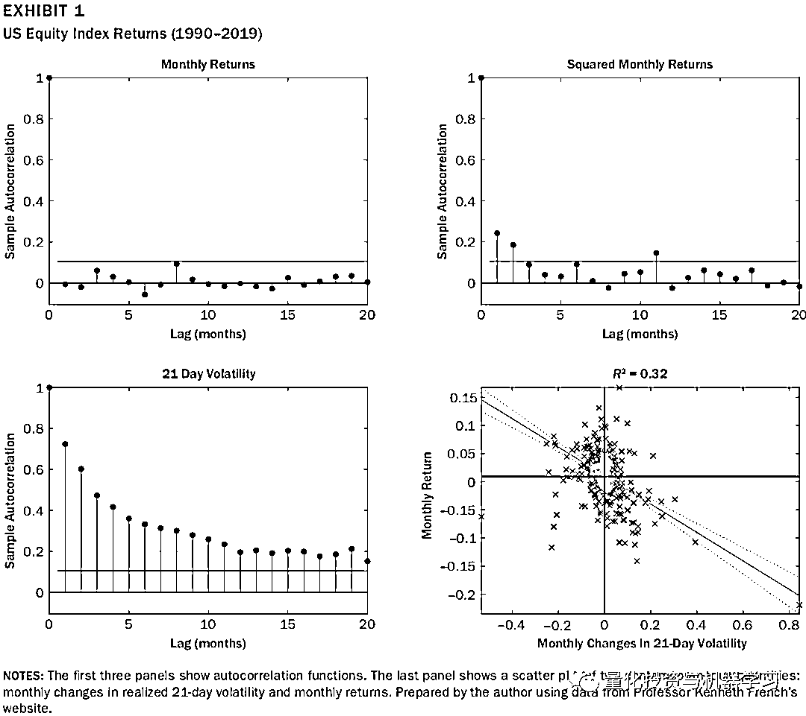
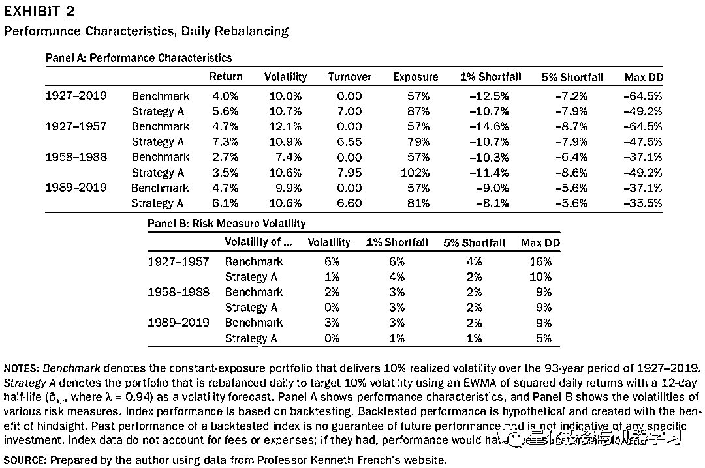
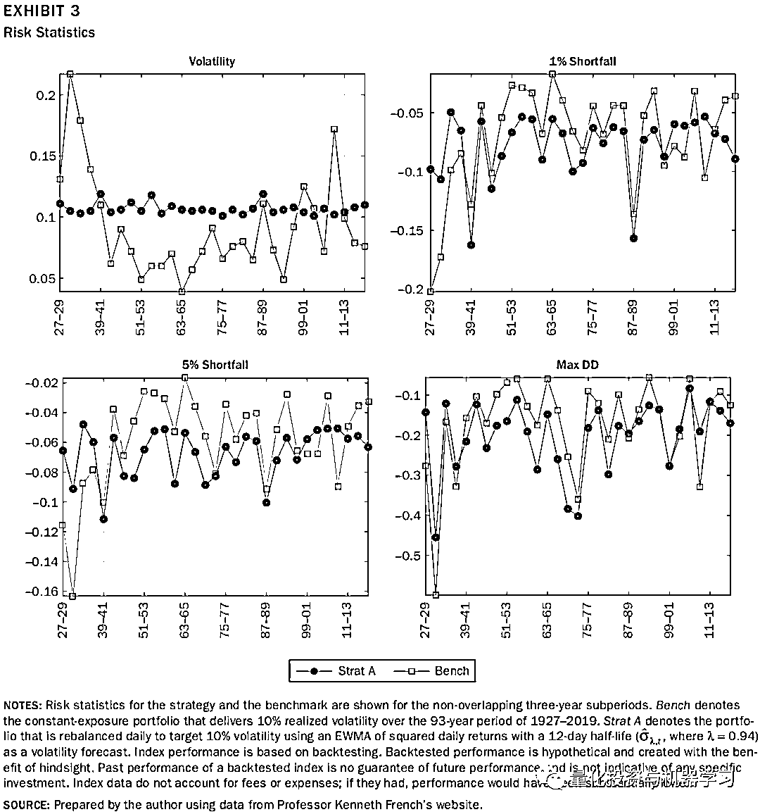
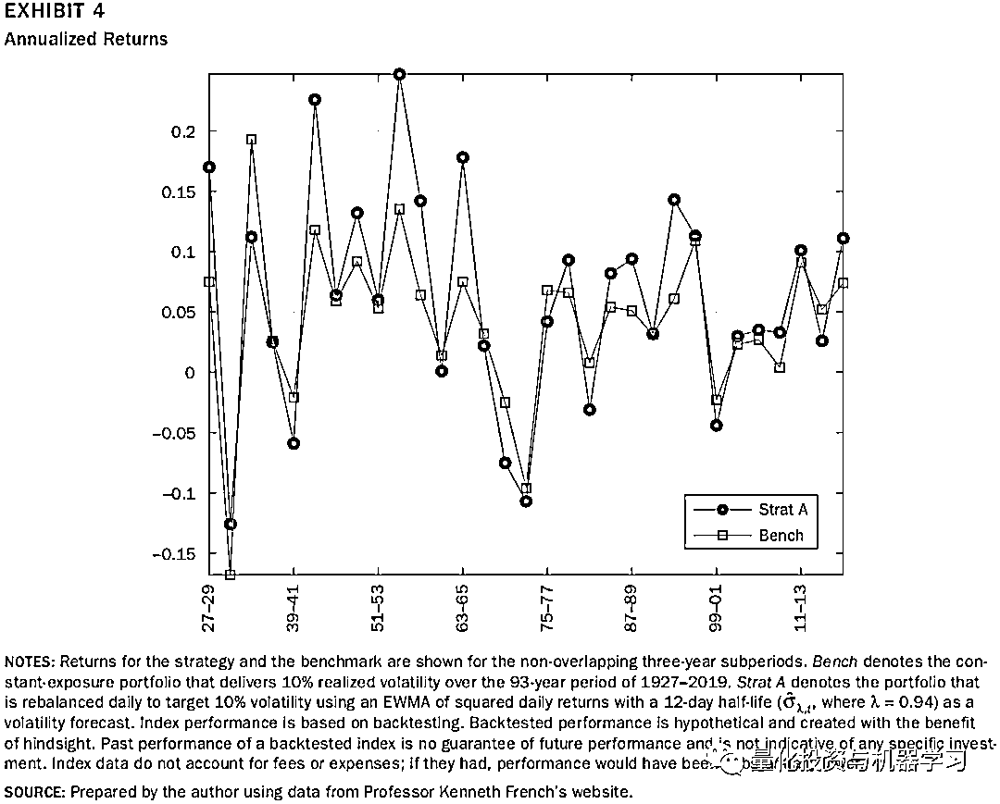
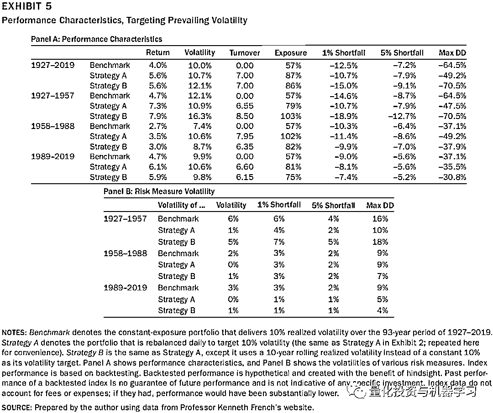
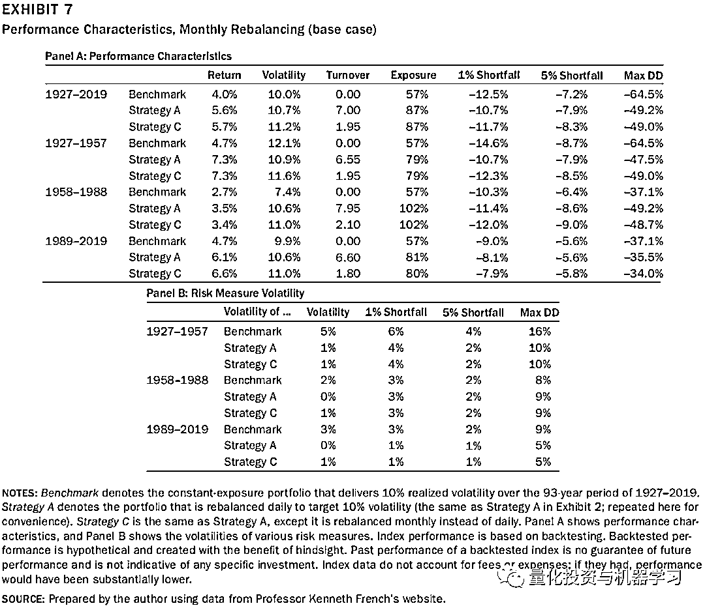
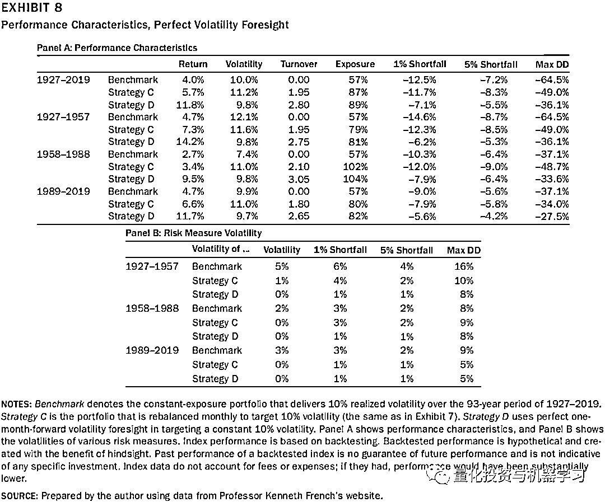
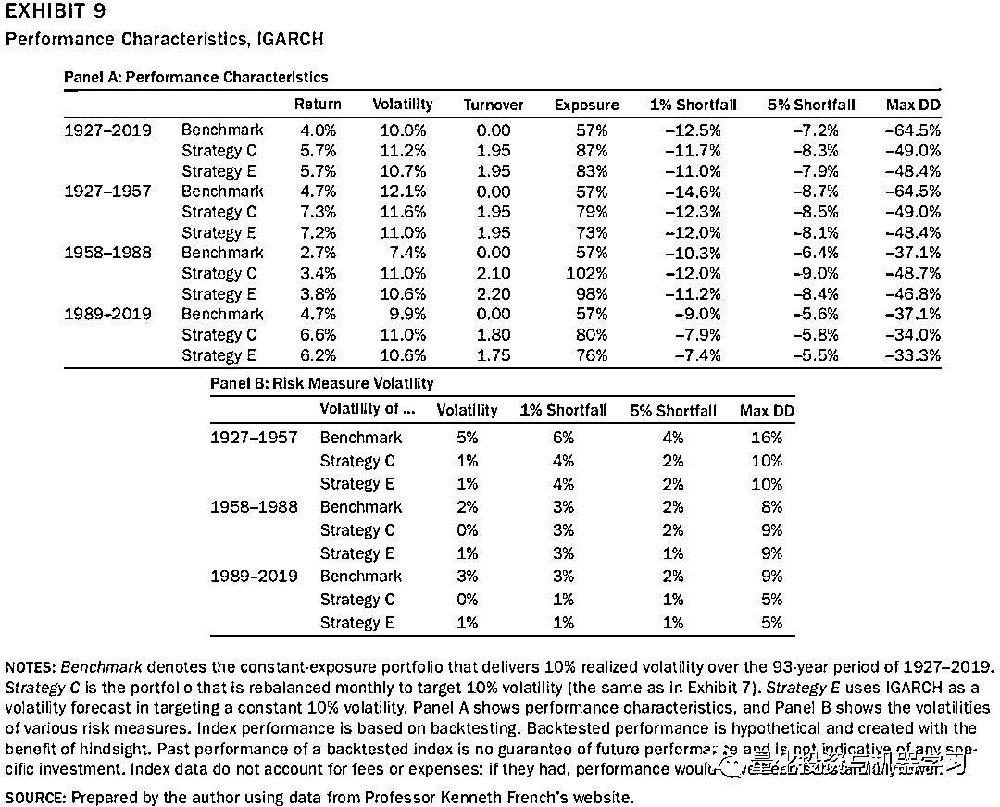

# 波动率目标策略，没有想象的那么简单！

> 原文：[`mp.weixin.qq.com/s?__biz=MzAxNTc0Mjg0Mg==&mid=2653318797&idx=1&sn=cead68a3df07593edcf9f4008b0fbd86&chksm=802dac98b75a258ea4b20f081ddd73dc36e2295e8488c2bc8dc50cca42bf29a1296275530c6c&scene=27#wechat_redirect`](http://mp.weixin.qq.com/s?__biz=MzAxNTc0Mjg0Mg==&mid=2653318797&idx=1&sn=cead68a3df07593edcf9f4008b0fbd86&chksm=802dac98b75a258ea4b20f081ddd73dc36e2295e8488c2bc8dc50cca42bf29a1296275530c6c&scene=27#wechat_redirect)

# 

量化投资与机器学习微信公众号，是业内垂直于**量化投资、对冲基金、Fintech、人工智能、大数据**等领域的主流自媒体。公众号拥有来自**公募、私募、券商、期货、银行、保险、高校**等行业**20W+**关注者，连续 2 年被腾讯云+社区评选为“年度最佳作者”。

# 

量化投资与机器学习公众号独家解读

量化投资与机器学公众号 *** ***QIML Insight——深度研读系列 ******是公众号今年全力打造的一档**深度、前沿、高水准**栏目。

公众号**遴选**了各大期刊前沿论文，按照理解和提炼的方式为读者呈现每篇论文最精华的部分。QIML 希望大家能够读到可以成长的量化文章，愿与你共同进步！

> **本期遴选论文** **来源：**The Journal of Portfolio Management August 2021
> **标题：**Volatility Targeting: It’s Complicated!
> **作者：**George Mylnikov

**前言**

*   **本文主要基于美国股票，探讨波动率目标（Volatility Targeting）的组合管理方法是否能够提高收益、降低尾部损失，获得更稳健的风险表现（Risk Profile）。**

*   **波动率目标确实能提供更稳健的收益，但是并不能减少尾部损失。**

*   **即使是更好的波动率预测模型能够提高收益，但也不能降低尾部损失。**

基于波动率目标（Volatility Targeting）的策略是指在资产的波动率比较低的时候增加头寸，在资产波动了较高的时候降低头寸，调整后组合的波动率到一个固定的目标值。为什么这么简单的策略会有效果，主要是因为波动率聚集（Volatility Clustering）和杠杆效应（Leverage Effect）。

一个有效的市场通常快速的使一些简单的赚取超额收益的方法失效，比如很难通过过去的收益赚取未来的超额收益，因为收益之间是序列不相关的（以美国股指收益率序列为例）。虽然收益率之间是序列不相关，但某些收益率的非线性转换确实序列正相关的。如下图 1 所示，左上图是收益率序列自相关系数，右上图是收益平方的序列自相关系数。可以看出，收益平方在 Lag=1,2 及 11 时是显著序列相关的。**另外一种非线性转换，即波动率，显示出了更强的序列相关性（图 1 左下图所示），这种收益波动率自相关的现象称为波动率聚集（Volatility Clustering）。**且波动率与收益之间呈现了明显的负相关性（如图 1 右下图所示），也就是说市场急剧下跌的时候，市场的波动更大，这种现象称为杠杆效应（Leverage Effect）。

如果一个组合根据一个固定的波动目标定期调仓，往往能获得更高的风险回报。当资产的波动上升，**波动率聚集**告诉我们，高波动的状态很可能会持续；**杠杆效应**告诉我们市场会下跌；此时，波动目标的策略会降低资产的头寸。当资产的波动下降，**波动率聚集**告诉我们，低波动的状态很可能会持续；杠杆效应告诉我们市场会上涨；此时，波动目标的策略会增加资产的头寸。**该策略另外一个可能的优点是，在市场高波动时降低仓位，可能会带来更低的尾部损失。第三个潜在好处是组合的风险表现更加稳健，**通常会用波动率的波动（Volatility of Volatility）或尾部损失的波动来度量组合的风险表现,这个指标通常是一些 Policy Portfolio（如 60%股票及 40%债券组合）的机构投资者比较看重的。

所以，正如前文所述，理论上波动目标的组合管理方法能够带来更好的收益及更低的尾部损失，获得更稳健的风险表现。但波动目标是否真的能带来这些好处，通过实证分析，作者得出了相关结论。

**实证分析**

在使用 Volatility Targeting 时，需要对未来组合的波动率做预测，作者使用了两种不同的波动率预测法：EWMA，以半衰期为 12 天，计算过去收益率平方的指数加权平均值；IGARCH。

测试了日度和月度两种调仓频率，测试时间为 1927 年 1 月 1 日至 2019 年 12 月 31 日，组合的标的为美国上市的股票及 1 个月的国债。波动率目标的值为 10%，即每个调仓期初，调整资产权重，使其使用以上两种方法计算的波动率为 10%。在测试过程中的基准组合，为整个测试区间（1923-2019）已实现波动率为 10%的组合。

> 如现在是 2019 年 11 月 1 日，波动率目标组合是 2019 年 11 月 1 日计算的预测波动率，构建的波动率为 10%的组合；而基准组合是固定权重，这个权重使得组合在 1923-2019 的已实现波动率为 10%。所以基准组合是一个参考，没有可投资性，因为用到了未来数据。

**实证结果**

图 2-3 是使用 EWMA 的日度调仓的波动目标组合与基准组合的实证结果，其中有很多有趣的发现：

*   首先在整个测试区间及各个子时间段，波动目标策略（Stragtegy A）的组合波动非常接近 10%（图 3），说明 EWMA 的方法很有效，这使得组合波动的波动变得非常小，特别是相对基准而言。

*   其次，Strategy A 的收益，在整个测试区间及各个子时间段，都优于基准。如图 4 所示，65%的时间段，Strategy A 的收益都要好于基准。

*   **第三，在尾部损失方便，Strategy A 相对于基准并没有明显的优势。**整个测试区间，波动目标策略 Stragte A 的 5%尾部损失要高于基准。

*   最后，基准组合在三个子区间段的已实现波动率变化非常大，这说明不同区间的市场状态有着非常不一样的变化。但设置为 10%波动目标策略的波动率变化很小，这似乎说明波动目标策略能提供更稳定的风险表现，**但是问题是我们是站在现在的时间点，在了解了市场这么多年的波动后，给过去的所有时间段都设置一个固定 10%的目标，这已经使用到了未来信息，我们怎么确保在历史上我们会一直设置 10%的波动目标？**

现在的问题回到了怎么设置一个合理的波动率目标，或许可以用波动率的移动均值作为波动目标，这样就杜绝了未来信息。在下图 5 中，作者给出了以 10 年已实现波动的移动均值作为波动目标的 Strategy B 的测试结果。可以看出：

*   在各子区间，相对于基准，Strategy B 的波动更高，但波动的波动有所降低。

*   其次，Strategy B 的收益，在整个测试区间及各个子时间段，都优于基准。

*   **第三，在尾部损失方便，同 Strategy A 类似，Strategy B 相对于基准并没有明显的优势。**

Strategy A 的收益确实高于基准，但没有考虑交易费率。如果降低换手的同时保持波动目标策略的优势呢？作者展示了一个很简单的方法，降低交易频率。下图 7 展示了月度换仓策略 Strategy C 的表现。可以看到，**Strategy A 和 Strategy C 的表现非常类似**，仅仅在波动率的波动的指标上，**有所下降。也就是说，月度调仓的策略有着日度调仓的所有优点，而且还有更低的交易成本。**

**如果能够看到未来**

波动目标策略的核心问题回到了如何准确预测未来波动的问题上来，这当然超出了本文的范畴，但我们很好奇，如果对于未来的波动，我们能 100%准确的预测，策略的表现会如何？下图 8 给出了结果，其中 Strategy D 就是利用当月已实现波动调整组合波动至 10%，得出的收益表现。可以看出：**在各项指标下，Strategy D 的表现均大幅优于 Strategy C 和基准。**

现实是，我们没法 100%预测未来的波动率，那么更先进的波动率预测方法是否能够提高表现？作者测试了 IGARCH 方法下，波动目标策略 Strategy E 的表现，如图 9 所示，可以看出：

*   相对 Strategy C，组合的波动明显降低，更接近 10%的固定暴露

*   收益整体上没有变化

*   尾部损失也没有明显的变化

**总结**

*   波动目标的回测中对于目标的选定会用到未来信息，如何确定波动目标具体的值是真实情况下需要考虑的重要问题；

*   波动目标策略能提高收益，但不能降低尾部损失；

*   即使是更好的波动率预测模型能够提高收益，但也不能降低尾部损失。