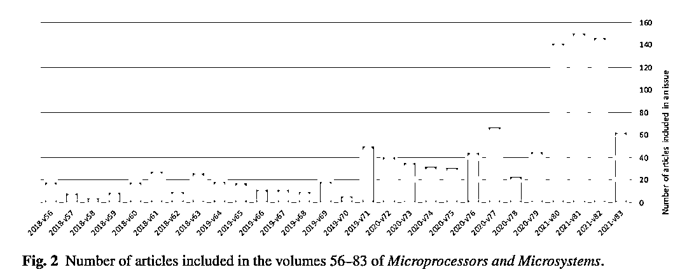

# 机翻降重？掩饰抄袭？SCI 期刊上的这些「奇言怪语」，不少来自中国作者

> 原文：[`mp.weixin.qq.com/s?__biz=MzAxNTc0Mjg0Mg==&mid=2653318774&idx=1&sn=610757ecf48d01a2e9be48332e1aabfd&chksm=802dac63b75a25756497f725828d5d7ee8a754de29bbbab08a593a5e80a3c7f37b78a5e18d51&scene=27#wechat_redirect`](http://mp.weixin.qq.com/s?__biz=MzAxNTc0Mjg0Mg==&mid=2653318774&idx=1&sn=610757ecf48d01a2e9be48332e1aabfd&chksm=802dac63b75a25756497f725828d5d7ee8a754de29bbbab08a593a5e80a3c7f37b78a5e18d51&scene=27#wechat_redirect)

# 

量化投资与机器学习微信公众号，是业内垂直于**量化投资、对冲基金、Fintech、人工智能、大数据**等领域的主流自媒体。公众号拥有来自**公募、私募、券商、期货、银行、保险、高校**等行业**20W+**关注者，连续 2 年被腾讯云+社区评选为“年度最佳作者”。

文章来自：机器之心内容编辑：蛋酱深度神经网络，怎么就翻译成了「profound neural organization」？
如果你经常阅读计算机领域的论文，一定会发现一些神奇的词汇，比如：「伪意识（counterfeit consciousness）」「深层神经组织（profound neural organization）」「海量信息（colossal information）」

这都是什么？每个字母都认识，但合在一起还是怪怪的，总觉得涵义不够明确。结合上下文语境，读者才恍然大悟：哦，其实就是「人工智能」、「深度神经网络」和「大数据」。这些不明所以的词汇，在学界有自己的专属名称：「tortured phrases」。今年 7 月，法国图卢兹大学的学者 Guillaume Cabanac 和他的同事在 arXiv 平台上传了一篇 27 页的论文，介绍了关于该现象的一些调查结论。

论文链接：https://arxiv.org/pdf/2107.06751.pdf 自动文本生成器一直被用于「科研文献写作」，那些毫无意义的论文很容易被人和机器检测到。但今天的 AI 技术已经能够生成更加「以假乱真」的文本，与人类写作的文本无法区分。一般来说，「tortured phrases」可能是自动翻译或试图掩饰文章内容抄袭的结果。表 1 先展示了研究者在各个文献中找到的奇怪短语，并给出了它们实际上对应的术语。起初这只是一种偶然的发现，当研究者发现这种现象出现得过于频繁之后，他们采取严肃的方法用已经确定的术语进行了滚雪球式搜查。「face recognition」变成了「facial acknowledgement」，「artificial intelligence (AI)」变成了「(counterfeit | human-made) consciousness」，designs preparing unit 其实是 GPU，focal preparing unit 其实是 CPU，简直离谱……

当研究者以「profound neural organization」为关键词在 Dimensions 进行检索时，有 860 篇出版物至少包含这个短语，其中 31 篇都发表在同一个期刊《微处理器和微系统》上。

随后研究者将研究重点放在了《微处理器和微系统》期刊上，他们借助一种工具调查了一系列来自这本和其他期刊的摘要，该工具可以识别文本是否是由 GPT 生成的。表 2 展示了该期刊 2017-2019 年间发表的 378 篇文章中排名前 5 位的贡献国家 / 地区和机构。

接下来，研究者对 2018 年 2 月至 2021 年 6 月的数据进行了更深入的分析。图 2 显示了从 2020 年开始，每一期发表的文章数量的变化。

研究者使用了「编辑评估」来表示从提交稿件到接收稿件的时间，包括: 初步筛选、邀请审稿人、同行评议和最终决定。每篇论文发表的元数据将其编辑评估的节点分为三个日期: 提交、修订和接收。根据对提交日期与接收日期的分析，2021 年出版的各期的编辑评估突然缩短。大多数文章都是在编辑评估后发表的，但评估周期出人意料的短。从 2021 年 2 月第 80 卷开始，较短的处理时间 (低于 40 天) 变得普遍。编辑评估时间 (表 3) 在比较 2018-2020 年的数量和 2021 年初的数量时，平均处理时间减少到五分之一，中位时间减少到六分之一。而这些论文的作者中有很多来自中国。

表 3: 编辑评估时间的变化。一部分论文具有相同的提交、修订和接收日期，其中大部分出现在该期刊的特刊中。这个现象很可疑，特刊通常由客座编辑负责，并专注于特定的研究领域。研究者基于 GPT 检测工具，对实验组和对照组的摘要进行了评估。如下图所示，在《微处理器和微系统》期刊中，GPT 得分较高的文章的集中度最高，为 72.1% ，而其他期刊的最高值为 13.6% 。「论文数量」这一栏显示，许多其他期刊发表的论文摘要都获得了较高的 GPT 分数。虽然该分数很高并不一定表明某篇文章有缺陷，但这类文章在某些期刊的高度集中会引起对人们的进一步思考。

论文发布后，2021 年 7 月中旬，《微处理器和微系统》的出版商爱思唯尔对此展开了调查。这些涉及的论文正在被逐一重新评估。爱思唯尔的发言人表示，作者很可能使用逆向翻译软件来掩饰抄袭，这可能是这些措辞的来源。 令人惊讶的是，一些网站专门提供免费改写文本的服务，主要负责生成那些「冗长的、折磨人的短语」，形成了一条产业链。你怎么看？参考链接：https://www.nature.com/articles/d41586-021-02134-0