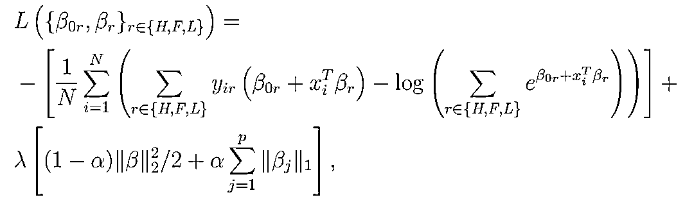

# PEAD, R.I.P.? PEAD.txt 来代替

> 原文：[`mp.weixin.qq.com/s?__biz=MzAxNTc0Mjg0Mg==&mid=2653318747&idx=1&sn=e11abb715dba0c46cb8ea74ee2e943c5&chksm=802dac4eb75a2558a52b216f948c731e54edbfee5cb9e537309eb613ed1c819f3cad1d7ba444&scene=27#wechat_redirect`](http://mp.weixin.qq.com/s?__biz=MzAxNTc0Mjg0Mg==&mid=2653318747&idx=1&sn=e11abb715dba0c46cb8ea74ee2e943c5&chksm=802dac4eb75a2558a52b216f948c731e54edbfee5cb9e537309eb613ed1c819f3cad1d7ba444&scene=27#wechat_redirect)

# 

量化投资与机器学习微信公众号，是业内垂直于**量化投资、对冲基金、Fintech、人工智能、大数据**等领域的主流自媒体。公众号拥有来自**公募、私募、券商、期货、银行、保险、高校**等行业**20W+**关注者，连续 2 年被腾讯云+社区评选为“年度最佳作者”。

**摘要**

> Martineau (2021) 的实证结果表明 PEAD 在美股市场中已经不复存在了；不过 Meursault et al. (2021) 的研究发现基于 earnings call 的 surprises 带来了升级版的 PEAD.txt。

***01***

要问今年哪个因子表现最抢眼？超预期一定是当仁不让的答案。

而在学术界，人们对超预期的反应不足也造就了一个经久不衰的异象 —— PEAD（Ball and Brown (1968)）。需要 PEAD 背景知识的小伙伴，请参考连长雄文[《PEAD 异象》](https://mp.weixin.qq.com/s?__biz=MzI3Mjk5OTU1Ng==&mid=2247484530&idx=1&sn=19e4464744e402bcf54f514bd70123aa&scene=21#wechat_redirect)。

Martineau (2021) 统计了发表在金融学和会计学高水平（不限顶刊）期刊上直接和 PEAD 相关的论文（下表），足足有 80 篇，一方面说明了它的生命力，另一方面也说明了它的火热程度。

不过，Martineau (2021) 基于最新的实证结果显示，以 earnings surprises 构造的 PEAD 异象在近年来已经在美股上消失了。这篇文章虽然不是发表在金融学三大顶刊，但是它发表在以强调可复制性著称的 *Critical Finance Review* 上，从一定程度说明了其实证结果是靠谱的。而该文的标题则比实证数据显示的还要大胆 —— **Rest in Peace** Post-Earnings Announcement Drift，直接宣告了 PEAD 的终结。

在 PEAD 的表现有所减弱之际，另一篇和 PEAD 有着千丝万缕关联的文章及时的出现了。在今年 SFS Cavalcade North America 会议（顶会之一）上，Meursault et al. (2021) 报告了通过 earnings call 文本分析构造的 PEAD 升级版 —— PEAD.txt 异象。**从名字中的 txt 就不难看出，它捕捉的是 earnings call 而非财务数据中的超预期****。**Meursault et al. (2021) 研究发现，PEAD.txt 可以获得远超传统 PEAD 的超额收益。

今天这篇小文就来梳理一下 Martineau (2021) 和 Meursault et al. (2021)。不过，正如本文的标题中的问号所传递的那样，我对美股中 PEAD 是否 R.I.P. 依然是存疑的。看完第 2 节各位小伙伴就明白为什么。

***02***

Martineau (2021) 的 main results 是它的 Table 3。该表汇报了微小市值股票（microcap）和除微小市值外其他股票（all-but-microcap）在财报公布之后的第 1 个交易日（BHAR[0,1]），以及第 2 到 60 个交易日（BHAR[2, 60]）两个窗口内的累计超额收益。实证结果显示，BHAR[0,1] 和 BHAR[2, 60] 截然不同。前者持续显著，但后者几乎已经消失殆尽。对于 all-but-microcap，从 2006 年之后 BHAR[2, 60] 不再有超额收益，而对于 microcap，从 2016 年之后，BHAR[2, 60] 也不复存在（另外，这里插个彩蛋，见备注[1]）。

随后，该文做了各种稳健性分析，比如作为锚定的 earnings 的选择，以及考察了不同 size quintiles 的结果。种种迹象表明，价格在财报发布之后就很快反应到位了，drift 不再存在。

Martineau (2021) 的实证结果似乎宣告了 PEAD 的终结，那么我为什么要在 R.I.P. 后打个问号呢？原因是该文构造 PEAD 异象所使用的变量。和众多研究 PEAD 的论文一样，该文通过 earnings surprises 来构造投资组合。然而，如下图所示，**该文在计算 earnings surprises 时，分母并非传统 SUE 中使用的标准差，而是使用了滞后的价格作为分母。虽然这种处理并非罕见，但它显然不如使用标准差为分母的 SUE 普及。**

这波操作不能不让人心生猜疑。不过，Martineau (2021) 给出了采用这种方法的出处，即 Livnat and Mendenhall (2006) 和 Hartzmark and Shue (2018)，前者发表于会计学顶刊 JAR，后者发表于金融学顶刊 JF，似乎足够有说服力。但是，这依然挡不住我的好奇心。

为此，我找来 Livnat and Mendenhall (2006) 瞅了一眼，结果（下图）……该文一句 consistent with many prior studies 就带过了。

我们再来看看 Hartzmark and Shue (2018)，结果发现它引用了另一篇 JF 的文章 DellaVigna and Pollet (2009)……

好吧，我们顺藤摸瓜，找来 DellaVigna and Pollet (2009) 一探究竟。结果却再一次落空了，该文也没有讨论这么做的原因，而是给出了另一个出处：Kothari (2001)。

本着一磕到底的态度，我们最后找来 Kothari (2001)。好家伙，这是一篇长达 127 页的文献综述！BTW，该文系统梳理了利用会计报表信息研究资本市场的相关研究，非常值得一看。

然而，当我看到这是一篇 127 页的综述时，我的心情是这样的：

对着 Kothari (2001) 看了半天，也只是在字里行间看到了使用价格作为分母对预期外 earnings 进行标准化，然而该文并没有给出任何解释。好消息是，它没有再给出新的参考文献“套娃”了。虽然没有找到上述计算 earnings surprises 的决定性证据，但是我们从 Kothari (2001) 找出了另一条关键线索。

该文指出虽然 Ball and Brown (1968) 最先提出 PEAD，但真正让它发扬光大并被世人所熟知的论文则要数 Jones and Litzenberger (1970)，Foster, Olsen, and Shevlin (1984) 以及 Bernard and Thomas (1989, 1990)。

Guess what? 这些一举奠定 PEAD 地位的文章，在计算 SUE 的时候，无一例外均使用了标准差作为分母。所以，我们熟知的方式才是计算 SUE 以及研究 PEAD 的常规做法，而非 Martineau (2021) 使用的方法。

我们无从知道为什么 Martineau (2021) 不选择更常见的 SUE 研究 PEAD，但这足以让我们对该文的结论 —— PEAD, R.I.P. —— 打上问号。

***03***

Meursault et al. (2021) 使用 earnings call 代替传统的 earnings number，将 PEAD 延伸，提出了 PEAD.txt。实证数据表明，PEAD.txt 的异常超额收益几乎是 PEAD 的两倍。

顾名思义，PEAD.txt 就是文本版的 PEAD。为了研究它，Meursault et al. (2021) 仿照传统 SUE 提出了 SUE.txt。简单的说，该文将 earnings call 中的 presentation 和 Q&A 环节区分对待，使用两部分的词频作为特征，使用 earnings call 下一个交易日的异常收益作为标签，使用滚动窗口进行有监督学习。

具体来说，该文将股票按照收益率高低分成三组（High、Flat、Low），使用 regularized multinomial logistic regression 建模：

Loss function 如下：

参数确定后，代入最新一期 earnings call 的特征，就可以计算每个公司属于 High 和 Low 的 log-odds。Meursault et al. (2021) 将 SUE.txt 定义为模型预测某公司的 earnings call 属于 High 和 Low 的 log-odds 之差：

一旦有了 SUE.txt，通过 portfolio sort 或者 Fama-MacBeth regression 就可以分析 PEAD.txt 的超额收益。下图给出了 PEAD.txt 和 PEAD 之间的类比。

下面来看实证结果。下图中，左图显示比起 SUE，SUE.txt 更能预测 earnings call 之后第 1 到第 63 个交易日内的累计异常收益；右图则显示在常见因子无法解释 SUE.txt，它能够获得显著的超额收益。

除了对模型和实证结果的论述外，Meursault et al. (2021) 花了的大量的笔墨讨论如何理解基于 earnings call 的模型以及如此显著的 PEAD.txt。为此，该文首先在单词粒度层面分析了哪些单词对于计算 SUE.txt 最有贡献。

由于该文将收益率分成三组，因此每个单词在 High 组的参数和 Low 组的参数之差和词频乘积就代表了该单词的 SUE.txt 强弱。结果如下图所示（蓝色条目代表 presentation 部分的词汇，绿色条目代表 Q&A 部分的词汇），从中我们就能看出哪些词汇产生正的 SUE.txt，哪些产生负的 SUE.txt。

然而，脱离了上下文来考虑词汇是没有灵魂的。Meursault et al. (2021) 当然深谙此道。为此，他们把词汇聚类到不同的段落组中，并给段落组赋予了有财务含义的类别（包括 Financial accounting，Global economics，Operations and marketing 以及 Strategy；每个大类下又有细分小类），从而考察不同财务类别对 SUE.txt 的贡献。

在上图中，横坐标是段落的频率，纵坐标是每个财务细分类别 SUE.txt 的绝对值。另外值得一提的是，图中的虚线曲线表示的是横坐标和纵坐标相乘的“等高线”，即 ISO-surprise 曲线，从图中右上角到左下角依次降低，坐落在高 ISO-surprise 曲线上的类别对 SUE.txt 有更大的贡献。

从结果不难看出，贡献最大的是 metrics FIN 类别，它对应的是财务数据。这也许并不意外，但其他高贡献 —— 包括 segment performance（segment OPE），公司前景展望（forward FOR）以及公司策略（gen. strategy STR）—— 也对找到超预期的公司贡献很高。这就是在财务数据本身之外，通过研究 earnings call 能够得到的增量信息。

不过，Meursault et al. (2021) 最后也表示：*Text is different from numbers in form, but similar in substance*. 但这篇文章依然是值得肯定的尝试。

无论如何，关于 PEAD 的研究引领了一个时代，而其也因为非凡的可复制性（Ball and Brown 2019）[2]而独具学术生命力。无论 PEAD 是否在美股中已经 R.I.P. 了，我们都期待 PEAD.txt 以及今后类似的研究能够延续其生命力。

而对于 A 股，希望今年大红大紫的超预期类因子在明年的表现不要像去年某大红大紫的因子在今年的表现那样。

**备注：**

[1] 一篇同样发表在 *Critical Finance Review* 的文章 Pyun (2021) 指出著名的 IVOL 异象在样本外也不复存在了，而这个样本外的时点也是 2006 年前后。

[2] 见[《致敬经典：Ball and Brown (1968)》](https://mp.weixin.qq.com/s?__biz=MzIyMDEwNDk1Mg==&mid=2650879277&idx=1&sn=3173d0ca3db0bbfdde59d79b1402b458&scene=21#wechat_redirect)。

**参考文献**

Ball, R. and P. Brown (1968). An empirical evaluation of accounting income numbers. ***Journal of Accounting Research*** *6*(2), 159 – 178.

Ball, R. and P. Brown (2019). Ball and Brown (1968) after fifty years. ***Pacific-Basin Finance Journal*** *53*, 410 – 431.

Bernard, V. L. and J. K. Thomas (1989). Post-earnings-announcement drift: Delayed price response or risk premium? ***Journal of Accounting Research*** *27*, 1 – 36.

Bernard, V. L. and J. K. Thomas (1990). Evidence that stock prices do not fully reflect the implications of current earnings for future earnings. ***Journal of Accounting and Economics*** *13*(4), 305 – 340.

DellaVigna, S. and J. M. Pollet (2009). Investor inattention and Friday earnings announcements. ***Journal of Finance*** *64*(2), 709 – 749.

Foster, G., C. Olsen, and T. Shevlin (1984). Earnings releases, anomalies, and the behavior of security returns. ***The Accounting Review*** *59*(4), 574 – 603.

Hartzmark, S. M. and K. Shue (2018). A tough act to follow: Contrast effects in financial markets. ***Journal of Finance*** *73*(4), 1567 – 1613.

Jones, C. P. and R. H. Litzenberger (1970). Quarterly earnings reports and intermediate stock price trends. ***Journal of Finance*** *25*(1), 143 – 148.

Kothari, S. P. (2001). Capital markets research in accounting. ***Journal of Accounting and Economics** 31*(1-3), 105 – 231.

Livnat, J. and R. R. Mendenhall (2006). Comparing the post-earnings announcement drift for surprises calculated from analyst and time series forecasts. ***Journal of Accounting Research*** *44*(1), 177 – 205.

Martineau, C. (2021). Rest in peace post-earnings announcement drift. ***Critical Finance Review*** forthcoming.

Meursault, V., P. J. Liang, B. Routledge, and M. Scanlon (2021). PEAD.txt: Post-earnings-announcement drift using text. Working paper.

Pyun, C. (2021). Documenting the post-2000 decline in the idiosyncratic volatility effect. ***Critical Finance Review*** *10*(3), 419 – 427.

**免责声明：**入市有风险，投资需谨慎。在任何情况下，本文的内容、信息及数据或所表述的意见并不构成对任何人的投资建议。在任何情况下，本文作者及所属机构不对任何人因使用本文的任何内容所引致的任何损失负任何责任。除特别说明外，文中图表均直接或间接来自于相应论文，仅为介绍之用，版权归原作者和期刊所有。