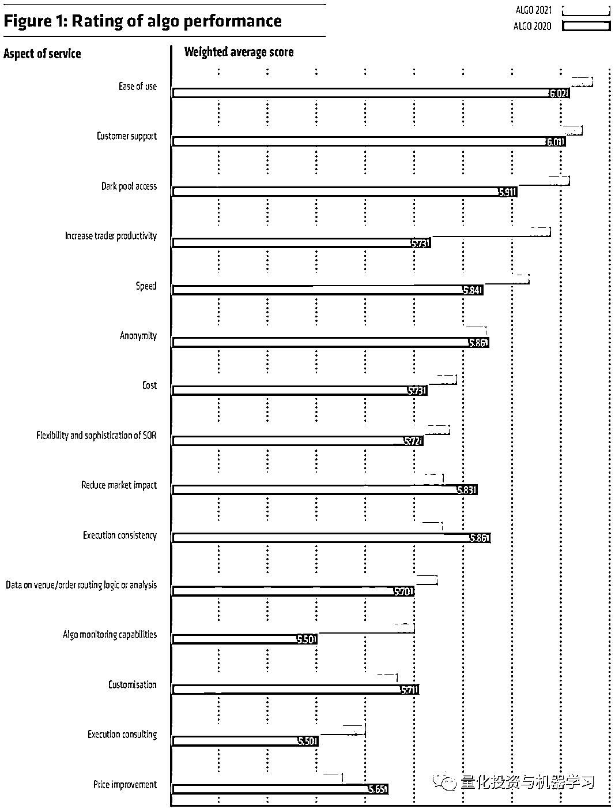
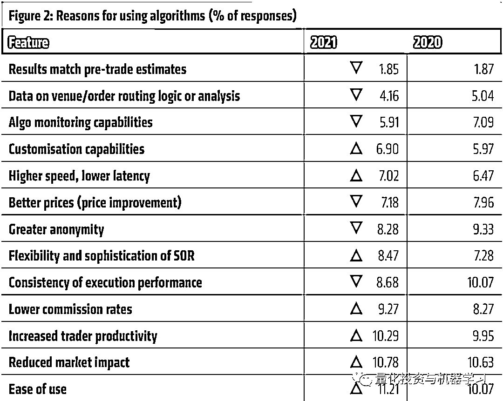
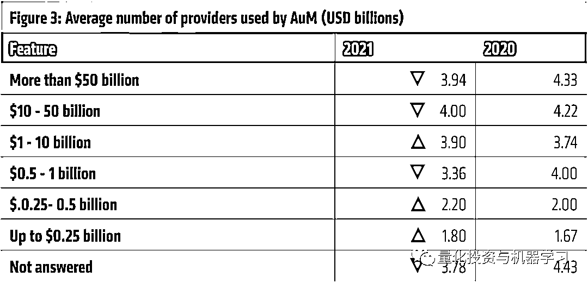
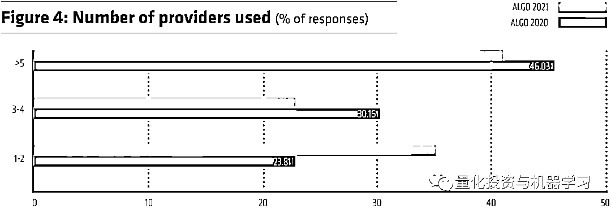
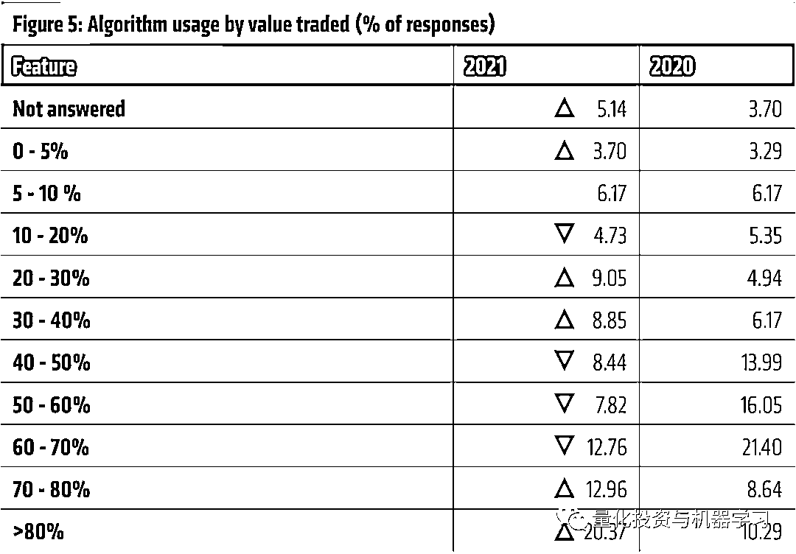
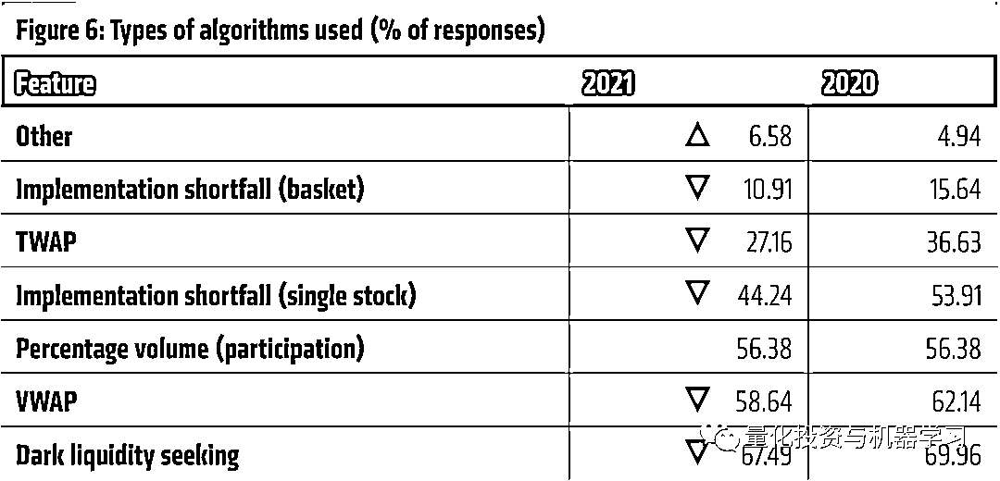
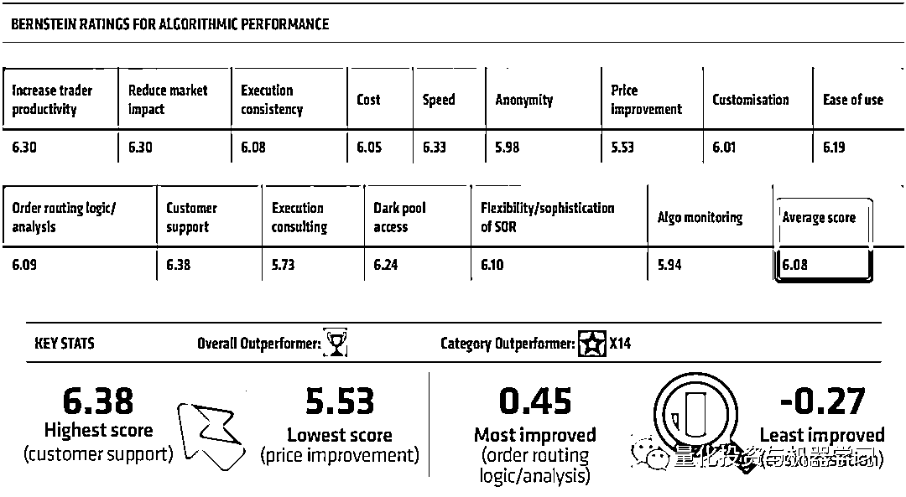

# 全球对冲基金『算法交易服务使用』深度调查

> 原文：[`mp.weixin.qq.com/s?__biz=MzAxNTc0Mjg0Mg==&mid=2653318738&idx=1&sn=cab64c6b99cd7fb852021fceb996a540&chksm=802dac47b75a2551300b3cc9de1ff2fc89b8e73537383ff429744256f0be1edbc775e373e56a&scene=27#wechat_redirect`](http://mp.weixin.qq.com/s?__biz=MzAxNTc0Mjg0Mg==&mid=2653318738&idx=1&sn=cab64c6b99cd7fb852021fceb996a540&chksm=802dac47b75a2551300b3cc9de1ff2fc89b8e73537383ff429744256f0be1edbc775e373e56a&scene=27#wechat_redirect)

# 

量化投资与机器学习微信公众号，是业内垂直于**量化投资、对冲基金、Fintech、人工智能、大数据**等领域的主流自媒体。公众号拥有来自**公募、私募、券商、期货、银行、保险、高校**等行业**20W+**关注者，连续 2 年被腾讯云+社区评选为“年度最佳作者”。

Tradenews 于近期公布了 2021 国际对冲基金算法交易服务*使用的情况调查，从这份调查中我们可以看到国际顶级对冲基金对于算法交易在其策略中使用情况的统计。

*算法交易服务，指使用第三方提供的订单执行算法服务。

2021 年关于算法交易服务最看重的部分，排在前两名的是算法服务的易用性（Ease of use）和客户支持（Customer support），除了服务与易用性，**Dark pool access 是各大对冲基金最看重的部分**。相对于 2020 年，提高交易员生产力（Increase trader productivity）的方面，各大国际对冲基金给予了更对的关注。**反而，对于更优价格的追求（Price improvement）却是最不关注的部分。**

**同样，关于使用第三方算法交易服务的原因中**，2021 年 11.21%的对冲基金是因为算法服务易用性而选择了第三方算法交易服务，其他显著的原因包括降低市场冲击、提高交易员生产力及更低的交易佣金。

以资产管理规模，**统计对冲基金平均使用的算法服务商的数量，可以看到管理规模越大使用的服务商越多**，但相对 2020 年，大机构使用的服务商在减少，中小基金的使用的服务商数量在增加。总体而言，平均使用的服务商在两个以上。其中 41%使用的服务商数量超过 5 个，23%使用 3-4 个，35%使用 1-2 服务商，相对于 2020 年，总体使用算法交易服务商的数量在减少。

细化到成交量上面，20.37%的对冲基金，他们有 80%多的交易是由算法交易服务执行的，**这个比率相对于 2020 年的 10.29%有大幅的上升。说明，对冲基金越来越依赖于算法交易服务。**

交易算法的使用情况上，VWAP 和 TWAP 的使用量都在降低，其他类的算法策略在增加。说明基金大佬们对于创新的算法策略越来越看重。

在各家提供三方算法交易服务的服务商中，平均分得分最高的是 Bernstein Trading，AllianceBernstein L.P. 的全资子公司，主要为机构投资者提供基本面研究及订单执行服务。

