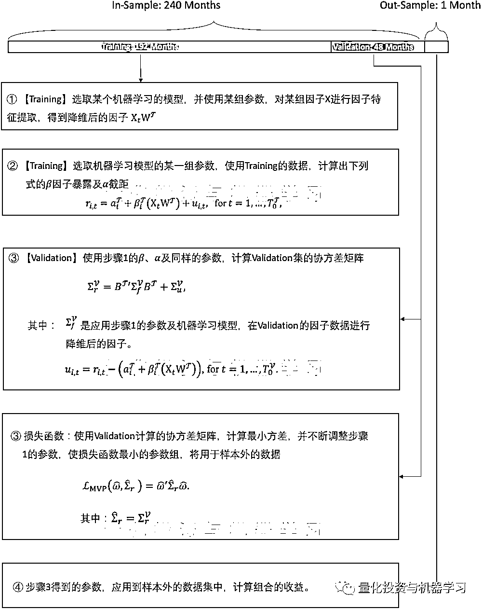

# 高清『无码』！因子模型与机器学习

> 原文：[`mp.weixin.qq.com/s?__biz=MzAxNTc0Mjg0Mg==&mid=2653318664&idx=1&sn=e6f536dd9b8b0e7716df59af90f59b8e&chksm=802dac1db75a250b9684dbfaae1e66579962f7403ff4deb83a1fa2521346c0b1190433ffd916&scene=27#wechat_redirect`](http://mp.weixin.qq.com/s?__biz=MzAxNTc0Mjg0Mg==&mid=2653318664&idx=1&sn=e6f536dd9b8b0e7716df59af90f59b8e&chksm=802dac1db75a250b9684dbfaae1e66579962f7403ff4deb83a1fa2521346c0b1190433ffd916&scene=27#wechat_redirect)

# 

量化投资与机器学习微信公众号，是业内垂直于**量化投资、对冲基金、Fintech、人工智能、大数据**等领域的主流自媒体。公众号拥有来自**公募、私募、券商、期货、银行、保险、高校**等行业**20W+**关注者，连续 2 年被腾讯云+社区评选为“年度最佳作者”。

# 

量化投资与机器学习公众号独家解读

量化投资与机器学公众号 *** ***QIML Insight——深度研读系列 ******是公众号今年全力打造的一档**深度、前沿、高水准**栏目。

公众号**遴选**了各大期刊前沿论文，按照理解和提炼的方式为读者呈现每篇论文最精华的部分。QIML 希望大家能够读到可以成长的量化文章，愿与你共同进步！

今天跟大家分享一篇机器学习用于因子模型的论文，一句话概括文章的内容：  

**作者首先利用了几类机器学习的模型对多个因子进行降维（或者称为特征提取），再利用处理后的因子结合组合优化 Minimum-Variance 的框架进行组合构建。**

首先，对原始因子处理的模型使用了以下五大类，只有第 5 种是跟深度学习相关的，为了行文一致性，我们后文都称为机器学习模型。

*   Principal component analysis 

*   Sparse principal component analysis

*   Partial least squares

*   Sparse partial least squares

*   Autoencoders

利用以上机器学习模型对因子进行处理后，通过时间序列线性回归计算出因子暴露及特质收益项，再分别得出因子收益的协方差矩阵及特质收益矩阵，并通过这两个风险矩阵结合组合优化模型确定组合权重。

文章内容本身很长，但作者利用滚动窗口把数据分为 Training、Validation 及 Out of Sample，并结合基于 Minimum-Variance 的损失函数，这个整体的框架及步骤很有借鉴意义。这里把整个框架的步骤梳理出来跟大家分享，其他实证性的内容，请大家参考原论文。

**需要注意的是，作者在文中采用的是基于时序的因子模型，也就是说，因子收益是已知的，如 Fama-French 的因子，因子本身代表组合的收益率。并不是如 Barra 体系下，截面回归中的因子暴露。所以回归时，求解的是因子暴露。**

通过 Training 的数据求出因子暴露，并利用 Training 得到的因子暴露、截距及对应的机器学习模型参数，应用到验证数据中求得的风险矩阵。 

将验证数据中求得的风险矩阵，放到损失函数里，得到一组参数使用损失函数最小**。这里的创新点就是巧妙的结合了训练数据与验证数据及损失函数。这正是我们可以借鉴的部分。**

需要 **论文**的小伙伴，请在公众号后台回复：

**MLF**