# 基于 Order Book 的深度学习模型：预测多时间段收益序列

> 原文：[`mp.weixin.qq.com/s?__biz=MzAxNTc0Mjg0Mg==&mid=2653318588&idx=1&sn=236623672d6666353029244c01113f09&chksm=802dafa9b75a26bf65cd109ca40daec0bc596890207a82346d326be59f46ee84f36ec477e788&scene=27#wechat_redirect`](http://mp.weixin.qq.com/s?__biz=MzAxNTc0Mjg0Mg==&mid=2653318588&idx=1&sn=236623672d6666353029244c01113f09&chksm=802dafa9b75a26bf65cd109ca40daec0bc596890207a82346d326be59f46ee84f36ec477e788&scene=27#wechat_redirect)

# 

量化投资与机器学习微信公众号，是业内垂直于**量化投资、对冲基金、Fintech、人工智能、大数据**等领域的主流自媒体。公众号拥有来自**公募、私募、券商、期货、银行、保险、高校**等行业**20W+**关注者，连续 2 年被腾讯云+社区评选为“年度最佳作者”。

量化投资与机器学习公众号独家解读

量化投资与机器学公众号 *** ***QIML Insight——深度研读系列 ******是公众号今年全力打造的一档**深度、前沿、高水准**栏目。

公众号**遴选**了各大期刊前沿论文，按照理解和提炼的方式为读者呈现每篇论文最精华的部分。QIML 希望大家能够读到可以成长的量化文章，愿与你共同进步！

> **本期遴选论文** **来源：**SSRN
> **标题：**Deep Order Flow Imbalance: Extracting Alpha at Multiple Horizons from the Limit Order Book
> **作者：**Petter N. Kolm、Jeremy Turiel、Nicholas Westray

作者基于原始订单数据，构建了订单状态指标、订单流指标，并结合深度学习模型对 Nasdaq 的 115 股票构建高频价格预测模型，并对比了多个模型的效果。核心观点如下：

*   订单流的原始数据，可以直接作为深度学习模型的输入，而不需要过多的进行特征工程。

*   模型预测的效果与股票交易活跃度有关，成交活跃的股票，模型的整体效果更优。

*   在多预测时间段的测试中，模型整体对于短期价格的变动有优秀的预测能力，模型效果的最优表现出现在 K=10 附近。

**订单数据**

订单簿如下图所示，按照价格优先时间优先的原则将买单卖单做如下排列，

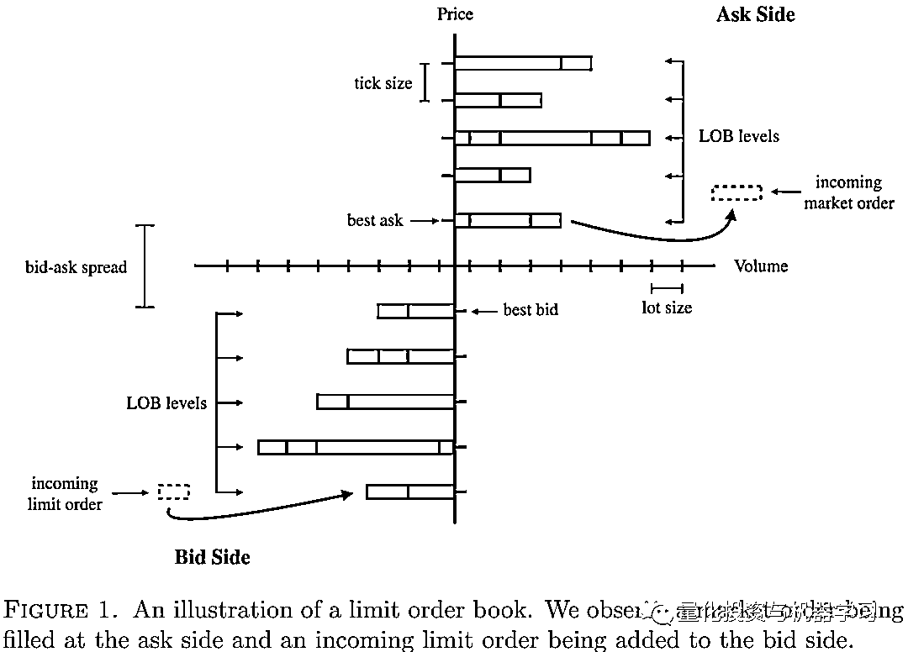

针对订单簿的数据，作者定义了以下指标：订单簿状态 LOB，订单流 OF，订单流失衡（OFI）

**1、Order Book States（LOB）**<embed style="vertical-align: -1.469ex;width: 53.484ex;height: auto;max-width: 300% !important;" src="https://mmbiz.qlogo.cn/mmbiz_svg/a18XcQ1EBBggIibBXCZoqdiaPiceeIs9FeOHuTFAbiaYd33Gvc85pLMVTT7ic811MtZFnEcR6MOn7ibALpCSa5MakN71iapVgexibbWT/0?wx_fmt=svg" data-type="svg+xml">

其中 为前十档的卖价， 为前十档的卖量， 为前十档的买价格， 为前十档的买量。

**2、Bid-Ask Order Flow（OF）**

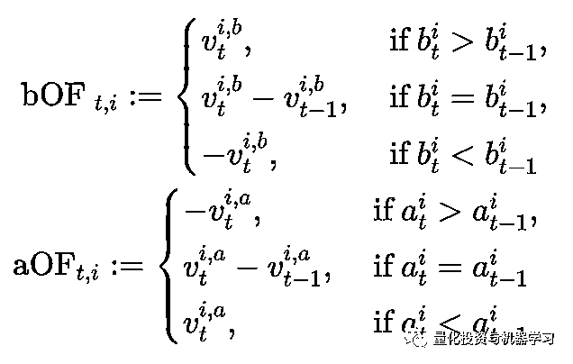

**3、Order Flow Imbalance（OFI）**

**预测模型**

作者测试了多种模型，对比各种模型的预测效果。

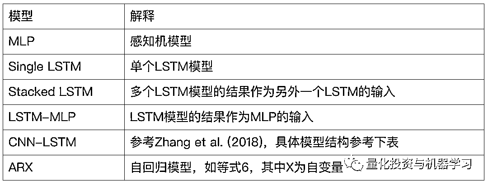

<embed style="vertical-align: -2.819ex;width: 37.152ex;height: auto;max-width: 300% !important;" src="https://mmbiz.qlogo.cn/mmbiz_svg/a18XcQ1EBBggIibBXCZoqdiaPiceeIs9FeOJ7AGmMjRtMDDXw6rPO78FztkaveMCztniaibUX5nJvIKCRsasveAJGVzvA89d4INfy/0?wx_fmt=svg" data-type="svg+xml">

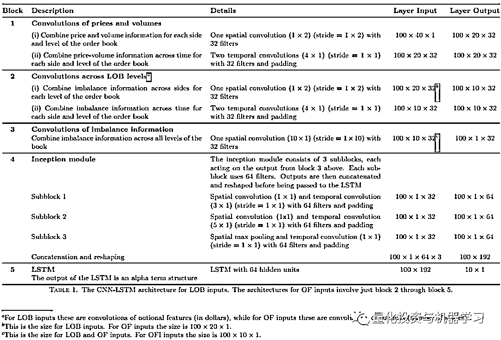

**实证**

**因变量**

因变量是股票在未来一段时间用 mid-price 计算的收益率，对于每一时刻 t，模型预测了多个未来 horizon 的收益率，用向量 r 表示：<embed style="vertical-align: -0.65ex;width: 42.377ex;height: auto;max-width: 300% !important;" src="https://mmbiz.qlogo.cn/mmbiz_svg/a18XcQ1EBBggIibBXCZoqdiaPiceeIs9FeOrVBljDXyblc7DFic122CjpJlIZ999CSLllz9ibsBziaLuGwKs1CXJbbpZOB3mn7Rc1J/0?wx_fmt=svg" data-type="svg+xml">

其中 r 为 mid-price return, 表示两个 tick 之间中间价计算的收益率。该模型是采用长度为 w 的滚动窗口进行计算，对于所有模型，w 统一设置为 100：

<embed style="vertical-align: -0.566ex;width: 29.556ex;height: auto;max-width: 300% !important;" src="https://mmbiz.qlogo.cn/mmbiz_svg/a18XcQ1EBBggIibBXCZoqdiaPiceeIs9FeOO8CkP4VGdGLV5wtZZricJnBMo2pmqfyGGFLp6iaiak7XcFfZicTbiaKrHbOMEAexLdM94/0?wx_fmt=svg" data-type="svg+xml">

如表 6 所示，由于每个股票的成交活跃度都不一样，EBAY 和 MSFT 每天 Order Book 的活跃度（Updates）差了三个数量级。所以作者针对每个股票设定各自的时间划分间隔（stock specific time increment)：

其中分子是一个交易日交易时间的毫秒数，N 表示这个股票每天非零的 mid-price returns 的数量。那对于（14）中，具体的预测时间点为以下 10 个时间点：

各时间点的 mid-price return 为：

其中 表示时刻 t 的 mid-price， 是为了考虑延迟，所以在时间 t 用的实际上是 的 mid-price， 的取值是 10 毫秒。

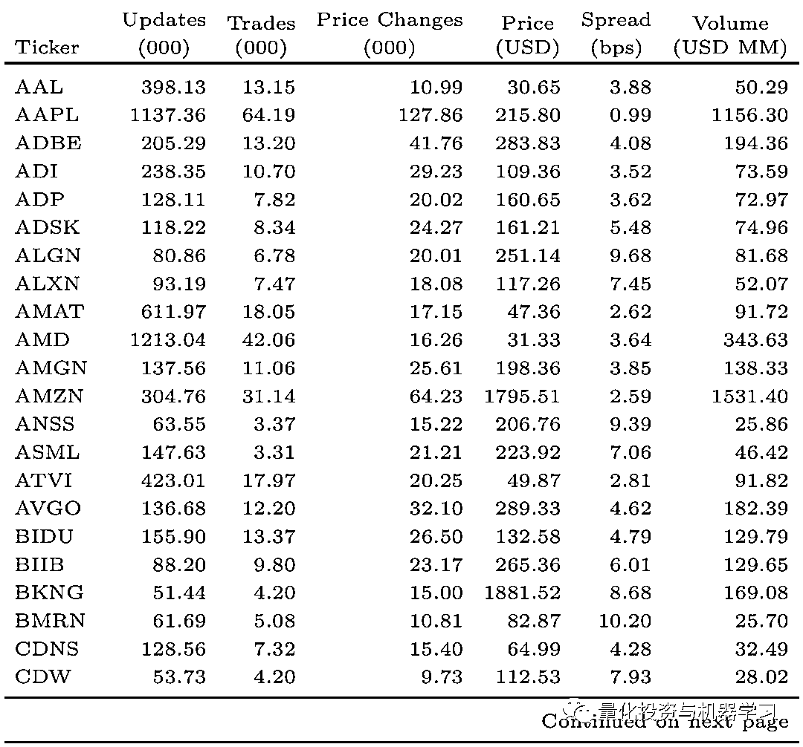

**自变量**

作者测试了两种自变量的表现，分别是上式（1）的 LOB 和上式（4）的 OF，对于所有自变量和因变量都 Winsorize 到 0.5%和 99.5%的区间，并转换为 z-score。最终作者选取了纳斯达克上市的 115 只股票的订单数据作为训练样本。

对于每个测试时间段，模型评价采用以下方式：<embed style="vertical-align: -0.911ex;width: 31.11ex;height: auto;max-width: 300% !important;" src="https://mmbiz.qlogo.cn/mmbiz_svg/a18XcQ1EBBggIibBXCZoqdiaPiceeIs9FeOO6xQTIdRdjwH4QkrN5hzibXptfx8kL94YPwPHXKIKUKcCWcVuibnHuicQAf6Zyv6ZzO/0?wx_fmt=svg" data-type="svg+xml">

其中 是模型的 mean square error， 是基于测试时间段 r 的均值计算的 mean square error，以此作为模型表现得基准。 大于 0，说明模型的效果优于 Benchmark。

**模型设置**

表 2 给出了所有模型的参数及设置，单个模型的训练时间在 10-60 分钟左右。

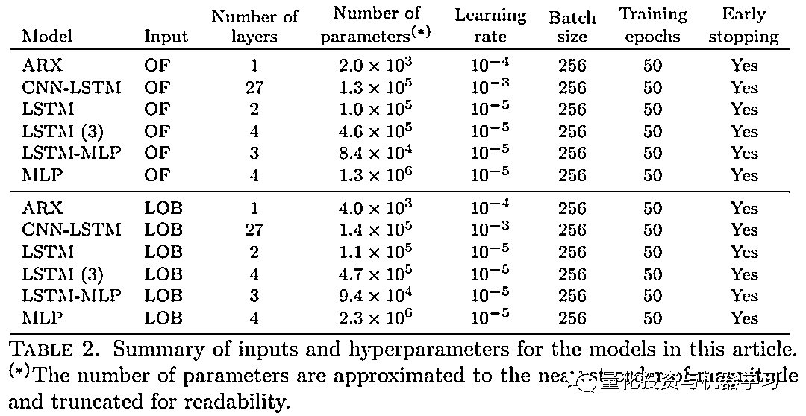

**结果**

**短期预测效果对比**

下图给出了各模型短期预测效果的对比，其中左边的自变量是 OF，右边的自变量是 LOB。X 轴对应不同的预测 horizon（如 17 表示，一共 10 个 horizons）；Y 轴是根据 18 计算的模型表现，首先计算每个股票每个 Horizon 每天平均的 ，然后把所有股票的 平均就得到 Y 轴的值。可以看出：

*   **基于 LOB 的模型，处理 CNN=LSTM 跑赢基准，其他模型都没法从 LOB 中学习到有效信息。由于 OF 只是基于 LOB 计算的衍生指标，给定足够数据的情况下，理论上深度学习的模型（如 LSTM 等）应该能够学到如基于 OF 模型一样的效果，但是整体而言，基于 OF（左边）的模型表现更好。**

*   **模型的效果在 X 轴等于 2（k=10）时，达到了上限，也就是说深度学习模型整体对短期的价格变动有更好的预测结果。**

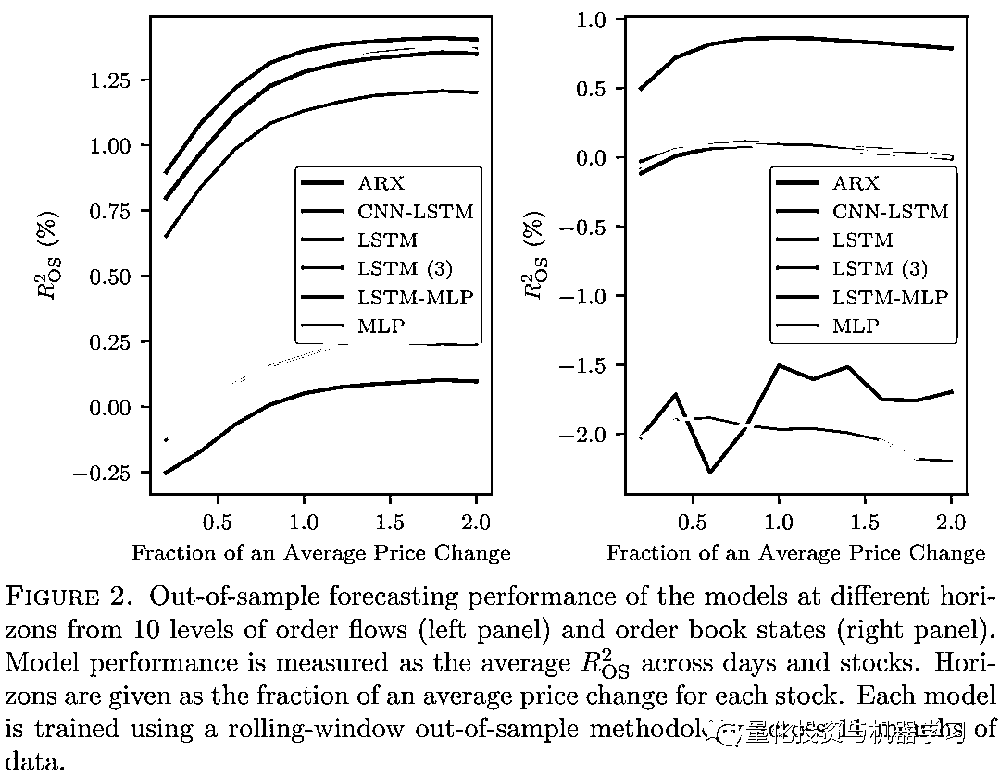

**预测准确度比较**

基于 OF 和 LOB 两种输入，分别测试的 6 个模型，所以一共有 12 个组合。每天对 12 个模型的不同 horizon 的表现进行排序（1-12 名），然后把所有测试时间段，每个模型每天的排序计算平均值，由下图表示：

*   OF 模型的整体排名要由于 LOB

*   含有 LSTM 部分的模型的表现要由于 ARX 和 MLP

*   CNN-LSTM 的表现很稳定，在各 horizon 得排在第一

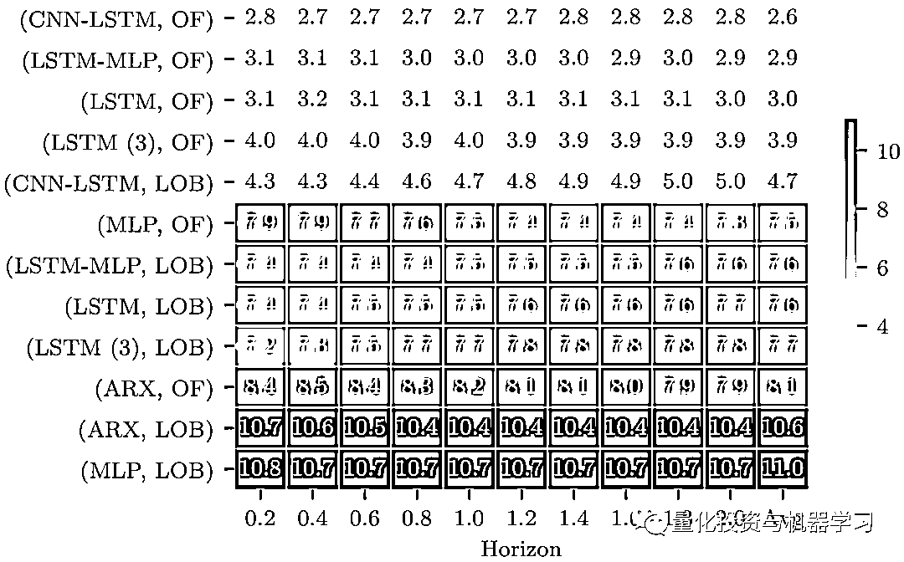

**预测表现和股票其他特征之前的关系**

作者针对 OF 作为输入的 LSTM 模型，研究模型表现与股票特征之间的关系，计算出每个模型测试时间的 均值，并计算对 与股票各特征做回归，包括 Tick Size, LogUpdates, LogTrades, LogPriceChg, Log(Updates/PriceChg。**可以发现模型的表现与 TickSize 和 Updates 正相关，与 PriceChg 负相关。其中 PriceChg 表示单位时间价格变动的次数，一定程度反映了股票的波动性。**

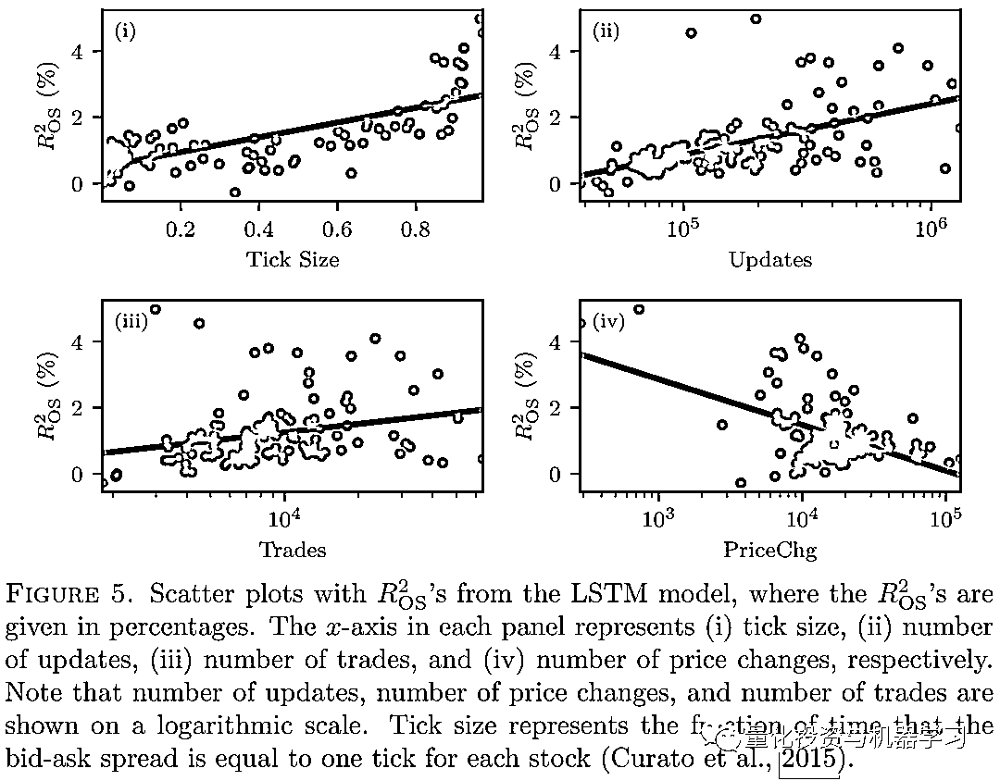

具体的截面回归的结果如下表所示：

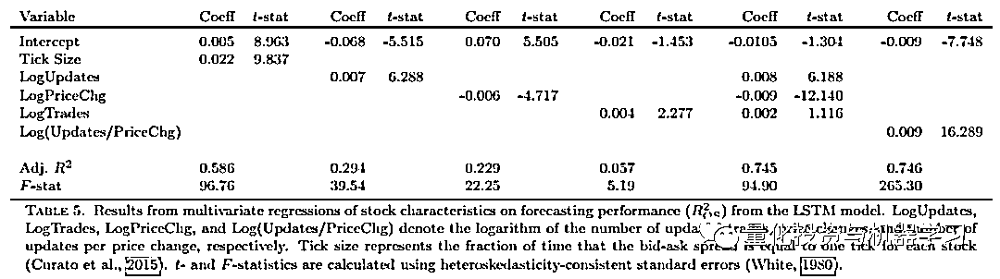

**长期预测能力**

以上的结果都限定在 k=10 以内（等式 17 中的 k），对于更长时间的预测效果，如下图所示，可以看出模型的表现在 x 轴等于 2 的时候达到最大，当 x 超过 2，模型的效果持续下降。

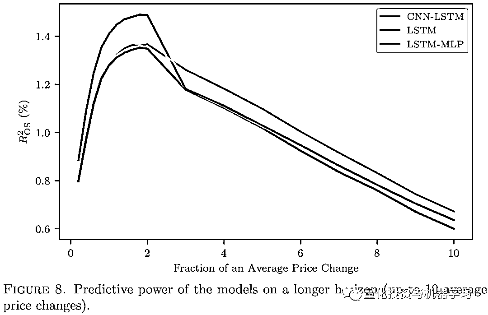

**总结**

*   订单流的原始数据，可以直接作为深度学习模型的输入，而不需要过多的进行特征工程。

*   模型预测的效果与股票交易活跃度有关，成交活跃的股票，模型的整体效果更优。

*   在多预测时间段的测试中，模型整体对于短期价格的变动有优秀的预测能力，模型效果的最优表现出现在 K=10 附近。

**参考文献**  

Zhang, Zihao, Stefan Zohren, and Stephen Roberts (2018). \BDLOB: Bayesian Deep Convolutional Neural Networks For Limit Order Books". In: arXiv preprint arXiv:1811.10041.