# Billions 第五季（下）剧透：Chuck 暴瘦，战争升级！

> 原文：[`mp.weixin.qq.com/s?__biz=MzAxNTc0Mjg0Mg==&mid=2653318480&idx=1&sn=bc2e59b7f55338e29ef478d844c80f51&chksm=802daf45b75a26530a844541b2d0ed8d65b4605203db7ad0bd317be4b6608b90deca03d1c0d6&scene=27#wechat_redirect`](http://mp.weixin.qq.com/s?__biz=MzAxNTc0Mjg0Mg==&mid=2653318480&idx=1&sn=bc2e59b7f55338e29ef478d844c80f51&chksm=802daf45b75a26530a844541b2d0ed8d65b4605203db7ad0bd317be4b6608b90deca03d1c0d6&scene=27#wechat_redirect)

# 

量化投资与机器学习微信公众号，是业内垂直于**量化投资、对冲基金、Fintech、人工智能、大数据**等领域的主流自媒体。公众号拥有来自**公募、私募、券商、期货、银行、保险、高校**等行业**20W+**关注者，连续 2 年被腾讯云+社区评选为“年度最佳作者”。

**第五季 part 2 预告片发布**

Billions 终于发布了第五季下半部分的预告片：***that this is when the fun starts***

> **认真看预告片，文章后半段有详细解析：**

[`mp.weixin.qq.com/mp/readtemplate?t=pages/video_player_tmpl&action=mpvideo&auto=0&vid=wxv_1993285155339239425`](https://mp.weixin.qq.com/mp/readtemplate?t=pages/video_player_tmpl&action=mpvideo&auto=0&vid=wxv_1993285155339239425)

**9 月 5 日**，不见不散

今天距正片播出还有**28 天**

**Chuck 经历了什么？**

我去，Chuck 是换了个人吗？胡子没了，人也瘦了，公众号看了好几遍···

这是之前的 Chuck：

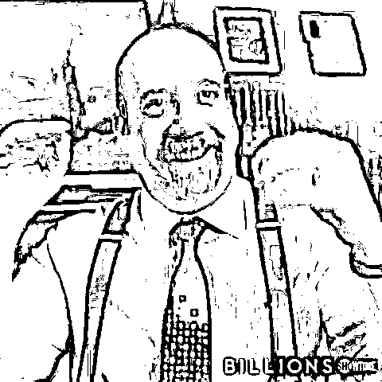

这是现在的 Chuck：

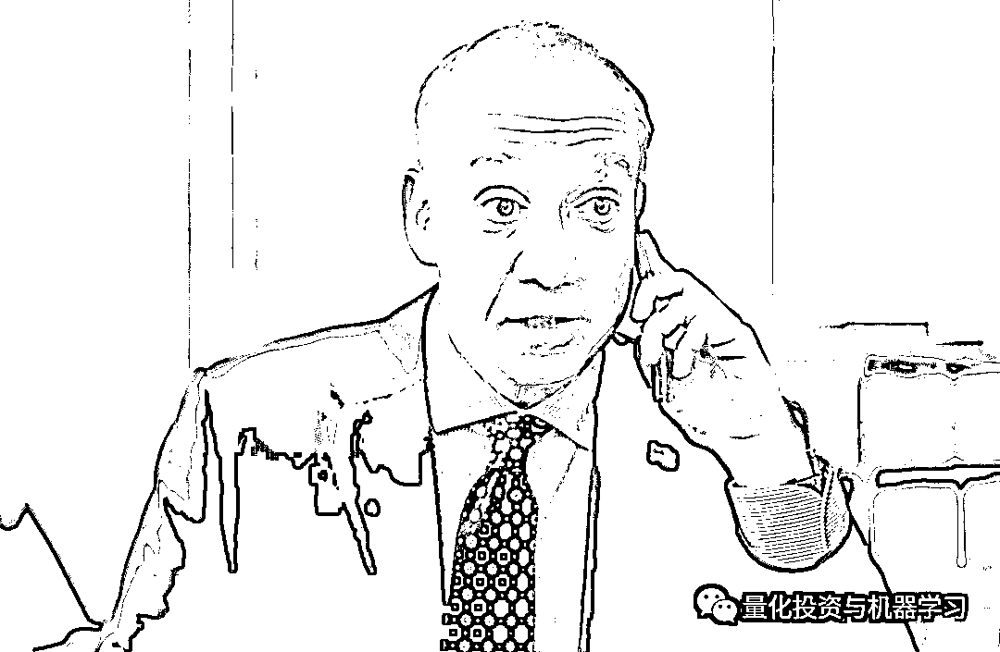

Paul Giamatti（Chuck 扮演者）在今年疫情期间，由于接了几部新戏变成了现在这个样子，一个演员为了一部戏真自律到如此，也是佩服。

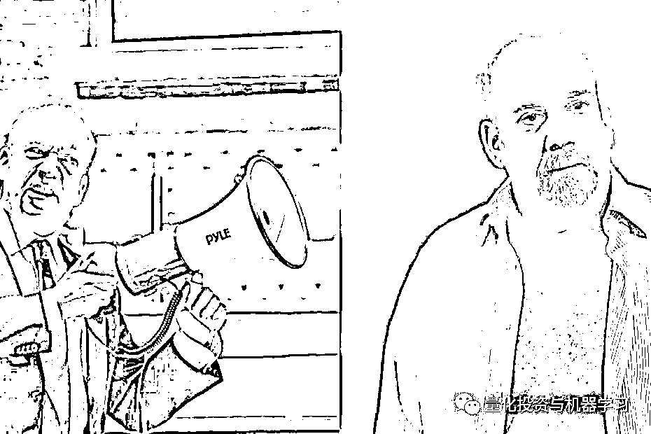

**正式剧透剖析开始**

在第五季的后半段，Prince 的出现在 Axe Capital 掀起了一股波澜，并为 Chuck 与 Axe 的战斗中提供了一个潜在的新武器。联盟从形成、分裂又重新形成，从 Taylor 到 Wendy，所有人都被卷入了这场冲突，这场冲突几乎摧毁了他们所珍视的一切！

**下面的内容是根据预告片并结合前情的推断预测：**

事实上，Wendy 和 Taylor 已经开始与 Prince 合作，这对 Axe 来说是一个巨大的打击。他认为 Prince 操纵了 Wendy 和 Taylor。

> **“Textbook fucking manipulation.”**

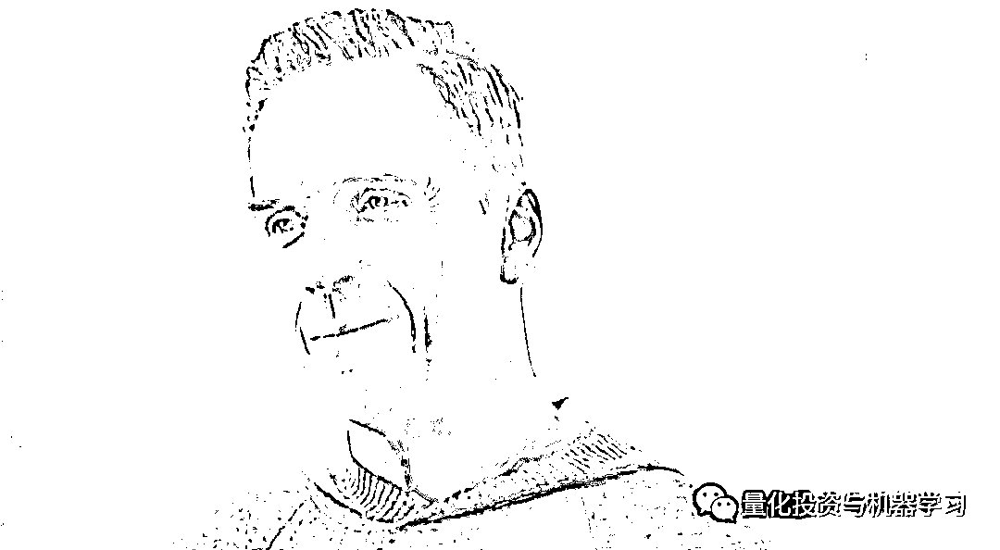

尽管 Taylor 谈到了与 Prince 合作的长期好处，但 Axe 根本不听。据他说，Taylor 这样做不是因为他们自愿，而是 Prince 策划的一场阴谋，操纵他们自愿。他打赌 Prince 在消息传出之前就削减了他在 Shine-Lucence 的头寸。

Prince 是我们在剧中看到的唯一一个避免与 Axe 正面冲突的人。但现在，Axe 计划用“Joan of Arc-style”的方式扳倒 Prince。除了 Chuck 还有谁能更好地帮他解决这个小问题？

现在，我们都知道 Chuck 正在努力摧毁 Axe，所以他没办法帮他解决这个问题。但如果 Axe 开出了一个让 Chuck 无法抗拒的条件呢？

他的肾！

让我们记住，Axe 曾让 Wags 把 Hall 和 Bach 带进他的办公室商量应对计划时，公众号相信 Hall 已经收集了所有关于老 Chuck 健康问题和很多细节！

在预告片的一个场景中，老 Chuck 看起来病了，如果不马上进行肾移植，他可能没有多少时间了。他甚至可能在道别，试图让世界为他的离去做好准备。看起来他好像是在时机成熟的时候让 Wendy 为他做点什么。

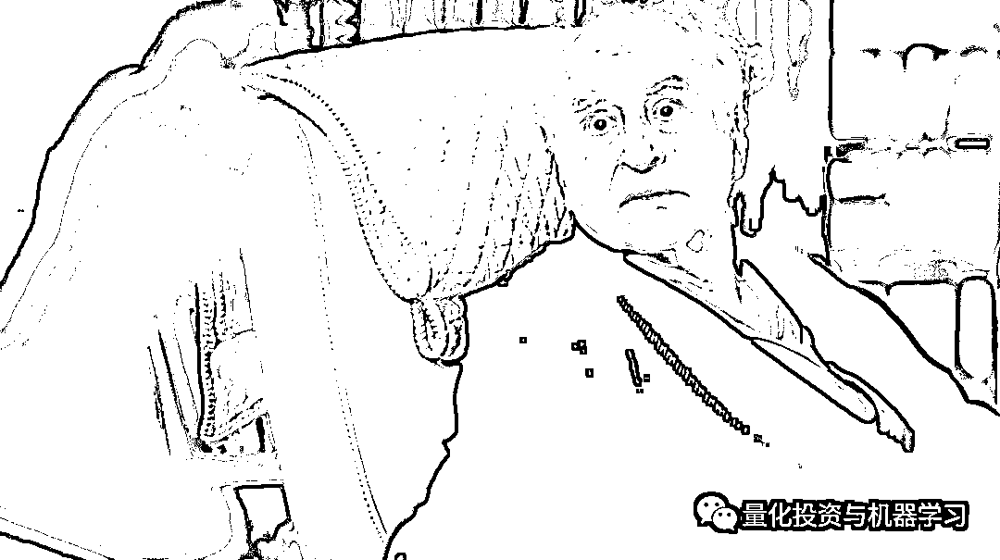

> ***“You’re the cool-headed killer. You’ll do the right thing when the time comes.”***

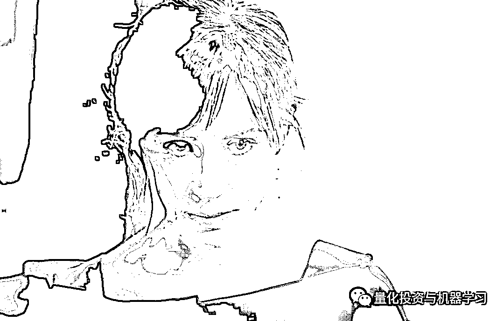

因此，当 Axe 发现 Chuck 此刻迫切需要的帮助时，他可以在 Axe Capital 组织一场“献血活动”，寻找与老 Chuck 相配的人。**因此，在第五季第二部分的官方预告片中，Chuck 的开场白可能是说服老 Chuck 接受 Axe 的肾。**

> ***“You love a game…. The chance to take someone else’s power for yourself…. You can’t deny how you’ll feel good Especially if that power was coming from Bobby Axelrod…”***

而且，我们可以看到老 Chuck 活着，在他的余生里，Axe 的一部分将永久留在他的体内

与之相关的是，Chuck 和 Axe 在 Chuck 的办公室里的会面，他们讨论 Axe 是一条大海鲢还是一条鲨鱼，可能是关于 Axe 向老 Chuck 提供他的肾以换取他的帮助！

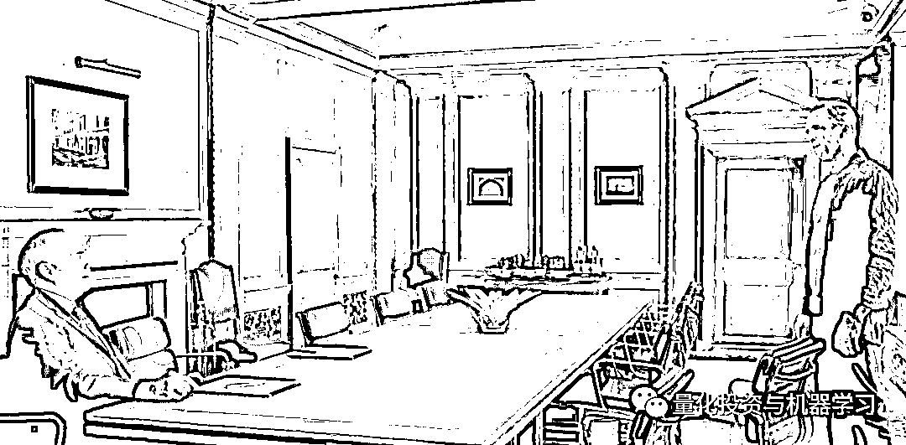

谁会让媒体知道 Bobby Axelrod 去找州检察官了！ Bobby Axelrod 现在必须告诉全世界，他与 Chuck Rhoades 的会面不是程序上的，而是私人的

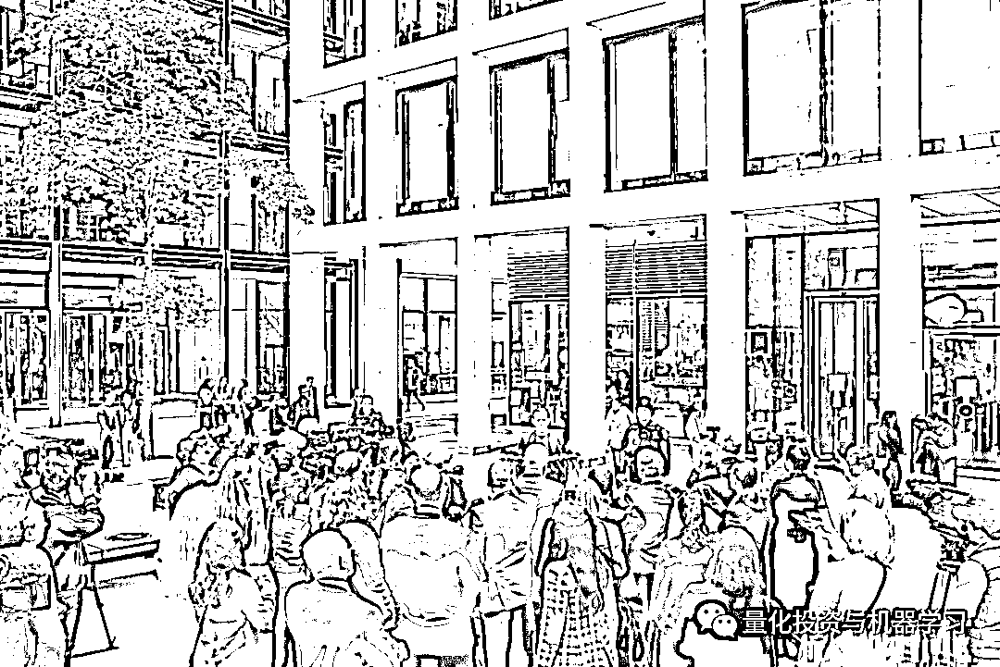

不管故事情节如何发展，从预告片中可以明显看出，Axe 为 Prince 惹了不少麻烦，使得 Prince 拜访了 Axe 位于 Tribeca 的顶层公寓。

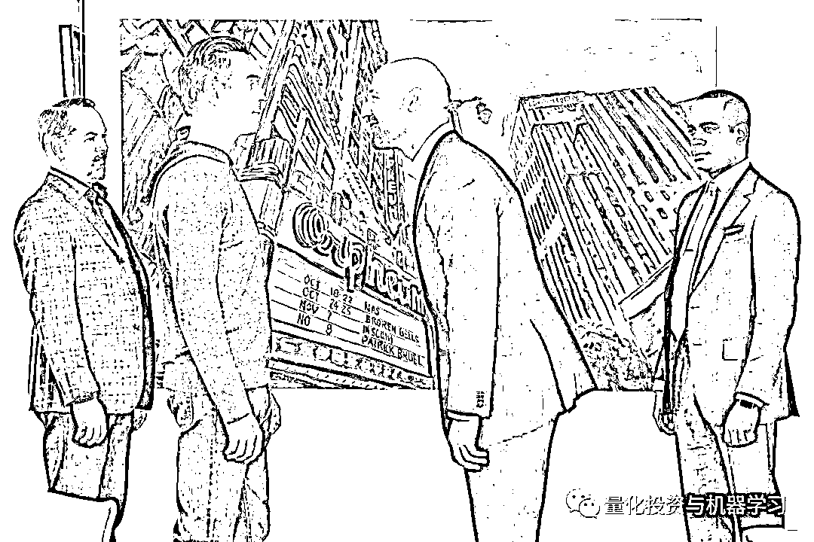

Prince 似乎对 King 研究得很透彻。他知道 Axe 喜欢了解人们的肢体语言，而 Prince 对自己的肢体语言很有信心。他的手不会颤抖，他可以直视 Axe 的眼睛。在他的生活中，没有任何东西可以让 Axe 用来对付他。虽然 Prince 在拜访 Axe 时能够保持冷静，但他被 Axe 拖入混乱中感到非常沮丧。

> **“Someone has to wipe him off the face of the Earth!”**

这句话太狠了！ 

Chuck 很高兴能够帮助 Kate，不像 Kate 和 Prince 那样举杯庆祝成功。因为她正在竞选政治职位，需要非常小心。

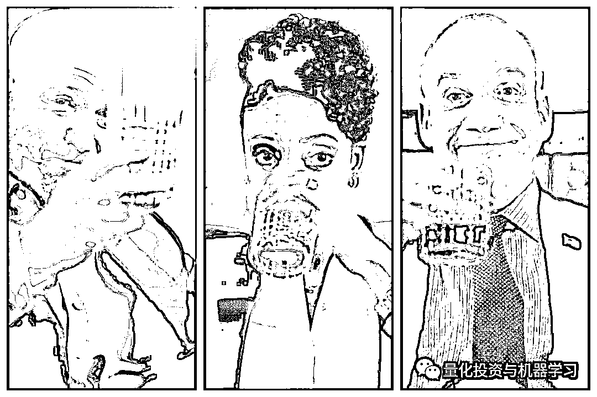

但，公众号对 Chuck 没有那么信任。我们正在谈论的是一个在第二季中为了得到自己想要的东西背叛自己的父亲和最好的朋友！所以小编希望 Axe 能够监听 Chuck 的一举一动，有没有可能 Hall 正在监听 Chuck 和 Prince 的对话？

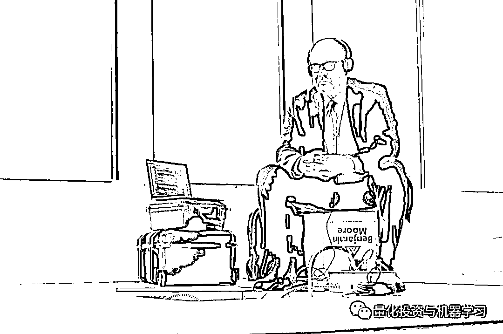

人们不禁要问，下面让 Kate 和 Chuck 感到惊讶的信息是指 Axe 还是 Prince？

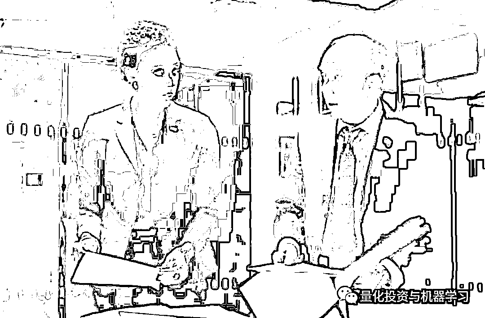

逮捕了很多人，纽约州检察官和曼哈顿地区检察官来了···

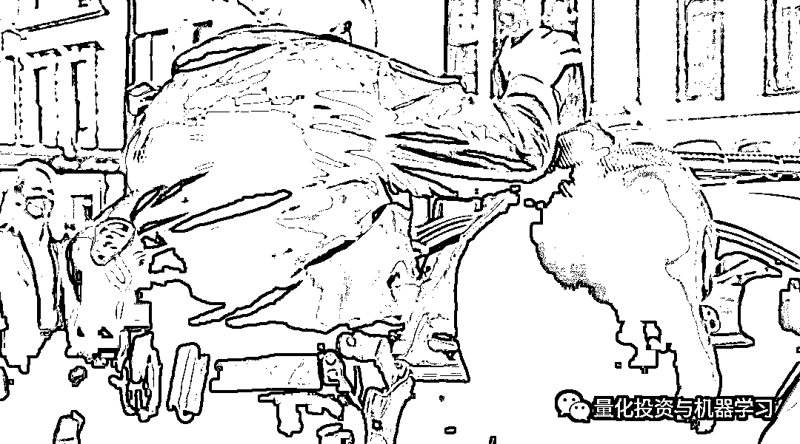

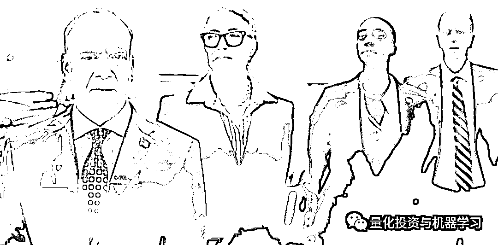

还有瑞士边境警卫队！难道是 Prince 从飞机里出来了吗?

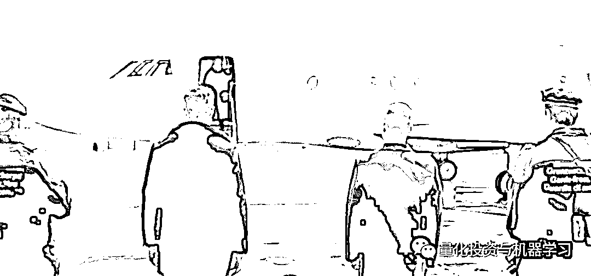

> **“You need an enemy. Or you think you do. Like without that gravitational pull, you’ll go flying off into nothingness. No edge, no drive, no Axe.”**

根据经验，Wendy 知道，Axe 搞砸的确切时间就是他把目光集中在报复上的时候。所以，Axe 实际上可能天生就会自我毁灭。小编觉得非常悲哀的是，即使他毁掉了 Prince 和他的一切，他也只能回到一张舒适的床上，而不是一个家庭。因为他也在另一场愚蠢的战争中失去了家庭。

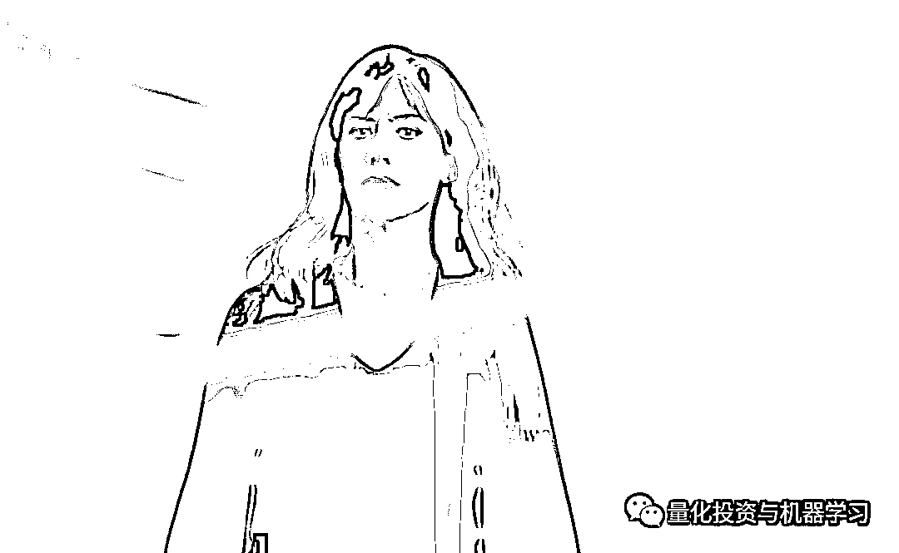

在经历了多次内部斗争之后，Wendy 似乎在公司找到了自己的位置，并找到了新的爱人。然而，Axe 却在那里毁掉她的生活，仅仅因为 Axe 相信 Wendy 被操纵了。如果 Axe 继续惹 Wendy，Wendy 可能也会报复他。而且我们知道 Wendy 可以像 Axe 或 Chuck 一样坏

我们知道 Axe 无法忍受 Wendy 发现 Tanner 是清白的。他为 Tanner 举办的观影派对只是为了证明 Tanner 不是 Wendy 想象中的那个人。当 Tanner 告诉 Wendy，他无法忍受观众对他的画扯淡解读时，而 Wendy 却看到他极度关注一位女士，这位女士提供了明显胡说八道的诠释，这样 Wendy 很失望。

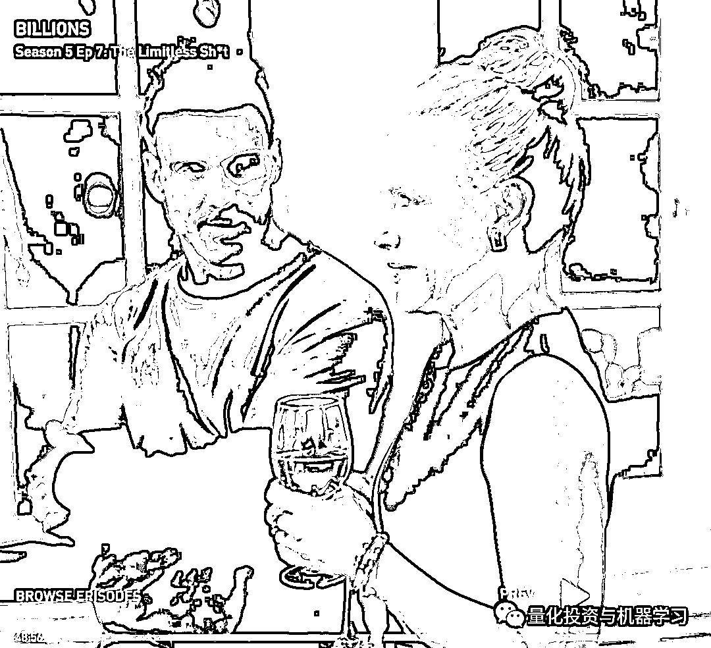

Tanner 可能就是 Wendy 想的那个人。你看他把给 Axe 的画都拆了。他可能是想让 Wendy 知道他是真心爱她的，而不是因为 Axe 的钱。Wendy 惊讶的表情说明了很多问题，不是吗？以前从来没有人为她做过这样的事。值得一提的是，Axe 缩短了自己的假期，回来参加 Wendy 的审判，这毕竟也是关乎 Axe Capital 的声誉。

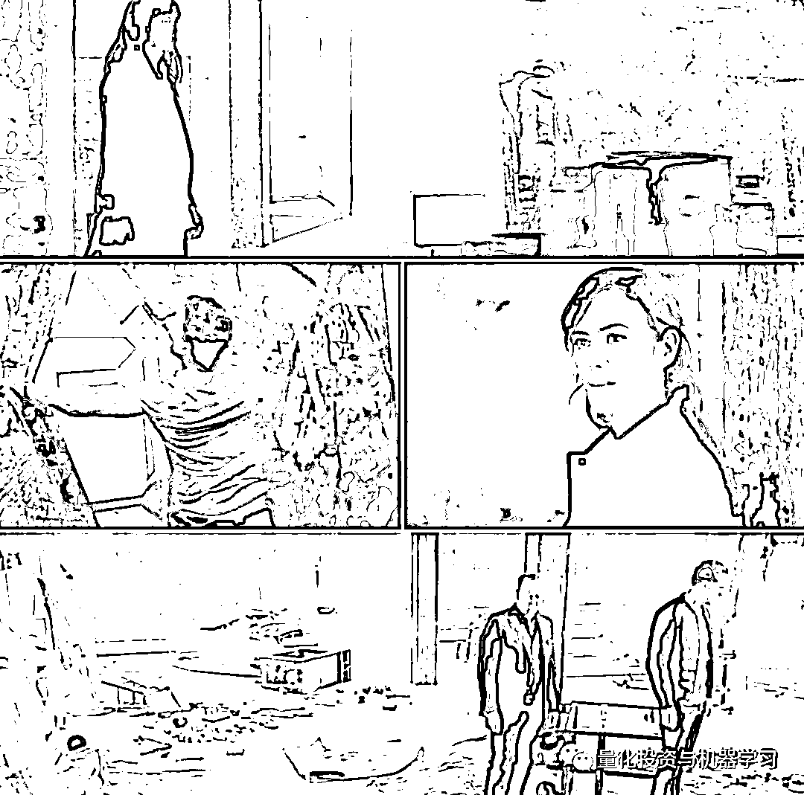

小编不认为 Axe 会停止扰乱 Wendy 的私人生活。很可能他会试图在职业上伤害她——这可能会成为 Axe 所犯的最大的错误。

在官方的预告片中，我们看到 Wendy 告诉 Axe 放弃与 Prince 的战斗。当提到 Prince 的时候，这两个人的看法肯定不一致。小编猜，随着 Wendy 对 Prince 的了解加深，她可能会发现，Prince 实际上就像当年的 Axe，那时他还不是一个对冲基金大佬。也许，是时候让 Wendy 和两个新的男主角（Tanner 和 Prince）来取代她生命中的两个老男人（Chuck 和 Axe）了。哎呀，我的妈呀

Prince 已经向 Wendy 和 Taylor 证明，他和他们做生意并无用心。当他看到 Taylor 已经准备好和他一起打持久战时，Prince 给小编留下了深刻的印象。

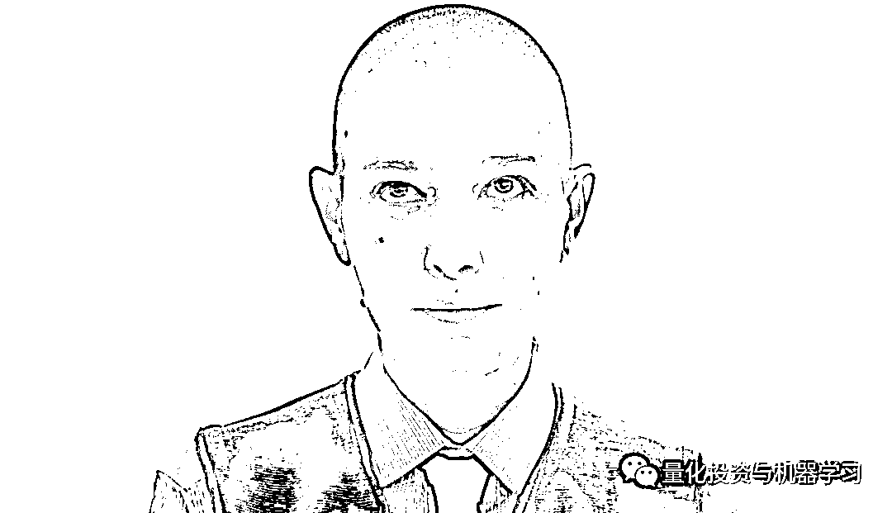

虽然 Axe 一点也不信任 Prince，但 Taylor 不知道他们是否可以信任任何人。当他们说“a wounded and cornered Bobby Axelrod… Few can survive that…”，他们是在警告 Prince？或者他们是在告诉别人，他们会尽最大努力在 Axe 面前生存下去？小编忍不住想知道，Taylor、Wendy 和 Prince 是否也可以联合起来，在某个时候把 Axe 和 Chuck 干掉。

对了，Showtime 已经宣布 Jeanane Garafolo 将作为客串明星加入 Billions。她将扮演 Winslow，一个合法大麻公司的老板。我们将看到她的故事将如何整合到故事情节中，是否与本季前几集的 Ayahuesca 生意有关？

艾美奖提名者 Jeanane Garafolo

最后，我们也期待着看到编剧们在电视剧中会不会荣融入新冠疫情的元素！

有几个细节，我们看到很多人，戴着口罩：

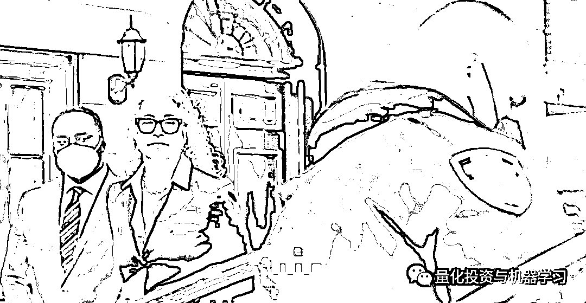

Axe 在别人认为是灾难的地方看到了机遇——比如 911 事件。因此，我们期待看到 Axe Capital 是否会在新冠疫情期间参与一些不寻常的交易！

最后，我们可以想象一下：Winston 写了一个算法来预测他和 Axe Capital 其他人感染新冠病毒的可能性，Wags 用一些流行设备来阻止病毒，Spyros 戴着一个保时捷口罩，还有 Dollar Bill，把他从家里带来的瓶子装满酒精提供给办公室各处进行消毒。哈哈哈，真是太有趣了

预告片中的一个情节是：Wags 在办公室里进行了一次浪漫的约会，可能是因为在疫情爆发期间餐馆关门了

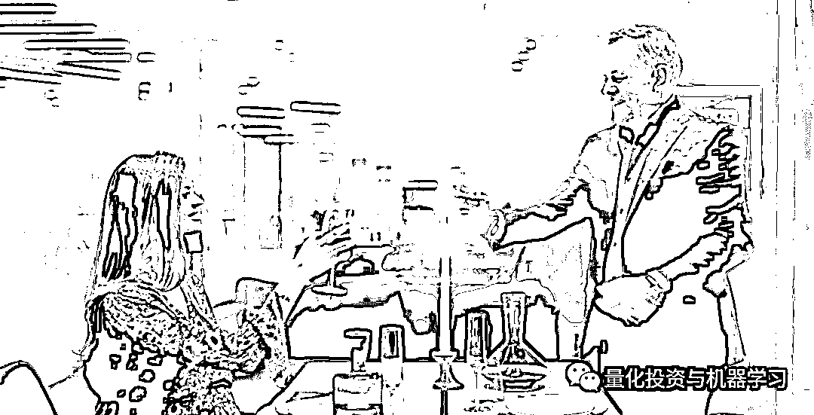

还有 28 天，虽然这是一个漫长的等待，但毕竟，这一切都是值得的！

周末快乐！