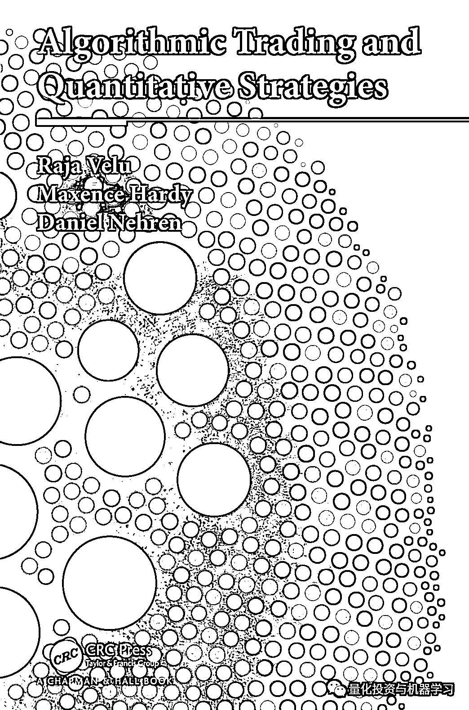

# Quant 书籍推荐：数据、策略到执行算法及技术设施

> 原文：[`mp.weixin.qq.com/s?__biz=MzAxNTc0Mjg0Mg==&mid=2653318214&idx=1&sn=d8b271a203a857e51d559e262d5ca11a&chksm=802dae53b75a27458cbdb557feae64f8e1541d77913594019f408fdc1ba910e6b855ae6ac749&scene=27#wechat_redirect`](http://mp.weixin.qq.com/s?__biz=MzAxNTc0Mjg0Mg==&mid=2653318214&idx=1&sn=d8b271a203a857e51d559e262d5ca11a&chksm=802dae53b75a27458cbdb557feae64f8e1541d77913594019f408fdc1ba910e6b855ae6ac749&scene=27#wechat_redirect)

# 

量化投资与机器学习微信公众号，是业内垂直于**量化投资、对冲基金、Fintech、人工智能、大数据**等领域的主流自媒体。公众号拥有来自**公募、私募、券商、期货、银行、保险、高校**等行业**20W+**关注者，连续 2 年被腾讯云+社区评选为“年度最佳作者”。

好久没有给大家推荐量化书籍了，今天公众号给大家推荐的这本书籍是：

*   **书名：**《Algorithmic Trading and Quantitative Strategies》

*   **作者：**Raja Velu, Maxence Hardy, Daniel Nehren

*   **推荐人群：****希望对量化投资（非基于技术指标的程序化交易）有系统全面的了解**

**简介**

本书从数据、策略到执行算法及技术设施等，全面而有深度的介绍了算法交易及量化策略。全书一共分为了五个部分：

**第一部分：**介绍了交易相关的基础，包括参与者、交易机制、研究所用的数据及做市商等。

**第二部分：**是侧重于数学基础，包括常规的单变量时间序列、多变量时间序列，还介绍了包括了高阶的数学模型在量化策略的应用，如时间空间序列模型、机器学习及状态变化发现模型等。这一部分是后续研究量化策略的基础。

**第三部分：**介绍了常见的量化策略，有时序的策略，包括统计套利的策略、模式识别，也有截面动量的策略；然后介绍了多因子模型及动态组合的管理；最后涉及了新闻、社交媒体等另类数据在量化策略的应用。

**第四部分：**侧重在执行端，主要关注市场微观结构，首先第八章涉及了交易数据的建模，然后更进一步讲解市场冲击（Market Impact）的模型，最后介绍如何设计最优的订单执行策略。

**最后一部分：**讲技术设施，分成两个维度：交易技术栈和研究技术栈。比如高频交易的技术架构及基础设施，研究环境及模拟成交环境的搭建等。

当然

**Talk is cheap, show me the code**

作者还贴心的搭配了 github 的资源：

*https://github.com/NehrenD/algo_trading_and_quant_strategies*

总体来说，本书每一部分都中规中矩，研究某一细分领域的 Quant 可以借由此书对整个量化投资有系统性的了解，大量的参考文献，也让更深入的研究有了基础。

**如何下载？**

公众号后台回复（全大写）：

**ATQS**