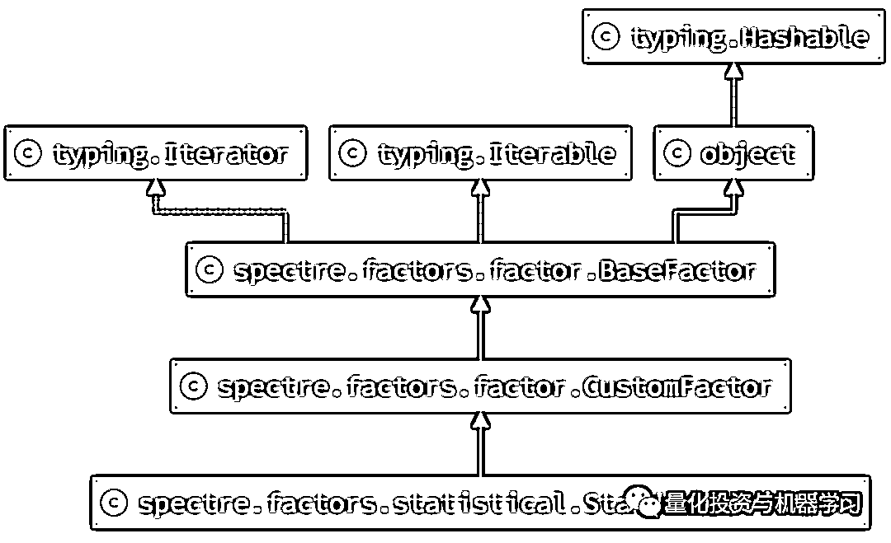

# 速度提升 80 倍！GUP 加持的因子计算神器 Spectre

> 原文：[`mp.weixin.qq.com/s?__biz=MzAxNTc0Mjg0Mg==&mid=2653318198&idx=1&sn=235f4c8ce7e526ce425f30fdaa5b1cd2&chksm=802dae23b75a2735f47fb6caba3f37b1dc15c385bbf90bc055d4d2ea09943088835147795116&scene=27#wechat_redirect`](http://mp.weixin.qq.com/s?__biz=MzAxNTc0Mjg0Mg==&mid=2653318198&idx=1&sn=235f4c8ce7e526ce425f30fdaa5b1cd2&chksm=802dae23b75a2735f47fb6caba3f37b1dc15c385bbf90bc055d4d2ea09943088835147795116&scene=27#wechat_redirect)

# 


量化投资与机器学习微信公众号，是业内垂直于**量化投资、对冲基金、Fintech、人工智能、大数据**等领域的主流自媒体。公众号拥有来自**公募、私募、券商、期货、银行、保险、高校**等行业**20W+**关注者，连续 2 年被腾讯云+社区评选为“年度最佳作者”。

**正文**

因子研究过程主要涉及以下三个步骤：**因子计算、因子分析及因子回测**。

每个过程都需要大量的计算，特别是第一步因子计算，当对于全市场所有股票计算过去 10 年的量价因子，多则几分钟，少则几十秒。**这对于每天把因子研究当做王者荣耀的 Quant 来说，确实是度秒如年。**公众号在最大的同性交友社区 Github 发现了这么一个独特的项目：spectre。这是来自项目首页的介绍：

spectre is a GPU-accelerated Parallel quantitative trading library, focused on performance.1\. Fast GPU Factor Engine, see below Benchmarks.2\. Pure python code, based on PyTorch, so it can integrate DL model very smoothly.3\. Compatible with alphalens and pyfolio.

**Spectre 基于开源因子分析模块 zipline.pipeline 的结构，并对其核心计算逻辑使用 pytorch 进行的爆改，使其能够调用 GPU 的 cuda 进行计算加速，**并且在输出端的数据结构可以完美的适应 alphalens 和 pyfolio。我们来看一下作者给出的速度对比，以下对比基于 3196 个股票，3637344 根 K 线计算 SMA 简单均线等计算指标：


在最耗时的 MACD+RSI+STOCH 复合因子并进行 zscore 标准化的计算中，基于 spectre 调用 3090 显卡的耗时为 184 毫秒，基于 spectre 调用 CPU（不用显卡）的耗时为 6.01 秒，**使用 zipline.pipeline 的计算时间为 14.3 秒。可以看出 spectre 使用 3090 显卡比 zipline 快了近 80 倍。**

以上测试基于以下机器配置：

*   i9-7900X @ 3.30GHz，20 Cores

*   DDR4 3800MHz

*   3090：GIGABYTE GeForce RTX 3090 GAMING OC 24G

*   2080Ti：RTX 2080Ti Founders

接下来我们从安装，入门到核心概念来介绍下 Spectre。

**安装**

分为两步，首先是 spectre 的安装

```py
pip install --no-deps git+git://github.com/Heerozh/spectre.git
```

由于 spectre 依赖 pytorch 进行 cuda 计算，所以还需要安装及其他相关依赖库，**Pytorch 很大，大家忍一下。**

```py
conda install pytorch torchvision torchaudio cudatoolkit=11.0 -c pytorch
conda install pyarrow pandas tqdm plotly requests
```

首先是因子计算，因子计算之前需要导入数据，项目提供的专门的数据加载类 DataLoader，基于基础得数据加载类 DataLoader，可以实现不同数据加载的形式，可以来自 csv 文件，数据库或其他方式。以 CsvDirLoader 为例:

```py
from spectre.factors import FactorEngine, SMA, OHLCV
from spectre.data import CsvDirLoader 
loader = CsvDirLoader(
    '../tests/data/daily/', calender_asset='SPY',
    ohlcv=('uOpen', 'uHigh', 'uLow', 'uClose', 'uVolume'),
    prices_index='date', parse_dates=True,
)
engine = FactorEngine(loader)
# engine.to_cuda()
engine.add(SMA(5), 'ma5')
engine.add(OHLCV.close, 'close')
df = engine.run('2019-01-14', '2019-01-15')
print(df)
```

CsvDirLoader 是**项目自带的，用于导入某个文件夹下的所有数据**，所以在这个文件夹下每个文件对应一个股票的数据，实例化的第一个参数输入的就是文件夹的位置。

*   calender_asset 用于同意交易日历，比如这里有标普 500 的时间作为统一的交易日历

*   ohlcv，如果是价格数据，需要制定高开低收的列名称

*   prices_index，指定日期所在的列

FactorEngine 是用于因子计算、分析回测的总引擎，在实例化时需要加载 DataLoader，这里我们把刚刚实例化的 CsvDirLoader 加载到 FactorEngine。如果有 GPU 的话，可以把 engine.to_cuda()的注释去掉。

接下来就是给 FactorEngine 加载需要计算的因子，这里的 SMA 是一个简单均线因子，因子算法项目本身已经提供（关于自定义因子算法，后文会讲解）。**所以这里加载的因子，实际上是因子算法，FactorEngine 会根据因子的算法，使用 DataLoader 读取数据进行计算。**然后，是一个更简单的因子，就是高开低收里的收盘价。FactorEngine 一次可以加载多个因子，所有的结果会以 MultiIndex Dataframe 的形式返回。最后，调用 engine.run()就可以开始计算。

接下来，我们看一个因子分析的例子，Barra 里的 Volatility 和 Momentum 进行因子分析：

```py
from spectre import factors
import math
risk_free_rate = 0.04 / 252
excess_logret = factors.LogReturns() - math.log(1 + risk_free_rate) # 计算超额收益率
universe = factors.AverageDollarVolume(win=120).top(100) # 过于 120 交易量前 100 的股票
# Barra MOMENTUM
ema126 = factors.EMA(half_life=126, inputs=[excess_logret]) # ema126 基于 excess_logret 计算得出
rstr = ema126.shift(11).sum(252)
MOMENTUM = rstr
# Barra Volatility
ema42 = factors.EMA(half_life=42, inputs=[excess_logret])
dastd = factors.STDDEV(252, inputs=[ema42])
VOLATILITY = dastd
# run engine
engine = factors.FactorEngine(loader) # 还是使用上面的 loader
engine.set_filter( universe )
engine.add( MOMENTUM, 'MOMENTUM' )
engine.add( VOLATILITY, 'VOLATILITY' )
engine.to_cuda()
%time factor_data, mean_return = engine.full_run("2013-01-02", "2018-01-19", periods=(1,5,10,))
```

关于以上代码，大家肯定有很多疑问，我们逐一说明：

*   首先作者定义了超额对数收益率 excess_logret，它有股票的对数收益减去无风险的对数收益得到。LogReturns 也是一种因子算法，我们后面可以看到这些因子都继承子一个因子基类 CustomFactor

*   基于 excess_logret，作者有定义了两个需要测试的因子 MOMENTUM 和 VOLATILITY，值得注意的是在一直到 13 行代码，**都是在定义因子计算逻辑，并没有真正的开始计算。而且因子的逻辑是可以嵌套的，后面的因子可以把之前定义的因子作为输入。**

*   **engine.full_run 与 engine.run 的区别是后者只是计算因子，而前者不仅计算因子，还对因子进行分析。但总体分析的维度比较简单，可以结合 alphalens 进行更详细的测试。**

```py
import alphalens as al
...
factor_data, _ = engine.full_run("2013-01-02", "2018-01-19")
clean_data = factor_data[['{factor_name}', 'Returns']].droplevel(0, axis=1)
al.tears.create_full_tear_sheet(clean_data)
```

**核心概念**

Spectre 最核心的是对于因子类的抽象，当我们在定义一个因子并计算时，实际上包含了两部分工作，首先是定义数据源，告诉 FactorEngine 如何加载数据，从哪里加载数据。然后就是定义因子算法，这部分主要在 CustomFactor 的 compute 方法里实现。

以项目自带的 StandardDeviation 因子为例，inputs 默认为收盘价，但可以在实例化的初始化过程中重新定义输入：

```py
class StandardDeviation(CustomFactor):
    inputs = [OHLCV.close]
    _min_win = 2
    def compute(self, data):
        return data.nanstd()

# 重新定义 inputs
std_factor = StandardDeviation(inputs=[excess_logret])
```

下图给出了标准差 StandardDeviation 因子的继承关系图。可以发现最终继承自 BaseFactor。



**如果 inputs 是数据库中已有的某列数据呢？**spectre 已经考虑了这种情况，某列数据，只要能对应到某个具体的股票，它也是因子的一种，只不过这种因子不需要计算，在 spectre 中这类因子用 ColumnDataFactor 表示，也继承自 BaseFactor。我们可以看下 ColumnDataFactor 的源码：

```py
class ColumnDataFactor(BaseFactor):
    def __init__(self, inputs: Optional[Sequence[str]] = None, should_delay=True) -> None:
        super().__init__()
        if inputs:
            self.inputs = inputs
        assert (3 > len(self.inputs) > 0), \
            "ColumnDataFactor's `inputs` can only contains one data column and corresponding " \
            "adjustments column"
        self._data = None
        self._multi = None
        self._should_delay = should_delay
    @property
    def adjustments(self):
        return self._multi
    def get_total_backwards_(self) -> int:
        return 0
    def should_delay(self) -> bool:
        return self._should_delay
    def pre_compute_(self, engine, start, end) -> None:
        super().pre_compute_(engine, start, end)
        self._data = engine.column_to_tensor_(self.inputs[0])
        self._data = engine.group_by_(self._data, self.groupby)
        if len(self.inputs) > 1 and self.inputs[1] in engine.dataframe_:
            self._multi = engine.column_to_tensor_(self.inputs[1])
            self._multi = engine.group_by_(self._multi, self.groupby)
        else:
            self._multi = None
    def clean_up_(self) -> None:
        super().clean_up_()
        self._data = None
        self._multi = None
    def compute_(self, stream: Union[torch.cuda.Stream, None]) -> torch.Tensor:
        return self._data
    def compute(self, *inputs: Sequence[torch.Tensor]) -> torch.Tensor:
        pass
```

可以发现，ColumnDataFactor 的 inputs 是数据的某列的列名称，compute 方法直接返回数据，而没有任何计算逻辑。所以如果是数据库中以后的因子需要测试，则需要以下几个步骤：

```py
from spectre.factors import FactorEngine, ColumnDataFactor
from spectre.data import CsvDirLoader 

# 定义 DataLoader
loader = CsvDirLoader(
    '../tests/data/daily/', calender_asset='SPY',
    prices_index='date', parse_dates=True,
) # 比如这个数据里有一列因子为 size

engine = FactorEngine(loader)
engine.to_cuda()

# 指定要测试的因子
size_factor = ColumnDataFactor(inputs=['size'])
engine.add(size_factor)

# 因子测试
factor_data, mean_return = engine.full_run("2013-01-02", "2018-01-19", periods=(1,5,10,))
```

BaseFactor 是所有 Factor 的基类，其中包括因子异常值处理、标准化及分组等常用的方法。关于该模块的详细用法请参考：*https://github.com/Heerozh/spectre*

**总结**

spectre 结合 pytorch 对因子计算的效率有了极大的提高，因子定义维护也有了一个标准的模板，给了我们很大的借鉴意义，但关于因子在 A 股的应用还有很多优化的，比如：

*   对于 A 股基本面数据的支持与优化
*   对于因子中性化处理的逻辑
*   以及更丰富的因子测试结果

公众号也会努力舔砖加瓦，请大家持续关注