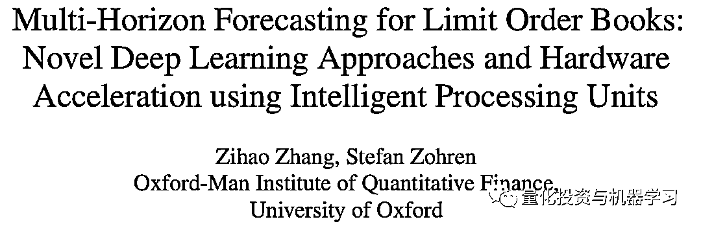
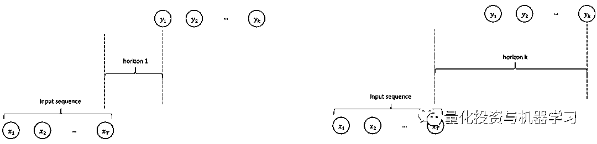
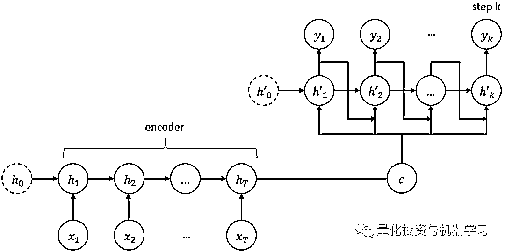
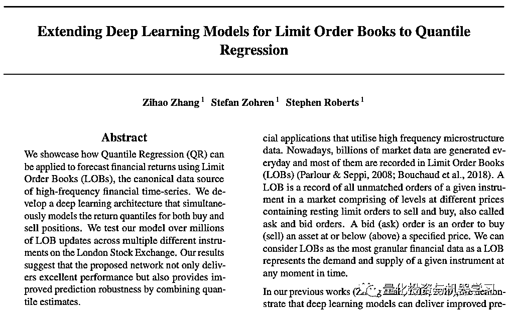
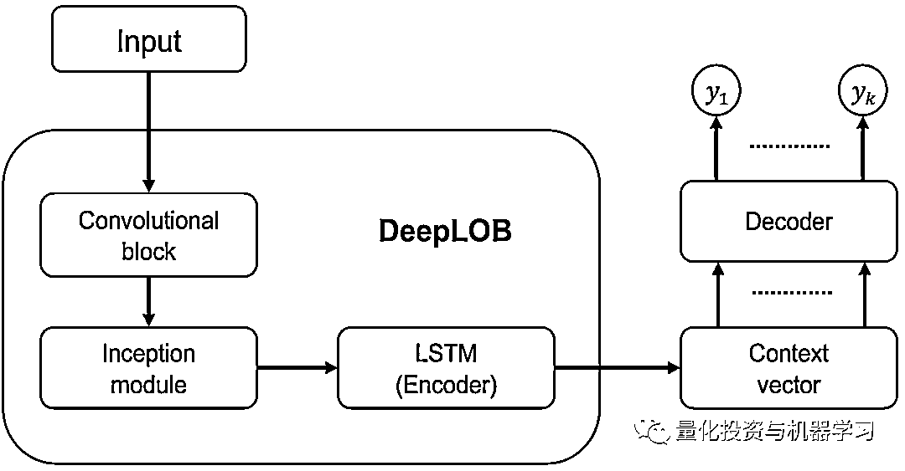
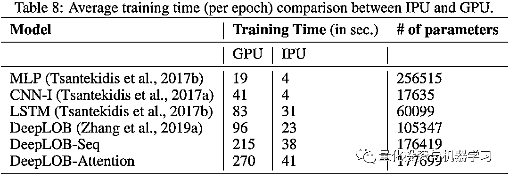
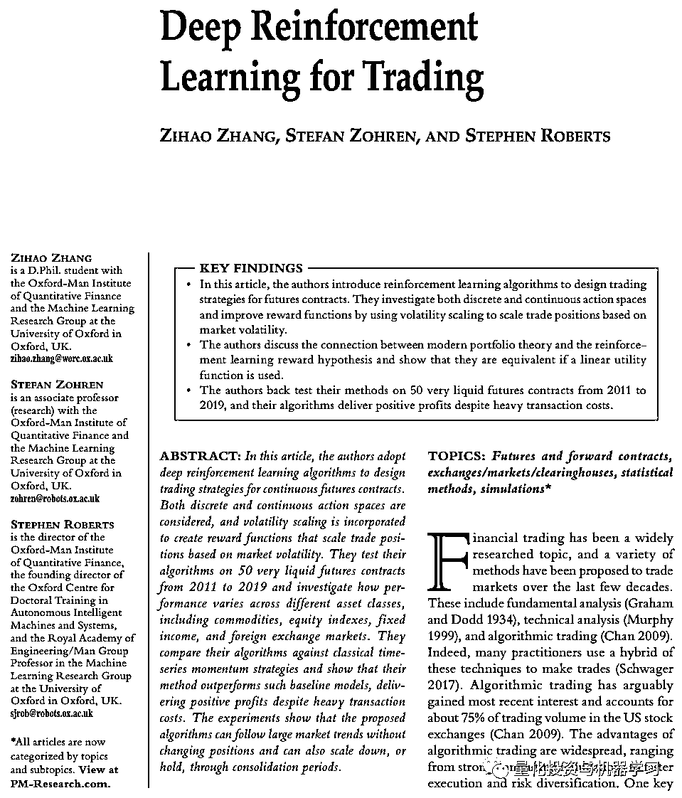

# 量化都玩 IPU 了？Man Group-Oxford 研究所给你答案

> 原文：[`mp.weixin.qq.com/s?__biz=MzAxNTc0Mjg0Mg==&mid=2653318180&idx=1&sn=4b41f498aaae2308720dfb39d4075962&chksm=802dae31b75a2727470b825c630664bf551b5401edff1b061073786e77efc84d85bd5a9e3b02&scene=27#wechat_redirect`](http://mp.weixin.qq.com/s?__biz=MzAxNTc0Mjg0Mg==&mid=2653318180&idx=1&sn=4b41f498aaae2308720dfb39d4075962&chksm=802dae31b75a2727470b825c630664bf551b5401edff1b061073786e77efc84d85bd5a9e3b02&scene=27#wechat_redirect)

# 

量化投资与机器学习微信公众号，是业内垂直于**量化投资、对冲基金、Fintech、人工智能、大数据**等领域的主流自媒体。公众号拥有来自**公募、私募、券商、期货、银行、保险、高校**等行业**20W+**关注者，连续 2 年被腾讯云+社区评选为“年度最佳作者”。

**人工智能可以预测走势**

近日，根据彭博报道，Oxford-Man 量化研究所的研究人员表示，他们已经开发出了一个机器学习程序，可以预测股价的走势——预测范围在 30s 内，且该程序的成功率达到了 80%！

根据报道，该算法计算出价格在 100 个 tick 内的走势，这相当于大约 30 秒到 2 分钟的交易时间。

该研究所副教授、此项目联合负责人 Stefan Zohren 表示：“在多步预测中，我们实际上有一个经过训练的模型，可以在更小的范围内进行预测。我们将这些信息反馈给预测本身，并将预测向前滚动，从而得到更长周期的预测。”

Man AHL 首席科学家 Anthony Ledford 表示：“该算法仍处于测试阶段。如果我们建立并且持有自己的仓位，你可能会持有该仓位数周。但实际上，通过一系列规模较小的交易，实际上让你持有该仓位的时间要短得多。”

Ledford 也表示：“虽然这项研究是兴奋的，但 Man 尚未承诺推出该模型！”

随着行业竞争的加剧，核心策略的收益越来越低，量化分析师们正在争相部署学习股票统计模式的程序，以降低交易成本，并找到新的投资信号。

Zohren 与研究助理 Zihao Zhang 还在今年共同撰写了下面这篇论文，大家可以看看：

https://arxiv.org/pdf/2105.10430.pdf

在这篇论文中的一个核心点在于，研究人员使用了 Graphcore（拟未科技）公推出司的**IPU（Intelligence Processing Unit）**优化了其计算性能。

**什么是 IPU？**

用一句话来总结为什么需要 IPU，可以这样说：

**如果 CPU 和 GPU 是 AI 技术的“适应者”，那 IPU 就是针对 AI 而生的技术！**

的确，现在有越来越多的 AI 技术是在 CPU、GPU 之后才出现，但只有 IPU 是为了实现 AI 的技术而设计，速度更快、更完整呈现算法。

至于 GPU 跟 IPU 实际上的差别，Graphcore 曾说道：“如果是用来执行分类静态图片的前馈卷积神经网络（feed-forward convolutional neural networks），GPU 的表现已经相当好，但 IPU 可以提供两到三倍的性能优势、有时甚至是五倍。若是更复杂的模型，像是尝试理解场景对话的模型，由于资料需来回快速传递，但是因为所有的模型都保存在我们的处理器中，IPU 可以比 GPU 快很多，甚至可能快十倍、二十倍或者五十倍。”

我们知道，多时间窗口（multi-horizon）预测模型的实用性在很大程度上受到了 CPU 和 GPU 训练缓慢的影响。

多时间窗口预测

由于 IPU 为 AI 设计的架构为 Oxford-Man 量化研究所减少了多时间窗口预测模型的训练时间，以便更准确地估计市场价格变动，他们发现 IPU 的速度至少比普通 GPU 快至少 10 倍左右。

单时间窗口（single horizon）预测通常是作为一个标准的监督学习方法，其目的是建立限价订单簿上的买/卖价格和在特定时刻的最终市场价格之间的关系。然而，影响市场定价的因素众多，有用的信噪比相对较低，使得很难从单时间窗口推断出长期的预测路径。

一种实现多时间窗口预测的技术借用了 NLP 中常见的方法，采用 Seq2Seq 和 Attention 模型，这些模型包括编码器和解码器的复杂循环神经层。Attention 模型有助于解决 Seq2Seq 模型的某些限制，这些限制阻止它们处理一些长序列。

Seq2Seq 网络体系结构

但是，这种模型的递归结构不利于 GPU 等处理器体系结构上的并行处理。考虑 LOB 数据的速度很快，这种情况尤成问题。 

对于这个计算问题已经提出了几种解决方案，包括使用具有完全连接层的 Transformer。

然而，Oxford-Man 量化研究所的团队认为，Seq2Seq/Attention 组合的周期性结构与多时间窗口预测中时间序列的性质非常吻合，从而能够总结过去的信息并传播到随后的时间戳。

LOB 数据被 Oxford-Man 量化研究团队用来训练一些模型，其中包括 DeepLOB，由其团队开发：

https://arxiv.org/pdf/1906.04404.pdf

多时间窗口预测方面，研究人员测试了 DeepLOB 的两个变体 DeepLOB-Seq2Seq 和 DeepLOB-Attention，它们分别使用 Seq2Seq 和 Attention 模型作为解码器。

模型架构：具有编码器/解码器结构的 DeepLOB

在包括 DeepLOB-Seq2Seq 和 DeepLOB-Attention 在内的一系列模型中，Graphcore IPU 系统在训练时间方面优于其 GPU：

同时，Zohren 还考虑将编码器-解码器结构应用于强化学习框架，正如下面这篇论文所述：

https://www.oxford-man.ox.ac.uk/wp-content/uploads/2020/06/Deep-Reinforcement-Learning-for-Trading.pdf

诸位怎么看？