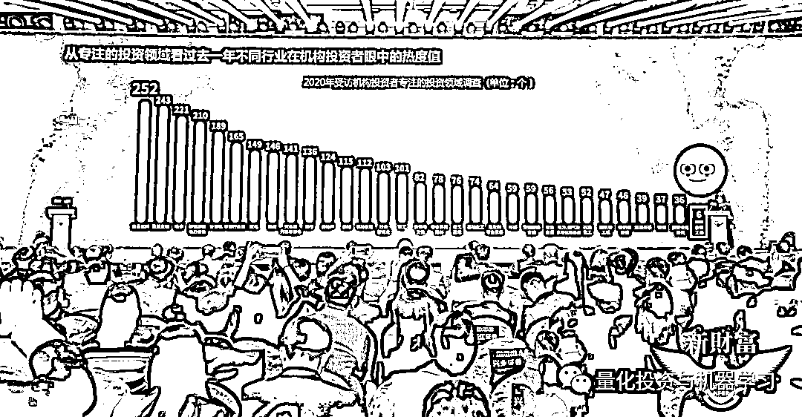

# 二千零二十一、Q2：『卖方金工』研报热度 榜单！

> 原文：[`mp.weixin.qq.com/s?__biz=MzAxNTc0Mjg0Mg==&mid=2653318102&idx=1&sn=25578a0261c4558d5a37585bef67b4fa&chksm=802da9c3b75a20d52c97b81d8e53bab7f65a463fdf8ffe10d6673a7c76383fb1b14ec996b169&scene=27#wechat_redirect`](http://mp.weixin.qq.com/s?__biz=MzAxNTc0Mjg0Mg==&mid=2653318102&idx=1&sn=25578a0261c4558d5a37585bef67b4fa&chksm=802da9c3b75a20d52c97b81d8e53bab7f65a463fdf8ffe10d6673a7c76383fb1b14ec996b169&scene=27#wechat_redirect)

# 

统计时间范围：2021 年 1 月 1 日~2021 年 7 月 29 日

**免责声明：**以下所引述机构或个人的观点、言论、数据及其他信息仅作参考和资讯传播之目的，不代表公众号赞同其观点或证实其描述。

**2021 Q2：『卖方金工』研报热度榜单**

*数据来自：慧博平台，按券商首字母排序 

去年新财富有一张扎心的图：

来个放大版：

啥也不说了！

**卖方金融工程**太苦了

QIML 公众号分析：金融工程受关注比较低主要有两个原因：

**第一金融工程本来就不是一个行业，金融工程是一种方法，在越来越倡导基本面量化的情况下，金融工程更多的发展空间来自于与主观行业研究的结合。**

**其二，近几年量化在公募基金的发展比较缓慢，公募基金还是以主观投资为主，所以出现了公募私募量化两重天的现象。**

期待今年的新财富又会是怎样。

  量化投资与机器学习微信公众号，是业内垂直于**量化投资、对冲基金、Fintech、人工智能、大数据**等领域的主流自媒体。公众号拥有来自**公募、私募、券商、期货、银行、保险、高校**等行业**20W+**关注者，连续 2 年被腾讯云+社区评选为“年度最佳作者”。