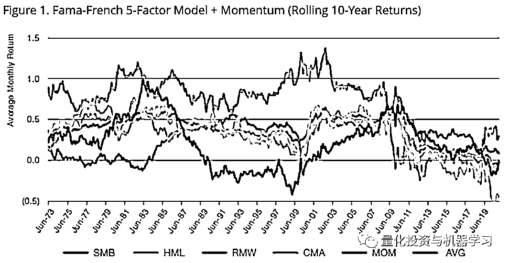
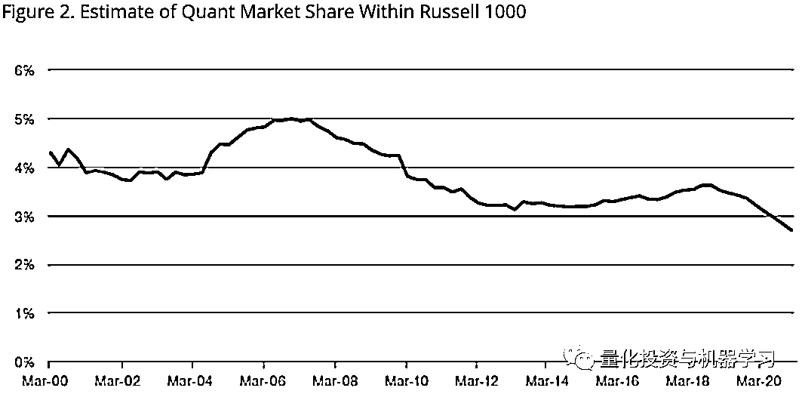
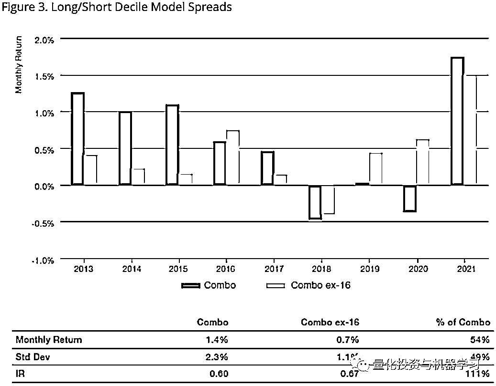

# Man Numeric：量化股票策略的未来

> 原文：[`mp.weixin.qq.com/s?__biz=MzAxNTc0Mjg0Mg==&mid=2653318071&idx=1&sn=6d2203c8fc4a9ef6654626620deaa15e&chksm=802da9a2b75a20b4169295e72a0ef44be3d66cfd47685b6397c05f29adbaf0091d1384c03970&scene=27#wechat_redirect`](http://mp.weixin.qq.com/s?__biz=MzAxNTc0Mjg0Mg==&mid=2653318071&idx=1&sn=6d2203c8fc4a9ef6654626620deaa15e&chksm=802da9a2b75a20b4169295e72a0ef44be3d66cfd47685b6397c05f29adbaf0091d1384c03970&scene=27#wechat_redirect)

# 

作者：Daniel Taylor       编译：QIML 编辑部

量化股票投资正面临一场中年危机。2021 年，一些最流行的策略最近已陷入困境。几十年来我们一直使用的有效的方法今后还会继续起作用吗？现在，在一个数据似乎无限、计算能力远远超出我们几十年前所能想象的世界里，我们应该保留这个过程的哪些原则？在这里，我们努力找出一条前进的道路，并希望我们能够做得更好。

我们讨论的重点是最常用的量化策略之一：**截面的策略，通常是自下而上的策略。**尽管这类策略已经以这样或那样的形式出现了几十年，但它们从上世纪 90 年代开始真正开始获得吸引力和市场份额。研究截面策略的量化分析师历来关注行为相关的异象，经常围绕价值(过度反应)和动量(反应不足)的概念展开。其他类型的方法也获得了普及，如低波动性或低贝塔策略。我们通常试图以一种系统的、可重复的方式捕捉那些我们认为在市场上随着时间的推移普遍存在的现象。

一般来说，量化股票策略非常依赖回测的结果。如果一个人相信未来至少会看起来有点像过去(事实往往如此!)那么，过去有效的策略在未来有很大机会发挥作用。我们也知道，在某些时期，某些策略会失效。而且，往往这些时期提供了最好的潜在的机会！研究过程通常包括产生策略逻辑、回测、调整和再回测，是一个不断重复的过程。如果我们发现一个信号陷入了困境，我们可以进行额外的研究来“解决”这个问题。除了信号的产生，我们还非常重视投资组合的构建，风险管理和执行。

**现在**

在过去的几十年里，这个领域的竞争变得异常激烈，量化因子、策略和技术被广泛采用。过去十年的大部分时间对于许多量化股票策略来说都是一个充满挑战的环境，尤其是那些关注价值、质量或低风险的策略。在某些地区(比如美国) ，这种表现引发了这些策略是否还有效的严重的问题。我们认为，重要的是要区分这些因子（比如价值）面临的周期性和长期性的挑战。

在周期性方面，量化分析师对一些传统因子的了解和使用可能有所增加。事实上，有人可能会合理地提出（从事后来看），过去十年中的某个时候，许多以因子为导向的策略变得过于拥挤。此外，毫无疑问，价值因子已经失宠一段时间了，而且防御性或低波动性策略最近也失宠了。这种周期性可能与货币政策和利率环境有关，这是很难阻碍的。显然，低名义利率和负实际利率对资产定价产生了影响，虽然这作为对某些因子表现的当时解释是有用的，但不一定具有预测性。许多因子往往是周期性的，这是采用因子策略的所需要接收的事实，而且事实上这也是一些支持者论点的核心。

然而，也有一些重要的世俗问题在起作用。今天计算机的能力和普及程度的提高，再加上许多因子被很多人使用，引发了一些严重的问题，这些策略的优势在不断衰退。过分简单化的以因子策略随着时间的推移显示出了显著的长期衰退，为了减轻这种衰退，有必要进行创新。

*图片来自：Man Numeric

图 1 显示了 Fama-French 五因子模型中及动量因子的月度收益的 10 年滚动均值。过去，这些因子中的一个以上呈现负收益的情况很少见; 然而，在过去十年中，它们中的许多都挣扎着，这五个因子的平均值在过去 10 多年中一直是负的。而且要注意的是，这还没扣除交易成本。

这并不是说以因子策略的前景没有任何希望。但是，期望这些因子像历史上那样发挥作用是不合理的，这应该有助于指导我们如何设计和实施策略。事实上，我们通常应该假设信号会随着时间的推移而衰减，并据此制定计划。

**应该怎么做**

首先，让我们对三种量化股票策略进行分类: factor risk premia [FRP], enhanced beta capture [EBC] and true idiosyncratic alpha [TIA].。在我们看来，大多数量化股票策略属于 FRP 或 EBC 类别。以价值或动量为导向的投资策略属于 FRP 类别，而低波动性或风险平价投资组合属于 EBC 类别。FRP 和 EBC 类别的不同之处在于，FRP 要求对回报进行专门的资产预测(通常是一个或多个因素的转化) ，而 EBC 策略只要求考虑风险（波动性和相关结构）。这些类型策略的好处是，它们可以利用可能长期存在的行为或结构偏见，提供有吸引力的风险回报。**TIA 是最难的策略，很难发现真正的特质收益率。虽然有些量化股票策略在一定程度上是 TIA，但随着时间的推移，它最终会演变为 FRP。我们认为，认识到真正的 alpha 和 factor risk premia 之间的差异非常重要——对于投资者和配置者都是如此。**

现在假定，大多数量化股票内容属于 FRP 和 EBC 类别——那又怎样？**尽管这些类别中的许多概念已被证明在很长的历史时期内是有效的，但它们通常会长时间的失效，这非常考验投资者的耐心。**在过去的十年里，由于大多数发达国家的实际利率都是负数，价值一直处于极度挣扎之中。随着债券类股票变得更具吸引力，债券市场 30 年的牛市可能有利于低波动性，但在利率稳定或上升的环境下，这种策略会发生什么变化呢？另一个问题是，当量化股票投资策略发挥作用时，大量资本往往会流入这些策略，因为这会带来更高的回报和流动(请注意，对于任何类型的投资策略而言，这都是一个挑战)。当然，随着越来越多的资本试图从某种特定的异象情况中获利，预期利润将会下降，直到找到新的均衡。然后，收益和资金流入的正反馈回路可以迅速逆转(正如许多因子策略在过去几年中所看到的那样)。图 2 显示了我们估计的 Russell 1000 中的量化市场份额，在 2008 年到 2012 年(表现良好的时期)上升，再从 2018 年到 2020 年再次出现的下降。

*图片来自：Man Numeric

**这是两个大问题，但最大的问题可能是量化股票策略过度依赖回测。**大多数量化策略依赖于回测来找出在过去哪些策略有效，然后说服自己这些策略可能在未来继续有效。通常情况下，回测看起来非常有吸引力，因为大量的“研究”可以发现回测阶段回撤较小的策略。**但量化分析师真正需要的是，在量化股票策略的研究中更具前瞻性。这并不是说历史是无关紧要的——它只是说历史是从一个分布中抽取出来的，而且很可能是一个有偏见的分布，可能会产生一种错误的安全感。当某种东西在一段时间内不起作用时，我们的先验是它应该反弹，而不是它不再起作用，因为历史上就是这样。**

有趣的是，这种错误的安全感在经济繁荣时期也起作用: 当一项策略表现良好时，感觉世界上一切都是正确的。这两种情况都引入了自满的可能性: 我们建立了一个可重复和系统化的过程，而当事情进展顺利时，我们不愿意改变它(为什么要破坏一个好的策略?)或者当事情变得很糟糕的时候也不愿改变(它会迅速恢复)。

那么真正的特质 Alpha 呢？无论它存在于哪里，它都不可能无限期地持续下去，而且它的容量也可能非常有限。Alpha 可能来自于操作优势、市场的暂时混乱、或者一个尚未商品化或普及的洞察力或数据集。但真正的 Alpha 本质是它会衰变，因此监测 Alpha 衰变和相关结构是至关重要的。要做好这件事，在规模上，需要一个优秀的平台、流程和人员。

我们越来越相信，投资者应该把重点放在试图了解哪些研究更有实际操作性。一种方法是通过一系列通用因子(例如 Barra 基本风险因子)对 alpha 进行中性化处理。另一种方法是我们称之为收益中性化处理，它试图通过从历史收益的时间序列中估计风险因子的对冲比率。这两种方法都试图确定多少“Alpha”是真正的 Alpha，而多少“Alpha”其实来自常见的风险因子。图 3 显示了全球(发达国家的大盘股)复合 alpha 策略 的回测结果，蓝色和黄色柱子分别表示包括和不包括 Barra 基本风险因子(ex-16)。在样本的前几年，很大一部分的回测 alpha 实际上暴露于几个一般的基本面风险因子，而在 2019 年和 2020 年，这些基本面风险因子降低了策略的表现。

*图片来自：Man Numeric

从产品开发和定位的角度来看，理解资产增值的前提以及相对于市场中的其他参与者的位置是非常重要的。**真正的 alpha 是非常有价值的，但并不像我们大多数人所希望的那么丰富。收费应该更高，容量应该更有限。**尽管如此，如果能够巧妙地实施，并注重最大限度地减少直接(如费用)和间接(如交易成本)的费用，FRP 和 EBC 投资组合可以成为一个多样化投资项目的有价值组成部分。

**未来**

首先，成功的交易或投资必须是过程驱动的，但这一过程必须是动态的和灵活的。随着时间的推移，市场和参与者会不断变化，而且变化的速度越来越快，如果不适应这些变化，那么它将很难持续繁荣下去。

其次，我们认为，我们必须区分真正的特质 Alpha 和风险溢价或面向投资组合构建的策略。这对费用、能力、风险管理、交易的进取性和业绩预期都有重要影响。因子风险溢价策略要与纯 Alpha 产品区分开来，理解这些差异并据此执行将变得越来越重要。

第三，我们作为量化分析师需要更多地向前看(而不是向后看!).我们需要看到未来可能是什么样子，或者相信某个信号将与未来相关，或者有一个严格的程序告诉我们什么时候我们错了: 今天或明天与我们的回测有什么不同？每个人都有更多机会获取大量的计算能力、数据、学术研究、历史交易策略和社交网络。这些对策略的发展会带来什么变化？

第四，市场或资产的价格或价值确实很重要。尽管为市场或资产定价或估值本身就很困难，而且有时投资者/交易员也不会为这些世俗的担忧所困扰，但将估值框架作为投资过程的一部分，应该始终是相关的(与一些纯成长型投资者可能的建议相反)。当前关于价值的相关性或者它是否已经死亡的争论是被误导的: 在一定的价格下，几乎任何资产都可能是有吸引力的或者没有吸引力的。

**总结**

虽然传统的以因子策略已经繁荣了几十年(断断续续) ，但我们需要更好地利用我们的优势，并认识到我们的弱点。需要明确的是，这是 Man Numeric 在过去的几年中一直在策略性地朝着这个方向发展，事实上，他们一直在尝试利用历史。展望未来，我们需要运用分析技能来展望未来，发现机遇，然后做出判断。被动性的崛起、 ESG 的采用、气候变化的威胁、收入和财富不平等的挑战、技术融入我们的日常生活以及不断变化的世界人口结构，所有这些都可能为运用分析能力解决未来的投资问题提供机会，**而这种解决方式是回测无法回答的。**

量化投资与机器学习微信公众号，是业内垂直于**量化投资、对冲基金、Fintech、人工智能、大数据**等领域的主流自媒体。公众号拥有来自**公募、私募、券商、期货、银行、保险、高校**等行业**20W+**关注者，连续 2 年被腾讯云+社区评选为“年度最佳作者”。