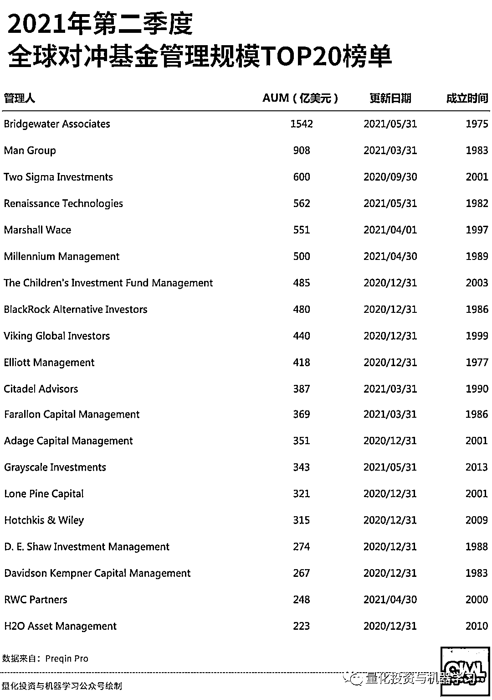

# 最新！2021 Q2 全球对冲基金 AUM 榜单出炉

> 原文：[`mp.weixin.qq.com/s?__biz=MzAxNTc0Mjg0Mg==&mid=2653318053&idx=1&sn=cf6af01558431bf0242579aa83731cea&chksm=802da9b0b75a20a6de15adcb6525e36d86a52d8c4a11b0ffdad5713a4e36152799563c764ab4&scene=27#wechat_redirect`](http://mp.weixin.qq.com/s?__biz=MzAxNTc0Mjg0Mg==&mid=2653318053&idx=1&sn=cf6af01558431bf0242579aa83731cea&chksm=802da9b0b75a20a6de15adcb6525e36d86a52d8c4a11b0ffdad5713a4e36152799563c764ab4&scene=27#wechat_redirect)

# 

来看看国内目前百亿私募情况。根据市场公开信息，目前国内百亿量化私募有如下几家：

**博普资产、诚奇资产、黑翼资产、幻方量化**

**佳期投资、金锝资产、进化论资产、九坤投资**

**灵均投资、明汯投资、鸣石投资、宁波幻方量化**

**启林投资、盛泉恒元、天演资本、衍复投资**

（按管理人首字母排序从左至右）

量化投资与机器学习微信公众号，是业内垂直于**量化投资、对冲基金、Fintech、人工智能、大数据**等领域的主流自媒体。公众号拥有来自**公募、私募、券商、期货、银行、保险、高校**等行业**20W+**关注者，连续 2 年被腾讯云+社区评选为“年度最佳作者”。