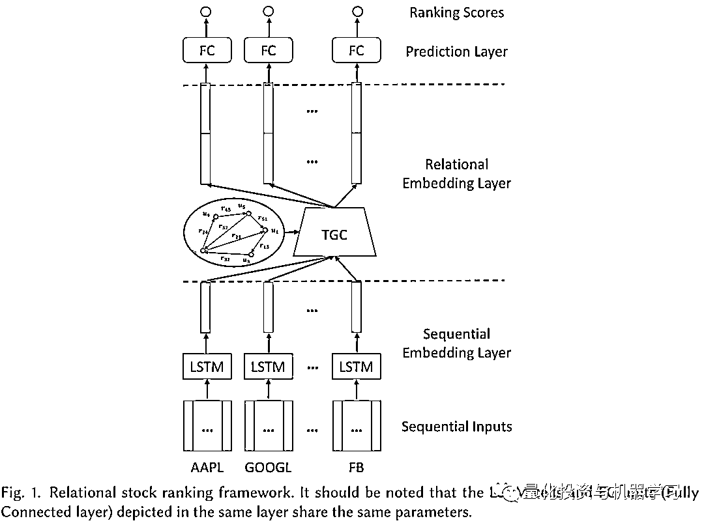

# 基于图神经网络、图谱型数据的收益预测模型（附代码）

> 原文：[`mp.weixin.qq.com/s?__biz=MzAxNTc0Mjg0Mg==&mid=2653318032&idx=1&sn=ceffdc840c52e49de288ce534fb9d989&chksm=802da985b75a20932461a19c17ce841c20349d704dff3c96f001d2a970c7691b5a6712a34846&scene=27#wechat_redirect`](http://mp.weixin.qq.com/s?__biz=MzAxNTc0Mjg0Mg==&mid=2653318032&idx=1&sn=ceffdc840c52e49de288ce534fb9d989&chksm=802da985b75a20932461a19c17ce841c20349d704dff3c96f001d2a970c7691b5a6712a34846&scene=27#wechat_redirect)

# 

量化投资与机器学习公众号独家解读

量化投资与机器学公众号 *** ***QIML Insight——深度研读系列 ******是公众号今年全力打造的一档**深度、前沿、高水准**栏目。

公众号**遴选**了各大期刊前沿论文，按照理解和提炼的方式为读者呈现每篇论文最精华的部分。QIML 希望大家能够读到可以成长的量化文章，愿与你共同进步！

[第一期 ](http://mp.weixin.qq.com/s?__biz=MzAxNTc0Mjg0Mg==&mid=2653315304&idx=1&sn=8f36bc03096995655abea040e2ee3f94&chksm=802da2fdb75a2beb5d210c8235ab64fba0ba510b16683599189419f2ce0af483ea9c020707f6&scene=21#wechat_redirect) | [第二期](http://mp.weixin.qq.com/s?__biz=MzAxNTc0Mjg0Mg==&mid=2653315407&idx=1&sn=e9f5e375aedcb0b8f82d6c42b7ea3e80&chksm=802da35ab75a2a4c1aa8aa458bb5878ccbe0499b3c4e01bfff51508610c4e45f07d5b16fd6ab&scene=21#wechat_redirect) | [第三期](http://mp.weixin.qq.com/s?__biz=MzAxNTc0Mjg0Mg==&mid=2653315880&idx=1&sn=0d7bd33e5f1697973c1f365b729369b5&chksm=802da13db75a282b762267494b493c81b5595f35ca41da6a34625a13c02c6e1765d641ed7f0c&scene=21#wechat_redirect) | [第四期](http://mp.weixin.qq.com/s?__biz=MzAxNTc0Mjg0Mg==&mid=2653316512&idx=1&sn=d88a7b3d5c46f307370fe7e8939b4bbd&chksm=802da7b5b75a2ea3f74d3f7f1dff4c57c811a51f60f77104f0a8de86301f98f3b28814daa834&scene=21#wechat_redirect) | [第五期](http://mp.weixin.qq.com/s?__biz=MzAxNTc0Mjg0Mg==&mid=2653316725&idx=1&sn=4ef212b4f7ffca70da72a9b72917676e&chksm=802da460b75a2d762a41f36c89140ce6f364cf2ab1994ffccec7306b8186641f4598372495ed&scene=21#wechat_redirect) | [第六期](http://mp.weixin.qq.com/s?__biz=MzAxNTc0Mjg0Mg==&mid=2653316934&idx=1&sn=0bae7eba4fc5a8b462ee21ded87e3718&chksm=802da553b75a2c45232d3928fee7677c7fce7e2ccea7c77377e3748db3c7b884450f41ce323a&scene=21#wechat_redirect) 

[第七期](http://mp.weixin.qq.com/s?__biz=MzAxNTc0Mjg0Mg==&mid=2653317372&idx=1&sn=ca755712e4a0b8d84b9beca7e513a8ce&chksm=802daae9b75a23ffe0d91ef55c22827772e7d28b727b91b13519aa095deede6b2736d808529a&scene=21#wechat_redirect) | [第八期 |](http://mp.weixin.qq.com/s?__biz=MzAxNTc0Mjg0Mg==&mid=2653317559&idx=1&sn=2c967a2b372c293e71b4dcbb2dab8442&chksm=802daba2b75a22b4bc256e7b904af21e2f6ee86dbfb1b9dc70a3e56d84eb1cc754511af3ee38&scene=21#wechat_redirect) [第九期](http://mp.weixin.qq.com/s?__biz=MzAxNTc0Mjg0Mg==&mid=2653317718&idx=1&sn=f2529edafe0f348952d589fe1f487727&chksm=802da843b75a21550c0c0a101e1483bf131bf3d5c62ac1c5a6d7f978b171c1ea064e073d8f7b&scene=21#wechat_redirect)[ | 第十期](http://mp.weixin.qq.com/s?__biz=MzAxNTc0Mjg0Mg==&mid=2653317895&idx=1&sn=fd0c72987a57c7963dab778aaee67b3d&chksm=802da912b75a20049f33650057330966b36da9c055ed314cac67e1bb581ca981feaa1ecab5d2&scene=21#wechat_redirect) [| 第十一期](http://mp.weixin.qq.com/s?__biz=MzAxNTc0Mjg0Mg==&mid=2653317992&idx=1&sn=cc92a1ae42b7ca0c0291dd55505149ba&chksm=802da97db75a206bc9363a2a14166b977594f0d78a9bbfbdc734483900c5965cb4a7372cb107&scene=21#wechat_redirect)

**前言**

传统的股价预测的时许模型，对于收益率的假设往往不切实际，而最近兴起的机器学习模型，特别是深度学习模型对于股价的预测也存在着明显的问题：

*   **大多数文献中，都直接预测股价或者是收益率，并没有考虑股票之间的排序。**

*   **每只股票的序列单独输入模型中，并不能考虑股票或公司间多维度的信息：比如供应关系和产业关系。**

为了解决以上问题，作者提出了一个新的框架：Relational Stock Ranking(RSR)。这个框架主要由两个创新：

*   **损失函数新增了关系股票收益排序的惩罚项，使模型能够顾及股票收益间的排序（Rank）。**

*   **结合了时间图神经网络，使模型能够结合股票间的关系型数据，如行业属性、上下游、股权信息等。**

**RELATIONAL STOCK RANKING（RSR）**

RSR 总共包含三层，分别是基于序列数据应用序列神经网络模型的 Sequential Embedding Layer, 基于关系型数据应用图神经网络的 Relational Embedding Layer, 和最终给出收益预测结果的 Prediction Layer。如下图所示：

**Sequential Embedding Layer**

股票过去的价格变动对于未来的变化有明显的影响，所以整个框架的第一层采用序列模型去捕获股价序列间的依赖信息。RNN 在最近的文献中，都有出色的表现。所以作者选用的 RNN 最为第一层的模型。更具体的，作者采用了 LSTM，因为它能保留序列的长期记忆。并以 LSTM 的模型结果作为下一层的输入。（LSTM 的输入为股价的历史序列 X_t）

**Relational Embedding Layer**

这一层主要考虑股票之间的关系型数据，作者在模型中加入了两类关系型数据：

行业属性：两个公司是否属于同一个行业或板块，如果属于同一行业，那么两个公司之间的基本业务应该类似，股价的表现也应该有相似的趋势，如图 2a 中，MSFT 和 GOOGL 的股价。

供应链关系：如果两家公司属于供应链的上下游，即一家公司是另一家的客户（或供应商），那么他们之间的股价的变动应该有传导效应。如图 2b 中，Apple 的供应商 LENS 在 AAPL 发布 iphone8 之后，股价开始上涨。

为了使 RSR 能够加入这些关系型的数据，作者采用了 Temporal Graph Convolution(TGC)算法，将关系型的图谱数据与第一层的输出进行结合，作为第三层的输入。关于 TGC，下一节会详细介绍。

**Prediction Layer**

最终将第二层的输入用于股票收益率的预测，这里的损失函数定义为：

<embed style="vertical-align: -1.469ex;width: 81.823ex;height: auto;" src="https://mmbiz.qlogo.cn/mmbiz_svg/a18XcQ1EBBggIibBXCZoqdiaDpvfar6YtuPXf6QSiag89CLicJqibxelZgT6zg0E11YHeM6HcAZN67icjp8IdHee2VtlBZXu8y6aDm/0?wx_fmt=svg" data-type="svg+xml">

其中 分别是股票的预测收益率和实际收益率。这个损失函数中，第一项为了是预测的收益误差越小越好理解。第二项，为了股票间的相对顺序与真实情况比，误差越小越好。

**Temporal Graph Convolution**

给定 N 个股票的序列特征（sequential embeddings) 和多维度的二元关系 ，TGC 的主要任务是基于二元关系，重新学习 N 个股票的序列特征。传统的图神经网络没有考虑关系的动态变化，对于所有时间中，每个点（Vertex）的影响性都用固定的方式计算，比如如下考虑关系重要性作为权重的特征计算：

<embed style="vertical-align: -3.301ex;width: 23.851ex;height: auto;max-width: 300% !important;" src="https://mmbiz.qlogo.cn/mmbiz_svg/a18XcQ1EBBggIibBXCZoqdiaDpvfar6YtuiclFE3bJwImc4WxzfMYMVacg25QeYYNKGtSRRBVfFM8D2VyTAsD7M3xfdTwy2H6pic/0?wx_fmt=svg" data-type="svg+xml">

其中， 为股票 ，使用网络关系，整合其他与之相关的股票，而重新生成的特征， 为 A 关系张量中与股票 i 有关系的股票的数量， 为股票 与股票 的关系，函数 用于度量关系的强弱。可以看到，这里的函数 是固定不变的，并没有考虑不同时间的序列特征，作者做了如下改进，将 t 时刻的股票的序列特征也考虑在关系强度函数 中：

<embed style="vertical-align: -3.301ex;width: 29.726ex;height: auto;max-width: 300% !important;" src="https://mmbiz.qlogo.cn/mmbiz_svg/a18XcQ1EBBggIibBXCZoqdiaDpvfar6YtuDOHlIXnR8ljFuXaPZF1rhTE38HGxCBqAxZ9nWLbCfNicricFajgHmRWNbOWiaqKOcyq/0?wx_fmt=svg" data-type="svg+xml">

此时，关系强弱函数 g 的定义就关系到了 TGC 的具体表现，作者给出了显性模型和隐性模型两种定义：

**显性**，其中 为激活函数， 为参数。也就是说，关系的强弱，取决于第一项，两个股票当前时间的相似性，和第二项两者关系的重要。这两项的乘积决定了关系强弱。因为这两项都能清楚的解释，所以称为显性模型。<embed style="vertical-align: -4.492ex;width: 38.438ex;height: auto;max-width: 300% !important;" src="https://mmbiz.qlogo.cn/mmbiz_svg/a18XcQ1EBBggIibBXCZoqdiaDpvfar6YtuxYibXzeTfg9BPSo7wgWcsJF4hCUKs3VmYz46Im3icrPFdYtJWcek13lnia96hbY6H7p/0?wx_fmt=svg" data-type="svg+xml">

**隐性**，如果把序列特征及关系都放到激活函数内部，则称为隐性模型。

<embed style="vertical-align: -2.148ex;width: 39.939ex;height: auto;max-width: 300% !important;" src="https://mmbiz.qlogo.cn/mmbiz_svg/a18XcQ1EBBggIibBXCZoqdiaDpvfar6Ytu6CA7gpb3icZoSbmyibzwc7vZdKg9hyQibDoSzVFufzlDGdLbM96rOuGoia5w2os0Itq4/0?wx_fmt=svg" data-type="svg+xml">

**实证**

作者选取了 NASDAQ 和 NYSE 从 2013 年 1 月 2 日至 2017 年 12 月 8 日的数据，经过以下条件的过滤：

*   在此区间，98%的时间正常交易

*   股价从未低于 5 美元

分别在 NASDAQ 选取了 1026 只股票，在 NYSE 选取了 1737 只股票，获取了日度价格数据。并把测试时间分为了 3 个不同的阶段，如下表所示：

除了价格数据，还有股票的关系数据，包括行业属性数据及关系数据（总计 42 中关系），覆盖度如下：

关系型数据，主要分为，如图 4 表示：

*   一阶关系：两者直接相关

*   二阶关系：两者分别和第三者相关

**回测设定**

在 2017/01/03 至 2017/12/08 的测试区间，回测的设定如下：

*   买入预测收益最高的股票，日度换仓，收盘买卖

*   每次固定 50,000 美元的持仓规模

*   交易成本为 0，假设全部成交

**用于对比的其他模型**

*   SFM：首先将历史价格数据进行离散傅里叶变换，再输入到 LSTM 模型中进行预测。参考 Liheng 2017；

*   LSTM：基于历史收盘价及 5、10、20 和 30 均线的 LSTM 模型；

*   RANK_LSTM：RSR 中去除 Relational Embedding Layer 后的模型；

*   Graph-base Ranking(GBR)：RANK_LSTM 的损失函数增加图惩罚项；

*   GCN：RSR 的第二层采用 GCN；

*   RSR_E：RSR 中的关系强弱函数 g，用显性模型；

*   RSR_I：RSR 中的关系强弱函数 g，用隐性模型。

衡量模型效果的指标有：

*   Mean Square Error (MSE)，越小越好；

*   Mean Reciprocal Rank(MRR)：是一个国际上通用的对搜索算法进行评价的机制，即第一个结果匹配，分数为 1，第二个匹配分数为 0.5，第 n 个匹配分数为 1/n，如果没有匹配的句子分数为 0。总之，越大越好。

*   the cumulative investment return ratio (IRR)：越大越好。

**最关心的问题**

**1、将股票的价格预测问题变成一个收益预测的任务，效果怎么样？相比当下热门的算法，RSR 有没有优势？**

*   以 IRR 指标衡量，Rank_LSTM 的效果比 SFM 和 LSTM 好很多，说明基于股票排序的学习比直接预测收益率，效果更优。这对我们研究更先进的排序学习算法(Learning-to-rank)有了信心。

*   但在 MRR 指标上，在 NYSE 市场，Rank_LSTM 的表现差于 SFM，可能是因为损失函数及考虑了绝对预测的准确性，又考虑了相对排序的准确性，从而降低了模型的稳定性。

*   图 5 给出了三个模型的累计收益曲线，可以看出仅仅买入一只股票的收益波动还是很大的，模型的表现不够稳定。

**2、股票间的关系数据能否提高神经网络模型的效果？文中提出的 TGC 与卷积图神经网络算法 GCN 相比有效性怎么样？**

表 6 的测试中，关系型数据仅仅使用了行业属性数据：

*   加入行业属性的数据后，在 NYSE 的表现比 NASDAQ 的表现更好，可能是因为 NASDAQ 的股票波动更大，更受短期因素的影响；

*   在 NYSE，所有加入图关系数据的模型的 IRR 都比 Rank_LSTM 来的好，说明关系型数据能增强模型的表现；

*   RSR_E，RSR_I 的表现优于 GCN 和 GBR。说明，TGC 相比 GCN 的效果更佳。

如表 7 所示，在考虑 Wiki 关系型数据后，RSR_E 和 RSR_I 在两个市场的 IRR 都是最高的。下表展示了，Wiki 关系型数据中最重要的 5 个关系，**其中 P1056_P1056 表示两个公司是否生产同一种产品，这个关系是最重要的，也是公司的产业链关系，可以用产业图谱表示。**

**总结**

*   前段时间，JPM 有很多文章介绍 Learning-to-rank 的算法，本篇文章虽然没有之间采用 Learning-to-rank 的算法，但在损失函数设计中巧妙的考虑了股票间的排序。

*   产业链、供应链等图谱型数据，日益成为大家关注的数据类型，但很多机构并没有想好怎么用这类数据？传统基于量价的深度学习模型，结合基于图谱类数据的图神经网络，给这类数据的应用指明了一条可探索的道路。

**资源**

作者在 github 上开源了论文的代码，心急的小伙伴尽快尝鲜：

***https://github.com/fulifeng/Temporal_Relational_Stock_Ranking***

量化投资与机器学习微信公众号，是业内垂直于**量化投资、对冲基金、Fintech、人工智能、大数据**等领域的主流自媒体。公众号拥有来自**公募、私募、券商、期货、银行、保险、高校**等行业**20W+**关注者，连续 2 年被腾讯云+社区评选为“年度最佳作者”。