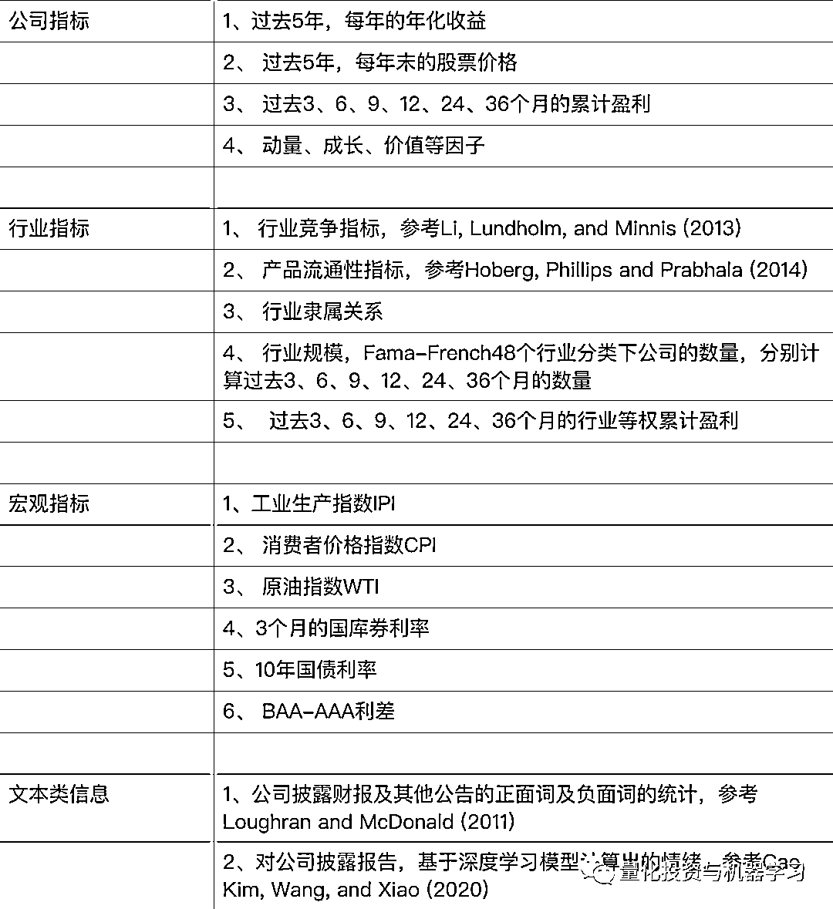
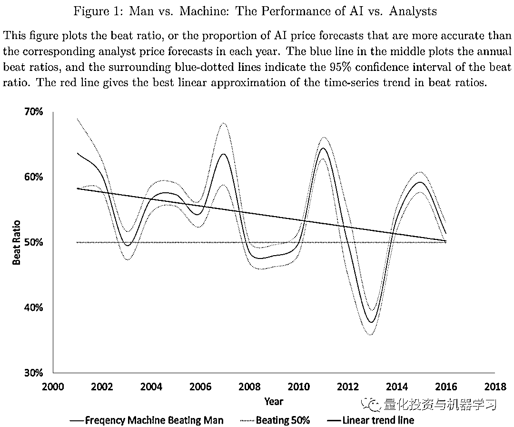
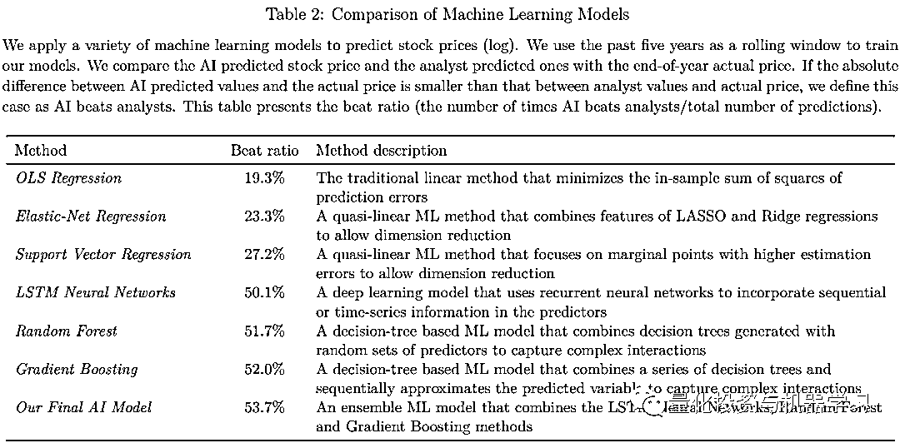
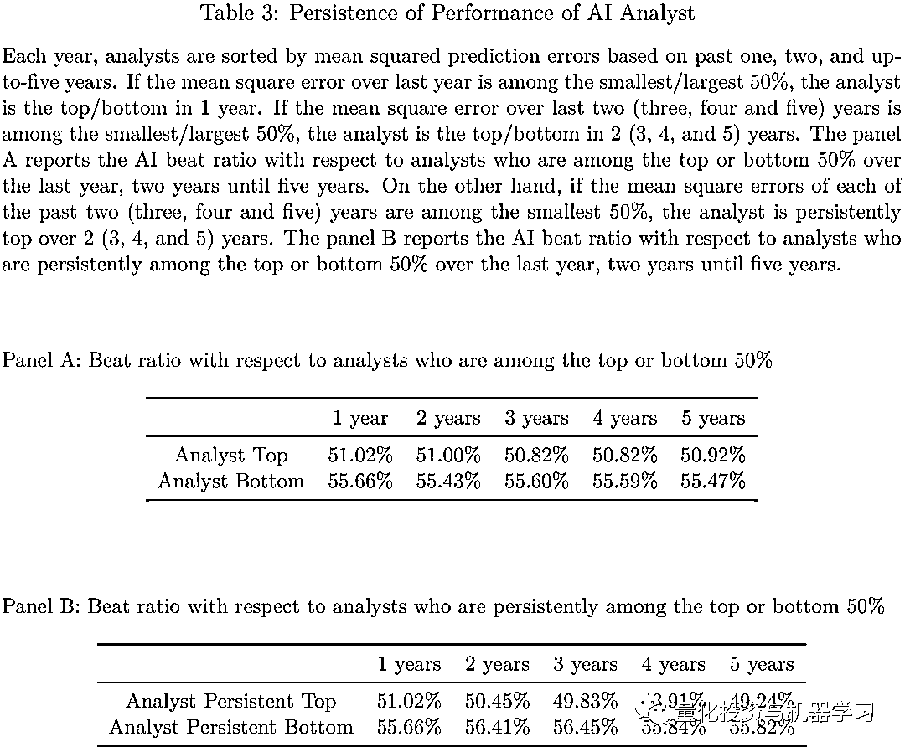
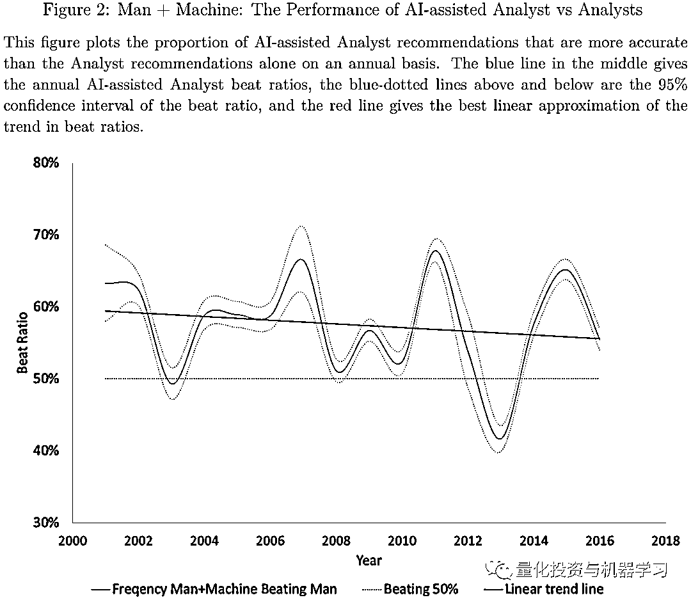
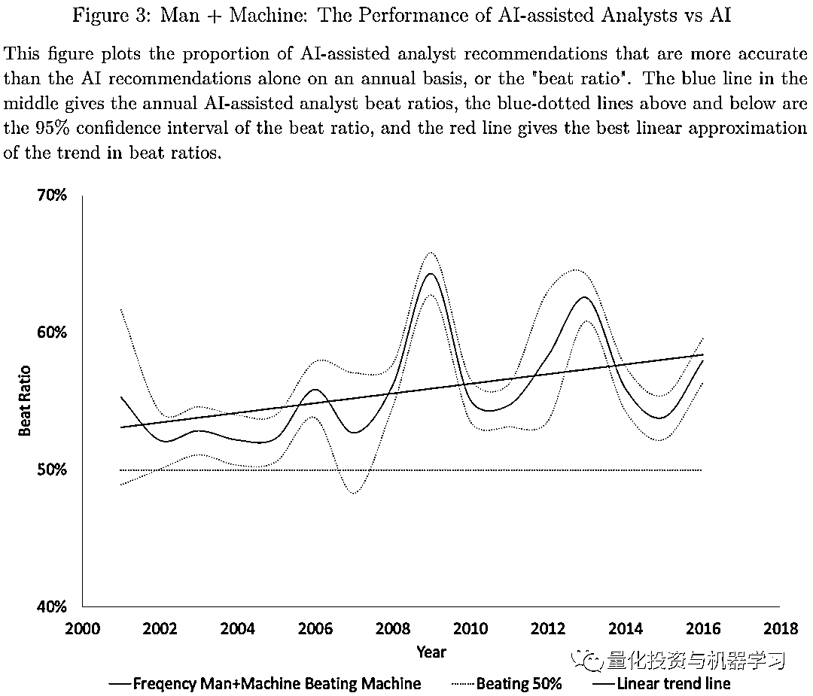
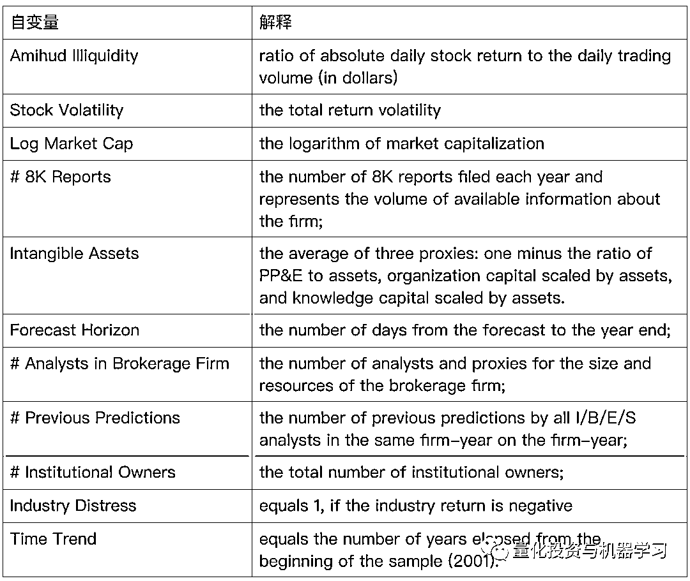
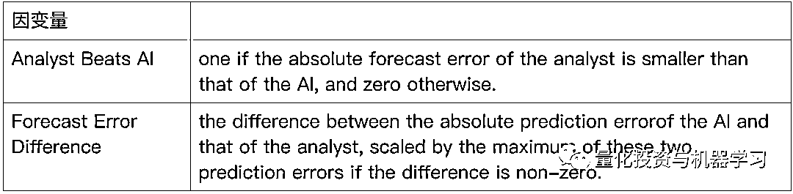
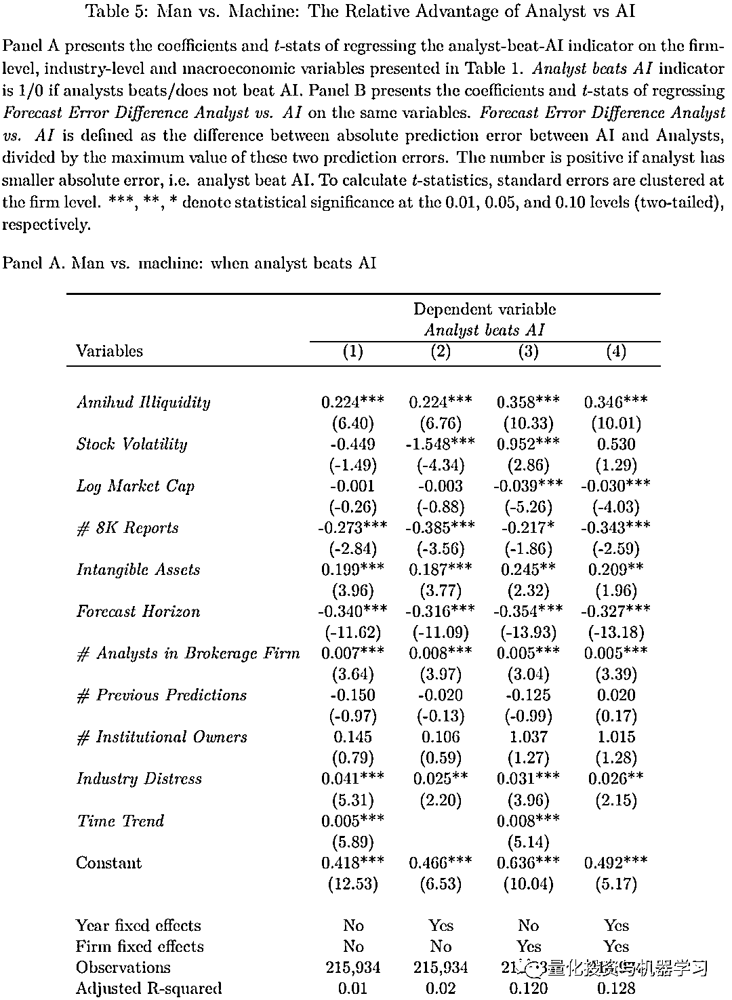
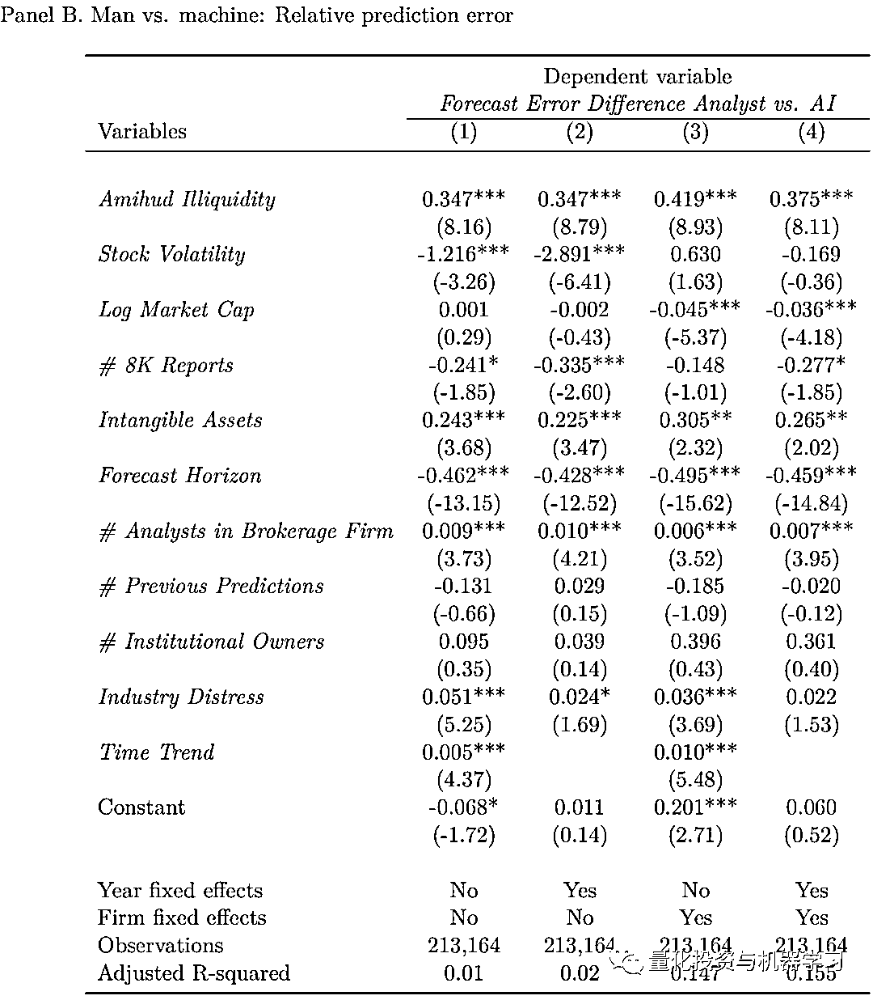

# 从『Man VS AI』到『Man + AI』

> 原文：[`mp.weixin.qq.com/s?__biz=MzAxNTc0Mjg0Mg==&mid=2653317992&idx=1&sn=cc92a1ae42b7ca0c0291dd55505149ba&chksm=802da97db75a206bc9363a2a14166b977594f0d78a9bbfbdc734483900c5965cb4a7372cb107&scene=27#wechat_redirect`](http://mp.weixin.qq.com/s?__biz=MzAxNTc0Mjg0Mg==&mid=2653317992&idx=1&sn=cc92a1ae42b7ca0c0291dd55505149ba&chksm=802da97db75a206bc9363a2a14166b977594f0d78a9bbfbdc734483900c5965cb4a7372cb107&scene=27#wechat_redirect)

# 

**量化投资与机器学习微信公众号，是业内垂直于**量化投资、对冲基金、Fintech、人工智能、大数据**等领域的主流自媒体。公众号拥有来自**公募、私募、券商、期货、银行、保险、高校**等行业**20W+**关注者，连续 2 年被腾讯云+社区评选为“年度最佳作者”。**

**量化投资与机器学习公众号独家解读**

**量化投资与机器学公众号 *** ***QIML Insight——深度研读系列 ******是公众号今年全力打造的一档**深度、前沿、高水准**栏目。**

****

**公众号**遴选**了各大期刊最新论文，按照理解和提炼的方式为读者呈现每篇论文最精华的部分。QIML 希望大家能够读到可以成长的量化文章，愿与你共同进步！**

**[第一期 ](http://mp.weixin.qq.com/s?__biz=MzAxNTc0Mjg0Mg==&mid=2653315304&idx=1&sn=8f36bc03096995655abea040e2ee3f94&chksm=802da2fdb75a2beb5d210c8235ab64fba0ba510b16683599189419f2ce0af483ea9c020707f6&scene=21#wechat_redirect) | [第二期](http://mp.weixin.qq.com/s?__biz=MzAxNTc0Mjg0Mg==&mid=2653315407&idx=1&sn=e9f5e375aedcb0b8f82d6c42b7ea3e80&chksm=802da35ab75a2a4c1aa8aa458bb5878ccbe0499b3c4e01bfff51508610c4e45f07d5b16fd6ab&scene=21#wechat_redirect) | [第三期](http://mp.weixin.qq.com/s?__biz=MzAxNTc0Mjg0Mg==&mid=2653315880&idx=1&sn=0d7bd33e5f1697973c1f365b729369b5&chksm=802da13db75a282b762267494b493c81b5595f35ca41da6a34625a13c02c6e1765d641ed7f0c&scene=21#wechat_redirect) | [第四期](http://mp.weixin.qq.com/s?__biz=MzAxNTc0Mjg0Mg==&mid=2653316512&idx=1&sn=d88a7b3d5c46f307370fe7e8939b4bbd&chksm=802da7b5b75a2ea3f74d3f7f1dff4c57c811a51f60f77104f0a8de86301f98f3b28814daa834&scene=21#wechat_redirect) | [第五期](http://mp.weixin.qq.com/s?__biz=MzAxNTc0Mjg0Mg==&mid=2653316725&idx=1&sn=4ef212b4f7ffca70da72a9b72917676e&chksm=802da460b75a2d762a41f36c89140ce6f364cf2ab1994ffccec7306b8186641f4598372495ed&scene=21#wechat_redirect) | [第六期](http://mp.weixin.qq.com/s?__biz=MzAxNTc0Mjg0Mg==&mid=2653316934&idx=1&sn=0bae7eba4fc5a8b462ee21ded87e3718&chksm=802da553b75a2c45232d3928fee7677c7fce7e2ccea7c77377e3748db3c7b884450f41ce323a&scene=21#wechat_redirect) **

**[第七期](http://mp.weixin.qq.com/s?__biz=MzAxNTc0Mjg0Mg==&mid=2653317372&idx=1&sn=ca755712e4a0b8d84b9beca7e513a8ce&chksm=802daae9b75a23ffe0d91ef55c22827772e7d28b727b91b13519aa095deede6b2736d808529a&scene=21#wechat_redirect) | [第八期 |](http://mp.weixin.qq.com/s?__biz=MzAxNTc0Mjg0Mg==&mid=2653317559&idx=1&sn=2c967a2b372c293e71b4dcbb2dab8442&chksm=802daba2b75a22b4bc256e7b904af21e2f6ee86dbfb1b9dc70a3e56d84eb1cc754511af3ee38&scene=21#wechat_redirect) [第九期](http://mp.weixin.qq.com/s?__biz=MzAxNTc0Mjg0Mg==&mid=2653317718&idx=1&sn=f2529edafe0f348952d589fe1f487727&chksm=802da843b75a21550c0c0a101e1483bf131bf3d5c62ac1c5a6d7f978b171c1ea064e073d8f7b&scene=21#wechat_redirect)[ | 第十期](http://mp.weixin.qq.com/s?__biz=MzAxNTc0Mjg0Mg==&mid=2653317895&idx=1&sn=fd0c72987a57c7963dab778aaee67b3d&chksm=802da912b75a20049f33650057330966b36da9c055ed314cac67e1bb581ca981feaa1ecab5d2&scene=21#wechat_redirect)**

> ****本期遴选论文**
> **来源：**SSRN
> **标题：**From Man vs. Machine to Man + Machine: The Art and AI of Stock Analyses May 2021
> **作者：**Sean Cao、Wei Jiang、Junbo Wang、Baozhong Yang**

**自从 AI 诞生至发展至今，人们一直把重点放在 AI 如何替代人类的工作，人类又将如何在 AI 发展的时代找到自身的定位。大多的学术讨论也集中在那些因为 AI 的演进而消失的、又或是新创造出来的工作。也就是说，大家总是把人类和 AI 放在了对立面，都在讨论“Man VS AI”。很少有文献讨论，一个有经验的有技能的人类，如何借助 AI 技术，发挥更大的潜能，也就是“Man + AI”。本文主要以对比分析师预测和 AI 模型预测股票年底的目标价，讨论如何从“Man VS AI”到“Man + AI”。**

**具体如何对比分析师的预测和 AI 模型的预测，作者是这么做的：不断的搜集公司、行业及宏观经济数据作为输入的指标，当然这里包括公司披露的文本类数据，但是不包括分析师的预测数据。当与某个特定的分析师的预测做比较时，**AI 模型所使用的数据也只到分析师给出预测的那个时期。比如，分析师预测 2021 年 8 月 12 日预测 A 公司的年底的目标价为 33 元**，那么 AI 模型所使用的数据也只能到 2021 年 8 月 12 日。在 AI 模型层面，作者使用了多个模型构成的复合模型。**

****最终结果显示，以上的 AI 模型的预测结果有 53.7%是优于人类分析师的，而用同样的数据，普通线性回归模型只有 19.3%优于人类分析师。**在这样一个策略里，如果 AI 模型的预测结果大于分析师预测的中位数，则买入；相反，则卖空，该多空策略的平均月 Alpha 为 0.84%到 0.92%（以 Fama-French-Carhat 四因子回归得到）。这就显示，即使作者的 AI 模型并不是最先进的，也显示了分析师正受到 AI 模型的颠覆。**

**那么 AI 模型和分析师各自有什么优势，他们的结合是否会带来增强的效果？首先，作者研究了分析师优胜的情况，在这些预测中，作者发现分析师做出的预测的绝对预测误差更低。作者进一步发现，**分析师对于流动性更差、规模更小的公司和拥有轻资产商业模式(即更高的无形资产)的公司的预测更准，这些公司的信息不对称，需要更好的机构知识或行业经验来解读。**隶属于大型经纪公司的分析师，结合自身能力和可用的研究资源，也更有可能击败 AI 模型。此外，当相关行业陷入困境时，分析师更有可能占据上风，这表明 AI 模型对于相对罕见行业衰退不能给出更好的结果。**这也表现，AI 模型对于少量发生的事件，不能有效的学习，从而不能给出准确的预测；而当样本量更大时，击败分析师的可能性就越大。****

****有趣的是，当作者把分析师的预测加入到 AI 模型中时（Man+AI），AI 模型打败分析师的比率从原先的 53.7%上升到了 57.3%，并且在所有的年份都优于原先的 AI 模型。**于是，作者好奇，对于一个 Man+AI 的模型，什么时候 Man 带来的增量信息是最大的？跟前面的发现类似，分析师对于低流动性的、小规模公司的预测，叠加到 AI 模型中，带来的增量效果更大。而且，小券商分析师带来的增益效应和大券商分析师保持一致。**

**最后，作者通过一个研究来强化这个关系人机结合增益效应的推断。近些年，关于“大数据”的应用在投资过程中逐渐普及。比如，可以通过卫星数据来判断一个零售商停车场的数量，从而推断其销售情况，进而预测其股价。这些用机器学习模型处理得到的数据称之为另类数据。**作者发现，当分析师结合另类数据对某些公司进行预测，其效果比单纯的 AI 模型来的准确。****

****实证过程****

****预测样本****

**作者使用 I/B/E/S、CRSP 及 Compustat 总计 685888 条分析师的目标价预测数据，时间跨度为 1996 年至 2016 年，覆盖 6118 家上市公司，数据总共涉及 755 家券商的 10287 个分析师。之所以选择目标价而不是盈利预测，是因为作者认为盈利本来存在更多的操纵空间，相对于股价更容易被管理层控制。**

****采用 5 年滚动的时间窗口对模型进行训练，详细来说：比如某个分析师在第 u 年的日期 t 对某家公司年底的股价做了预测，那么 AI 模型会用 u-5 到 u-1 的数据进行训练，并使用 u 年截止 t-1 日期前的数据进行预测。****

****输入数据****

****

****模型****

**作者比较了多种模型，最终的模型是三个效果最好的模型组成的复合模型。这些模型包括：Elastic-Net, Support Vector Machines, Random Forest, Gradient Boosting, and Long Short-Term Memory Neural Networks.**

****实证结果****

**假设在日期 ，某个分析师 对股票 的年末目标价的对数值做出了一个预测，以 表示，其中 Man 表示人类分析师，AI 模型在同一日期对同一股票的预测为 。如果 <embed style="vertical-align: -0.987ex;width: 37.592ex;height: auto;" src="https://mmbiz.qlogo.cn/mmbiz_svg/a18XcQ1EBBggIibBXCZoqdmtZNn10VdfCIDsJugAia2RwXibffFE78uEkXkkzpx5eJxZFbkPhU7HpsXsHlxUy9mCYLzSiaa9VLPS/0?wx_fmt=svg" data-type="svg+xml">，则认为 AI 打败了分析师；反之亦然。而且如果， ，则视为一个买入信号，反之则视为卖出信号。**

**下图 1 显示，在 2001 年至 2016 年间，AI 有 53.7%的预测是优于人类分析师的。其中 2013 年的表现最差，而且整体的优势是在下降的。这某种程度上是因为，随着 AI 的发展，人类分析师对于数据获取及加工的能力也在增强，他们在分析的过程中也更多的加入了机器学习的模型等。**

****

**表 2 显示了不同机器学习模型的表现，单模型来说，Gradient Boosting 的表现最好，这从另一个维度说明，模型的发展对 AI 模型预测效果的提升也是显而易见的。**

****

**下图这个统计很有意思，作者把分析师分为了两组，过去 N 年（表格中不同列表示）预测误差最小的前 50%在 Top 组，后 50%在 Bottom 组。然后分别统计 AI 模型打败 Bottom 组或 Top 组分析师的比率。**可以发现对于 Bottom 组的分析师（水平较低的分析师），AI 的胜率更高。而对于 Top 组的分析师，在 Panel A 里，AI 还有一些优势。**但在 Panel B 就基本没有优势了。Panel A 中，不同的列表示的是，基于过去 1、2、3、4、5 年的表现对分析师分组。Panel B 表示持续出现在 Top 组或 Bottom 的分析师。**

****

**下图 2，给出了 AI+Man 打败分析师的比率（AI+Man 的模型是指把分析师的预测数据也作为一个指标加入到 AI 模型中），与图 1 不加分析师预测的 AI 模型相比，特别是在 2008-2010 年，AI+Man 的模型打败分析师的比率有了明显的提高，总体打败的分析师的概率也从原先的 53.7%提高到了 57.3%。**

****

**AI+Man 的效果不仅比分析师要，比原先不加分析师预测的 AI 模型也要好，而且从下图可以看出，AI+Man 比纯 AI 的领先优势在逐年递增，说明分析师的预测数据对于 AI 的帮助越来越大，也从侧面说明，得力于 AI 的发展，AI 在辅助分析师做数据分析后，分析师做出的预测越来越有用。**

****

****Man VS AI：各自的优势****

**人类分析师到底什么情况下表现会由于 AI 模型？AI 模型什么时候又会优于分析师？作者试图通过以下分析找到答案。首先定义了可能跟预测表现相关的自变量，各变量的定义如下：**

****

**对于每次预测，作者定义了两个衡量 AI 和分析师预测效果的因变量：**

****

**然后对由公司 ，分析师 ，日期 t 构成的面板数据做以下回归：**

**<embed style="vertical-align: -0.901ex;width: 53.764ex;height: auto;" src="https://mmbiz.qlogo.cn/mmbiz_svg/a18XcQ1EBBggIibBXCZoqdmtZNn10VdfCD2cvhRvESOcaCgP6OYz8xKaGKTZkBibiaImTp7gIttIFIgLjsF2mO2ialhibdIAwoUp7/0?wx_fmt=svg" data-type="svg+xml">**

**其中 Relative Performance 为 Analyst Beats AI 的回归结果在表 5 的 Panel A 中，Relative Performance 为 Forecast Error Difference 的回归结果在表 5 的 Panel B 中， 为 Amihud Illiquidity 等自变量。 和 为控制是否考虑公司和年份固定效应的变量。**

**从以下结果可以看出：**

*   **当覆盖流动性差的、拥有较高无形资产的小公司时，分析师的表现更优，  因为这类公司的信息不对称程度更高，需要更深层次的理解。 **

*   **当公司披露报告的数量更多时，AI 的表现比分析师更优，说明 AI 更能处理大量的信息。**

*   **预测时间更短时（Forecast Horizon），分析师的表现更优。**

*   **当行业整体下行时，分析师的表现更优，因为行业下行的发生概率较低，AI 在处理低频事件时，表现不如人类分析师。**

****

****

****总结****

**AI 与分析师并不是对立面，AI 的出现也并不是为了替代分析师，两者的结合可以是相互的：**

*   **分析师可以借助 AI 来处理更多的信息，从而更高效的发掘有价值的信息，做出更优的预测。**

*   **AI 也可以将分析师的预测作为输入，来提升模型的表现。**

****公众号也注意到现在已经有很多应用将 AI 用于公司基本面，比如公司盈利的预测。这是 AI 发展到一定阶段的产物。但很多时候，我们面临的不是二选一的命题，AI 可以帮我们处理非结构化数据，也可以直接参与到投资策略的生产端，只有了解 AI 和人类各自的优缺点，进行有逻辑的结合，才能在有效整合 AI 的道路上走得更远。****